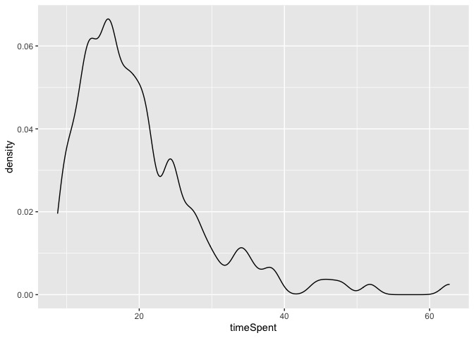

Xor-Some Preregistered Study: Preprocessing
================
Polina Tsvilodub
10/18/2021

## Read Data

First, the data is loaded.

    ## Parsed with column specification:
    ## cols(
    ##   .default = col_character(),
    ##   submission_id = col_double(),
    ##   ID = col_double(),
    ##   RT = col_double(),
    ##   age = col_double(),
    ##   competence = col_double(),
    ##   endTime = col_double(),
    ##   expected = col_double(),
    ##   experiment_id = col_double(),
    ##   prior = col_double(),
    ##   relevance = col_double(),
    ##   response = col_double(),
    ##   startTime = col_double(),
    ##   timeSpent = col_double(),
    ##   trial_number = col_double()
    ## )

    ## See spec(...) for full column specifications.

## Clean data

Checking if there are any comments indicating technical issues, to be
excluded then:

``` r
d %>% distinct(comments) %>% View()
```

Apply language related exclusion criterion: Check native languages.
Participants not indicating English as (one of) their native language(s)
are excluded. We also compute some participant demographics.

``` r
d %>% distinct(languages)
```

    ## # A tibble: 19 x 1
    ##    languages          
    ##    <chr>              
    ##  1 English            
    ##  2 Spanish            
    ##  3 English, German    
    ##  4 english            
    ##  5 English, Albanian  
    ##  6 english, amharic   
    ##  7 English; isiZulu   
    ##  8 Polish, English    
    ##  9 <NA>               
    ## 10 yoruba             
    ## 11 English, Cantonese 
    ## 12 IsiXhosa           
    ## 13 English, Vietnamese
    ## 14 English,Vietnamese 
    ## 15 french             
    ## 16 English, Welsh     
    ## 17 English and Persian
    ## 18 Scottish           
    ## 19 English welsh

``` r
cat("Number of participants before excluding non-natives: ", d %>% distinct(submission_id) %>% count() %>% pull() ) 
```

    ## Number of participants before excluding non-natives:  159

``` r
# exclude non-natives if necessary
d_native <- d %>% 
 # filter(("en" | "En" | "bri") %in% languages)
  filter(grepl("[(en)(br)]", languages, ignore.case = T))

cat(" Number of participants after excluding non-natives: ", d_native %>% distinct(submission_id) %>% count() %>% pull() )
```

    ##  Number of participants after excluding non-natives:  154

``` r
cat(" Mean age: ", d_native %>% pull(age) %>% mean(., na.rm = T) )
```

    ##  Mean age:  30.75817

``` r
d_native  %>% count(gender) %>% mutate(n = n/80)
```

    ## # A tibble: 3 x 2
    ##   gender     n
    ##   <chr>  <dbl>
    ## 1 female   114
    ## 2 male      39
    ## 3 other      1

Check the overall completion time. Participants who complete the
experiment in less than 8 minutes are excluded.

``` r
d_native_completed <- d_native %>% mutate(timeSpent = round(timeSpent, 2)) %>%
  filter(timeSpent > 8) 

cat(" Number of participants who completed the expt in > 8 minutes: ", d_native_completed %>% distinct(submission_id) %>% count() %>% pull() )
```

    ##  Number of participants who completed the expt in > 8 minutes:  152

``` r
d_native_completed %>% summarize(median_time = median(timeSpent),
                                 mean_time = mean(timeSpent))
```

    ## # A tibble: 1 x 2
    ##   median_time mean_time
    ##         <dbl>     <dbl>
    ## 1        17.9      20.0

``` r
# check the distribution of completion times
d_native_completed %>% 
  ggplot(., aes(x=timeSpent)) +
  geom_density()
```

<!-- -->

Apply attention check based exclusion criterion:

``` r
d_native_attention <- d_native_completed %>% 
  filter(condition == "attention_check") %>% mutate(
  passed_attention_trial = case_when(
    (expected == 0) & (response == 0) ~ T,
    (expected == 100) & (response == 100) ~ T,
    (expected == 50) & (response %>% between(45, 55)) ~ T,
    TRUE ~ F
  )
)

d_native_attention_summary <- d_native_attention %>% 
  group_by(submission_id) %>%
  summarize(attention_prop = mean(passed_attention_trial)) %>%
  mutate(
    passed_attention_check = attention_prop > 0.75
  ) %>% 
  filter(passed_attention_check == TRUE)
```

    ## `summarise()` ungrouping output (override with `.groups` argument)

``` r
d_native_attention_failed <- d_native_attention %>% 
  group_by(submission_id) %>%
  summarize(attention_prop = mean(passed_attention_trial)) %>%
  mutate(
    passed_attention_check = attention_prop > 0.75
  ) %>% 
  filter(passed_attention_check == FALSE)
```

    ## `summarise()` ungrouping output (override with `.groups` argument)

``` r
d_native_attended <- anti_join(d_native_completed, 
                               d_native_attention_failed, 
                               by = c("submission_id"))

cat(" Number of participants failing attention checks: ", d_native_attention_failed %>% distinct(submission_id) %>% count() %>% pull() )
```

    ##  Number of participants failing attention checks:  13

Data frames preparation:

``` r
d_main <- d_native_attended %>% select(-age, -comments, -education, -endTime, 
                              -gender, -languages, -optionLeft, -optionRight, -startDate,
                              -startTime, -timeSpent, -expected) %>%
  filter(trial_name != "example", trial_name != "attention_check")
d_exmpl <- d_native_attended %>% select(-age, -comments, -education, -endTime, 
                              -gender, -languages, -optionLeft, -optionRight, -startDate,
                              -startTime, -timeSpent, -expected) %>%
  filter(trial_name == "example")
d_critical <- d_main %>% filter(condition == "critical")

d_test <- d_main %>% rowwise() %>% filter(condition == "test") %>% 
  mutate(test_condition = substr(test_question, 6, 9),
         test_condition = ifelse(test_condition == "fals", "false", 
                                 ifelse(test_condition == "unce", "uncertain",
                                        test_condition)))
```

Exclude participants based on example trials, comprehension question
performance, and response patterns. Participants who gave all responses
within the range of 10 and participants who failed more than 0.2 of the
comprehension questions are excluded from analysis. Participants who
failed all example trials are excluded, as well.

``` r
# get participants failing example trials
d_exmpl_fail <- d_exmpl %>% group_by(submission_id) %>% 
  mutate(example_condition = ifelse(grepl("as certainly true", question), "true", 
                                    ifelse(grepl("as certainly false", question), "false",
                                           "uncertain")),
         passed_example_trial = case_when(example_condition == "true" ~ response >= 80,
                                    example_condition == "false" ~ response <= 20,
                                    example_condition == "uncertain" ~ response >= 30),
       #  check if all trials passed
         passed_example = case_when(sum(passed_example_trial) == 0 ~ FALSE,
                                    TRUE ~ TRUE)
         ) %>% filter(passed_example == F)

cat("Subjects failing the example trials: ", d_exmpl_fail %>% distinct(submission_id) %>% pull() %>% length())
```

    ## Subjects failing the example trials:  0

``` r
# apply exclusion criteria to main trials
# check range of responses per participant
d_main_fail <- d_main %>% group_by(submission_id) %>%
  mutate(passed_main = case_when(max(response) - min(response) <= 10 ~ FALSE,
                                 TRUE ~ TRUE)
         ) %>% filter(passed_main == F)
cat(" Subjects providing the same ratings throughout the trials: ", d_main_fail %>% distinct(submission_id) %>% pull() %>% length())
```

    ##  Subjects providing the same ratings throughout the trials:  0

``` r
# get participants failing comprehension questions
d_test <- d_test %>%
  group_by(submission_id) %>%
  mutate(passed_filler_trial = case_when(test_condition == "true" ~ response >= 60,
                                   test_condition == "false" ~ response <= 40,
                                   test_condition == "uncertain" ~ response %in% (10:90)),
         mean_comprehension = mean(passed_filler_trial),
         passed_filler = mean_comprehension >= 0.8
         ) 

d_test_fail <- d_test %>% 
  filter(passed_filler == F)

cat(" Subjects failing the comprehension trials: ", d_test_fail %>% distinct(submission_id) %>% pull() %>% length())
```

    ##  Subjects failing the comprehension trials:  24

Write out data for plotting:

``` r
d_test %>% write_csv("./../../data/main/results_prereg_raw_N158_test.csv")
```

``` r
# put it all together
d_full_clean <- anti_join(d_main, d_main_fail, by = "submission_id")
d_full_clean <- anti_join(d_full_clean, d_exmpl_fail, d_test, by = "submission_id")
d_full_clean <- anti_join(d_full_clean, d_test_fail, by = "submission_id")

cat(" Nr. of participants left after cleaning: ", d_full_clean %>% distinct(submission_id) %>% pull() %>% length())
```

    ##  Nr. of participants left after cleaning:  115

Write out tidy data:

``` r
d_full_clean %>% write_csv("./../../data/main/results_prereg_N158_tidy.csv")
```

``` r
# get overall mean ratings / subject across comprehension and critical trials 
d_full_clean %>% group_by(submission_id) %>% summarise(mean_rating = mean(response)) %>% arrange(mean_rating)
```

    ## `summarise()` ungrouping output (override with `.groups` argument)

    ## # A tibble: 115 x 2
    ##    submission_id mean_rating
    ##            <dbl>       <dbl>
    ##  1          2338        40.9
    ##  2          2346        41.5
    ##  3          2402        41.9
    ##  4          2363        42.3
    ##  5          2473        43.2
    ##  6          2382        43.5
    ##  7          2374        43.6
    ##  8          2360        43.9
    ##  9          2401        44.0
    ## 10          2449        44.7
    ## # … with 105 more rows

``` r
# get mean ratings / subject in critical trials 
d_full_clean %>% filter(condition == "critical") %>% group_by(submission_id) %>% summarise(mean_rating = mean(response)) %>% arrange(mean_rating)
```

    ## `summarise()` ungrouping output (override with `.groups` argument)

    ## # A tibble: 115 x 2
    ##    submission_id mean_rating
    ##            <dbl>       <dbl>
    ##  1          2360        37.1
    ##  2          2338        38.7
    ##  3          2402        39.4
    ##  4          2374        40.9
    ##  5          2346        42.8
    ##  6          2379        44.2
    ##  7          2414        44.3
    ##  8          2450        44.7
    ##  9          2473        45.8
    ## 10          2440        46  
    ## # … with 105 more rows

## Transformations

Create more extensive condition labels.

``` r
# extending 'conditions' labels to include whether the utterance was present or not
d_critical_long <- d_critical_long %>% 
  mutate(
    block_extended =  ifelse(block %in% c("some", "xor"), "target", block)
  )
```

Z-scoring:

``` r
d_critical_zScored <- d_critical_long %>% group_by(submission_id, block_extended) %>%
  mutate(block_mean = mean(response),
         block_sd = sd(response),
         response_centered = (response - block_mean)/block_sd,
         # catch the cases where sd is 0 
         response_centered = ifelse(is.na(response_centered), 0, response_centered))

d_critical_zScored_wide <- d_critical_zScored %>% 
  select(submission_id, title, main_type, block_extended, response_centered) %>% 
  unique() %>% 
  pivot_wider(
    names_from = block_extended, 
    values_from = response_centered, 
    values_fn = mean # getting means for double prior measurement in "xor"
  ) 
```

Write out z-scored data

``` r
d_critical_zScored %>% write_csv("./../../data/main/results_prereg_tidy_N158_zScored_long.csv")
d_critical_zScored_wide %>% write_csv("./../../data/main/results_prereg_tidy_N158_zScored_wide.csv")
```
