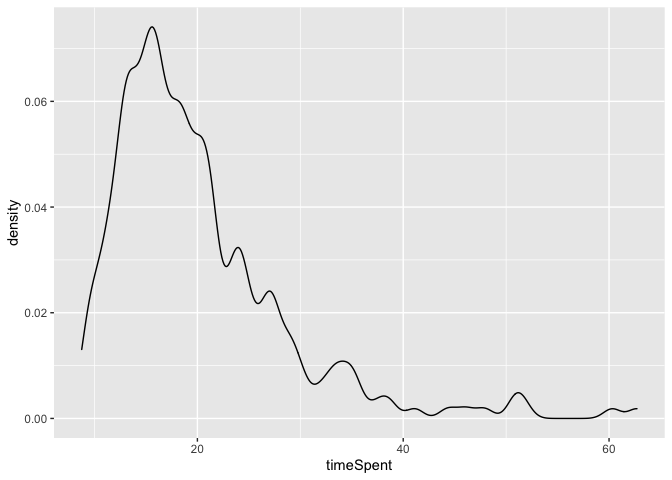

Xor-Some Preregistered Study: Preprocessing
================
Polina Tsvilodub
10/18/2021

## Read Data

First, the data is loaded.

## Clean data

Checking if there are any comments indicating technical issues, to be
excluded then:

``` r
d %>% distinct(comments) %>% View()
```

Apply language related exclusion criterion: Check native languages.
Participants not indicating English as (one of) their native language(s)
are excluded. We also compute some participant demographics.

``` r
d %>% distinct(languages)
```

    ## # A tibble: 28 x 1
    ##    languages             
    ##    <chr>                 
    ##  1 English               
    ##  2 english               
    ##  3 <NA>                  
    ##  4 English, Danish       
    ##  5 English, French       
    ##  6 English Welsh         
    ##  7 2                     
    ##  8 yoruba                
    ##  9 english french bengali
    ## 10 English and Bulgarian 
    ## # … with 18 more rows

``` r
cat("Number of participants before excluding non-natives: ", d %>% distinct(submission_id) %>% count() %>% pull() ) 
```

    ## Number of participants before excluding non-natives:  277

``` r
# exclude non-natives if necessary
d_native <- d %>% 
 # filter(("en" | "En" | "bri") %in% languages)
  filter(grepl("eng", languages, ignore.case = T))

cat(" Number of participants after excluding non-natives: ", d_native %>% distinct(submission_id) %>% count() %>% pull() )
```

    ##  Number of participants after excluding non-natives:  262

``` r
d_native %>% distinct(languages)
```

    ## # A tibble: 20 x 1
    ##    languages             
    ##    <chr>                 
    ##  1 English               
    ##  2 english               
    ##  3 English, Danish       
    ##  4 English, French       
    ##  5 English Welsh         
    ##  6 english french bengali
    ##  7 English and Bulgarian 
    ##  8 ENGLISH               
    ##  9 English, German       
    ## 10 English, Albanian     
    ## 11 english, amharic      
    ## 12 English; isiZulu      
    ## 13 Polish, English       
    ## 14 English, Cantonese    
    ## 15 English, Vietnamese   
    ## 16 English,Vietnamese    
    ## 17 swati, english        
    ## 18 English, Welsh        
    ## 19 English and Persian   
    ## 20 English welsh

``` r
cat(" Mean age: ", d_native %>% pull(age) %>% mean(., na.rm = T) )
```

    ##  Mean age:  32.48462

``` r
d_native  %>% count(gender) %>% mutate(n = n/80)
```

    ## # A tibble: 4 x 2
    ##   gender     n
    ##   <chr>  <dbl>
    ## 1 female   190
    ## 2 male      69
    ## 3 other      1
    ## 4 <NA>       2

Check the overall completion time. Participants who complete the
experiment in less than 8 minutes are excluded.

``` r
d_native_completed <- d_native %>% mutate(timeSpent = round(timeSpent, 2)) %>%
  filter(timeSpent > 8) 

cat(" Number of participants who completed the expt in > 8 minutes: ", d_native_completed %>% distinct(submission_id) %>% count() %>% pull() )
```

    ##  Number of participants who completed the expt in > 8 minutes:  259

``` r
d_native_completed %>% summarize(median_time = median(timeSpent),
                                 mean_time = mean(timeSpent))
```

    ## # A tibble: 1 x 2
    ##   median_time mean_time
    ##         <dbl>     <dbl>
    ## 1        18.0      19.8

``` r
# check the distribution of completion times
d_native_completed %>% 
  ggplot(., aes(x=timeSpent)) +
  geom_density()
```

<!-- -->

Apply attention check based exclusion criterion:

``` r
d_native_attention <- d_native_completed %>% 
  filter(condition == "attention_check") %>% mutate(
  passed_attention_trial = case_when(
    (expected == 0) & (response == 0) ~ T,
    (expected == 100) & (response == 100) ~ T,
    (expected == 50) & (response %>% between(45, 55)) ~ T,
    TRUE ~ F
  )
)

d_native_attention_summary <- d_native_attention %>% 
  group_by(submission_id) %>%
  summarize(attention_prop = mean(passed_attention_trial)) %>%
  mutate(
    passed_attention_check = attention_prop > 0.75
  ) %>% 
  filter(passed_attention_check == TRUE)
```

    ## `summarise()` ungrouping output (override with `.groups` argument)

``` r
d_native_attention_failed <- d_native_attention %>% 
  group_by(submission_id) %>%
  summarize(attention_prop = mean(passed_attention_trial)) %>%
  mutate(
    passed_attention_check = attention_prop > 0.75
  ) %>% 
  filter(passed_attention_check == FALSE)
```

    ## `summarise()` ungrouping output (override with `.groups` argument)

``` r
d_native_attended <- anti_join(d_native_completed, 
                               d_native_attention_failed, 
                               by = c("submission_id"))

cat(" Number of participants failing attention checks: ", d_native_attention_failed %>% distinct(submission_id) %>% count() %>% pull() )
```

    ##  Number of participants failing attention checks:  26

``` r
#d_attention_fail_IDs <- right_join(d_raw, d_native_attention_failed, by = c("submission_id")) %>% select(submission_id, prolific_id) %>% distinct()
#d_attention_fail_IDs %>% write_csv("~/Documents/Research/XOR/raw_data/xor-some_prereg_failed_attention_prolificIDs_final.csv")
```

Data frames preparation:

``` r
d_main <- d_native_attended %>% select(-age, -comments, -education, -endTime, 
                              -gender, -languages, -optionLeft, -optionRight, -startDate,
                              -startTime, -timeSpent, -expected) %>%
  filter(trial_name != "example", trial_name != "attention_check")
d_exmpl <- d_native_attended %>% select(-age, -comments, -education, -endTime, 
                              -gender, -languages, -optionLeft, -optionRight, -startDate,
                              -startTime, -timeSpent, -expected) %>%
  filter(trial_name == "example")
d_critical <- d_main %>% filter(condition == "critical")

d_test <- d_main %>% rowwise() %>% filter(condition == "test") %>% 
  mutate(test_condition = substr(test_question, 6, 9),
         test_condition = ifelse(test_condition == "fals", "false", 
                                 ifelse(test_condition == "unce", "uncertain",
                                        test_condition)))
```

Investigate if the comprehension questions received expected responses
on by-question basis:

``` r
d_test %>% group_by(ID, test_question) %>% 
  mutate(
    expected = case_when( test_condition == "true" ~ 100,
                          test_condition == "false" ~ 0,
                          TRUE ~ 50)
  ) %>%
  summarise(
    expected = mean(expected),
    response = mean(response),
    difference = abs(expected - response)
  ) %>% 
  arrange(., desc(difference))
```

    ## `summarise()` regrouping output by 'ID' (override with `.groups` argument)

    ## # A tibble: 384 x 5
    ## # Groups:   ID [64]
    ##       ID test_question expected response difference
    ##    <dbl> <chr>            <dbl>    <dbl>      <dbl>
    ##  1    64 test_false1          0    100        100  
    ##  2     8 test_false1          0     77.1       77.1
    ##  3    18 test_false1          0     56.4       56.4
    ##  4    26 test_true1         100     51.4       48.6
    ##  5    58 test_true1         100     53.6       46.4
    ##  6     4 test_false1          0     45.9       45.9
    ##  7    63 test_false1          0     45.8       45.8
    ##  8     1 test_false2          0     45.2       45.2
    ##  9     6 test_false2          0     43.8       43.8
    ## 10     1 test_false1          0     42.9       42.9
    ## # … with 374 more rows

``` r
# look at the vignette text and the qeustion of the worst performing item
d_test %>% filter(ID == 64, test_question == "test_false1") %>% select(prompt, QUD) %>% View()
```

Exclude participants based on example trials, comprehension question
performance, and response patterns. Participants who gave all responses
within the range of 10 and participants who failed more than 0.2 of the
comprehension questions are excluded from analysis. Participants who
failed all example trials are excluded, as well.

``` r
# get participants failing example trials
d_exmpl_fail <- d_exmpl %>% group_by(submission_id) %>% 
  mutate(example_condition = ifelse(grepl("as certainly true", question), "true", 
                                    ifelse(grepl("as certainly false", question), "false",
                                           "uncertain")),
         passed_example_trial = case_when(example_condition == "true" ~ response >= 80,
                                    example_condition == "false" ~ response <= 20,
                                    example_condition == "uncertain" ~ response >= 30),
       #  check if all trials passed
         passed_example = case_when(sum(passed_example_trial) == 0 ~ FALSE,
                                    TRUE ~ TRUE)
         ) %>% filter(passed_example == F)

cat("Subjects failing the example trials: ", d_exmpl_fail %>% distinct(submission_id) %>% pull() %>% length())
```

    ## Subjects failing the example trials:  0

``` r
# apply exclusion criteria to main trials
# check range of responses per participant
d_main_fail <- d_main %>% group_by(submission_id) %>%
  mutate(passed_main = case_when(max(response) - min(response) <= 10 ~ FALSE,
                                 TRUE ~ TRUE)
         ) %>% filter(passed_main == F)
cat(" Subjects providing the same ratings throughout the trials: ", d_main_fail %>% distinct(submission_id) %>% pull() %>% length())
```

    ##  Subjects providing the same ratings throughout the trials:  0

``` r
# get participants failing comprehension questions
d_test <- d_test %>%
  group_by(submission_id) %>%
  mutate(passed_filler_trial = case_when(test_condition == "true" ~ response >= 60,
                                   test_condition == "false" ~ response <= 40,
                                   test_condition == "uncertain" ~ response %in% (10:90)),
         mean_comprehension = mean(passed_filler_trial),
         passed_filler = mean_comprehension >= 0.8
         ) 

d_test_fail <- d_test %>% 
  filter(passed_filler == F)

cat(" Subjects failing the comprehension trials: ", d_test_fail %>% distinct(submission_id) %>% pull() %>% length())
```

    ##  Subjects failing the comprehension trials:  33

Perform an alternative exclusion based on comprehension question
EXCLUDING the test\_false1 question from the vignette with the ID=64
which had an incorrect prior classification.

``` r
# get participants failing comprehension questions
d_test_alternative <- d_test %>%
  group_by(submission_id) %>%
  filter(ID != 64 && test_question != "test_false1") %>%
  mutate(passed_filler_trial = case_when(test_condition == "true" ~ response >= 60,
                                   test_condition == "false" ~ response <= 40,
                                   test_condition == "uncertain" ~ response %in% (10:90)),
         mean_comprehension = mean(passed_filler_trial),
         passed_filler = mean_comprehension >= 0.8
         ) 

d_test_fail_alternative <- d_test_alternative %>% 
  filter(passed_filler == F)

cat(" Subjects failing the comprehension trials without misclassified trial: ", d_test_fail_alternative %>% distinct(submission_id) %>% pull() %>% length())
```

    ##  Subjects failing the comprehension trials without misclassified trial:  27

Write out data for plotting:

``` r
d_test %>% write_csv("./../../data/main/results_prereg_raw_final_test.csv")
```

``` r
# put it all together
d_full_clean <- anti_join(d_main, d_main_fail, by = "submission_id")
d_full_clean <- anti_join(d_full_clean, d_exmpl_fail, d_test, by = "submission_id")
d_full_clean <- anti_join(d_full_clean, d_test_fail, by = "submission_id")

cat(" Nr. of participants left after cleaning: ", d_full_clean %>% distinct(submission_id) %>% pull() %>% length())
```

    ##  Nr. of participants left after cleaning:  200

\[-Exclude the 201st participant for target N=200-\] The exclusion of
the last participant isn’t necessary anymore, since we only have 200
subjects left upon exclusions due to the initially incorrect native
language check.

``` r
#d_full_clean %>% arrange(., desc(submission_id)) %>% distinct() %>% pull(submission_id)

# exclude participant with last submission_id
#d_full_clean <- d_full_clean %>% filter(submission_id != 2620)

cat(" Nr. of participants left after cleaning and N=200 extraction: ", d_full_clean %>% distinct(submission_id) %>% pull() %>% length())
```

Write out tidy data:

``` r
d_full_clean %>% write_csv("./../../data/main/results_prereg_final_tidy.csv")
```

``` r
# get overall mean ratings / subject across comprehension and critical trials 
d_full_clean %>% group_by(submission_id) %>% summarise(mean_rating = mean(response)) %>% arrange(mean_rating)
```

    ## `summarise()` ungrouping output (override with `.groups` argument)

    ## # A tibble: 200 x 2
    ##    submission_id mean_rating
    ##            <dbl>       <dbl>
    ##  1          2528        37.7
    ##  2          2613        40.5
    ##  3          2591        40.5
    ##  4          2338        40.9
    ##  5          2609        41.0
    ##  6          2346        41.5
    ##  7          2402        41.9
    ##  8          2363        42.3
    ##  9          2473        43.2
    ## 10          2382        43.5
    ## # … with 190 more rows

``` r
# get mean ratings / subject in critical trials 
d_full_clean %>% filter(condition == "critical") %>% group_by(submission_id) %>% summarise(mean_rating = mean(response)) %>% arrange(mean_rating)
```

    ## `summarise()` ungrouping output (override with `.groups` argument)

    ## # A tibble: 200 x 2
    ##    submission_id mean_rating
    ##            <dbl>       <dbl>
    ##  1          2360        37.1
    ##  2          2591        37.6
    ##  3          2338        38.7
    ##  4          2613        38.8
    ##  5          2528        39.0
    ##  6          2402        39.4
    ##  7          2374        40.9
    ##  8          2559        42.3
    ##  9          2609        42.6
    ## 10          2590        42.8
    ## # … with 190 more rows

## Transformations

Create more extensive condition labels.

``` r
# extending 'conditions' labels to include whether the utterance was present or not
d_critical_long <- d_critical_long %>% 
  mutate(
    block_extended =  ifelse(block %in% c("some", "xor"), "target", block)
  )
```

Z-scoring:

``` r
d_critical_zScored <- d_critical_long %>% group_by(submission_id, block_extended) %>%
  mutate(block_mean = mean(response),
         block_sd = sd(response),
         response_centered = (response - block_mean)/block_sd,
         # catch the cases where sd is 0 
         response_centered = ifelse(is.na(response_centered), 0, response_centered))

d_critical_zScored_wide <- d_critical_zScored %>% 
  select(submission_id, title, main_type, block_extended, response_centered) %>% 
  unique() %>% 
  pivot_wider(
    names_from = block_extended, 
    values_from = response_centered, 
    values_fn = mean # getting means for double prior measurement in "xor"
  ) 

# write out a wide df with both prior ratings for exploratory analysis
d_critical_zScored_xor <- d_critical_zScored %>% 
  ungroup() %>%
  select(submission_id, title, main_type, block_extended, response_centered) %>% 
  unique() %>% 
  filter(main_type == "xor")

d_critical_zScored_wide_xor_priors <- d_critical_zScored_xor %>% group_by(title, block_extended) %>% 
  mutate(
    block_extended = ifelse(block_extended == "prior", 
                            paste(block_extended, which(block_extended == "prior")%%2, sep="_"),
                            block_extended)
  ) %>% ungroup() %>%
  pivot_wider(
    names_from = block_extended, 
    values_from = response_centered 
  ) %>%
  filter(!is.na(prior_1), !is.na(prior_0)) # not sure where the NAs came from

d_critical_zScored_wide_xor_priors %>% write_csv("./../../data/main/results_prereg_tidy_final_zScored_wide_xor_priors.csv")
```

Write out z-scored data

``` r
d_critical_zScored %>% write_csv("./../../data/main/results_prereg_tidy_final_zScored_long.csv")
d_critical_zScored_wide %>% write_csv("./../../data/main/results_prereg_tidy_final_zScored_wide.csv")
```
