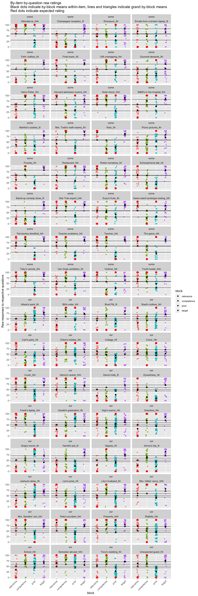
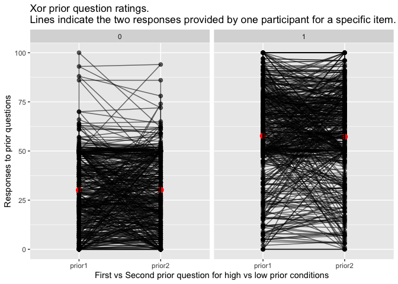

Xor-Some Preregistered Study: Visualizations
================
Polina Tsvilodub
10/18/2021

Read data created in preprocessing script:

``` r
d_critical_zScored_wide <- read_csv("./../../data/main/results_prereg_tidy_final_zScored_wide.csv")
d_critical_zScored <- read_csv("./../../data/main/results_prereg_tidy_final_zScored_long.csv")
d_test <- read_csv("./../../data/main/results_prereg_raw_final_test.csv")
```

## Plots

Comprehension question performance:

``` r
d_test_ci <- d_test %>% group_by(test_condition) %>% 
  tidyboot_mean(column = response) 
```

    ## Warning: `as_data_frame()` is deprecated as of tibble 2.0.0.
    ## Please use `as_tibble()` instead.
    ## The signature and semantics have changed, see `?as_tibble`.
    ## This warning is displayed once every 8 hours.
    ## Call `lifecycle::last_warnings()` to see where this warning was generated.

    ## Warning: `cols` is now required when using unnest().
    ## Please use `cols = c(strap)`

``` r
d_test %>% 
  ggplot(., aes(x = test_condition, y = response)) +
  geom_point(size = 2, alpha = 0.3, position = position_jitter(width = 0.1)) +
  geom_point(data = d_test_ci, aes(x = test_condition, y = mean), color = "red", 
             size = 4) +
  facet_wrap(~main_type)
```

<!-- -->

Plot predictor ratings against inference strength ratings by trigger:
<!-- -->

``` r
d_critical_zScored %>% 
  filter(block == "xor" | block == "some") %>%
  ggplot(., aes(x = prior_class, y = response_centered)) +
  geom_point(size = 2, alpha = 0.5) +
  geom_smooth(method="lm") +
  ylab("Inference strength ratings") +
  facet_wrap(block~class_condition) +
  xlab("Anticipated categorization of the items") +
  ggtitle("Inference strength ratings by-predictor")
```

    ## `geom_smooth()` using formula 'y ~ x'

<!-- -->

``` r
# plot by-item ratings vs our prior categorizations
d_critical_long_grandMeans <- d_critical_zScored %>% 
  mutate(title = paste(title, exp_condition, sep = "_"),
         block = ifelse(block == "xor" | block == "some", "target", block)) %>%
  filter(block == class_condition | (block == "target" & class_condition == "relevance")) %>%
  group_by(main_type, block) %>% 
  summarize(mean_resp = mean(response))
```

    ## `summarise()` regrouping output by 'main_type' (override with `.groups` argument)

``` r
d_critical_long_expectedCats <- d_critical_zScored %>% 
  mutate(title = paste(title, exp_condition, sep = "_"),
         block = ifelse(block == "xor" | block == "some", "target", block)) %>%
  filter(block == class_condition | (block == "target" & class_condition == "relevance")) %>%
  group_by(main_type, block, title) %>% 
  summarize(mean_resp_block = mean(response))
```

    ## `summarise()` regrouping output by 'main_type', 'block' (override with `.groups` argument)

``` r
d_critical_zScored %>% 
  mutate(title = paste(title, exp_condition, sep = "_"),
         block = ifelse(block == "xor" | block == "some", "target", block)) %>%
  left_join(., d_critical_long_grandMeans, by = c("main_type", "block")) %>% 
  filter(block == class_condition | ((block == "target") & (class_condition == "relevance"))) -> d_long_plot_data

left_join(d_long_plot_data, d_critical_long_expectedCats, by = c("main_type", "block", "title")) %>% 
  mutate(expected_block = ifelse(block != "target", prior_class * 100, NA),
         block = factor(block, levels = c("relevance", "competence", "prior", "target"))) -> d_long_plot_full

d_long_plot_full %>%
  ggplot(., aes(x = block, y = response, color = block)) +
  geom_point(alpha = 0.7, position = position_jitter(width = 0.1)) +
  geom_hline(aes(yintercept = mean_resp), alpha = 0.7) +
  geom_point(aes(y = mean_resp), color = "black", shape = 2) +
  geom_point(aes(y = mean_resp_block, fill = block), color = "black") +
  geom_point(aes(y = expected_block), color="red", size = 2.5, na.rm = T) +
  ylab("Raw responses to respective questions") +
  facet_wrap(main_type~title, ncol = 4) +
  theme(axis.text.x = element_text(angle = 45, hjust = 1)) +
  ggtitle("By-item by-question raw ratings\nBlack dots indicate by-block means within-item, lines and triangles indicate grand by-block means\nRed dots indicate expected rating")
```

<!-- -->

Plot the prior ratings on the two prior questions in the XOr condition
in terms of question order:

``` r
# check whether the ratings in the two prior questions are the same in xor 
d_critical_zScored %>% 
  filter(block != "xor" & block != "some") %>%
  filter(block == class_condition) %>%
  filter(block == "prior", main_type == "xor") %>%
  mutate(priorQ_nr = rep(c(1,2), nrow(.)/2),
         unique_ID = paste(submission_id, ID, sep="_")) -> d_xor_priors

d_xor_priors %>% group_by(priorQ_nr, prior_class) %>%
  summarise(mean = mean(response)) -> d_xor_priors_summary
```

    ## `summarise()` regrouping output by 'priorQ_nr' (override with `.groups` argument)

``` r
d_xor_priors %>%
  ggplot(., aes(x = as.factor(priorQ_nr), y = response )) +
  geom_point(size = 2, alpha = 0.6) +
  geom_point(data = d_xor_priors_summary, aes(x = as.factor(priorQ_nr), y = mean), color = "red", size = 3) +
  geom_path(aes(group = "unique_ID"), alpha = 0.6) +
  ylab("Responses to prior questions") +
  xlab("First vs Second prior question for high vs low prior conditions") +
  facet_wrap(~as.factor(prior_class)) + # get ratings from the respective trials only 
  ggtitle("Xor prior question ratings.\nLines indicate the two responses provided by one participant for a specific item.")
```

<!-- -->

Plot the prior ratings on the two prior questions in the XOr condition
in terms of the specific by-item question (question 1 vs question 2 for
a given item, regardless of presentation order):

``` r
# create labels for the two questions
d_xor_priors %>% group_by(ID, prompt) %>%
  select(ID, prompt) %>% distinct() %>%
  ungroup() %>%
  mutate(
    priorQ_label = rep(c("prior1", "prior2"), 32)
  ) -> d_xor_priors_labels
left_join(d_xor_priors, d_xor_priors_labels, by = c("prompt")) %>%
  group_by(priorQ_label, prior_class) %>%
  summarise(mean = mean(response)) -> d_xor_priors_labels_summary
```

    ## `summarise()` regrouping output by 'priorQ_label' (override with `.groups` argument)

``` r
# add the label and plot
left_join(d_xor_priors, d_xor_priors_labels, by = c("prompt")) %>%
  ggplot(., aes(x = as.factor(priorQ_label), y = response )) +
  geom_point(size = 2, alpha = 0.6) +
  geom_point(data = d_xor_priors_labels_summary, aes(x = as.factor(priorQ_label), y = mean), color = "red", size = 3) +
  geom_path(aes(group = "unique_ID"), alpha = 0.6) +
  ylab("Responses to prior questions") +
  xlab("First vs Second prior question for high vs low prior conditions") +
  facet_wrap(~as.factor(prior_class)) + # get ratings from the respective trials only 
  ggtitle("Xor prior question ratings.\nLines indicate the two responses provided by one participant for a specific item.")
```

<!-- -->

Plot inference strength ratings against predictor ratings, by-item,
using by-item mean ratings across participants.

``` r
d_critical_predictorsXtarget_summary <-  d_critical_zScored_wide %>% 
  pivot_longer(
    cols = c(relevance, prior, competence),
    names_to = "predictors",
    values_to = "predictor_response"
  ) %>% 
  group_by(title, predictors, main_type) %>%
  summarise(mean_target = mean(target),
            mean_predictor = mean(predictor_response), 
            sd_target = sd(target),
            sd_predictor = sd(predictor_response))  
```

    ## `summarise()` regrouping output by 'title', 'predictors' (override with `.groups` argument)

``` r
# get the prior classifications of the vignettes for convenient coloring
d_critical_zScored %>% select(title, class_condition, prior_class) %>%
  distinct() -> d_critical_prior_classes

left_join(d_critical_predictorsXtarget_summary, d_critical_prior_classes, by = c("title", "predictors" = "class_condition")) %>%
  mutate(prior_class = as.factor(prior_class)) %>%
  ggplot(., aes(x = mean_predictor, y = mean_target)) +
  geom_point(aes(color = prior_class)) +
  ggrepel::geom_text_repel(aes(label=title), size = 2.5) +
  geom_smooth(method = "lm") +
  ylab("Mean inference strength rating") +
  xlab("Mean predictor ratings") + 
  facet_wrap(main_type~predictors) +
  scale_fill_manual(name = "Prior classification of item")
```

    ## `geom_smooth()` using formula 'y ~ x'

    ## Warning: ggrepel: 1 unlabeled data points (too many overlaps). Consider
    ## increasing max.overlaps

<!-- -->
