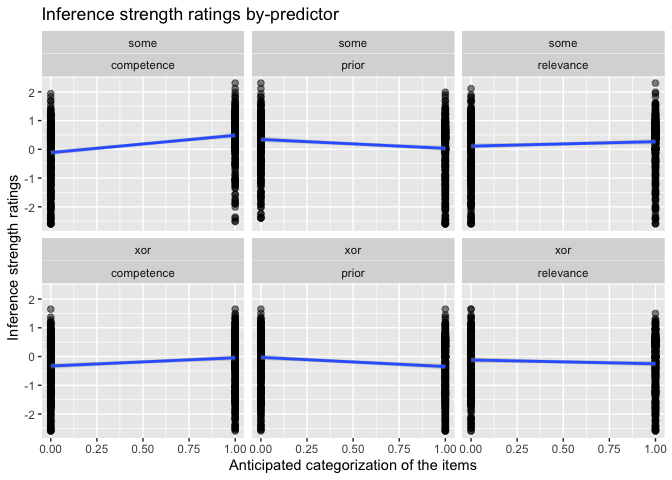

Xor-Some Preregistered Study: Visualizations
================
Polina Tsvilodub
10/18/2021

Read data created in preprocessing script:

``` r
d_critical_zScored_wide <- read_csv("./../../data/main/results_prereg_tidy_final_zScored_wide.csv")
```

    ## Parsed with column specification:
    ## cols(
    ##   submission_id = col_double(),
    ##   title = col_character(),
    ##   main_type = col_character(),
    ##   competence = col_double(),
    ##   prior = col_double(),
    ##   relevance = col_double(),
    ##   target = col_double()
    ## )

``` r
d_critical_zScored <- read_csv("./../../data/main/results_prereg_tidy_final_zScored_long.csv")
```

    ## Parsed with column specification:
    ## cols(
    ##   .default = col_character(),
    ##   submission_id = col_double(),
    ##   ID = col_double(),
    ##   RT = col_double(),
    ##   experiment_id = col_double(),
    ##   response = col_double(),
    ##   trial_number = col_double(),
    ##   prior_class = col_double(),
    ##   block_mean = col_double(),
    ##   block_sd = col_double(),
    ##   response_centered = col_double()
    ## )

    ## See spec(...) for full column specifications.

``` r
d_test <- read_csv("./../../data/main/results_prereg_raw_final_test.csv")
```

    ## Parsed with column specification:
    ## cols(
    ##   .default = col_character(),
    ##   submission_id = col_double(),
    ##   ID = col_double(),
    ##   RT = col_double(),
    ##   competence = col_double(),
    ##   critical_question = col_logical(),
    ##   experiment_id = col_double(),
    ##   prior = col_double(),
    ##   relevance = col_double(),
    ##   response = col_double(),
    ##   trial_number = col_double(),
    ##   passed_filler_trial = col_logical(),
    ##   mean_comprehension = col_double(),
    ##   passed_filler = col_logical()
    ## )
    ## See spec(...) for full column specifications.

## Plots

Comprehension question performance:

``` r
d_test_ci <- d_test %>% group_by(test_condition) %>% 
  tidyboot_mean(column = response) 
```

    ## Warning: `as_data_frame()` is deprecated as of tibble 2.0.0.
    ## Please use `as_tibble()` instead.
    ## The signature and semantics have changed, see `?as_tibble`.
    ## This warning is displayed once every 8 hours.
    ## Call `lifecycle::last_warnings()` to see where this warning was generated.

    ## Warning: `cols` is now required when using unnest().
    ## Please use `cols = c(strap)`

``` r
d_test %>% 
  ggplot(., aes(x = test_condition, y = response)) +
  geom_point(size = 2, alpha = 0.3, position = position_jitter(width = 0.1)) +
  geom_point(data = d_test_ci, aes(x = test_condition, y = mean), color = "red", 
             size = 4) +
  facet_wrap(~main_type)
```

<!-- -->

<!-- -->

``` r
d_critical_zScored %>% 
  filter(block == "xor" | block == "some") %>%
  ggplot(., aes(x = prior_class, y = response_centered)) +
  geom_point(size = 2, alpha = 0.5) +
  geom_smooth(method="lm") +
  ylab("Inference strength ratings") +
  facet_wrap(block~class_condition) +
  xlab("Anticipated categorization of the items") +
  ggtitle("Inference strength ratings by-predictor")
```

    ## `geom_smooth()` using formula 'y ~ x'

<!-- -->
