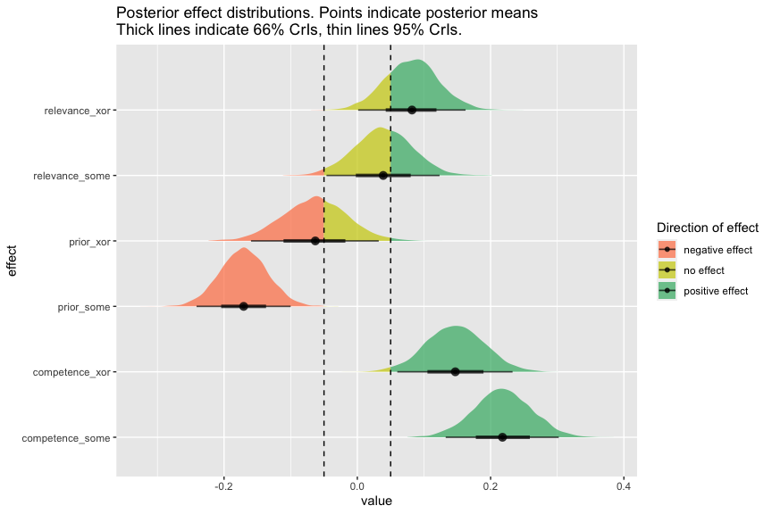
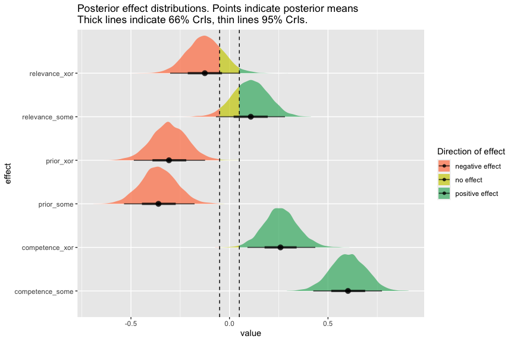
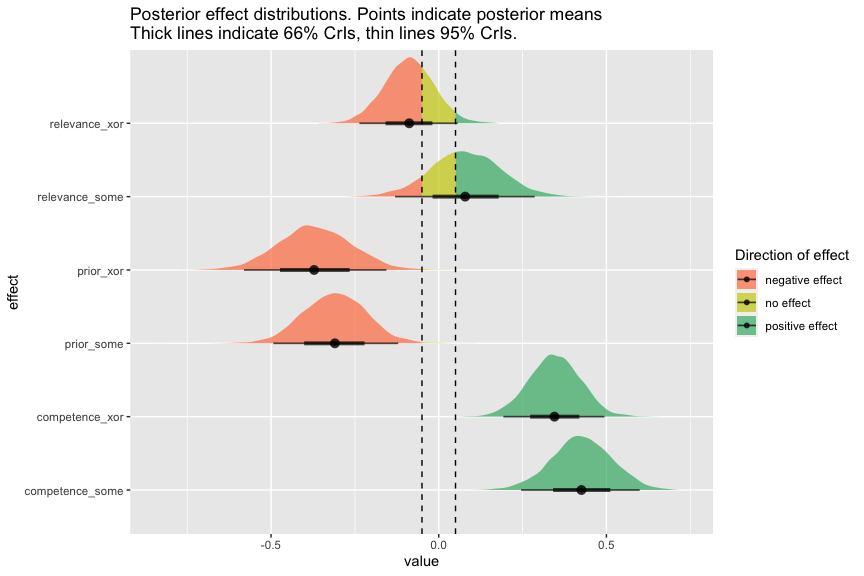

Xor-Some Preregistered Study: Analyses
================
Polina Tsvilodub
8/31/2021

Read data created in preprocessing script:

``` r
d_critical_zScored_wide <- read_csv("./../../data/main/results_prereg_tidy_final_zScored_wide.csv")
d_critical_zScored <- read_csv("./../../data/main/results_prereg_tidy_final_zScored_long.csv")
```

## Main analysis

Next, fit the maximal model *across* experiments (i.e., *across SI
trigger types*). For convergence reasons, correlation of random effects
has to be set to 0.

``` r
# Full model 
d_critical_zScored_wide <- d_critical_zScored_wide %>% mutate(
  main_type = as.factor(main_type)
)
# some = 0, xor = 1
contrasts(d_critical_zScored_wide$main_type) 

# set priors
priors <- set_prior("student_t(1, 0, 2)", class = "b")

model_SI <- brm(target ~ prior*competence*relevance* main_type +
                   (1 + prior + competence + relevance + main_type || submission_id) +
                   (1 | title),
                 data = d_critical_zScored_wide,
                 prior = priors,
                 sample_prior = T,
                 control = list(adapt_delta = 0.95),
                 cores = 4,
                 iter = 3000)
```

``` r
summary(model_SI)
```

    ##  Family: gaussian 
    ##   Links: mu = identity; sigma = identity 
    ## Formula: target ~ prior * competence * relevance * main_type + (1 + prior + competence + relevance + main_type || submission_id) + (1 | title) 
    ##    Data: d_critical_zScored_wide (Number of observations: 1600) 
    ## Samples: 4 chains, each with iter = 3000; warmup = 1500; thin = 1;
    ##          total post-warmup samples = 6000
    ## 
    ## Group-Level Effects: 
    ## ~submission_id (Number of levels: 200) 
    ##                  Estimate Est.Error l-95% CI u-95% CI Rhat Bulk_ESS Tail_ESS
    ## sd(Intercept)        0.02      0.01     0.00     0.05 1.00     4009     2428
    ## sd(prior)            0.21      0.04     0.14     0.28 1.00     1593     2875
    ## sd(competence)       0.10      0.05     0.01     0.19 1.01      764     1530
    ## sd(relevance)        0.06      0.04     0.00     0.15 1.00     1233     2253
    ## sd(main_typexor)     0.05      0.04     0.00     0.13 1.00     2492     2888
    ## 
    ## ~title (Number of levels: 64) 
    ##               Estimate Est.Error l-95% CI u-95% CI Rhat Bulk_ESS Tail_ESS
    ## sd(Intercept)     0.25      0.04     0.18     0.33 1.00     2247     3349
    ## 
    ## Population-Level Effects: 
    ##                                         Estimate Est.Error l-95% CI u-95% CI
    ## Intercept                                   0.12      0.06     0.01     0.23
    ## prior                                      -0.16      0.04    -0.23    -0.09
    ## competence                                  0.22      0.04     0.13     0.30
    ## relevance                                   0.04      0.04    -0.05     0.12
    ## main_typexor                               -0.29      0.08    -0.44    -0.14
    ## prior:competence                            0.06      0.03     0.00     0.12
    ## prior:relevance                            -0.02      0.03    -0.08     0.04
    ## competence:relevance                        0.04      0.04    -0.03     0.12
    ## prior:main_typexor                          0.10      0.06    -0.01     0.21
    ## competence:main_typexor                    -0.07      0.06    -0.18     0.04
    ## relevance:main_typexor                      0.04      0.06    -0.07     0.16
    ## prior:competence:relevance                 -0.00      0.03    -0.06     0.05
    ## prior:competence:main_typexor              -0.09      0.05    -0.19     0.02
    ## prior:relevance:main_typexor                0.02      0.05    -0.08     0.12
    ## competence:relevance:main_typexor           0.03      0.05    -0.07     0.13
    ## prior:competence:relevance:main_typexor     0.01      0.05    -0.09     0.11
    ##                                         Rhat Bulk_ESS Tail_ESS
    ## Intercept                               1.00     2793     3815
    ## prior                                   1.00     3833     4300
    ## competence                              1.00     2983     3732
    ## relevance                               1.00     3692     4006
    ## main_typexor                            1.00     2697     3386
    ## prior:competence                        1.00     4792     4594
    ## prior:relevance                         1.00     3936     4638
    ## competence:relevance                    1.00     3725     4201
    ## prior:main_typexor                      1.00     4852     4735
    ## competence:main_typexor                 1.00     3592     4538
    ## relevance:main_typexor                  1.00     4022     4343
    ## prior:competence:relevance              1.00     4073     4727
    ## prior:competence:main_typexor           1.00     4953     4738
    ## prior:relevance:main_typexor            1.00     4215     4221
    ## competence:relevance:main_typexor       1.00     4028     4707
    ## prior:competence:relevance:main_typexor 1.00     4646     4396
    ## 
    ## Family Specific Parameters: 
    ##       Estimate Est.Error l-95% CI u-95% CI Rhat Bulk_ESS Tail_ESS
    ## sigma     0.83      0.02     0.80     0.87 1.00     2791     3725
    ## 
    ## Samples were drawn using sampling(NUTS). For each parameter, Bulk_ESS
    ## and Tail_ESS are effective sample size measures, and Rhat is the potential
    ## scale reduction factor on split chains (at convergence, Rhat = 1).

Next, extract posterior contrasts of interest: effects of each predictor
{prior, competence and relevance} for each trigger.

``` r
model_SI %>% spread_draws(b_Intercept, b_prior, b_competence, b_relevance,
                          b_main_typexor, `b_prior:competence`,
                          `b_prior:relevance`, `b_competence:relevance`,
                          `b_prior:main_typexor`, `b_competence:main_typexor`,
                          `b_relevance:main_typexor`, `b_prior:competence:relevance`, 
                          `b_prior:competence:main_typexor`, `b_prior:relevance:main_typexor`,
                          `b_competence:relevance:main_typexor`, 
                          `b_prior:competence:relevance:main_typexor`) %>% 
  mutate(
    prior_xor = b_prior + `b_prior:main_typexor`,
    prior_some = b_prior,
    competence_xor = b_competence + `b_competence:main_typexor`,
    competence_some = b_competence,
    relevance_xor =  b_relevance + `b_relevance:main_typexor`,
    relevance_some = b_relevance
  ) -> model_SI_posteriors

# check P that the effects are positive / negative / no effect present
posterior_hypotheses <- model_SI_posteriors %>% 
  select(prior_xor, prior_some, 
         competence_xor, competence_some,
         relevance_xor, relevance_some) %>%
  gather(key, val) %>%
  group_by(key) %>% mutate(positive = mean(val > 0.05),
                           negative = mean(val < -0.05),
                           no = mean(val %>% between(-0.05, 0.05))) %>%
  summarise(positive_eff = mean(positive),
            negative_eff = mean(negative),
            no_eff = mean(no))
```

    ## `summarise()` ungrouping output (override with `.groups` argument)

``` r
posterior_hypotheses
```

    ## # A tibble: 6 x 4
    ##   key             positive_eff negative_eff no_eff
    ##   <chr>                  <dbl>        <dbl>  <dbl>
    ## 1 competence_some        1         0        0     
    ## 2 competence_xor         0.987     0        0.0133
    ## 3 prior_some             0         1        0     
    ## 4 prior_xor              0.009     0.588    0.403 
    ## 5 relevance_some         0.386     0.0197   0.594 
    ## 6 relevance_xor          0.775     0.000667 0.224

#### Perform BF analysis

We want to address a conjunctive hypothesis, one triplet for each
trigger word, namely:

1.  the slope of ‘competence’ is positive
2.  the slope of ‘prior’ is negative
3.  the slope of ‘relevance’ is positive

We judge there to be strong evidence for positivity of a slope variable
\(\beta_X\), if the posterior probability \(P(\beta_X > \delta \mid D)\)
is at least \(.95\), for \(\delta = 0.05\) the parameter that defines
our ‘region of practical equivalence’. A posterior odds ratio of at
least \(\frac{.95}{.05} = 19\) corresponds to a Bayes factor of at least
19 when prior odds are 1.

The binary test of conformity with the theoretical predictions therefore
is:

``` r
test_conjunction_of_all_hypotheses <-  function(posterior_hypotheses) {
  posterior_hypotheses %>% 
    mutate(hypothesis_true = case_when(
      key == 'competence_some' ~ positive_eff > 0.95,
      key == 'competence_xor'  ~ positive_eff > 0.95,
      key == 'prior_some' ~ negative_eff > 0.95,
      key == 'prior_xor'  ~ negative_eff > 0.95, 
      key == 'relevance_some' ~ positive_eff > 0.95,
      key == 'relevance_xor'  ~ positive_eff > 0.95
    )) %>% 
    pull(hypothesis_true) %>% all()
}
# applied to the pilot data
test_conjunction_of_all_hypotheses(posterior_hypotheses)
```

    ## [1] FALSE

### Plot posterior distributions

``` r
model_SI_posteriors %>% select(prior_xor, prior_some,
                               competence_xor, competence_some,
                               relevance_xor, relevance_some) %>%
  pivot_longer(cols = everything(), names_to = "effect", values_to = "value") -> model_SI_posteriors_long


model_SI_posteriors_long %>%
  ggplot(.) + # 
  stat_halfeye(aes(y = effect, x = value, 
                   fill = stat(case_when(x %>% between(-0.05, 0.05) ~ "no effect", x < -0.05 ~ "negative effect", x > 0.05 ~ "positive effect"))
                   ), 
               alpha = .7) +
  geom_vline(xintercept = c(-.05, .05), linetype = "dashed") +
  scale_fill_manual(name = "Direction of effect", values = c("coral", "yellow3", "mediumseagreen")) +
  ggtitle("Posterior effect distributions. Points indicate posterior means\nThick lines indicate 66% CrIs, thin lines 95% CrIs.")
```

<!-- -->

## Exploratory analyses

Model with binary predictors:

``` r
d_critical_zScored %>% 
  select(submission_id, title, main_type, block_extended, response_centered, prior_class, class_condition) %>% 
  unique() %>% 
  pivot_wider(
    names_from = class_condition, 
    values_from = prior_class
  )  %>%
  mutate(relevance = factor(relevance, levels = c(1, 0)),
         competence = factor(competence, levels = c(1, 0)),
         prior = factor(prior, levels = c(1, 0)),
         main_type = as.factor(main_type)) %>% 
  filter(block_extended == "target") -> d_critical_wide_cat_zScored
# sum code predictors
# low prior: -1, high prior:: 1 
contrasts(d_critical_wide_cat_zScored$prior) <- contr.sum(2)
# low comp : -1, high comp : 1
contrasts(d_critical_wide_cat_zScored$competence) <- contr.sum(2)
# low rel: -1, high rel: 1
contrasts(d_critical_wide_cat_zScored$relevance) <- contr.sum(2)
# leave main type dummy coded
contrasts(d_critical_wide_cat_zScored$main_type) 

# xor, maximal model with interactions and maximal REs
model_xor_cat_zScored <- brm(
  response_centered ~ prior*competence*relevance*main_type + 
    (1 + prior + competence + relevance + main_type || submission_id) +
    (1 | title),
  data = d_critical_wide_cat_zScored,
  prior = priors,
  sample_prior = T,
  family = "gaussian",
  cores = 4,
  iter = 3000
)
```

``` r
summary(model_xor_cat_zScored)
```

    ##  Family: gaussian 
    ##   Links: mu = identity; sigma = identity 
    ## Formula: response_centered ~ prior * competence * relevance * main_type + (1 + prior + competence + relevance + main_type || submission_id) + (1 | title) 
    ##    Data: d_critical_wide_cat_zScored (Number of observations: 1600) 
    ## Samples: 4 chains, each with iter = 3000; warmup = 1500; thin = 1;
    ##          total post-warmup samples = 6000
    ## 
    ## Group-Level Effects: 
    ## ~submission_id (Number of levels: 200) 
    ##                  Estimate Est.Error l-95% CI u-95% CI Rhat Bulk_ESS Tail_ESS
    ## sd(Intercept)        0.02      0.01     0.00     0.05 1.00     4915     3288
    ## sd(prior1)           0.20      0.04     0.12     0.27 1.00     1725     1570
    ## sd(competence1)      0.11      0.05     0.01     0.20 1.00     1120     1679
    ## sd(relevance1)       0.17      0.04     0.07     0.24 1.00     1350     1121
    ## sd(main_typexor)     0.05      0.04     0.00     0.14 1.00     3203     2958
    ## 
    ## ~title (Number of levels: 64) 
    ##               Estimate Est.Error l-95% CI u-95% CI Rhat Bulk_ESS Tail_ESS
    ## sd(Intercept)     0.17      0.04     0.09     0.25 1.00     1980     2541
    ## 
    ## Population-Level Effects: 
    ##                                            Estimate Est.Error l-95% CI u-95% CI
    ## Intercept                                      0.18      0.04     0.10     0.27
    ## prior1                                        -0.18      0.05    -0.27    -0.09
    ## competence1                                    0.30      0.04     0.22     0.39
    ## relevance1                                     0.05      0.04    -0.03     0.14
    ## main_typexor                                  -0.37      0.06    -0.49    -0.25
    ## prior1:competence1                             0.08      0.04    -0.00     0.17
    ## prior1:relevance1                              0.01      0.04    -0.08     0.09
    ## competence1:relevance1                         0.01      0.04    -0.07     0.10
    ## prior1:main_typexor                            0.03      0.06    -0.09     0.14
    ## competence1:main_typexor                      -0.18      0.06    -0.30    -0.06
    ## relevance1:main_typexor                       -0.11      0.06    -0.23     0.01
    ## prior1:competence1:relevance1                  0.02      0.04    -0.07     0.10
    ## prior1:competence1:main_typexor               -0.08      0.06    -0.20     0.04
    ## prior1:relevance1:main_typexor                 0.06      0.06    -0.07     0.18
    ## competence1:relevance1:main_typexor            0.09      0.06    -0.03     0.20
    ## prior1:competence1:relevance1:main_typexor    -0.15      0.06    -0.27    -0.02
    ##                                            Rhat Bulk_ESS Tail_ESS
    ## Intercept                                  1.00     6638     4938
    ## prior1                                     1.00     5085     4754
    ## competence1                                1.00     4649     4369
    ## relevance1                                 1.00     5242     4924
    ## main_typexor                               1.00     6351     4733
    ## prior1:competence1                         1.00     4981     4421
    ## prior1:relevance1                          1.00     4835     4430
    ## competence1:relevance1                     1.00     5313     4820
    ## prior1:main_typexor                        1.00     5529     4298
    ## competence1:main_typexor                   1.00     4982     4106
    ## relevance1:main_typexor                    1.00     5562     4460
    ## prior1:competence1:relevance1              1.00     5307     4476
    ## prior1:competence1:main_typexor            1.00     5066     4134
    ## prior1:relevance1:main_typexor             1.00     3969     4478
    ## competence1:relevance1:main_typexor        1.00     5213     4766
    ## prior1:competence1:relevance1:main_typexor 1.00     5213     4392
    ## 
    ## Family Specific Parameters: 
    ##       Estimate Est.Error l-95% CI u-95% CI Rhat Bulk_ESS Tail_ESS
    ## sigma     0.83      0.02     0.79     0.87 1.00     2026     3278
    ## 
    ## Samples were drawn using sampling(NUTS). For each parameter, Bulk_ESS
    ## and Tail_ESS are effective sample size measures, and Rhat is the potential
    ## scale reduction factor on split chains (at convergence, Rhat = 1).

Now extract posterior contrasts of interest from categorical model:
effects of each predictor {prior, competence and relevance} for each
trigger.

``` r
model_xor_cat_zScored %>% spread_draws(b_Intercept, b_prior1, b_competence1, b_relevance1,
                          b_main_typexor, `b_prior1:competence1`,
                          `b_prior1:relevance1`, `b_competence1:relevance1`,
                          `b_prior1:main_typexor`, `b_competence1:main_typexor`,
                          `b_relevance1:main_typexor`, `b_prior1:competence1:relevance1`, 
                          `b_prior1:competence1:main_typexor`, `b_prior1:relevance1:main_typexor`,
                          `b_competence1:relevance1:main_typexor`, 
                          `b_prior1:competence1:relevance1:main_typexor`) %>% 
  mutate(
    prior_xor = 2 * b_prior1 + 2* `b_prior1:main_typexor`,
    prior_some = 2 * b_prior1,
    competence_xor = 2 * b_competence1 + 2* `b_competence1:main_typexor`,
    competence_some = 2 * b_competence1,
    relevance_xor =  2 * b_relevance1 + 2* `b_relevance1:main_typexor`,
    relevance_some = 2* b_relevance1
  ) -> model_xor_cat_zScored_posteriors

# check P that the effects are positive / negative / no effect present
posterior_hypotheses_cat <- model_xor_cat_zScored_posteriors %>% 
  select(prior_xor, prior_some, 
         competence_xor, competence_some,
         relevance_xor, relevance_some) %>%
  gather(key, val) %>%
  group_by(key) %>% mutate(positive = mean(val > 0.05),
                           negative = mean(val < -0.05),
                           no = mean(val %>% between(-0.05, 0.05))) %>%
  summarise(positive_eff = mean(positive),
            negative_eff = mean(negative),
            no_eff = mean(no))
```

    ## `summarise()` ungrouping output (override with `.groups` argument)

``` r
posterior_hypotheses_cat
```

    ## # A tibble: 6 x 4
    ##   key             positive_eff negative_eff  no_eff
    ##   <chr>                  <dbl>        <dbl>   <dbl>
    ## 1 competence_some        1           0      0      
    ## 2 competence_xor         0.990       0      0.00983
    ## 3 prior_some             0           0.999  0.00117
    ## 4 prior_xor              0           0.997  0.003  
    ## 5 relevance_some         0.740       0.0358 0.224  
    ## 6 relevance_xor          0.027       0.793  0.180

``` r
test_conjunction_of_all_hypotheses(posterior_hypotheses_cat)
```

    ## [1] FALSE

``` r
model_xor_cat_zScored_posteriors %>% select(prior_xor, prior_some,
                               competence_xor, competence_some,
                               relevance_xor, relevance_some) %>%
  pivot_longer(cols = everything(), names_to = "effect", values_to = "value") -> model_xor_cat_posteriors_long


model_xor_cat_posteriors_long %>%
  ggplot(.) + # 
  stat_halfeye(aes(y = effect, x = value, 
                   fill = stat(case_when(x %>% between(-0.05, 0.05) ~ "no effect", x < -0.05 ~ "negative effect", x > 0.05 ~ "positive effect"))
                   ), 
               alpha = .7) +
  geom_vline(xintercept = c(-.05, .05), linetype = "dashed") +
  scale_fill_manual(name = "Direction of effect", values = c("coral", "yellow3", "mediumseagreen")) +
  ggtitle("Posterior effect distributions. Points indicate posterior means\nThick lines indicate 66% CrIs, thin lines 95% CrIs.")
```

<!-- -->

Model with aggregated by-story ratings:

``` r
d_critical_zScored_wide_byItem <- d_critical_zScored_wide %>% ungroup() %>%
  group_by(title, main_type) %>%
  summarize(mean_response = mean(target),
            mean_prior = mean(prior),
            mean_relevance = mean(relevance),
            mean_competence = mean(competence))


model_means <- brm(mean_response ~ mean_prior * mean_relevance * mean_competence * main_type,
                       data = d_critical_zScored_wide_byItem,
                       prior = priors,
                       sample_prior = T,
                       family = "gaussian",
                       cores = 4,
                       iter = 3000
                       )
```

``` r
summary(model_means)
```

    ##  Family: gaussian 
    ##   Links: mu = identity; sigma = identity 
    ## Formula: mean_response ~ mean_prior * mean_relevance * mean_competence * main_type 
    ##    Data: d_critical_zScored_wide_byItem (Number of observations: 64) 
    ## Samples: 4 chains, each with iter = 3000; warmup = 1500; thin = 1;
    ##          total post-warmup samples = 6000
    ## 
    ## Population-Level Effects: 
    ##                                                        Estimate Est.Error
    ## Intercept                                                  0.07      0.06
    ## mean_prior                                                -0.31      0.09
    ## mean_relevance                                             0.08      0.10
    ## mean_competence                                            0.43      0.09
    ## main_typexor                                              -0.21      0.08
    ## mean_prior:mean_relevance                                  0.06      0.13
    ## mean_prior:mean_competence                                 0.14      0.13
    ## mean_relevance:mean_competence                             0.00      0.12
    ## mean_prior:main_typexor                                   -0.05      0.14
    ## mean_relevance:main_typexor                               -0.17      0.13
    ## mean_competence:main_typexor                              -0.08      0.12
    ## mean_prior:mean_relevance:mean_competence                  0.00      0.17
    ## mean_prior:mean_relevance:main_typexor                    -0.05      0.20
    ## mean_prior:mean_competence:main_typexor                   -0.22      0.20
    ## mean_relevance:mean_competence:main_typexor                0.17      0.16
    ## mean_prior:mean_relevance:mean_competence:main_typexor    -0.09      0.29
    ##                                                        l-95% CI u-95% CI Rhat
    ## Intercept                                                 -0.06     0.18 1.00
    ## mean_prior                                                -0.50    -0.13 1.00
    ## mean_relevance                                            -0.12     0.29 1.00
    ## mean_competence                                            0.25     0.60 1.00
    ## main_typexor                                              -0.37    -0.05 1.00
    ## mean_prior:mean_relevance                                 -0.21     0.32 1.00
    ## mean_prior:mean_competence                                -0.12     0.39 1.00
    ## mean_relevance:mean_competence                            -0.24     0.24 1.00
    ## mean_prior:main_typexor                                   -0.34     0.23 1.00
    ## mean_relevance:main_typexor                               -0.41     0.09 1.00
    ## mean_competence:main_typexor                              -0.31     0.15 1.00
    ## mean_prior:mean_relevance:mean_competence                 -0.32     0.33 1.00
    ## mean_prior:mean_relevance:main_typexor                    -0.43     0.34 1.00
    ## mean_prior:mean_competence:main_typexor                   -0.59     0.17 1.00
    ## mean_relevance:mean_competence:main_typexor               -0.16     0.48 1.00
    ## mean_prior:mean_relevance:mean_competence:main_typexor    -0.68     0.48 1.00
    ##                                                        Bulk_ESS Tail_ESS
    ## Intercept                                                  5538     4571
    ## mean_prior                                                 4675     4403
    ## mean_relevance                                             3166     3922
    ## mean_competence                                            3265     3603
    ## main_typexor                                               5781     4601
    ## mean_prior:mean_relevance                                  3567     4392
    ## mean_prior:mean_competence                                 3278     4190
    ## mean_relevance:mean_competence                             3188     3804
    ## mean_prior:main_typexor                                    5071     4713
    ## mean_relevance:main_typexor                                3647     4759
    ## mean_competence:main_typexor                               4227     4219
    ## mean_prior:mean_relevance:mean_competence                  3624     4265
    ## mean_prior:mean_relevance:main_typexor                     4380     4258
    ## mean_prior:mean_competence:main_typexor                    4858     4592
    ## mean_relevance:mean_competence:main_typexor                3838     3832
    ## mean_prior:mean_relevance:mean_competence:main_typexor     4892     4630
    ## 
    ## Family Specific Parameters: 
    ##       Estimate Est.Error l-95% CI u-95% CI Rhat Bulk_ESS Tail_ESS
    ## sigma     0.26      0.03     0.22     0.33 1.00     5326     4883
    ## 
    ## Samples were drawn using sampling(NUTS). For each parameter, Bulk_ESS
    ## and Tail_ESS are effective sample size measures, and Rhat is the potential
    ## scale reduction factor on split chains (at convergence, Rhat = 1).

Extract posterior contrasts of interest from by-story mean based model:
effects of each predictor {prior, competence and relevance} for each
trigger.

``` r
model_means %>% spread_draws(b_Intercept, b_mean_prior, b_mean_competence, b_mean_relevance,
                          b_main_typexor, `b_mean_prior:mean_competence`,
                          `b_mean_prior:mean_relevance`, `b_mean_relevance:mean_competence`,
                          `b_mean_prior:main_typexor`, `b_mean_competence:main_typexor`,
                          `b_mean_relevance:main_typexor`,
                          `b_mean_prior:mean_relevance:mean_competence`, 
                          `b_mean_prior:mean_competence:main_typexor`,
                          `b_mean_prior:mean_relevance:main_typexor`,
                          `b_mean_relevance:mean_competence:main_typexor`, 
                          `b_mean_prior:mean_relevance:mean_competence:main_typexor`) %>% 
  mutate(
    prior_xor = b_mean_prior + `b_mean_prior:main_typexor`,
    prior_some = b_mean_prior,
    competence_xor = b_mean_competence + `b_mean_competence:main_typexor`,
    competence_some = b_mean_competence,
    relevance_xor =  b_mean_relevance + `b_mean_relevance:main_typexor`,
    relevance_some = b_mean_relevance
  ) -> model_means_posteriors

# check P that the effects are positive / negative / no effect present
posterior_hypotheses_means <- model_means_posteriors %>% 
  select(prior_xor, prior_some, 
         competence_xor, competence_some,
         relevance_xor, relevance_some) %>%
  gather(key, val) %>%
  group_by(key) %>% mutate(positive = mean(val > 0.05),
                           negative = mean(val < -0.05),
                           no = mean(val %>% between(-0.05, 0.05))) %>%
  summarise(positive_eff = mean(positive),
            negative_eff = mean(negative),
            no_eff = mean(no))
```

    ## `summarise()` ungrouping output (override with `.groups` argument)

``` r
posterior_hypotheses_means
```

    ## # A tibble: 6 x 4
    ##   key             positive_eff negative_eff   no_eff
    ##   <chr>                  <dbl>        <dbl>    <dbl>
    ## 1 competence_some     1.00           0      0.000167
    ## 2 competence_xor      1              0      0       
    ## 3 prior_some          0              0.998  0.00183 
    ## 4 prior_xor           0.000167       0.998  0.002   
    ## 5 relevance_some      0.629          0.0975 0.273   
    ## 6 relevance_xor       0.033          0.692  0.274

``` r
test_conjunction_of_all_hypotheses(posterior_hypotheses_means)
```

    ## [1] FALSE

``` r
model_means_posteriors %>% select(prior_xor, prior_some,
                               competence_xor, competence_some,
                               relevance_xor, relevance_some) %>%
  pivot_longer(cols = everything(), names_to = "effect", values_to = "value") -> model_mean_posteriors_long


model_mean_posteriors_long %>%
  ggplot(.) + # 
  stat_halfeye(aes(y = effect, x = value, 
                   fill = stat(case_when(x %>% between(-0.05, 0.05) ~ "no effect", x < -0.05 ~ "negative effect", x > 0.05 ~ "positive effect"))
                   ), 
               alpha = .7) +
  geom_vline(xintercept = c(-.05, .05), linetype = "dashed") +
  scale_fill_manual(name = "Direction of effect", values = c("coral", "yellow3", "mediumseagreen")) +
  ggtitle("Posterior effect distributions. Points indicate posterior means\nThick lines indicate 66% CrIs, thin lines 95% CrIs.")
```

<!-- -->
