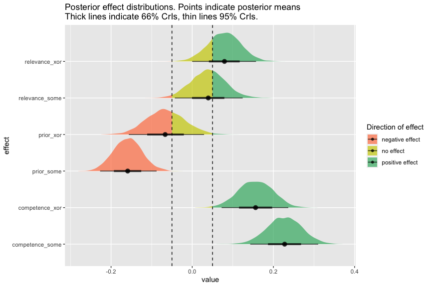
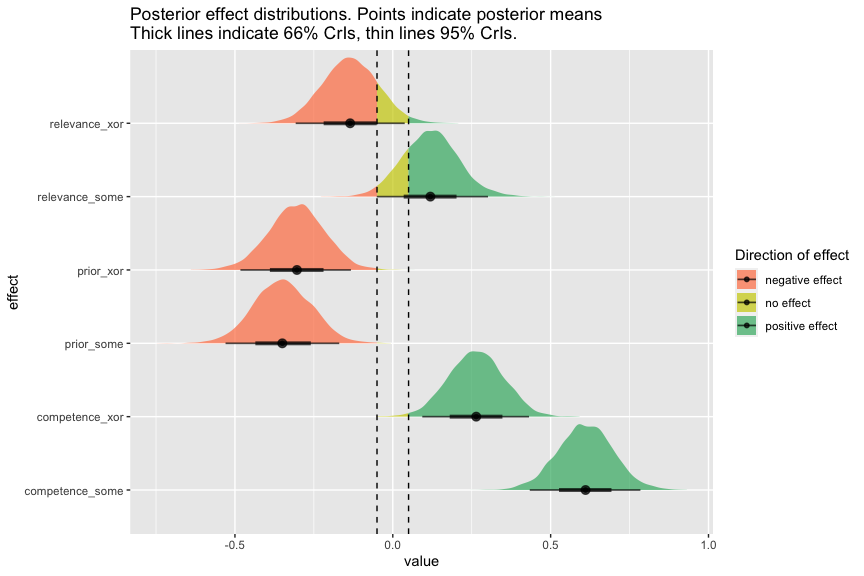
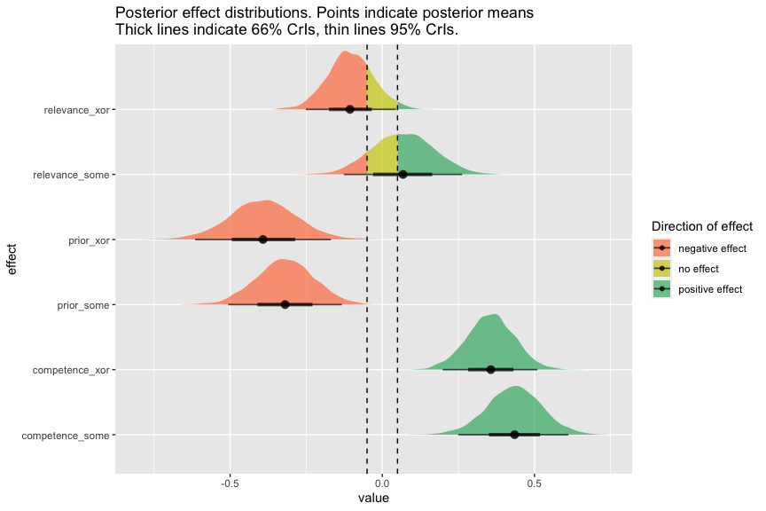

Xor-Some Preregistered Study: Analyses
================
Polina Tsvilodub
8/31/2021

Read data created in preprocessing script:

``` r
d_critical_zScored_wide <- read_csv("./../../data/main/results_prereg_tidy_final_zScored_wide.csv")
d_critical_zScored <- read_csv("./../../data/main/results_prereg_tidy_final_zScored_long.csv")

d_critical_zScored_wide_xor_prior_order <- read_csv("./../../data/main/results_prereg_tidy_final_zScored_wide_xor_priors-order.csv")

d_critical_zScored_wide_xor_prior_type <- read_csv("./../../data/main/results_prereg_tidy_final_zScored_wide_xor_priors-type.csv")
```

## Main analysis

Next, fit the maximal model *across* experiments (i.e., *across SI
trigger types*). For convergence reasons, correlation of random effects
has to be set to 0.

``` r
# Full model 
d_critical_zScored_wide <- d_critical_zScored_wide %>% mutate(
  main_type = as.factor(main_type)
)
# some = 0, xor = 1
contrasts(d_critical_zScored_wide$main_type) 

# set priors
priors <- set_prior("student_t(1, 0, 2)", class = "b")

model_SI <- brm(target ~ prior*competence*relevance* main_type +
                   (1 + prior + competence + relevance + main_type || submission_id) +
                   (1 | title),
                 data = d_critical_zScored_wide,
                 prior = priors,
                 sample_prior = T,
                 control = list(adapt_delta = 0.95),
                 cores = 4,
                 iter = 3000)
```

``` r
summary(model_SI)
```

    ##  Family: gaussian 
    ##   Links: mu = identity; sigma = identity 
    ## Formula: target ~ prior * competence * relevance * main_type + (1 + prior + competence + relevance + main_type || submission_id) + (1 | title) 
    ##    Data: d_critical_zScored_wide (Number of observations: 1648) 
    ## Samples: 4 chains, each with iter = 3000; warmup = 1500; thin = 1;
    ##          total post-warmup samples = 6000
    ## 
    ## Group-Level Effects: 
    ## ~submission_id (Number of levels: 206) 
    ##                  Estimate Est.Error l-95% CI u-95% CI Rhat Bulk_ESS Tail_ESS
    ## sd(Intercept)        0.02      0.01     0.00     0.05 1.00     4737     2571
    ## sd(prior)            0.20      0.04     0.13     0.27 1.00     1889     2646
    ## sd(competence)       0.11      0.05     0.01     0.20 1.00      823     1293
    ## sd(relevance)        0.06      0.04     0.00     0.15 1.00     1100     2110
    ## sd(main_typexor)     0.05      0.04     0.00     0.14 1.00     2100     2335
    ## 
    ## ~title (Number of levels: 64) 
    ##               Estimate Est.Error l-95% CI u-95% CI Rhat Bulk_ESS Tail_ESS
    ## sd(Intercept)     0.25      0.04     0.19     0.33 1.00     2123     3716
    ## 
    ## Population-Level Effects: 
    ##                                         Estimate Est.Error l-95% CI u-95% CI
    ## Intercept                                   0.13      0.06     0.02     0.24
    ## prior                                      -0.16      0.04    -0.23    -0.09
    ## competence                                  0.23      0.04     0.14     0.31
    ## relevance                                   0.04      0.04    -0.04     0.12
    ## main_typexor                               -0.30      0.08    -0.46    -0.14
    ## prior:competence                            0.06      0.03    -0.00     0.11
    ## prior:relevance                            -0.02      0.03    -0.08     0.04
    ## competence:relevance                        0.04      0.04    -0.04     0.11
    ## prior:main_typexor                          0.09      0.05    -0.01     0.20
    ## competence:main_typexor                    -0.07      0.06    -0.18     0.04
    ## relevance:main_typexor                      0.04      0.06    -0.07     0.15
    ## prior:competence:relevance                  0.00      0.03    -0.05     0.05
    ## prior:competence:main_typexor              -0.08      0.05    -0.19     0.02
    ## prior:relevance:main_typexor                0.02      0.05    -0.08     0.12
    ## competence:relevance:main_typexor           0.03      0.05    -0.07     0.14
    ## prior:competence:relevance:main_typexor     0.01      0.05    -0.09     0.10
    ##                                         Rhat Bulk_ESS Tail_ESS
    ## Intercept                               1.00     2791     3643
    ## prior                                   1.00     4224     4339
    ## competence                              1.00     2887     3512
    ## relevance                               1.00     3239     3881
    ## main_typexor                            1.00     2567     3157
    ## prior:competence                        1.00     4183     4384
    ## prior:relevance                         1.00     4318     4416
    ## competence:relevance                    1.00     3163     4023
    ## prior:main_typexor                      1.00     4327     4455
    ## competence:main_typexor                 1.00     3530     3852
    ## relevance:main_typexor                  1.00     3528     3886
    ## prior:competence:relevance              1.00     4239     4348
    ## prior:competence:main_typexor           1.00     4472     4705
    ## prior:relevance:main_typexor            1.00     4274     4954
    ## competence:relevance:main_typexor       1.00     3703     4677
    ## prior:competence:relevance:main_typexor 1.00     4702     4400
    ## 
    ## Family Specific Parameters: 
    ##       Estimate Est.Error l-95% CI u-95% CI Rhat Bulk_ESS Tail_ESS
    ## sigma     0.83      0.02     0.80     0.87 1.00     2993     3589
    ## 
    ## Samples were drawn using sampling(NUTS). For each parameter, Bulk_ESS
    ## and Tail_ESS are effective sample size measures, and Rhat is the potential
    ## scale reduction factor on split chains (at convergence, Rhat = 1).

Next, extract posterior contrasts of interest: effects of each predictor
{prior, competence and relevance} for each trigger.

``` r
model_SI %>% spread_draws(b_Intercept, b_prior, b_competence, b_relevance,
                          b_main_typexor, `b_prior:competence`,
                          `b_prior:relevance`, `b_competence:relevance`,
                          `b_prior:main_typexor`, `b_competence:main_typexor`,
                          `b_relevance:main_typexor`, `b_prior:competence:relevance`, 
                          `b_prior:competence:main_typexor`, `b_prior:relevance:main_typexor`,
                          `b_competence:relevance:main_typexor`, 
                          `b_prior:competence:relevance:main_typexor`) %>% 
  mutate(
    prior_xor = b_prior + `b_prior:main_typexor`,
    prior_some = b_prior,
    competence_xor = b_competence + `b_competence:main_typexor`,
    competence_some = b_competence,
    relevance_xor =  b_relevance + `b_relevance:main_typexor`,
    relevance_some = b_relevance
  ) -> model_SI_posteriors

# check P that the effects are positive / negative / no effect present
posterior_hypotheses <- model_SI_posteriors %>% 
  select(prior_xor, prior_some, 
         competence_xor, competence_some,
         relevance_xor, relevance_some) %>%
  gather(key, val) %>%
  group_by(key) %>% mutate(positive = mean(val > 0.05),
                           negative = mean(val < -0.05),
                           no = mean(val %>% between(-0.05, 0.05))) %>%
  summarise(positive_eff = mean(positive),
            negative_eff = mean(negative),
            no_eff = mean(no))
```

    ## `summarise()` ungrouping output (override with `.groups` argument)

``` r
posterior_hypotheses
```

    ## # A tibble: 6 x 4
    ##   key             positive_eff negative_eff  no_eff
    ##   <chr>                  <dbl>        <dbl>   <dbl>
    ## 1 competence_some      1             0      0      
    ## 2 competence_xor       0.993         0      0.00667
    ## 3 prior_some           0             0.999  0.001  
    ## 4 prior_xor            0.00783       0.638  0.355  
    ## 5 relevance_some       0.402         0.0177 0.581  
    ## 6 relevance_xor        0.768         0.001  0.230

#### Perform BF analysis

We want to address a conjunctive hypothesis, one triplet for each
trigger word, namely:

1.  the slope of ‘competence’ is positive
2.  the slope of ‘prior’ is negative
3.  the slope of ‘relevance’ is positive

We judge there to be strong evidence for positivity of a slope variable
\(\beta_X\), if the posterior probability \(P(\beta_X > \delta \mid D)\)
is at least \(.95\), for \(\delta = 0.05\) the parameter that defines
our ‘region of practical equivalence’. A posterior odds ratio of at
least \(\frac{.95}{.05} = 19\) corresponds to a Bayes factor of at least
19 when prior odds are 1.

The binary test of conformity with the theoretical predictions therefore
is:

``` r
test_conjunction_of_all_hypotheses <-  function(posterior_hypotheses) {
  posterior_hypotheses %>% 
    mutate(hypothesis_true = case_when(
      key == 'competence_some' ~ positive_eff > 0.95,
      key == 'competence_xor'  ~ positive_eff > 0.95,
      key == 'prior_some' ~ negative_eff > 0.95,
      key == 'prior_xor'  ~ negative_eff > 0.95, 
      key == 'relevance_some' ~ positive_eff > 0.95,
      key == 'relevance_xor'  ~ positive_eff > 0.95
    )) %>% 
    pull(hypothesis_true) %>% all()
}
# applied to the pilot data
test_conjunction_of_all_hypotheses(posterior_hypotheses)
```

    ## [1] FALSE

### Plot posterior distributions

``` r
model_SI_posteriors %>% select(prior_xor, prior_some,
                               competence_xor, competence_some,
                               relevance_xor, relevance_some) %>%
  pivot_longer(cols = everything(), names_to = "effect", values_to = "value") -> model_SI_posteriors_long


model_SI_posteriors_long %>%
  ggplot(.) + # 
  stat_halfeye(aes(y = effect, x = value, 
                   fill = stat(case_when(x %>% between(-0.05, 0.05) ~ "no effect", x < -0.05 ~ "negative effect", x > 0.05 ~ "positive effect"))
                   ), 
               alpha = .7) +
  geom_vline(xintercept = c(-.05, .05), linetype = "dashed") +
  scale_fill_manual(name = "Direction of effect", values = c("coral", "yellow3", "mediumseagreen")) +
  ggtitle("Posterior effect distributions. Points indicate posterior means\nThick lines indicate 66% CrIs, thin lines 95% CrIs.")
```

<!-- -->

## Exploratory analyses

Model with binary predictors:

``` r
d_critical_zScored %>% 
  select(submission_id, title, main_type, block_extended, response_centered, prior_class, class_condition) %>% 
  unique() %>% 
  pivot_wider(
    names_from = class_condition, 
    values_from = prior_class
  )  %>%
  mutate(relevance = factor(relevance, levels = c(1, 0)),
         competence = factor(competence, levels = c(1, 0)),
         prior = factor(prior, levels = c(1, 0)),
         main_type = as.factor(main_type)) %>% 
  filter(block_extended == "target") -> d_critical_wide_cat_zScored
# sum code predictors
# low prior: -1, high prior:: 1 
contrasts(d_critical_wide_cat_zScored$prior) <- contr.sum(2)
# low comp : -1, high comp : 1
contrasts(d_critical_wide_cat_zScored$competence) <- contr.sum(2)
# low rel: -1, high rel: 1
contrasts(d_critical_wide_cat_zScored$relevance) <- contr.sum(2)
# leave main type dummy coded
contrasts(d_critical_wide_cat_zScored$main_type) 

# xor, maximal model with interactions and maximal REs
model_xor_cat_zScored <- brm(
  response_centered ~ prior*competence*relevance*main_type + 
    (1 + prior + competence + relevance + main_type || submission_id) +
    (1 | title),
  data = d_critical_wide_cat_zScored,
  prior = priors,
  sample_prior = T,
  family = "gaussian",
  cores = 4,
  iter = 3000
)
```

``` r
summary(model_xor_cat_zScored)
```

    ##  Family: gaussian 
    ##   Links: mu = identity; sigma = identity 
    ## Formula: response_centered ~ prior * competence * relevance * main_type + (1 + prior + competence + relevance + main_type || submission_id) + (1 | title) 
    ##    Data: d_critical_wide_cat_zScored (Number of observations: 1648) 
    ## Samples: 4 chains, each with iter = 3000; warmup = 1500; thin = 1;
    ##          total post-warmup samples = 6000
    ## 
    ## Group-Level Effects: 
    ## ~submission_id (Number of levels: 206) 
    ##                  Estimate Est.Error l-95% CI u-95% CI Rhat Bulk_ESS Tail_ESS
    ## sd(Intercept)        0.02      0.01     0.00     0.05 1.00     5654     3263
    ## sd(prior1)           0.20      0.03     0.13     0.26 1.00     1649     1821
    ## sd(competence1)      0.11      0.05     0.01     0.20 1.00      928     1343
    ## sd(relevance1)       0.16      0.04     0.06     0.23 1.00     1126     1072
    ## sd(main_typexor)     0.05      0.04     0.00     0.14 1.00     2240     2893
    ## 
    ## ~title (Number of levels: 64) 
    ##               Estimate Est.Error l-95% CI u-95% CI Rhat Bulk_ESS Tail_ESS
    ## sd(Intercept)     0.18      0.04     0.10     0.26 1.00     1813     2481
    ## 
    ## Population-Level Effects: 
    ##                                            Estimate Est.Error l-95% CI u-95% CI
    ## Intercept                                      0.19      0.04     0.10     0.27
    ## prior1                                        -0.17      0.05    -0.26    -0.08
    ## competence1                                    0.30      0.04     0.22     0.39
    ## relevance1                                     0.06      0.04    -0.03     0.15
    ## main_typexor                                  -0.38      0.06    -0.50    -0.26
    ## prior1:competence1                             0.09      0.04    -0.00     0.17
    ## prior1:relevance1                             -0.00      0.04    -0.09     0.09
    ## competence1:relevance1                         0.00      0.04    -0.08     0.09
    ## prior1:main_typexor                            0.02      0.06    -0.10     0.14
    ## competence1:main_typexor                      -0.17      0.06    -0.29    -0.05
    ## relevance1:main_typexor                       -0.13      0.06    -0.25    -0.01
    ## prior1:competence1:relevance1                  0.01      0.04    -0.07     0.10
    ## prior1:competence1:main_typexor               -0.08      0.06    -0.21     0.04
    ## prior1:relevance1:main_typexor                 0.07      0.06    -0.05     0.19
    ## competence1:relevance1:main_typexor            0.10      0.06    -0.03     0.22
    ## prior1:competence1:relevance1:main_typexor    -0.14      0.06    -0.26    -0.01
    ##                                            Rhat Bulk_ESS Tail_ESS
    ## Intercept                                  1.00     4775     4592
    ## prior1                                     1.00     3651     3956
    ## competence1                                1.00     3935     4350
    ## relevance1                                 1.00     3791     4020
    ## main_typexor                               1.00     5143     4708
    ## prior1:competence1                         1.00     3475     3663
    ## prior1:relevance1                          1.00     3845     4099
    ## competence1:relevance1                     1.00     3826     4136
    ## prior1:main_typexor                        1.00     3759     4121
    ## competence1:main_typexor                   1.00     3937     4261
    ## relevance1:main_typexor                    1.00     3689     3928
    ## prior1:competence1:relevance1              1.00     3671     4046
    ## prior1:competence1:main_typexor            1.00     3565     3547
    ## prior1:relevance1:main_typexor             1.00     3704     3629
    ## competence1:relevance1:main_typexor        1.00     3306     4021
    ## prior1:competence1:relevance1:main_typexor 1.00     3699     4368
    ## 
    ## Family Specific Parameters: 
    ##       Estimate Est.Error l-95% CI u-95% CI Rhat Bulk_ESS Tail_ESS
    ## sigma     0.82      0.02     0.79     0.86 1.00     1761     3362
    ## 
    ## Samples were drawn using sampling(NUTS). For each parameter, Bulk_ESS
    ## and Tail_ESS are effective sample size measures, and Rhat is the potential
    ## scale reduction factor on split chains (at convergence, Rhat = 1).

Now extract posterior contrasts of interest from categorical model:
effects of each predictor {prior, competence and relevance} for each
trigger.

``` r
model_xor_cat_zScored %>% spread_draws(b_Intercept, b_prior1, b_competence1, b_relevance1,
                          b_main_typexor, `b_prior1:competence1`,
                          `b_prior1:relevance1`, `b_competence1:relevance1`,
                          `b_prior1:main_typexor`, `b_competence1:main_typexor`,
                          `b_relevance1:main_typexor`, `b_prior1:competence1:relevance1`, 
                          `b_prior1:competence1:main_typexor`, `b_prior1:relevance1:main_typexor`,
                          `b_competence1:relevance1:main_typexor`, 
                          `b_prior1:competence1:relevance1:main_typexor`) %>% 
  mutate(
    prior_xor = 2 * b_prior1 + 2* `b_prior1:main_typexor`,
    prior_some = 2 * b_prior1,
    competence_xor = 2 * b_competence1 + 2* `b_competence1:main_typexor`,
    competence_some = 2 * b_competence1,
    relevance_xor =  2 * b_relevance1 + 2* `b_relevance1:main_typexor`,
    relevance_some = 2* b_relevance1
  ) -> model_xor_cat_zScored_posteriors

# check P that the effects are positive / negative / no effect present
posterior_hypotheses_cat <- model_xor_cat_zScored_posteriors %>% 
  select(prior_xor, prior_some, 
         competence_xor, competence_some,
         relevance_xor, relevance_some) %>%
  gather(key, val) %>%
  group_by(key) %>% mutate(positive = mean(val > 0.05),
                           negative = mean(val < -0.05),
                           no = mean(val %>% between(-0.05, 0.05))) %>%
  summarise(positive_eff = mean(positive),
            negative_eff = mean(negative),
            no_eff = mean(no))
```

    ## `summarise()` ungrouping output (override with `.groups` argument)

``` r
posterior_hypotheses_cat
```

    ## # A tibble: 6 x 4
    ##   key             positive_eff negative_eff  no_eff
    ##   <chr>                  <dbl>        <dbl>   <dbl>
    ## 1 competence_some     1            0        0      
    ## 2 competence_xor      0.991        0.000333 0.0085 
    ## 3 prior_some          0            0.998    0.0015 
    ## 4 prior_xor           0.000167     0.997    0.00267
    ## 5 relevance_some      0.782        0.0258   0.192  
    ## 6 relevance_xor       0.0193       0.833    0.148

``` r
test_conjunction_of_all_hypotheses(posterior_hypotheses_cat)
```

    ## [1] FALSE

``` r
model_xor_cat_zScored_posteriors %>% select(prior_xor, prior_some,
                               competence_xor, competence_some,
                               relevance_xor, relevance_some) %>%
  pivot_longer(cols = everything(), names_to = "effect", values_to = "value") -> model_xor_cat_posteriors_long


model_xor_cat_posteriors_long %>%
  ggplot(.) + # 
  stat_halfeye(aes(y = effect, x = value, 
                   fill = stat(case_when(x %>% between(-0.05, 0.05) ~ "no effect", x < -0.05 ~ "negative effect", x > 0.05 ~ "positive effect"))
                   ), 
               alpha = .7) +
  geom_vline(xintercept = c(-.05, .05), linetype = "dashed") +
  scale_fill_manual(name = "Direction of effect", values = c("coral", "yellow3", "mediumseagreen")) +
  ggtitle("Posterior effect distributions. Points indicate posterior means\nThick lines indicate 66% CrIs, thin lines 95% CrIs.")
```

<!-- -->

Model with aggregated by-story ratings:

``` r
d_critical_zScored_wide_byItem <- d_critical_zScored_wide %>% ungroup() %>%
  group_by(title, main_type) %>%
  summarize(mean_response = mean(target),
            mean_prior = mean(prior),
            mean_relevance = mean(relevance),
            mean_competence = mean(competence))


model_means <- brm(mean_response ~ mean_prior * mean_relevance * mean_competence * main_type,
                       data = d_critical_zScored_wide_byItem,
                       prior = priors,
                       sample_prior = T,
                       family = "gaussian",
                       cores = 4,
                       iter = 3000
                       )
```

``` r
summary(model_means)
```

    ##  Family: gaussian 
    ##   Links: mu = identity; sigma = identity 
    ## Formula: mean_response ~ mean_prior * mean_relevance * mean_competence * main_type 
    ##    Data: d_critical_zScored_wide_byItem (Number of observations: 64) 
    ## Samples: 4 chains, each with iter = 3000; warmup = 1500; thin = 1;
    ##          total post-warmup samples = 6000
    ## 
    ## Population-Level Effects: 
    ##                                                        Estimate Est.Error
    ## Intercept                                                  0.07      0.06
    ## mean_prior                                                -0.32      0.10
    ## mean_relevance                                             0.07      0.10
    ## mean_competence                                            0.43      0.09
    ## main_typexor                                              -0.22      0.08
    ## mean_prior:mean_relevance                                  0.04      0.14
    ## mean_prior:mean_competence                                 0.16      0.13
    ## mean_relevance:mean_competence                            -0.02      0.12
    ## mean_prior:main_typexor                                   -0.07      0.15
    ## mean_relevance:main_typexor                               -0.17      0.12
    ## mean_competence:main_typexor                              -0.08      0.12
    ## mean_prior:mean_relevance:mean_competence                 -0.02      0.17
    ## mean_prior:mean_relevance:main_typexor                    -0.07      0.21
    ## mean_prior:mean_competence:main_typexor                   -0.23      0.20
    ## mean_relevance:mean_competence:main_typexor                0.18      0.17
    ## mean_prior:mean_relevance:mean_competence:main_typexor    -0.09      0.30
    ##                                                        l-95% CI u-95% CI Rhat
    ## Intercept                                                 -0.05     0.19 1.00
    ## mean_prior                                                -0.51    -0.13 1.00
    ## mean_relevance                                            -0.13     0.26 1.00
    ## mean_competence                                            0.25     0.61 1.00
    ## main_typexor                                              -0.37    -0.05 1.00
    ## mean_prior:mean_relevance                                 -0.23     0.31 1.00
    ## mean_prior:mean_competence                                -0.09     0.41 1.00
    ## mean_relevance:mean_competence                            -0.27     0.22 1.00
    ## mean_prior:main_typexor                                   -0.36     0.22 1.00
    ## mean_relevance:main_typexor                               -0.42     0.07 1.00
    ## mean_competence:main_typexor                              -0.31     0.16 1.00
    ## mean_prior:mean_relevance:mean_competence                 -0.35     0.31 1.00
    ## mean_prior:mean_relevance:main_typexor                    -0.49     0.33 1.00
    ## mean_prior:mean_competence:main_typexor                   -0.64     0.16 1.00
    ## mean_relevance:mean_competence:main_typexor               -0.15     0.51 1.00
    ## mean_prior:mean_relevance:mean_competence:main_typexor    -0.69     0.51 1.00
    ##                                                        Bulk_ESS Tail_ESS
    ## Intercept                                                  5606     4981
    ## mean_prior                                                 5102     4443
    ## mean_relevance                                             3275     3936
    ## mean_competence                                            3059     3474
    ## main_typexor                                               6532     5170
    ## mean_prior:mean_relevance                                  3724     4341
    ## mean_prior:mean_competence                                 3344     3673
    ## mean_relevance:mean_competence                             3716     4195
    ## mean_prior:main_typexor                                    5017     4675
    ## mean_relevance:main_typexor                                3769     4620
    ## mean_competence:main_typexor                               3801     3977
    ## mean_prior:mean_relevance:mean_competence                  3544     4254
    ## mean_prior:mean_relevance:main_typexor                     4514     4394
    ## mean_prior:mean_competence:main_typexor                    4547     4343
    ## mean_relevance:mean_competence:main_typexor                4471     4586
    ## mean_prior:mean_relevance:mean_competence:main_typexor     5152     4290
    ## 
    ## Family Specific Parameters: 
    ##       Estimate Est.Error l-95% CI u-95% CI Rhat Bulk_ESS Tail_ESS
    ## sigma     0.27      0.03     0.22     0.33 1.00     4486     4014
    ## 
    ## Samples were drawn using sampling(NUTS). For each parameter, Bulk_ESS
    ## and Tail_ESS are effective sample size measures, and Rhat is the potential
    ## scale reduction factor on split chains (at convergence, Rhat = 1).

Extract posterior contrasts of interest from by-story mean based model:
effects of each predictor {prior, competence and relevance} for each
trigger.

``` r
model_means %>% spread_draws(b_Intercept, b_mean_prior, b_mean_competence, b_mean_relevance,
                          b_main_typexor, `b_mean_prior:mean_competence`,
                          `b_mean_prior:mean_relevance`, `b_mean_relevance:mean_competence`,
                          `b_mean_prior:main_typexor`, `b_mean_competence:main_typexor`,
                          `b_mean_relevance:main_typexor`,
                          `b_mean_prior:mean_relevance:mean_competence`, 
                          `b_mean_prior:mean_competence:main_typexor`,
                          `b_mean_prior:mean_relevance:main_typexor`,
                          `b_mean_relevance:mean_competence:main_typexor`, 
                          `b_mean_prior:mean_relevance:mean_competence:main_typexor`) %>% 
  mutate(
    prior_xor = b_mean_prior + `b_mean_prior:main_typexor`,
    prior_some = b_mean_prior,
    competence_xor = b_mean_competence + `b_mean_competence:main_typexor`,
    competence_some = b_mean_competence,
    relevance_xor =  b_mean_relevance + `b_mean_relevance:main_typexor`,
    relevance_some = b_mean_relevance
  ) -> model_means_posteriors

# check P that the effects are positive / negative / no effect present
posterior_hypotheses_means <- model_means_posteriors %>% 
  select(prior_xor, prior_some, 
         competence_xor, competence_some,
         relevance_xor, relevance_some) %>%
  gather(key, val) %>%
  group_by(key) %>% mutate(positive = mean(val > 0.05),
                           negative = mean(val < -0.05),
                           no = mean(val %>% between(-0.05, 0.05))) %>%
  summarise(positive_eff = mean(positive),
            negative_eff = mean(negative),
            no_eff = mean(no))
```

    ## `summarise()` ungrouping output (override with `.groups` argument)

``` r
posterior_hypotheses_means
```

    ## # A tibble: 6 x 4
    ##   key             positive_eff negative_eff   no_eff
    ##   <chr>                  <dbl>        <dbl>    <dbl>
    ## 1 competence_some     1               0     0       
    ## 2 competence_xor      1.00            0     0.000167
    ## 3 prior_some          0.000333        0.998 0.00133 
    ## 4 prior_xor           0.000167        0.999 0.001   
    ## 5 relevance_some      0.567           0.122 0.311   
    ## 6 relevance_xor       0.0218          0.773 0.205

``` r
test_conjunction_of_all_hypotheses(posterior_hypotheses_means)
```

    ## [1] FALSE

``` r
model_means_posteriors %>% select(prior_xor, prior_some,
                               competence_xor, competence_some,
                               relevance_xor, relevance_some) %>%
  pivot_longer(cols = everything(), names_to = "effect", values_to = "value") -> model_mean_posteriors_long


model_mean_posteriors_long %>%
  ggplot(.) + # 
  stat_halfeye(aes(y = effect, x = value, 
                   fill = stat(case_when(x %>% between(-0.05, 0.05) ~ "no effect", x < -0.05 ~ "negative effect", x > 0.05 ~ "positive effect"))
                   ), 
               alpha = .7) +
  geom_vline(xintercept = c(-.05, .05), linetype = "dashed") +
  scale_fill_manual(name = "Direction of effect", values = c("coral", "yellow3", "mediumseagreen")) +
  ggtitle("Posterior effect distributions. Points indicate posterior means\nThick lines indicate 66% CrIs, thin lines 95% CrIs.")
```

<!-- -->

A non-preregistered, but nevertheless possibly interesting exploratory
analysis including the two individual prior ratings of the conditionals
in the xor condition as predictors (as opposed to the mean of the two
used in the preceding models): Analysis based on the order of appearance
of the questions:

``` r
# set priors
priors <- set_prior("student_t(1, 0, 2)", class = "b")

model_xor_priors_order <- brm(target ~ prior_1*prior_2*competence*relevance +
                   (1 + prior_1 + prior_2 + competence + relevance || submission_id) +
                   (1 | title),
                 data = d_critical_zScored_wide_xor_prior_order,
                 prior = priors,
                 sample_prior = T,
                 control = list(adapt_delta = 0.95),
                 cores = 4,
                 iter = 3000)
```

``` r
summary(model_xor_priors_order)
```

    ##  Family: gaussian 
    ##   Links: mu = identity; sigma = identity 
    ## Formula: target ~ prior_1 * prior_2 * competence * relevance + (1 + prior_1 + prior_2 + competence + relevance || submission_id) + (1 | title) 
    ##    Data: d_critical_zScored_wide_xor_prior_order (Number of observations: 824) 
    ## Samples: 4 chains, each with iter = 3000; warmup = 1500; thin = 1;
    ##          total post-warmup samples = 6000
    ## 
    ## Group-Level Effects: 
    ## ~submission_id (Number of levels: 206) 
    ##                Estimate Est.Error l-95% CI u-95% CI Rhat Bulk_ESS Tail_ESS
    ## sd(Intercept)      0.05      0.04     0.00     0.14 1.00     3352     3187
    ## sd(prior_1)        0.14      0.08     0.01     0.30 1.00      624     2120
    ## sd(prior_2)        0.21      0.09     0.03     0.36 1.00      866     1648
    ## sd(competence)     0.13      0.08     0.01     0.28 1.00     1377     2739
    ## sd(relevance)      0.07      0.05     0.00     0.19 1.00     2241     3587
    ## 
    ## ~title (Number of levels: 32) 
    ##               Estimate Est.Error l-95% CI u-95% CI Rhat Bulk_ESS Tail_ESS
    ## sd(Intercept)     0.26      0.06     0.16     0.39 1.00     2387     3647
    ## 
    ## Population-Level Effects: 
    ##                                      Estimate Est.Error l-95% CI u-95% CI Rhat
    ## Intercept                               -0.17      0.06    -0.29    -0.04 1.00
    ## prior_1                                  0.04      0.08    -0.13     0.20 1.00
    ## prior_2                                 -0.08      0.08    -0.24     0.08 1.00
    ## competence                               0.18      0.05     0.07     0.28 1.00
    ## relevance                                0.06      0.05    -0.04     0.17 1.00
    ## prior_1:prior_2                         -0.00      0.05    -0.09     0.09 1.00
    ## prior_1:competence                      -0.08      0.09    -0.25     0.10 1.00
    ## prior_2:competence                       0.05      0.09    -0.13     0.22 1.00
    ## prior_1:relevance                       -0.08      0.08    -0.24     0.08 1.00
    ## prior_2:relevance                        0.07      0.08    -0.08     0.23 1.00
    ## competence:relevance                     0.08      0.05    -0.02     0.18 1.00
    ## prior_1:prior_2:competence              -0.04      0.05    -0.13     0.05 1.00
    ## prior_1:prior_2:relevance                0.04      0.04    -0.05     0.13 1.00
    ## prior_1:competence:relevance             0.08      0.09    -0.10     0.25 1.00
    ## prior_2:competence:relevance            -0.07      0.09    -0.24     0.11 1.00
    ## prior_1:prior_2:competence:relevance    -0.01      0.04    -0.10     0.07 1.00
    ##                                      Bulk_ESS Tail_ESS
    ## Intercept                                5613     4735
    ## prior_1                                  6990     4621
    ## prior_2                                  6421     4616
    ## competence                               8977     5251
    ## relevance                                8357     4506
    ## prior_1:prior_2                          9845     5335
    ## prior_1:competence                       7985     4888
    ## prior_2:competence                       7752     4730
    ## prior_1:relevance                        8967     5122
    ## prior_2:relevance                        8597     5127
    ## competence:relevance                    10116     4764
    ## prior_1:prior_2:competence               9519     5168
    ## prior_1:prior_2:relevance                9360     4937
    ## prior_1:competence:relevance             7534     4927
    ## prior_2:competence:relevance             7301     4590
    ## prior_1:prior_2:competence:relevance     9518     4696
    ## 
    ## Family Specific Parameters: 
    ##       Estimate Est.Error l-95% CI u-95% CI Rhat Bulk_ESS Tail_ESS
    ## sigma     0.85      0.03     0.80     0.90 1.00     2805     4017
    ## 
    ## Samples were drawn using sampling(NUTS). For each parameter, Bulk_ESS
    ## and Tail_ESS are effective sample size measures, and Rhat is the potential
    ## scale reduction factor on split chains (at convergence, Rhat = 1).

Check the intervals of intervals, computing them separately using only
one prior estimate, to see if we get different results:

``` r
model_xor_priors_order %>% spread_draws(b_Intercept, b_prior_1, b_prior_2, b_competence, b_relevance) %>% 
  mutate(
    prior1_xor = b_prior_1,
    prior2_xor = b_prior_2,
    competence_xor = b_competence,
    relevance_xor =  b_relevance
  ) -> model_xor_priors_posteriors

# check P that the effects are positive / negative / no effect present
posterior_hypotheses_xor_priors_order <- model_xor_priors_posteriors %>% 
  select(prior1_xor, prior2_xor, 
         competence_xor, relevance_xor) %>%
  gather(key, val) %>%
  group_by(key) %>% mutate(positive = mean(val > 0.05),
                           negative = mean(val < -0.05),
                           no = mean(val %>% between(-0.05, 0.05))) %>%
  summarise(positive_eff = mean(positive),
            negative_eff = mean(negative),
            no_eff = mean(no))
```

    ## `summarise()` ungrouping output (override with `.groups` argument)

``` r
posterior_hypotheses_xor_priors_order
```

    ## # A tibble: 4 x 4
    ##   key            positive_eff negative_eff no_eff
    ##   <chr>                 <dbl>        <dbl>  <dbl>
    ## 1 competence_xor       0.991        0       0.009
    ## 2 prior1_xor           0.431        0.141   0.428
    ## 3 prior2_xor           0.0555       0.637   0.308
    ## 4 relevance_xor        0.600        0.0122  0.388

Prior question type based analysis:

``` r
# set priors
priors <- set_prior("student_t(1, 0, 2)", class = "b")

model_xor_priors_type <- brm(target ~ priorQ_1*priorQ_2*competence*relevance +
                   (1 + priorQ_1 + priorQ_2 + competence + relevance || submission_id) +
                   (1 | title),
                 data = d_critical_zScored_wide_xor_prior_type,
                 prior = priors,
                 sample_prior = T,
                 control = list(adapt_delta = 0.95),
                 cores = 4,
                 iter = 3000)
```

``` r
summary(model_xor_priors_type)
```

    ##  Family: gaussian 
    ##   Links: mu = identity; sigma = identity 
    ## Formula: target ~ priorQ_1 * priorQ_2 * competence * relevance + (1 + priorQ_1 + priorQ_2 + competence + relevance || submission_id) + (1 | title) 
    ##    Data: d_critical_zScored_wide_xor_prior_type (Number of observations: 824) 
    ## Samples: 4 chains, each with iter = 3000; warmup = 1500; thin = 1;
    ##          total post-warmup samples = 6000
    ## 
    ## Group-Level Effects: 
    ## ~submission_id (Number of levels: 206) 
    ##                Estimate Est.Error l-95% CI u-95% CI Rhat Bulk_ESS Tail_ESS
    ## sd(Intercept)      0.05      0.04     0.00     0.14 1.00     2351     2983
    ## sd(priorQ_1)       0.12      0.08     0.01     0.28 1.00      874     2050
    ## sd(priorQ_2)       0.25      0.08     0.05     0.38 1.00      882      944
    ## sd(competence)     0.14      0.08     0.01     0.29 1.00     1148     2250
    ## sd(relevance)      0.07      0.05     0.00     0.18 1.00     1891     2880
    ## 
    ## ~title (Number of levels: 32) 
    ##               Estimate Est.Error l-95% CI u-95% CI Rhat Bulk_ESS Tail_ESS
    ## sd(Intercept)     0.26      0.06     0.15     0.38 1.00     2243     3072
    ## 
    ## Population-Level Effects: 
    ##                                        Estimate Est.Error l-95% CI u-95% CI
    ## Intercept                                 -0.16      0.06    -0.28    -0.03
    ## priorQ_1                                  -0.02      0.08    -0.19     0.13
    ## priorQ_2                                  -0.02      0.08    -0.18     0.14
    ## competence                                 0.18      0.06     0.07     0.29
    ## relevance                                  0.06      0.05    -0.04     0.16
    ## priorQ_1:priorQ_2                         -0.01      0.05    -0.10     0.08
    ## priorQ_1:competence                        0.10      0.09    -0.07     0.28
    ## priorQ_2:competence                       -0.13      0.09    -0.31     0.05
    ## priorQ_1:relevance                        -0.02      0.08    -0.18     0.13
    ## priorQ_2:relevance                         0.02      0.08    -0.14     0.18
    ## competence:relevance                       0.08      0.05    -0.01     0.18
    ## priorQ_1:priorQ_2:competence              -0.05      0.05    -0.14     0.05
    ## priorQ_1:priorQ_2:relevance                0.05      0.04    -0.04     0.13
    ## priorQ_1:competence:relevance              0.02      0.09    -0.16     0.19
    ## priorQ_2:competence:relevance             -0.02      0.10    -0.20     0.18
    ## priorQ_1:priorQ_2:competence:relevance    -0.02      0.04    -0.10     0.07
    ##                                        Rhat Bulk_ESS Tail_ESS
    ## Intercept                              1.00     4192     4813
    ## priorQ_1                               1.00     4710     4436
    ## priorQ_2                               1.00     4867     4285
    ## competence                             1.00     5685     5069
    ## relevance                              1.00     4938     4720
    ## priorQ_1:priorQ_2                      1.00     8723     5035
    ## priorQ_1:competence                    1.00     5029     3638
    ## priorQ_2:competence                    1.00     5021     4339
    ## priorQ_1:relevance                     1.00     5048     3968
    ## priorQ_2:relevance                     1.00     5204     4407
    ## competence:relevance                   1.00     6020     4476
    ## priorQ_1:priorQ_2:competence           1.00     6748     5382
    ## priorQ_1:priorQ_2:relevance            1.00     6245     4991
    ## priorQ_1:competence:relevance          1.00     4914     4529
    ## priorQ_2:competence:relevance          1.00     5034     4619
    ## priorQ_1:priorQ_2:competence:relevance 1.00     5421     4559
    ## 
    ## Family Specific Parameters: 
    ##       Estimate Est.Error l-95% CI u-95% CI Rhat Bulk_ESS Tail_ESS
    ## sigma     0.85      0.03     0.80     0.90 1.00     2552     4002
    ## 
    ## Samples were drawn using sampling(NUTS). For each parameter, Bulk_ESS
    ## and Tail_ESS are effective sample size measures, and Rhat is the potential
    ## scale reduction factor on split chains (at convergence, Rhat = 1).

Check the intervals of intervals, computing them separately using only
one prior estimate, to see if we get different results:

``` r
model_xor_priors_type %>% spread_draws(b_Intercept, b_priorQ_1, b_priorQ_2, b_competence, b_relevance) %>% 
  mutate(
    priorQ1_xor = b_priorQ_1,
    priorQ2_xor = b_priorQ_2,
    competence_xor = b_competence,
    relevance_xor =  b_relevance
  ) -> model_xor_priors_posteriors

# check P that the effects are positive / negative / no effect present
posterior_hypotheses_xor_priors_type <- model_xor_priors_posteriors %>% 
  select(priorQ1_xor, priorQ2_xor, 
         competence_xor, relevance_xor) %>%
  gather(key, val) %>%
  group_by(key) %>% mutate(positive = mean(val > 0.05),
                           negative = mean(val < -0.05),
                           no = mean(val %>% between(-0.05, 0.05))) %>%
  summarise(positive_eff = mean(positive),
            negative_eff = mean(negative),
            no_eff = mean(no))
```

    ## `summarise()` ungrouping output (override with `.groups` argument)

``` r
posterior_hypotheses_xor_priors_type
```

    ## # A tibble: 4 x 4
    ##   key            positive_eff negative_eff no_eff
    ##   <chr>                 <dbl>        <dbl>  <dbl>
    ## 1 competence_xor        0.989        0     0.0113
    ## 2 priorQ1_xor           0.181        0.378 0.441 
    ## 3 priorQ2_xor           0.187        0.354 0.460 
    ## 4 relevance_xor         0.547        0.019 0.434
