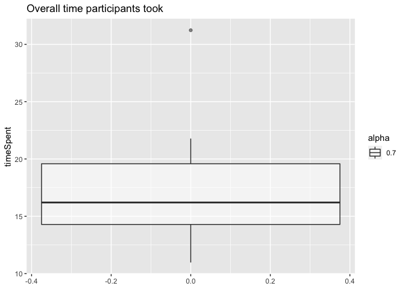
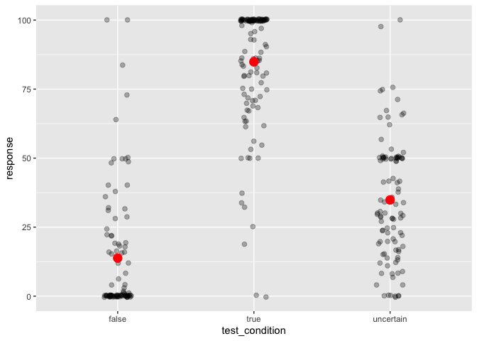
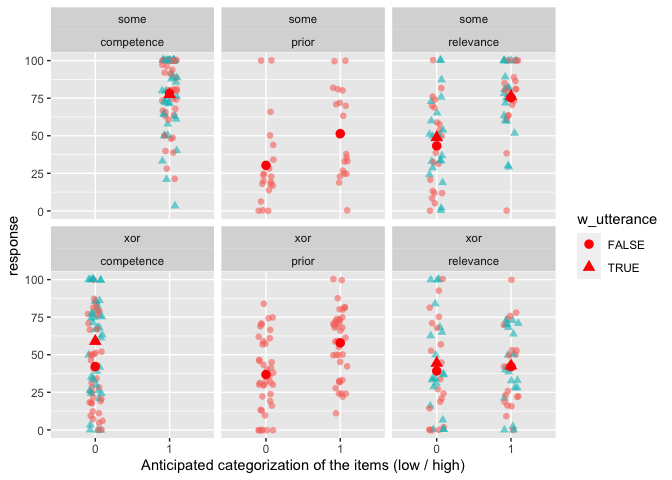
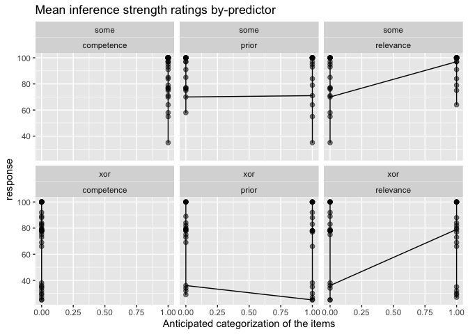
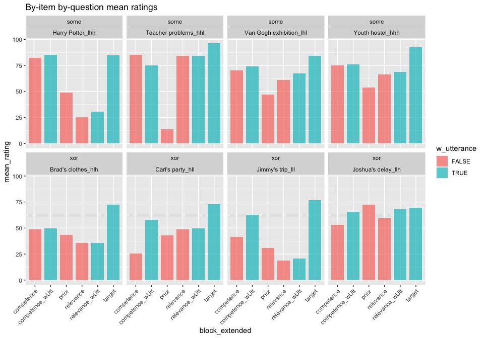
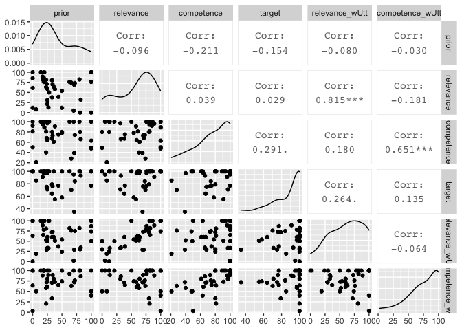
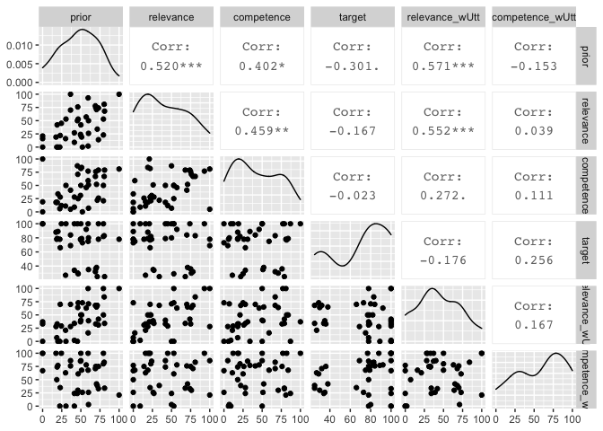
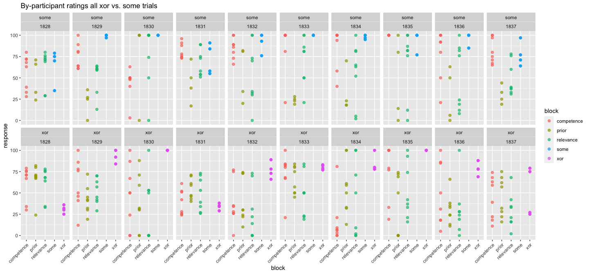

XOR-Some Prolific Pilot 1
================
Polina Tsvilodub
3/24/2021

In this first pilot on Prolific we test the implementation of the xor
study in magpie. The structure of the experiment was as follows:
Participants read instructions, completed three example trials, and then
completed 8 main blocks consisting of 4 xor and 4 some items. Each main
block had the following structure: Participants read the background
story, answered one comprehension question, then answered competence /
relevance / prior questions in randomized order; then they read another
3 comprehension questions, after which the critical utterance was added
below the background story. They answered the inference strength
question, and then competence / relevance questions in randomized order
again.

N=10 participants were recruited for this pilot and compensated 2
pounds/participant. 8 items (4 some + 4 xor) were manually selected for
this pilot to get more data points per item.

``` r
library(tidyverse)
```

    ## ── Attaching packages ───────────────────────────────────────────────────────────────────────────────────────── tidyverse 1.3.0 ──

    ## ✓ ggplot2 3.3.1     ✓ purrr   0.3.4
    ## ✓ tibble  3.0.1     ✓ dplyr   1.0.0
    ## ✓ tidyr   1.1.0     ✓ stringr 1.4.0
    ## ✓ readr   1.3.1     ✓ forcats 0.5.0

    ## ── Conflicts ──────────────────────────────────────────────────────────────────────────────────────────── tidyverse_conflicts() ──
    ## x dplyr::filter() masks stats::filter()
    ## x dplyr::lag()    masks stats::lag()

``` r
library(tidyboot)
```

``` r
d <- read_csv("../data/pilots/results_58_xor-some-Prolific-pilot1_N10.csv")
```

Checking if there are any comments indicating technical issues:

``` r
d %>% distinct(comments)
```

    ## # A tibble: 2 x 1
    ##   comments
    ##   <chr>   
    ## 1 N/A     
    ## 2 <NA>

Check native languages. In the main experiment, participants not
indicating English as (one of) their native language(s) will be
excluded. We also compute some participant demographics.

``` r
d %>% distinct(languages)
```

    ## # A tibble: 4 x 1
    ##   languages         
    ##   <chr>             
    ## 1 English           
    ## 2 english           
    ## 3 Australian English
    ## 4 Setswana

``` r
# exclude non-natives if necessary
d_native <- d

d_native %>% pull(age) %>% mean(., na.rm = T) 
```

    ## [1] 28.2

``` r
d_native %>% count(gender) %>% mutate(n = n/88)
```

    ## # A tibble: 3 x 2
    ##   gender     n
    ##   <chr>  <dbl>
    ## 1 female     5
    ## 2 male       4
    ## 3 other      1

Next, we check whether all the conditions were used correctly.

``` r
# check xor/some vs. trial type
d_native %>% count(main_type, condition) 
```

    ## # A tibble: 5 x 3
    ##   main_type condition     n
    ##   <chr>     <chr>     <int>
    ## 1 some      critical    240
    ## 2 some      test        160
    ## 3 xor       critical    280
    ## 4 xor       test        160
    ## 5 <NA>      example      40

``` r
# check xor/some vs. experimental condition
d_native %>% count(main_type, exp_condition)
```

    ## # A tibble: 9 x 3
    ##   main_type exp_condition     n
    ##   <chr>     <chr>         <int>
    ## 1 some      hhh             100
    ## 2 some      hhl             100
    ## 3 some      lhh             100
    ## 4 some      lhl             100
    ## 5 xor       hlh             110
    ## 6 xor       hll             110
    ## 7 xor       llh             110
    ## 8 xor       lll             110
    ## 9 <NA>      <NA>             40

``` r
# count items used
d_native %>% count(title)
```

    ## # A tibble: 9 x 2
    ##   title                                                                        n
    ##   <chr>                                                                    <int>
    ## 1 "<font size=\"4\" color= \"#00BFFF\"> EXAMPLE </font> <br/> Joe's shopp…    40
    ## 2 "Brad's clothes"                                                           110
    ## 3 "Carl's party"                                                             110
    ## 4 "Harry Potter"                                                             100
    ## 5 "Jimmy's trip"                                                             110
    ## 6 "Joshua's delay"                                                           110
    ## 7 "Teacher problems"                                                         100
    ## 8 "Van Gogh exhibition"                                                      100
    ## 9 "Youth hostel"                                                             100

Check the time participants spent overall on the experiment:

``` r
overall_timeSpent <- d_native %>% mutate(timeSpent = round(timeSpent, 2)) %>% distinct(timeSpent) 

#  summarize(timeCounts = count(timeSpent) / d_native %>% )
ggplot(data = overall_timeSpent, aes(y=timeSpent, alpha = 0.7)) +
  geom_boxplot() +
  ggtitle("Overall time participants took")
```

<!-- -->

Next, we would exclude participants based on their ratings in the main /
example trials (and possibly the bot check) according to preregistered
exclusion criteria. For now, all the data is considered.

``` r
d_main <- d_native %>% select(-age, -botresponse, -comments, -education, -endTime, 
                              -gender, -languages, -optionLeft, -optionRight, -startDate,
                              -startTime, -timeSpent) %>%
  filter(trial_name != "example")
d_exmpl <- d_native %>% select(-age, -botresponse, -comments, -education, -endTime, 
                              -gender, -languages, -optionLeft, -optionRight, -startDate,
                              -startTime, -timeSpent) %>%
  filter(trial_name == "example")
d_critical <- d_main %>% filter(condition == "critical")

# get overall mean ratings / subject
d_native %>% group_by(submission_id) %>% summarise(mean_rating = mean(response)) %>% arrange(mean_rating)
```

    ## # A tibble: 10 x 2
    ##    submission_id mean_rating
    ##            <dbl>       <dbl>
    ##  1          1837        47.7
    ##  2          1831        51.1
    ##  3          1832        52.9
    ##  4          1836        52.9
    ##  5          1829        53.3
    ##  6          1828        53.6
    ##  7          1834        53.7
    ##  8          1830        57.1
    ##  9          1833        60.3
    ## 10          1835        62.7

Plot responses on example questions by question type

Plot test questions by type

``` r
d_test <- d_main %>% rowwise() %>% filter(condition == "test") %>% 
  mutate(test_condition = substr(test_question, 6, 9),
         test_condition = ifelse(test_condition == "fals", "false", 
                                 ifelse(test_condition == "unce", "uncertain",
                                        test_condition)))
d_test_ci <- d_test %>% group_by(test_condition) %>% 
  tidyboot_mean(column = response) 
```

    ## Warning: `as_data_frame()` is deprecated as of tibble 2.0.0.
    ## Please use `as_tibble()` instead.
    ## The signature and semantics have changed, see `?as_tibble`.
    ## This warning is displayed once every 8 hours.
    ## Call `lifecycle::last_warnings()` to see where this warning was generated.

    ## Warning: `cols` is now required when using unnest().
    ## Please use `cols = c(strap)`

``` r
d_test %>% 
  ggplot(., aes(x = test_condition, y = response)) +
  geom_point(size = 2, alpha = 0.3, position = position_jitter(width = 0.1)) +
  geom_point(data = d_test_ci, aes(x = test_condition, y = mean), color = "red", 
             size = 4) 
```

<!-- -->

Plot main rel / comp / prior questions by main condition and by prior
classification of the item (x-axis), separated into with / without
critical utterance (shape, color). Only high-competence items were used
for the some trials (only low-competence in the xor trials,
respectively). This will be balanced in the main study.

``` r
# add info to already record this
d_critical <- d_critical %>% 
  mutate(w_utterance = ifelse(is.na(critical_question), F, T),
         block = ifelse(block == "comp", "competence", 
                        ifelse(block == "rel", "relevance", ifelse(block == "pri", "prior", block) )))
d_critical %>% 
  filter(block != "xor" & block != "some") %>%
  filter(block == class_condition) %>%
  group_by(main_type, class_condition, w_utterance, prior_class) %>% 
  summarize(mean_response = mean(response)) -> d_critical_summary

d_critical %>% 
  filter(block != "xor" & block != "some") %>%
  filter(block == class_condition) %>%
  ggplot(., aes(x = as.factor(prior_class), y = response, shape = w_utterance, color = w_utterance)) +
  geom_point(size = 2, alpha = 0.6, position = position_jitter(width = 0.1)) +
  geom_point(data = d_critical_summary, aes(x = as.factor(prior_class), y = mean_response, shape = w_utterance), 
             color = "red", size = 3) +
  xlab("Anticipated categorization of the items (low / high)") +
  facet_wrap(main_type~class_condition) # get ratings from the respective trials only 
```

<!-- -->

Plot inference ratings as a function of *anticipated* rating of the
explanatory factor, similar to the paper:

``` r
d_critical %>% 
  filter(block == "xor" | block == "some") %>%
  #group_by(block, class_condition, prior_class) %>%
  #summarize(mean_rating = mean(response)) %>%
  ggplot(., aes(x = prior_class, y = response)) +
  geom_point(size = 2, alpha = 0.5) +
  geom_line() +
  facet_wrap(block~class_condition) +
  xlab("Anticipated categorization of the items") +
  ggtitle("Mean inference strength ratings by-predictor")
```

<!-- -->

Create more extensive condition labels, including information about
whether a rating was produced with or without the utterance given.

``` r
# extending 'conditions' labels to include wheter the utterance was present or not
d_critical <- d_critical %>% 
  mutate(block_extended = ifelse(
    !w_utterance, 
    block, 
    ifelse(block %in% c("some", "xor"), "target", str_c(block, "_wUtt", ""))
  ))
```

Plot mean ratings (across all 10 participants) for each vignette (with
its respective condition indicated in the facet title, in the order
relevance/competence/prior), in each condition. For relevance and
competence, the color indicates whether it was presented without the
utterance or with.

``` r
bar.width = 0.8
d_critical %>% 
  mutate(title = paste(title, exp_condition, sep = "_")) %>%
  filter(block == class_condition | block == "xor" | block == "some") %>%
  group_by(block_extended, title, w_utterance, main_type) %>%
  summarize(mean_rating = mean(response)) %>% 
  ggplot(., aes(x = block_extended, y = mean_rating, fill = w_utterance)) +
  geom_col(alpha = 0.7, width = bar.width, position = position_dodge(width = bar.width)) +
  #geom_point(size = 2, alpha = 0.5, position = position_jitter(width = 0.1)) +
  facet_wrap(main_type~title, ncol = 4) +
  theme(axis.text.x = element_text(angle = 45, hjust = 1)) +
  ggtitle("By-item by-question mean ratings")
```

<!-- -->

``` r
# make a versatile wide representation of the critical data
d_critical_wide <- d_critical %>% 
  select(submission_id, title, main_type, block_extended, response) %>% 
  unique() %>% 
  pivot_wider(
    names_from = block_extended, 
    values_from = response, 
    values_fn = mean # getting means for double prior measurement in "xor"
  ) 

# correlation plot for "some"
GGally::ggpairs(
  filter(d_critical_wide, main_type == "some") %>%  
    select(prior:ncol(d_critical_wide))
)
```

<!-- -->

``` r
# correlation plot for "or"
GGally::ggpairs(
  filter(d_critical_wide, main_type == "xor") %>%  
    select(prior:ncol(d_critical_wide))
  )
```

<!-- -->

Check by-participant behavior to see if they show versatile response
strategies for the different questions for xor vs. some. Participants
show a sufficient range of responses across conditions.

``` r
d_critical %>%
  filter(block == class_condition | block == "xor" | block == "some") %>%
  ggplot(., aes(x = block, y = response, color = block)) +
  geom_point(alpha = 0.7, size = 2) + 
  facet_wrap(main_type~submission_id, ncol = 10) +
  theme(axis.text.x = element_text(angle = 45, hjust = 1)) +
  ggtitle("By-participant ratings all xor vs. some trials")
```

<!-- -->

In conclusion, the technical side of the experiment seems to work
without glitches; participants perform as expected on the comprehension
questions; the relevance / competence / prior ratings seem to be mostly
in line with our anticipated categorizations.

One point to note is that on average participants took slightly longer
than the expected 15 minutes to complete the experiment.
