XOR-Some Prolific Pilot 2
================
Polina Tsvilodub
4/2/2021

In this second pilot on Prolific we gather a more substantial amount of
pilot data for the xor-some study on Prolific. The structure of the
experiment was as follows: Participants read instructions, completed
three example trials, and then completed 8 main blocks consisting of 4
xor and 4 some items. Each main block had the following structure:
Participants read the background story, answered one comprehension
question, then answered competence / relevance / prior questions in
randomized order; then they read another 3 comprehension questions,
after which the critical utterance was added below the background story.
They answered the inference strength question, and then competence /
relevance questions in randomized order again.

N=118 participants were recruited for this pilot and compensated 2
pounds/participant. 8 items (4 some + 4 xor) were sampled at random for
each participant such that each participant saw one item in each
condition (relevance X competence X prior = 8 unique conditions).

## Checks & Exclusions

Checking if there are any comments indicating technical issues which is
not the case:

``` r
d %>% distinct(comments) %>% View()
```

Check native languages. Participants not indicating English as (one of)
their native language(s) are be excluded. We also compute some
participant demographics.

``` r
d %>% distinct(languages)
```

    ## # A tibble: 17 x 1
    ##    languages          
    ##    <chr>              
    ##  1 English            
    ##  2 engish             
    ##  3 english            
    ##  4 English & Yoruba   
    ##  5 Polish/English     
    ##  6 <NA>               
    ##  7 English, Arabic    
    ##  8 Englid             
    ##  9 ENGLISH            
    ## 10 English; Portuguese
    ## 11 british            
    ## 12 Englks             
    ## 13 Spanish            
    ## 14 English. Afrikaans 
    ## 15 English, Malay     
    ## 16 english, punjabi   
    ## 17 English, French

``` r
cat("Number of partiipants before excluding non-natives: ", d %>% distinct(submission_id) %>% count() %>% pull() ) 
```

    ## Number of partiipants before excluding non-natives:  118

``` r
# exclude non-natives if necessary
d_native <- d %>% 
 # filter(("en" | "En" | "bri") %in% languages)
  filter(grepl("[(en)(br)]", languages, ignore.case = T))

cat("Number of partiipants after excluding non-natives: ", d_native %>% distinct(submission_id) %>% count() %>% pull() )
```

    ## Number of partiipants after excluding non-natives:  116

``` r
cat("Mean age: ", d_native %>% pull(age) %>% mean(., na.rm = T) )
```

    ## Mean age:  35.25

``` r
d_native %>% count(gender) %>% mutate(n = n/88)
```

    ## # A tibble: 2 x 2
    ##   gender     n
    ##   <chr>  <dbl>
    ## 1 female    75
    ## 2 male      41

Next, we check whether all the conditions were used correctly.

``` r
# check xor/some vs. trial type
d_native %>% count(main_type, condition) 
```

    ## # A tibble: 5 x 3
    ##   main_type condition     n
    ##   <chr>     <chr>     <int>
    ## 1 some      critical   2784
    ## 2 some      test       1856
    ## 3 xor       critical   3248
    ## 4 xor       test       1856
    ## 5 <NA>      example     464

``` r
# check xor/some vs. experimental condition
d_native %>% count(main_type, exp_condition)
```

    ## # A tibble: 17 x 3
    ##    main_type exp_condition     n
    ##    <chr>     <chr>         <int>
    ##  1 some      hhh             490
    ##  2 some      hhl             550
    ##  3 some      hlh             620
    ##  4 some      hll             620
    ##  5 some      lhh             510
    ##  6 some      lhl             570
    ##  7 some      llh             620
    ##  8 some      lll             660
    ##  9 xor       hhh             737
    ## 10 xor       hhl             671
    ## 11 xor       hlh             594
    ## 12 xor       hll             594
    ## 13 xor       lhh             715
    ## 14 xor       lhl             649
    ## 15 xor       llh             594
    ## 16 xor       lll             550
    ## 17 <NA>      <NA>            464

``` r
# count items used
d_native %>% count(title)
```

    ## # A tibble: 65 x 2
    ##    title                                                                       n
    ##    <chr>                                                                   <int>
    ##  1 "<font size=\"4\" color= \"#00BFFF\"> EXAMPLE </font> <br/> Joe's shop…   464
    ##  2 "Alex's racket"                                                           231
    ##  3 "Alissa's paint"                                                          132
    ##  4 "Attendance"                                                              150
    ##  5 "Bill's order"                                                            220
    ##  6 "Brad Pitt"                                                                66
    ##  7 "Brad's clothes"                                                          154
    ##  8 "Carl's party"                                                            198
    ##  9 "Champagne reception"                                                     160
    ## 10 "Chloe's holiday"                                                         143
    ## # … with 55 more rows

Check the time participants spent overall on the experiment before
cleaning the data:

``` r
overall_timeSpent <- d_native %>% mutate(timeSpent = round(timeSpent, 2)) %>% distinct(timeSpent) 

#  summarize(timeCounts = count(timeSpent) / d_native %>% )
ggplot(data = overall_timeSpent, aes(y=timeSpent, alpha = 0.7)) +
  geom_boxplot() +
  ggtitle("Overall time participants took in mins")
```

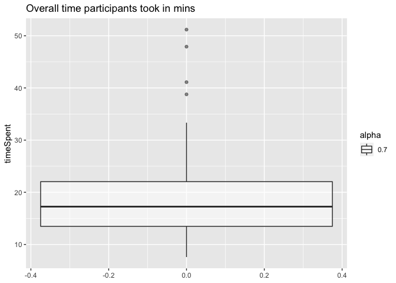<!-- -->

Investigate very fast completion times:

``` r
 d_native %>% mutate(timeSpent = round(timeSpent, 2)) %>%
  filter(timeSpent < 8) -> fast_completions

# check if their responses look somehow peculiar
fast_completions %>%
  ggplot(., aes(x = response)) +
  geom_histogram()
```

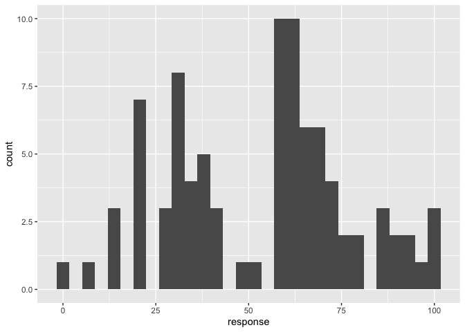<!-- -->

``` r
cat("number of fast-responders (below 8 mins):", fast_completions %>% distinct(submission_id) %>% pull() %>% length())
```

    ## number of fast-responders (below 8 mins): 1

Data frames preparation:

``` r
d_main <- d_native %>% select(-age, -botresponse, -comments, -education, -endTime, 
                              -gender, -languages, -optionLeft, -optionRight, -startDate,
                              -startTime, -timeSpent) %>%
  filter(trial_name != "example")
d_exmpl <- d_native %>% select(-age, -botresponse, -comments, -education, -endTime, 
                              -gender, -languages, -optionLeft, -optionRight, -startDate,
                              -startTime, -timeSpent) %>%
  filter(trial_name == "example")
d_critical <- d_main %>% filter(condition == "critical")
```

Plot responses on comprehension questions by type before applying
exclusion criteria:

    ## Warning: `as_data_frame()` is deprecated as of tibble 2.0.0.
    ## Please use `as_tibble()` instead.
    ## The signature and semantics have changed, see `?as_tibble`.
    ## This warning is displayed once every 8 hours.
    ## Call `lifecycle::last_warnings()` to see where this warning was generated.

    ## Warning: `cols` is now required when using unnest().
    ## Please use `cols = c(strap)`

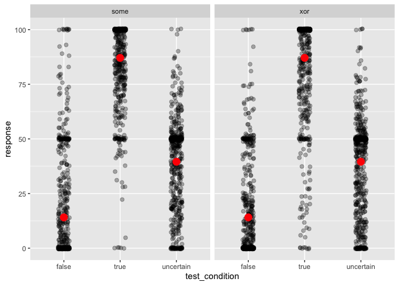<!-- -->

Next, we exclude participants based on their ratings in the main trials:
Participants who gave all responses within the range of 10 and
participants who failed more than 0.2 of the comprehension questions are
excluded from analysis. Participants who failed all example trials are
excluded, as well. The bot check trial is not considered for exclusions.

``` r
# get participants failing example trials
d_exmpl_fail <- d_exmpl %>% group_by(submission_id) %>% 
  mutate(example_condition = ifelse(grepl("as certainly true", question), "true", 
                                    ifelse(grepl("as certainly false", question), "false",
                                           "uncertain")),
         passed_example_trial = case_when(example_condition == "true" ~ response >= 80,
                                    example_condition == "false" ~ response <= 20,
                                    example_condition == "uncertain" ~ response >= 30),
       #  check if all trials passed
         passed_example = case_when(sum(passed_example_trial) == 0 ~ FALSE,
                                    TRUE ~ TRUE)
         ) %>% filter(passed_example == F)

cat("Subjects failing the example trials: ", d_exmpl_fail %>% distinct(submission_id) %>% pull() %>% length())
```

    ## Subjects failing the example trials:  0

``` r
# apply exclusion criteria to main trials
# check range of responses per participant
d_main_fail <- d_main %>% group_by(submission_id) %>%
  mutate(passed_main = case_when(max(response) - min(response) <= 10 ~ FALSE,
                                 TRUE ~ TRUE)
         ) %>% filter(passed_main == F)
cat(" Subjects providing the same ratings throughout the trials: ", d_main_fail %>% distinct(submission_id) %>% pull() %>% length())
```

    ##  Subjects providing the same ratings throughout the trials:  0

``` r
# get participants failing comprehension questions
d_test <- d_test %>%
  group_by(submission_id) %>%
  mutate(passed_filler_trial = case_when(test_condition == "true" ~ response >= 70,
                                   test_condition == "false" ~ response <= 40,
                                   test_condition == "uncertain" ~ response %in% (0:90)),
         mean_comprehension = mean(passed_filler_trial),
         passed_filler = mean_comprehension >= 0.8
         ) 

d_test_fail <- d_test %>% 
  filter(passed_filler == F)

cat(" Subjects failing the comprehension trials: ", d_test_fail %>% distinct(submission_id) %>% pull() %>% length())
```

    ##  Subjects failing the comprehension trials:  17

``` r
# plot by-participant means on comprehension questions, and mark red excluded points, 
# to see if the participants performed in a peculiar way
d_test %>% 
  group_by(submission_id, main_type, test_condition) %>%
  mutate(subj_mean = mean(response)) %>%
  ggplot(., aes(x = test_condition, y = subj_mean)) +
  geom_point(size = 2, alpha = 0.3, position = position_jitter(width = 0.1)) +
  geom_point(data = . %>% filter(passed_filler == F), aes(x = test_condition, y = subj_mean), color = "red", 
             size = 2) +
  facet_wrap(~main_type) +
  ggtitle("Red points mark subject response means for subjects\nwith a mean comprehension question accuracy < 0.8")
```

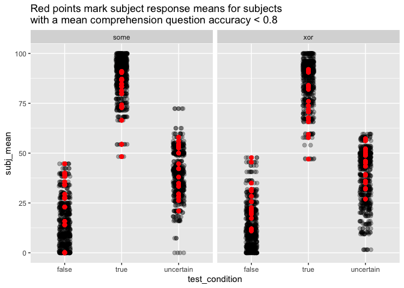<!-- -->

``` r
# put it all together
d_full_clean <- anti_join(d_main, d_main_fail, by = "submission_id")
d_full_clean <- anti_join(d_full_clean, d_exmpl_fail, d_test, by = "submission_id")
d_full_clean <- anti_join(d_full_clean, d_test_fail, by = "submission_id")

cat(" Nr. of participants left after cleaning: ", d_full_clean %>% distinct(submission_id) %>% pull() %>% length())
```

    ##  Nr. of participants left after cleaning:  99

Check exclusions if applying exclusion ranges as suggested by Bob – then
almost twice as many participants are excluded based on their
comprehension questions performance (I believe mainly due to a lower
bound on correct responses in the uncertain questions).

``` r
# true comprehension questions: 50-100
# uncertain comprehension questions: 25-75
# false comprehension questions: 0-50
# get participants failing example trials

d_exmpl2 <- d_exmpl %>% group_by(submission_id) %>% 
  mutate(example_condition = ifelse(grepl("as certainly true", question), "true", 
                                    ifelse(grepl("as certainly false", question), "false",
                                           "uncertain")),
         passed_example_trial = case_when(example_condition == "true" ~ response >= 50,
                                    example_condition == "false" ~ response <= 50,
                                    example_condition == "uncertain" ~ response %in% (25:75)),
       #  check if all trials passed
         passed_example = case_when(sum(passed_example_trial) == 0 ~ FALSE,
                                    TRUE ~ TRUE)
         ) %>% filter(passed_example == F)

cat("Subjects failing the example trials: ", d_exmpl2 %>% distinct(submission_id) %>% pull() %>% length())
```

    ## Subjects failing the example trials:  0

``` r
# apply exclusion criteria to main trials
# check range of responses per participant
d_main_fail <- d_main %>% group_by(submission_id) %>%
  mutate(passed_main = case_when(max(response) - min(response) <= 10 ~ FALSE,
                                 TRUE ~ TRUE)
         ) %>% filter(passed_main == F)
cat(" Subjects providing the same ratings throughout the trials: ", d_main_fail %>% distinct(submission_id) %>% pull() %>% length())
```

    ##  Subjects providing the same ratings throughout the trials:  0

``` r
# get participants failing comprehension questions
d_test2 <- d_test %>%
  group_by(submission_id) %>%
  mutate(passed_filler_trial = case_when(test_condition == "true" ~ response >= 50,
                                   test_condition == "false" ~ response <= 50,
                                   test_condition == "uncertain" ~ response %in% (25:75)),
         mean_comprehension = mean(passed_filler_trial),
         passed_filler = mean_comprehension >= 0.8
         ) 

d_test_fail2 <- d_test2 %>% 
  filter(passed_filler == F)

cat(" Subjects failing the comprehension trials: ", d_test_fail2 %>% distinct(submission_id) %>% pull() %>% length())
```

    ##  Subjects failing the comprehension trials:  33

Now we explore applying exclusion criteria on z-scored data. Here it
might make sense to exclude participants whose \>=0.8 of responses are
more than 2 SD from the mean (?).

``` r
# group by extended block, exmpl / filler / critical, maybe polarity of filler exmpl question
# add block extension, put all data together somehow
d_critical_fail_zScored <- d_main %>% 
  mutate(block_extended = ifelse(
    !(ifelse(is.na(critical_question), F, T)), 
    block, 
    ifelse(block %in% c("some", "xor"), "target", str_c(block, "_wUtt", ""))
  )  
  ) %>% 
  filter(!(grepl("test", block_extended))) %>%
  group_by(submission_id, block_extended) %>%
  mutate(subj_block_mean = mean(response),
         subj_block_sd = sd(response),
         response_centered = (response - subj_block_mean)/subj_block_sd,
         # catch the cases where sd is 0 
         response_centered = ifelse(is.na(response_centered), 0, response_centered)) %>%
  ungroup() %>%
  # add by-block SDs, such that participants can be excluded based on being outside 2 SDs on a block
  # or should this be based on by-subject SDs???? 
  group_by(block_extended) %>%
  mutate(block_mean = mean(response),
         block_sd = sd(response),
         passed_main_trial = case_when(abs(response_centered) <= 2*block_sd ~ T,
                                       T ~ F),
         mean_critical_passRate = mean(passed_main_trial))


# get participants failing comprehension questions with z-scored data; here, by-subject SD are used for the exclusion
d_test_fail_zScore <- d_test %>%
  group_by(submission_id, test_condition) %>%
  mutate(
    subj_block_mean = mean(response),
    subj_block_sd = sd(response),
    response_centered = (response - subj_block_mean)/subj_block_sd,
    response_centered = ifelse(is.na(response_centered), 0, response_centered),
    passed_filler_trial = case_when(abs(response_centered) <= 2*subj_block_sd ~ T,
                                   T ~ F),
         mean_comprehension = mean(passed_filler_trial),
         passed_filler = mean_comprehension >= 0.8
         ) 

d_test_fail_zScore <- d_test_fail_zScore %>% 
  ungroup() %>%
  filter(passed_filler == F)

cat(" Subjects failing the comprehension trials when using z-scored raw data: ", d_test_fail_zScore %>% distinct(submission_id) %>% pull() %>% length())
```

    ##  Subjects failing the comprehension trials when using z-scored raw data:  0

``` r
# get overall mean ratings / subject
d_full_clean %>% group_by(submission_id) %>% summarise(mean_rating = mean(response)) %>% arrange(mean_rating)
```

    ## # A tibble: 99 x 2
    ##    submission_id mean_rating
    ##            <dbl>       <dbl>
    ##  1          1960        30.0
    ##  2          1956        36.7
    ##  3          1920        39.3
    ##  4          1864        39.7
    ##  5          1950        40.4
    ##  6          1896        42.6
    ##  7          1901        43.2
    ##  8          1878        44.1
    ##  9          1900        44.8
    ## 10          1935        45.0
    ## # … with 89 more rows

Create more extensive condition labels, including information about
whether a rating was produced with or without the utterance given.

``` r
# extending 'conditions' labels to include whether the utterance was present or not
d_critical_long <- d_critical_long %>% 
  mutate(block_extended = ifelse(
    !w_utterance, 
    block, 
    ifelse(block %in% c("some", "xor"), "target", str_c(block, "_wUtt", ""))
  ))
```

Average nr of responses per question per vignette:

``` r
d_critical_long %>% 
  filter(class_condition == block | block == "xor" | block == "some") %>%
  select(-class_condition, -prior_class) %>%
  unique() %>% count(title, block_extended, main_type) %>%
  mutate(n = ifelse(main_type == "xor" & block_extended == "prior", n/2, n)) %>%
  summarize(mean_observations = mean(n))
```

    ## # A tibble: 1 x 1
    ##   mean_observations
    ##               <dbl>
    ## 1              12.4

Compute the average deviation from expected responses for each vignette,
individually for each dimension (rel / comp / pri):

``` r
d_critical_long %>% 
  filter(block != "xor" & block != "some") %>%
  filter(block == class_condition) %>%
  mutate(expected_rating = prior_class * 100,
         response_deviation = abs(response - expected_rating),
         block = ifelse(block == "xor" | block == "some", "target", block)
         ) %>%
  group_by(title, block) %>%
  summarize(mean_deviation = mean(response_deviation)) %>%
  arrange(desc(mean_deviation), .by_group = T) %>%
  # get the largest deviations - over 50 
  filter(mean_deviation >= 50) -> d_critical_deviations

#d_critical_deviations %>% write_csv("../data/pilots/pilot2_byItem_rating_deviations.csv")

print(d_critical_deviations)
```

    ## # A tibble: 47 x 3
    ## # Groups:   title [37]
    ##    title          block      mean_deviation
    ##    <chr>          <chr>               <dbl>
    ##  1 Alex's racket  prior                61.8
    ##  2 Alex's racket  relevance            54.8
    ##  3 Alissa's paint competence           54.2
    ##  4 Attendance     prior                82.9
    ##  5 Bill's order   prior                52.7
    ##  6 Brad Pitt      competence           52.3
    ##  7 Brad's clothes relevance            65.6
    ##  8 Brad's clothes prior                58.6
    ##  9 College        competence           51.0
    ## 10 Crime          prior                51.4
    ## # … with 37 more rows

``` r
# count which dimension is the most problematic - the prior
d_critical_deviations %>% group_by(block) %>% count()
```

    ## # A tibble: 3 x 2
    ## # Groups:   block [3]
    ##   block          n
    ##   <chr>      <int>
    ## 1 competence    13
    ## 2 prior         22
    ## 3 relevance     12

``` r
# check which items have the most deviations over 50 
d_critical_deviations %>% group_by(title) %>% count() %>% arrange(desc(.$n))
```

    ## # A tibble: 37 x 2
    ## # Groups:   title [37]
    ##    title                n
    ##    <chr>            <int>
    ##  1 Greg's movie         3
    ##  2 Shelter              3
    ##  3 Alex's racket        2
    ##  4 Brad's clothes       2
    ##  5 Gourmet desserts     2
    ##  6 Health inspector     2
    ##  7 Suzy's fruits        2
    ##  8 The game             2
    ##  9 Alissa's paint       1
    ## 10 Attendance           1
    ## # … with 27 more rows

Compute the standard deviation for each question for each item as an
additional measure of spread in the participants’ responses within-item:

``` r
d_critical_long %>% 
  filter(block != "xor" & block != "some") %>%
  filter(block == class_condition) %>%
  mutate(
         block = ifelse(block == "xor" | block == "some", "target", block)
         ) %>%
  group_by(title, block) %>%
  summarize(item_sd = sd(response)) %>%
  arrange(desc(item_sd), .by_group = T) %>%
  # arbitrary set to 25
  filter(item_sd >= 25) -> d_critical_sd
d_critical_sd
```

    ## # A tibble: 90 x 3
    ## # Groups:   title [59]
    ##    title               block      item_sd
    ##    <chr>               <chr>        <dbl>
    ##  1 Alex's racket       competence    26.6
    ##  2 Alissa's paint      competence    26.9
    ##  3 Attendance          prior         25.0
    ##  4 Bill's order        relevance     25.6
    ##  5 Brad Pitt           competence    25.5
    ##  6 Brad's clothes      competence    34.4
    ##  7 Brad's clothes      relevance     28.0
    ##  8 Carl's party        relevance     33.2
    ##  9 Carl's party        competence    28.8
    ## 10 Champagne reception relevance     28.1
    ## # … with 80 more rows

``` r
#d_critical_sd %>% write_csv("../data/pilots/pilot2_byItem_rating_SDs.csv")
```

Visually check the spread of by-item ratings among subjects for each
question:

``` r
d_critical_long_grandMeans <- d_critical_long %>% 
  mutate(title = paste(title, exp_condition, sep = "_"),
         block = ifelse(block == "xor" | block == "some", "target", block)) %>%
  filter(block == class_condition | block == "target") %>%
  group_by(main_type, block) %>% summarize(mean_resp = mean(response))

d_critical_long_expectedCats <- d_critical_long %>% 
  mutate(title = paste(title, exp_condition, sep = "_"),
         block = ifelse(block == "xor" | block == "some", "target", block)) %>%
  filter(block == class_condition | block == "target") %>%
  group_by(main_type, block, title) %>% summarize(mean_resp_block = mean(response))

d_critical_long %>% 
  mutate(title = paste(title, exp_condition, sep = "_"),
         block = ifelse(block == "xor" | block == "some", "target", block)) %>%
  left_join(., d_critical_long_grandMeans, by = c("main_type", "block")) %>% filter(block == class_condition | block == "target") -> d_long_place_holder


left_join(d_long_place_holder, d_critical_long_expectedCats, by = c("main_type", "block", "title")) %>% 
  mutate(expected_block = ifelse(block != "target", prior_class * 100, NA),
         block = factor(block, levels = c("relevance", "competence", "prior"))) %>%
  ggplot(., aes(x = block, y = response, color = block)) +
  geom_point(alpha = 0.7, position = position_jitter(width = 0.1)) +
  geom_hline(aes(yintercept = mean_resp), alpha = 0.7) +
  geom_point(aes(y = mean_resp), color = "black", shape = 2) +
  geom_point(aes(y = mean_resp_block, fill = block), color = "black") +
  geom_point(aes(y = expected_block), color="red", size = 2.5) +
  ylab("Raw responses to respective questions") +
  facet_wrap(main_type~title, ncol = 4) +
  theme(axis.text.x = element_text(angle = 45, hjust = 1)) +
  ggtitle("By-item by-question raw ratings\nBlack dots indicate by-block means within-item, lines and triangles indicate grand by-block means\nRed dots indicate expected rating")
```

    ## Warning: Removed 2376 rows containing missing values (geom_point).

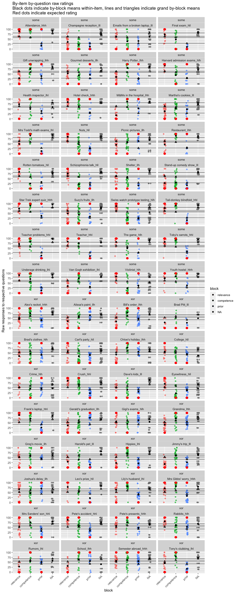<!-- -->
For the following items, participants seem to *disagree* in their
judgments for all of the predictors: Emails from a broken laptop, Gift
unwrapping, Martha’s cookies, Suzie’s fruits, Brad’s clothes, Crime,
maybe more..

Check by-vignette by-predictor empirical means, to see if the range is
somewhat covered:

``` r
d_critical_long %>% 
  mutate(title = paste(title, exp_condition, sep = "_"),
         block = ifelse(block == "xor" | block == "some", "target", block)) %>%
  filter(block == class_condition | block == "target") %>%
  group_by(title, block) %>%
  summarise(mean_response = mean(response)) %>%
  arrange(mean_response)
```

    ## # A tibble: 256 x 3
    ## # Groups:   title [64]
    ##    title                     block mean_response
    ##    <chr>                     <chr>         <dbl>
    ##  1 Final exam_hll            prior          10.6
    ##  2 Teacher_hhl               prior          10.8
    ##  3 Champagne reception_lll   prior          12  
    ##  4 Mrs Todd's math exams_lhl prior          13.1
    ##  5 Teacher problems_hhl      prior          14.3
    ##  6 Underage drinking_lhl     prior          14.3
    ##  7 Harold's pet_lll          prior          15.0
    ##  8 Shelter_llh               prior          15.4
    ##  9 Tail-donkey blindfold_hhl prior          16.2
    ## 10 Stand-up comedy show_lll  prior          17  
    ## # … with 246 more rows

## Plots

Plot main rel / comp / prior questions by main condition and by prior
classification of the item (x-axis), separated into with / without
critical utterance (shape, color). The prior questions were only used
without the utterance.

``` r
d_critical_long %>% 
  filter(block != "xor" & block != "some") %>%
  filter(block == class_condition) %>%
  group_by(main_type, class_condition, w_utterance, prior_class) %>% 
  summarize(mean_response = mean(response)) -> d_critical_summary

d_critical_long %>% 
  filter(block != "xor" & block != "some") %>%
  filter(block == class_condition) %>%
  ggplot(., aes(x = as.factor(prior_class), y = response, shape = w_utterance, color = w_utterance)) +
  geom_point(size = 2, alpha = 0.6, position = position_jitter(width = 0.1)) +
  geom_point(data = d_critical_summary, aes(x = as.factor(prior_class), y = mean_response, shape = w_utterance), 
             color = "red", size = 3) +
  ylab("Responses to respective predictor question") +
  xlab("Anticipated categorization of the items (low / high)") +
  facet_wrap(main_type~class_condition) # get ratings from the respective trials only 
```

<!-- -->

``` r
# check whether the ratings in the two prior questions are the same in xor 
d_critical_long %>% 
  filter(block != "xor" & block != "some") %>%
  filter(block == class_condition) %>%
  filter(block == "prior", main_type == "xor") %>%
  mutate(priorQ_nr = rep(c(1,2), 396),
         unique_ID = paste(submission_id, ID, sep="_")) -> d_xor_priors
d_xor_priors %>% group_by(priorQ_nr, prior_class) %>%
  summarise(mean = mean(response)) -> d_xor_priors_summary

d_xor_priors %>%
  ggplot(., aes(x = as.factor(priorQ_nr), y = response )) +
  geom_point(size = 2, alpha = 0.6, position = position_jitter(width = 0.1)) +
  geom_point(data = d_xor_priors_summary, aes(x = as.factor(priorQ_nr), y = mean), color = "red", size = 3) +
  geom_path(aes(group = "unique_ID"), alpha = 0.6) +
  ylab("Responses to prior questions") +
  xlab("First vs Second prior question for high vs low prior conditions") +
  facet_wrap(~as.factor(prior_class)) + # get ratings from the respective trials only 
  ggtitle("Xor prior question ratings.\nLines indicate the two responses provided by one participant for a specific item.")
```

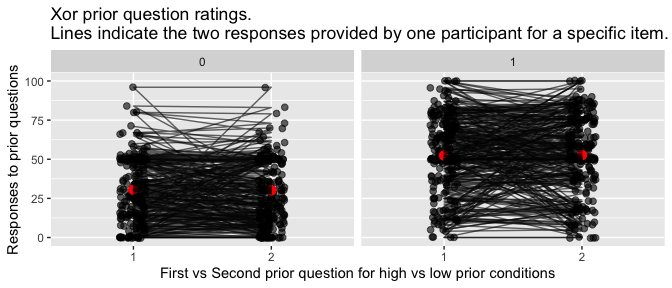<!-- -->

``` r
# check analytically how many subjects rate prior questions differently
d_xor_priors %>% select(-trial_number, -RT, -prompt) %>% 
  pivot_wider(names_from = "priorQ_nr", values_from = "response") %>%
  mutate(response_difference = abs(`1` - `2`),
         bigDifference = ifelse(response_difference > 15, T, F)) -> d_xor_priors_differences

# 41 responses with difference > 15 between first and second rating
d_xor_priors_differences %>% count(bigDifference)
```

    ## # A tibble: 2 x 2
    ##   bigDifference     n
    ##   <lgl>         <int>
    ## 1 FALSE           355
    ## 2 TRUE             41

``` r
# proportion of big differences in prior responses by prior type (high vs low)
d_xor_priors_differences %>% group_by(prior_class) %>% summarise(prop_big_diffs = mean(bigDifference))
```

    ## # A tibble: 2 x 2
    ##   prior_class prop_big_diffs
    ##         <dbl>          <dbl>
    ## 1           0         0.0681
    ## 2           1         0.137

Plot inference ratings as a function of *anticipated* rating of the
explanatory factor, similar to the paper:

``` r
d_critical_long %>% 
  filter(block == "xor" | block == "some") %>%
  ggplot(., aes(x = prior_class, y = response)) +
  geom_point(size = 2, alpha = 0.5) +
  geom_smooth(method="lm") +
  ylab("Inference strength ratings") +
  facet_wrap(block~class_condition) +
  xlab("Anticipated categorization of the items") +
  ggtitle("Inference strength ratings by-predictor")
```

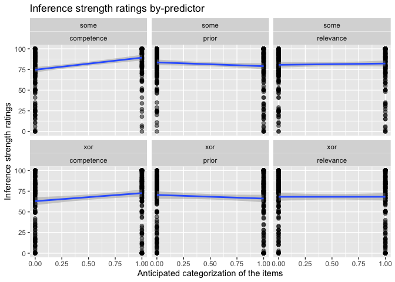<!-- -->

``` r
# make a versatile wide representation of the critical data
d_critical_wide <- d_critical_long %>% 
  select(submission_id, title, main_type, block_extended, response) %>% 
  unique() %>% 
  pivot_wider(
    names_from = block_extended, 
    values_from = response, 
    values_fn = mean # getting means for double prior measurement in "xor"
  ) 
```

Plot inference strength ratings against raw predictor ratings from each
participant across items:

``` r
d_critical_wide %>%
  ggplot(., aes(x = relevance, y = target)) +
  geom_point(size = 2, alpha = 0.7) +
  geom_smooth(method = "lm") +
  ylab("Inference strength ratings") +
  facet_wrap(~main_type, ncol = 1) -> p.rel

d_critical_wide %>%
  ggplot(., aes(x = competence, y = target)) +
  geom_point(size = 2, alpha = 0.7) +
  geom_smooth(method = "lm") +
  ylab("") +
  facet_wrap(~main_type, ncol = 1) -> p.comp

d_critical_wide %>%
  ggplot(., aes(x = prior, y = target)) +
  geom_point(size = 2, alpha = 0.7) +
  geom_smooth(method = "lm") +
  ylab("") +
  facet_wrap(~main_type, ncol = 1) -> p.pri

gridExtra::grid.arrange(p.rel, p.comp, p.pri, ncol = 3) 
```

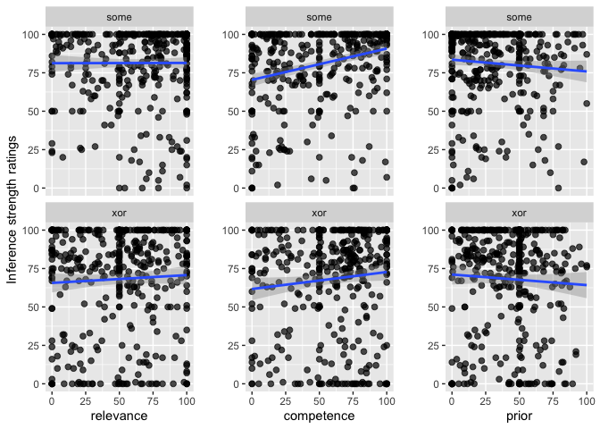<!-- -->

Plot mean ratings (across all participants) for each vignette (with its
respective condition indicated in the facet title, in the order
relevance/competence/prior), in each condition. For relevance and
competence, the color indicates whether it was presented without the
utterance or with.

``` r
bar.width = 0.8
d_critical_long %>% 
  mutate(title = paste(title, exp_condition, sep = "_")) %>%
  filter(block == class_condition | block == "xor" | block == "some") %>%
  group_by(block_extended, title, w_utterance, main_type) %>%
  summarize(mean_rating = mean(response)) %>% 
  ggplot(., aes(x = block_extended, y = mean_rating, fill = w_utterance)) +
  geom_col(alpha = 0.7, width = bar.width, position = position_dodge(width = bar.width)) +
  #geom_point(size = 2, alpha = 0.5, position = position_jitter(width = 0.1)) +
  ylab("Mean responses to respective questions") +
  xlab("Question type") +
  facet_wrap(main_type~title, ncol = 4) +
  theme(axis.text.x = element_text(angle = 45, hjust = 1)) +
  ggtitle("By-item by-question mean ratings")
```

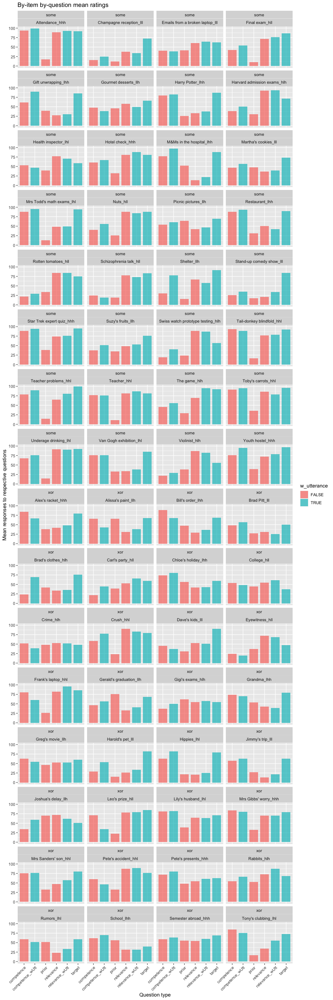<!-- -->

Plot by-item trends between predictor ratings and target inference
strength ratings (relevance / competence ratings with utterance are
omitted):

``` r
# make a versatile wide representation of the critical data
d_critical_predictorsXtarget <- d_critical_wide %>% 
  pivot_longer(
    cols = c(relevance, prior, competence, relevance_wUtt, competence_wUtt),
    names_to = "predictors",
    values_to = "predictor_response"
  ) %>%
  filter(predictors != "relevance_wUtt", predictors != "competence_wUtt") 

d_critical_predictorsXtarget %>%
  ggplot(., aes(x = predictor_response, y = target)) +
  geom_point() +
  facet_wrap(title~predictors, ncol= 6) +
  xlab("Response to predictor questions") +
  ylab("Inference strength rating") +
  ggtitle("By-item Inference Strength Ratings vs. Predictor Ratings (left to right)")
```

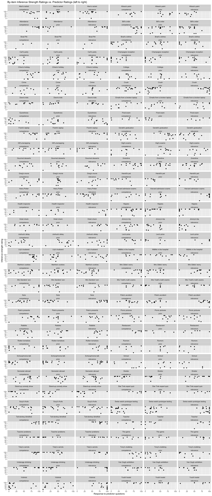<!-- -->

Plot inference strength ratings against predictor ratings, by-item,
using by-item mean ratings across participants. Error bars indicate the
standard deviation of the mean:

``` r
d_critical_predictorsXtarget_summary <- d_critical_predictorsXtarget %>% 
  group_by(title, predictors, main_type) %>%
  summarise(mean_target = mean(target),
            mean_predictor = mean(predictor_response), 
            sd_target = sd(target),
            sd_predictor = sd(predictor_response))  


d_critical_predictorsXtarget_summary %>%
  ggplot(., aes(x = mean_predictor, y = mean_target)) +
  geom_point() +
  geom_errorbar(aes(ymin = mean_target - sd_target, ymax = mean_target + sd_target), alpha = 0.7) +
  geom_errorbarh(aes(xmin = mean_predictor - sd_predictor, xmax = mean_predictor + sd_predictor), alpha = 0.7) +
  geom_text(aes(label=title), size = 2.5, nudge_y = 4) +
  geom_smooth(method = "lm") +
  ylab("Mean inference strength rating") +
  xlab("Mean predictor ratings") + 
  facet_wrap(main_type~predictors)
```

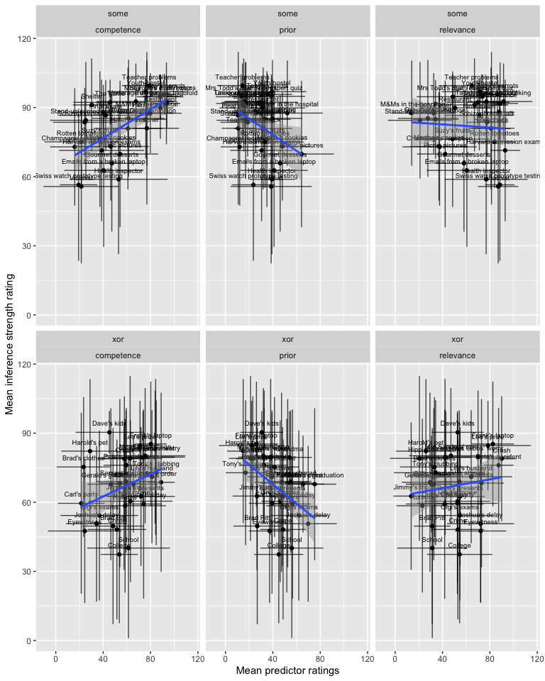<!-- -->

``` r
# correlation plot for "some"
GGally::ggpairs(
  filter(d_critical_wide, main_type == "some") %>%  
    select(prior, competence, relevance, target, competence_wUtt, relevance_wUtt) 
)
```

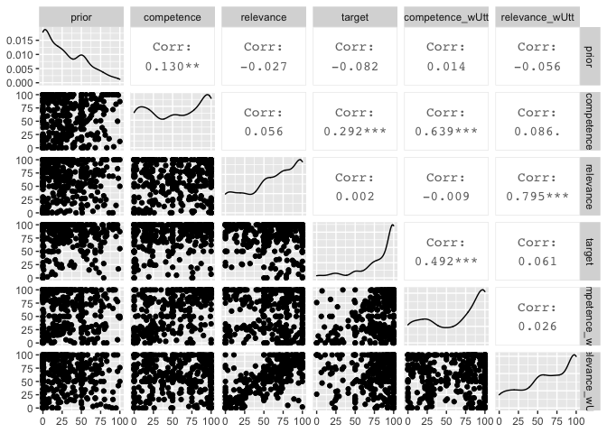<!-- -->

``` r
# correlation plot for "or"
GGally::ggpairs(
  filter(d_critical_wide, main_type == "xor") %>%  
    select(prior, competence, relevance, target, competence_wUtt, relevance_wUtt)
  )
```

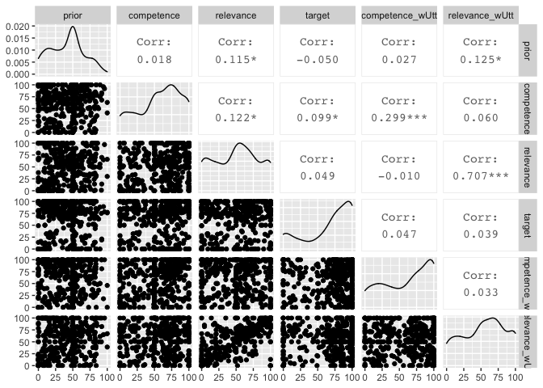<!-- -->

## Explore z-scoring

Visual exploration of z-scoring each measure (rel / comp / pri / target
/ comp-wUtterance / rel-wUtterance) per participant, collapsing some and
or together.

``` r
d_critical_zScored <- d_critical_long %>% group_by(submission_id, block_extended) %>%
  mutate(block_mean = mean(response),
         block_sd = sd(response),
         response_centered = (response - block_mean)/block_sd,
         # catch the cases where sd is 0 
         response_centered = ifelse(is.na(response_centered), 0, response_centered))

d_critical_zScored %>% 
  filter(block != "xor" & block != "some") %>%
  filter(block == class_condition) %>%
  group_by(main_type, class_condition, w_utterance, prior_class) %>% 
  summarize(mean_response = mean(response_centered)) -> d_critical_zScore_summary

d_critical_zScored %>% 
  filter(block != "xor" & block != "some") %>%
  filter(block == class_condition) %>%
  ggplot(., aes(x = as.factor(prior_class), y = response_centered, shape = w_utterance, color = w_utterance)) +
  geom_point(size = 2, alpha = 0.6, position = position_jitter(width = 0.1)) +
  geom_point(data = d_critical_zScore_summary, aes(x = as.factor(prior_class), y = mean_response, shape = w_utterance), 
             color = "red", size = 3) +
  ylab("Responses to respective predictor questions") +
  xlab("Anticipated categorization of the items (low / high)") +
  facet_wrap(main_type~class_condition) + # get ratings from the respective trials only 
  ggtitle("Centered responses to by-predictor questions")
```

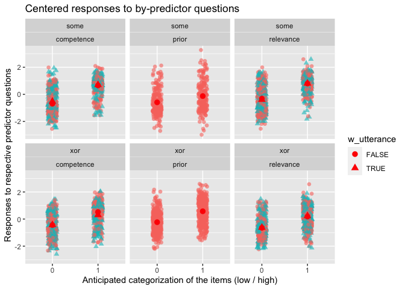<!-- -->

Plot z-scored predictor ratings against z-scored target inference
ratings

``` r
d_critical_zScored_wide <- d_critical_zScored %>% 
  select(submission_id, title, main_type, block_extended, response_centered) %>% 
  unique() %>% 
  pivot_wider(
    names_from = block_extended, 
    values_from = response_centered, 
    values_fn = mean # getting means for double prior measurement in "xor"
  ) 
  
d_critical_zScored_wide %>%
  ggplot(., aes(x = relevance, y = target)) +
  geom_point(size = 2, alpha = 0.7) +
  ylab("Inference strength ratings") +
  geom_smooth(method = "lm") +
  facet_wrap(~main_type, ncol = 1) -> p.rel.z

d_critical_zScored_wide %>%
  ggplot(., aes(x = competence, y = target)) +
  geom_point(size = 2, alpha = 0.7) +
  geom_smooth(method = "lm") +
  ylab("") +
  facet_wrap(~main_type, ncol = 1) -> p.comp.z

d_critical_zScored_wide %>%
  ggplot(., aes(x = prior, y = target)) +
  geom_point(size = 2, alpha = 0.7) +
  geom_smooth(method = "lm") +
  ylab("") +
  facet_wrap(~main_type, ncol = 1) -> p.pri.z

gridExtra::grid.arrange(p.rel.z, p.comp.z, p.pri.z, ncol = 3) 
```

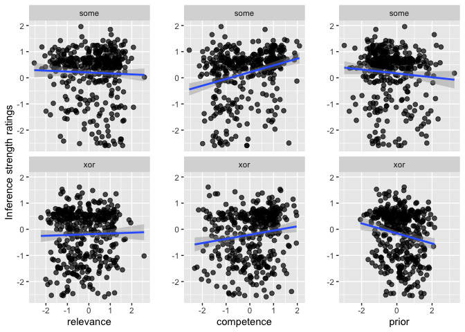<!-- -->

Correlation plots of z-scored data:

``` r
# correlation plot for "some"
GGally::ggpairs(
  filter(d_critical_zScored_wide, main_type == "some") %>% ungroup() %>%  
    select(prior, competence, relevance, target, competence_wUtt, relevance_wUtt)
)
```

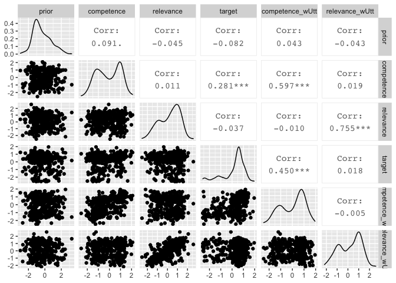<!-- -->

``` r
# correlation plot for "or"
GGally::ggpairs(
  filter(d_critical_zScored_wide, main_type == "xor") %>%  ungroup() %>%
    select(prior, competence, relevance, target, competence_wUtt, relevance_wUtt)
  )
```

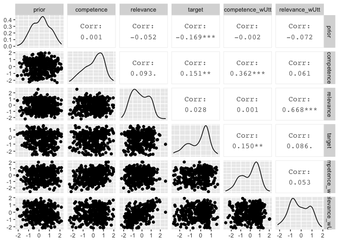<!-- -->

## Stats

Maximal models on raw ratings:

``` r
# xor, maximal model with interactions and maximal REs
model_xor <- brm(
  bf(target ~ prior*competence*relevance + 
    (1 + prior + competence + relevance || submission_id) +
    (1 | title),
    decomp = "QR"
  ), 
  data = d_critical_wide %>% filter(main_type == "xor"),
  family = "gaussian",
  cores = 4,
  iter = 3000
)
```

``` r
summary(model_xor)
```

    ##  Family: gaussian 
    ##   Links: mu = identity; sigma = identity 
    ## Formula: target ~ prior * competence * relevance + (1 + prior + competence + relevance || submission_id) + (1 | title) 
    ##    Data: d_critical_wide %>% filter(main_type == "xor") (Number of observations: 396) 
    ## Samples: 4 chains, each with iter = 3000; warmup = 1500; thin = 1;
    ##          total post-warmup samples = 6000
    ## 
    ## Group-Level Effects: 
    ## ~submission_id (Number of levels: 99) 
    ##                Estimate Est.Error l-95% CI u-95% CI Rhat Bulk_ESS Tail_ESS
    ## sd(Intercept)     16.96      2.97    10.82    22.70 1.00      833     1162
    ## sd(prior)          0.10      0.07     0.00     0.24 1.00      900     2456
    ## sd(competence)     0.14      0.06     0.01     0.25 1.00      436      705
    ## sd(relevance)      0.10      0.06     0.01     0.22 1.00      830     1886
    ## 
    ## ~title (Number of levels: 32) 
    ##               Estimate Est.Error l-95% CI u-95% CI Rhat Bulk_ESS Tail_ESS
    ## sd(Intercept)     9.28      2.50     4.59    14.47 1.00     2085     2843
    ## 
    ## Population-Level Effects: 
    ##                            Estimate Est.Error l-95% CI u-95% CI Rhat Bulk_ESS
    ## Intercept                     62.87      9.78    43.37    81.59 1.00     4171
    ## prior                         -0.00      0.23    -0.46     0.45 1.00     4641
    ## competence                     0.07      0.15    -0.22     0.36 1.00     4265
    ## relevance                      0.17      0.18    -0.18     0.52 1.00     5833
    ## prior:competence               0.00      0.00    -0.01     0.01 1.00     4539
    ## prior:relevance               -0.00      0.00    -0.01     0.00 1.00     5753
    ## competence:relevance          -0.00      0.00    -0.01     0.00 1.00     4979
    ## prior:competence:relevance     0.00      0.00    -0.00     0.00 1.00     5238
    ##                            Tail_ESS
    ## Intercept                      4397
    ## prior                          4772
    ## competence                     4125
    ## relevance                      4651
    ## prior:competence               4650
    ## prior:relevance                5139
    ## competence:relevance           4620
    ## prior:competence:relevance     4801
    ## 
    ## Family Specific Parameters: 
    ##       Estimate Est.Error l-95% CI u-95% CI Rhat Bulk_ESS Tail_ESS
    ## sigma    24.69      1.19    22.46    27.09 1.00     2224     3471
    ## 
    ## Samples were drawn using sampling(NUTS). For each parameter, Bulk_ESS
    ## and Tail_ESS are effective sample size measures, and Rhat is the potential
    ## scale reduction factor on split chains (at convergence, Rhat = 1).

Exploring plots of posterior samples for pairwise parameters shows that
there is a visible correlation between prior & competence, and a
somewhat weaker correlation between competence & relevance. The
interaction estimates also show a correlation with the main effects (as
a rough overall judgment).

``` r
#shinystan::launch_shinystan(model_xor)
```

Plot correlations of main effects

``` r
bayesplot::mcmc_pairs(model_xor, pars = c("b_prior", "b_competence", "b_relevance"))
```

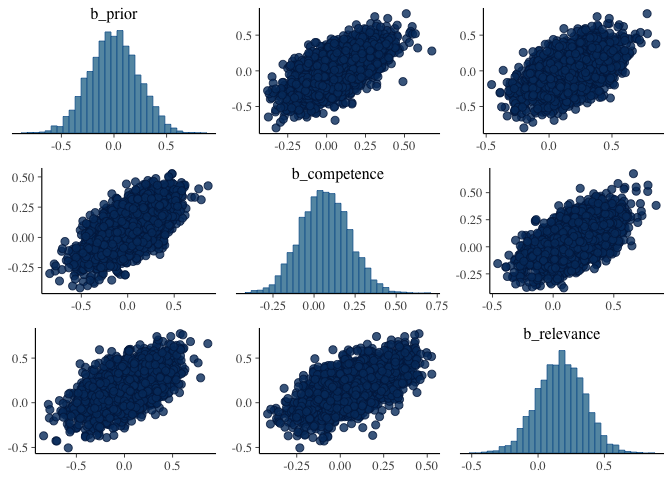<!-- -->

``` r
# some, maximal model with interactions and maximal REs
model_some <- brm(
  bf(target ~ prior*competence*relevance + 
    (1 + prior + competence + relevance || submission_id) +
    (1 | title),
    decomp = "QR"),
  data = d_critical_wide %>% filter(main_type == "some"),
  family = "gaussian",
  cores = 4,
  iter = 3000
)
```

    ## Warning: There were 2 divergent transitions after warmup. Increasing adapt_delta above 0.8 may help. See
    ## http://mc-stan.org/misc/warnings.html#divergent-transitions-after-warmup

    ## Warning: Examine the pairs() plot to diagnose sampling problems

``` r
summary(model_some)
```

    ## Warning: There were 2 divergent transitions after warmup. Increasing adapt_delta
    ## above 0.8 may help. See http://mc-stan.org/misc/warnings.html#divergent-
    ## transitions-after-warmup

    ##  Family: gaussian 
    ##   Links: mu = identity; sigma = identity 
    ## Formula: target ~ prior * competence * relevance + (1 + prior + competence + relevance || submission_id) + (1 | title) 
    ##    Data: d_critical_wide %>% filter(main_type == "some") (Number of observations: 396) 
    ## Samples: 4 chains, each with iter = 3000; warmup = 1500; thin = 1;
    ##          total post-warmup samples = 6000
    ## 
    ## Group-Level Effects: 
    ## ~submission_id (Number of levels: 99) 
    ##                Estimate Est.Error l-95% CI u-95% CI Rhat Bulk_ESS Tail_ESS
    ## sd(Intercept)     10.31      1.80     6.51    13.72 1.00     1771     1999
    ## sd(prior)          0.06      0.04     0.00     0.16 1.00     1817     2744
    ## sd(competence)     0.03      0.02     0.00     0.08 1.00     2200     3692
    ## sd(relevance)      0.04      0.03     0.00     0.11 1.00     1420     1708
    ## 
    ## ~title (Number of levels: 32) 
    ##               Estimate Est.Error l-95% CI u-95% CI Rhat Bulk_ESS Tail_ESS
    ## sd(Intercept)     8.60      1.92     5.09    12.57 1.00     2424     3276
    ## 
    ## Population-Level Effects: 
    ##                            Estimate Est.Error l-95% CI u-95% CI Rhat Bulk_ESS
    ## Intercept                     77.67      6.02    65.78    89.32 1.00     7351
    ## prior                         -0.15      0.21    -0.56     0.25 1.00     9677
    ## competence                     0.13      0.09    -0.06     0.31 1.00     8841
    ## relevance                     -0.07      0.08    -0.22     0.09 1.00     8583
    ## prior:competence               0.00      0.00    -0.00     0.01 1.00    10153
    ## prior:relevance                0.00      0.00    -0.00     0.01 1.00    10333
    ## competence:relevance           0.00      0.00    -0.00     0.00 1.00     9058
    ## prior:competence:relevance    -0.00      0.00    -0.00     0.00 1.00    10545
    ##                            Tail_ESS
    ## Intercept                      4834
    ## prior                          5083
    ## competence                     4902
    ## relevance                      4815
    ## prior:competence               5279
    ## prior:relevance                4730
    ## competence:relevance           4978
    ## prior:competence:relevance     4769
    ## 
    ## Family Specific Parameters: 
    ##       Estimate Est.Error l-95% CI u-95% CI Rhat Bulk_ESS Tail_ESS
    ## sigma    19.94      0.89    18.28    21.75 1.00     3832     4363
    ## 
    ## Samples were drawn using sampling(NUTS). For each parameter, Bulk_ESS
    ## and Tail_ESS are effective sample size measures, and Rhat is the potential
    ## scale reduction factor on split chains (at convergence, Rhat = 1).

For “some”, the correlation of prior and relevance is higher than for
prior and competence; there is also a visible correlation of competence
and relevance.

``` r
#shinystan::launch_shinystan(model_some)
```

``` r
bayesplot::mcmc_pairs(model_some, pars = c("b_prior", "b_competence", "b_relevance"))
```

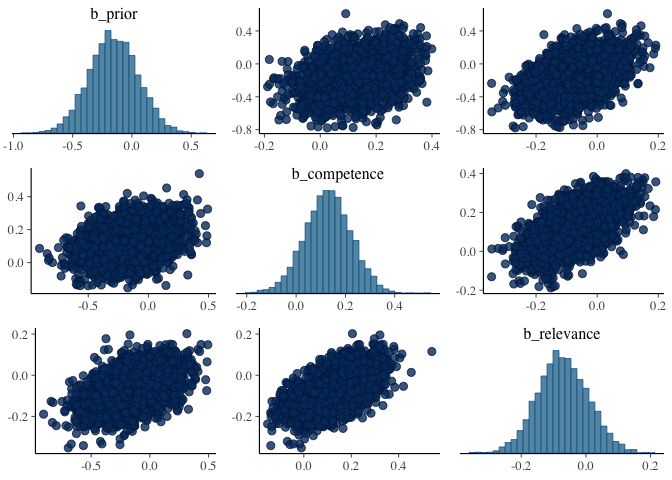<!-- -->

#### Smaller models with raw data to check for collinearity

Models on raw data with only one predictor:

``` r
# xor
model_xor_prior <- brm(
  bf(target ~ prior + 
    (1 + prior | submission_id) +
    (1 | title),
    decomp = "QR"),
  data = d_critical_wide %>% filter(main_type == "xor"),
  family = "gaussian",
  control = list(adapt_delta = 0.99),
  cores = 4,
  iter = 3000
)
```

``` r
summary(model_xor_prior)
```

    ##  Family: gaussian 
    ##   Links: mu = identity; sigma = identity 
    ## Formula: target ~ prior + (1 + prior | submission_id) + (1 | title) 
    ##    Data: d_critical_wide %>% filter(main_type == "xor") (Number of observations: 396) 
    ## Samples: 4 chains, each with iter = 3000; warmup = 1500; thin = 1;
    ##          total post-warmup samples = 6000
    ## 
    ## Group-Level Effects: 
    ## ~submission_id (Number of levels: 99) 
    ##                      Estimate Est.Error l-95% CI u-95% CI Rhat Bulk_ESS
    ## sd(Intercept)           20.61      2.84    15.24    26.46 1.00     2613
    ## sd(prior)                0.08      0.07     0.00     0.25 1.00      750
    ## cor(Intercept,prior)    -0.12      0.52    -0.94     0.91 1.00     3543
    ##                      Tail_ESS
    ## sd(Intercept)            3536
    ## sd(prior)                1152
    ## cor(Intercept,prior)     3108
    ## 
    ## ~title (Number of levels: 32) 
    ##               Estimate Est.Error l-95% CI u-95% CI Rhat Bulk_ESS Tail_ESS
    ## sd(Intercept)     9.65      2.39     5.15    14.58 1.00     1953     2366
    ## 
    ## Population-Level Effects: 
    ##           Estimate Est.Error l-95% CI u-95% CI Rhat Bulk_ESS Tail_ESS
    ## Intercept    69.30      4.35    60.81    77.77 1.00     2831     4279
    ## prior        -0.03      0.07    -0.17     0.11 1.00     4264     5024
    ## 
    ## Family Specific Parameters: 
    ##       Estimate Est.Error l-95% CI u-95% CI Rhat Bulk_ESS Tail_ESS
    ## sigma    25.14      1.11    23.09    27.40 1.00     3724     4656
    ## 
    ## Samples were drawn using sampling(NUTS). For each parameter, Bulk_ESS
    ## and Tail_ESS are effective sample size measures, and Rhat is the potential
    ## scale reduction factor on split chains (at convergence, Rhat = 1).

``` r
# xor
model_xor_comp <- brm(
  bf(target ~ competence + 
    (1 + competence | submission_id) +
    (1 | title),
    decomp = "QR"),
  data = d_critical_wide %>% filter(main_type == "xor"),
  family = "gaussian",
  control = list(adapt_delta = 0.99),
  cores = 4,
  iter = 3000
)
```

    ## Warning: Bulk Effective Samples Size (ESS) is too low, indicating posterior means and medians may be unreliable.
    ## Running the chains for more iterations may help. See
    ## http://mc-stan.org/misc/warnings.html#bulk-ess

``` r
summary(model_xor_comp)
```

    ##  Family: gaussian 
    ##   Links: mu = identity; sigma = identity 
    ## Formula: target ~ competence + (1 + competence | submission_id) + (1 | title) 
    ##    Data: d_critical_wide %>% filter(main_type == "xor") (Number of observations: 396) 
    ## Samples: 4 chains, each with iter = 3000; warmup = 1500; thin = 1;
    ##          total post-warmup samples = 6000
    ## 
    ## Group-Level Effects: 
    ## ~submission_id (Number of levels: 99) 
    ##                           Estimate Est.Error l-95% CI u-95% CI Rhat Bulk_ESS
    ## sd(Intercept)                21.08      4.05    13.63    29.53 1.00     1113
    ## sd(competence)                0.20      0.09     0.02     0.37 1.01      309
    ## cor(Intercept,competence)    -0.24      0.40    -0.75     0.80 1.00      674
    ##                           Tail_ESS
    ## sd(Intercept)                 2763
    ## sd(competence)                 436
    ## cor(Intercept,competence)      804
    ## 
    ## ~title (Number of levels: 32) 
    ##               Estimate Est.Error l-95% CI u-95% CI Rhat Bulk_ESS Tail_ESS
    ## sd(Intercept)     9.46      2.27     5.31    14.14 1.00     2301     3243
    ## 
    ## Population-Level Effects: 
    ##            Estimate Est.Error l-95% CI u-95% CI Rhat Bulk_ESS Tail_ESS
    ## Intercept     63.85      4.52    54.68    72.80 1.00     4021     4735
    ## competence     0.07      0.06    -0.05     0.19 1.00     4423     4258
    ## 
    ## Family Specific Parameters: 
    ##       Estimate Est.Error l-95% CI u-95% CI Rhat Bulk_ESS Tail_ESS
    ## sigma    24.37      1.22    22.13    26.87 1.00     1194     2900
    ## 
    ## Samples were drawn using sampling(NUTS). For each parameter, Bulk_ESS
    ## and Tail_ESS are effective sample size measures, and Rhat is the potential
    ## scale reduction factor on split chains (at convergence, Rhat = 1).

``` r
# xor
model_xor_rel <- brm(
  bf(target ~ relevance + 
    (1 + relevance | submission_id) +
    (1 | title),
    decomp = "QR"),
  data = d_critical_wide %>% filter(main_type == "xor"),
  family = "gaussian",
  control = list(adapt_delta = 0.99),
  cores = 4,
  iter = 3000
)
```

``` r
summary(model_xor_rel)
```

    ##  Family: gaussian 
    ##   Links: mu = identity; sigma = identity 
    ## Formula: target ~ relevance + (1 + relevance | submission_id) + (1 | title) 
    ##    Data: d_critical_wide %>% filter(main_type == "xor") (Number of observations: 396) 
    ## Samples: 4 chains, each with iter = 3000; warmup = 1500; thin = 1;
    ##          total post-warmup samples = 6000
    ## 
    ## Group-Level Effects: 
    ## ~submission_id (Number of levels: 99) 
    ##                          Estimate Est.Error l-95% CI u-95% CI Rhat Bulk_ESS
    ## sd(Intercept)               19.67      2.86    14.04    25.45 1.00     2701
    ## sd(relevance)                0.08      0.06     0.00     0.22 1.01      509
    ## cor(Intercept,relevance)     0.04      0.51    -0.87     0.94 1.00     2708
    ##                          Tail_ESS
    ## sd(Intercept)                3422
    ## sd(relevance)                 987
    ## cor(Intercept,relevance)     2123
    ## 
    ## ~title (Number of levels: 32) 
    ##               Estimate Est.Error l-95% CI u-95% CI Rhat Bulk_ESS Tail_ESS
    ## sd(Intercept)     9.93      2.29     5.75    14.74 1.00     2188     2853
    ## 
    ## Population-Level Effects: 
    ##           Estimate Est.Error l-95% CI u-95% CI Rhat Bulk_ESS Tail_ESS
    ## Intercept    66.89      4.00    59.05    74.72 1.00     3818     4135
    ## relevance     0.02      0.06    -0.09     0.13 1.00     4966     4313
    ## 
    ## Family Specific Parameters: 
    ##       Estimate Est.Error l-95% CI u-95% CI Rhat Bulk_ESS Tail_ESS
    ## sigma    25.11      1.12    23.01    27.44 1.00     3274     3806
    ## 
    ## Samples were drawn using sampling(NUTS). For each parameter, Bulk_ESS
    ## and Tail_ESS are effective sample size measures, and Rhat is the potential
    ## scale reduction factor on split chains (at convergence, Rhat = 1).

``` r
# some
model_some_rel <- brm(
  bf(target ~ relevance + 
    (1 + relevance | submission_id) +
    (1 | title),
    decomp = "QR"),
  data = d_critical_wide %>% filter(main_type == "some"),
  family = "gaussian",
  control = list(adapt_delta = 0.99),
  cores = 4,
  iter = 3000
)
```

``` r
summary(model_some_rel)
```

    ##  Family: gaussian 
    ##   Links: mu = identity; sigma = identity 
    ## Formula: target ~ relevance + (1 + relevance | submission_id) + (1 | title) 
    ##    Data: d_critical_wide %>% filter(main_type == "some") (Number of observations: 396) 
    ## Samples: 4 chains, each with iter = 3000; warmup = 1500; thin = 1;
    ##          total post-warmup samples = 6000
    ## 
    ## Group-Level Effects: 
    ## ~submission_id (Number of levels: 99) 
    ##                          Estimate Est.Error l-95% CI u-95% CI Rhat Bulk_ESS
    ## sd(Intercept)               11.60      2.25     7.25    16.21 1.00     2630
    ## sd(relevance)                0.04      0.03     0.00     0.11 1.00     1223
    ## cor(Intercept,relevance)    -0.15      0.55    -0.96     0.93 1.00     5288
    ##                          Tail_ESS
    ## sd(Intercept)                3080
    ## sd(relevance)                2055
    ## cor(Intercept,relevance)     3078
    ## 
    ## ~title (Number of levels: 32) 
    ##               Estimate Est.Error l-95% CI u-95% CI Rhat Bulk_ESS Tail_ESS
    ## sd(Intercept)    11.11      1.90     7.76    15.15 1.00     2680     4002
    ## 
    ## Population-Level Effects: 
    ##           Estimate Est.Error l-95% CI u-95% CI Rhat Bulk_ESS Tail_ESS
    ## Intercept    82.19      3.68    75.04    89.32 1.00     4069     4523
    ## relevance    -0.00      0.04    -0.09     0.08 1.00     5597     4965
    ## 
    ## Family Specific Parameters: 
    ##       Estimate Est.Error l-95% CI u-95% CI Rhat Bulk_ESS Tail_ESS
    ## sigma    19.81      0.86    18.21    21.61 1.00     4337     4480
    ## 
    ## Samples were drawn using sampling(NUTS). For each parameter, Bulk_ESS
    ## and Tail_ESS are effective sample size measures, and Rhat is the potential
    ## scale reduction factor on split chains (at convergence, Rhat = 1).

``` r
# some
model_some_prior <- brm(
  bf(target ~ prior + 
    (1 + prior | submission_id) +
    (1 | title),
    decomp = "QR"),
  data = d_critical_wide %>% filter(main_type == "some"),
  family = "gaussian",
  control = list(adapt_delta = 0.99),
  cores = 4,
  iter = 3000
)
```

``` r
summary(model_some_prior)
```

    ##  Family: gaussian 
    ##   Links: mu = identity; sigma = identity 
    ## Formula: target ~ prior + (1 + prior | submission_id) + (1 | title) 
    ##    Data: d_critical_wide %>% filter(main_type == "some") (Number of observations: 396) 
    ## Samples: 4 chains, each with iter = 3000; warmup = 1500; thin = 1;
    ##          total post-warmup samples = 6000
    ## 
    ## Group-Level Effects: 
    ## ~submission_id (Number of levels: 99) 
    ##                      Estimate Est.Error l-95% CI u-95% CI Rhat Bulk_ESS
    ## sd(Intercept)           11.88      1.96     8.10    15.83 1.00     2470
    ## sd(prior)                0.09      0.07     0.00     0.26 1.01      612
    ## cor(Intercept,prior)    -0.34      0.48    -0.95     0.82 1.00     2834
    ##                      Tail_ESS
    ## sd(Intercept)            3048
    ## sd(prior)                1130
    ## cor(Intercept,prior)     3041
    ## 
    ## ~title (Number of levels: 32) 
    ##               Estimate Est.Error l-95% CI u-95% CI Rhat Bulk_ESS Tail_ESS
    ## sd(Intercept)    10.95      1.93     7.62    15.20 1.00     2347     3489
    ## 
    ## Population-Level Effects: 
    ##           Estimate Est.Error l-95% CI u-95% CI Rhat Bulk_ESS Tail_ESS
    ## Intercept    82.42      2.84    76.80    87.99 1.00     2504     3582
    ## prior        -0.01      0.05    -0.11     0.09 1.00     5431     4782
    ## 
    ## Family Specific Parameters: 
    ##       Estimate Est.Error l-95% CI u-95% CI Rhat Bulk_ESS Tail_ESS
    ## sigma    19.80      0.89    18.17    21.68 1.00     3683     3534
    ## 
    ## Samples were drawn using sampling(NUTS). For each parameter, Bulk_ESS
    ## and Tail_ESS are effective sample size measures, and Rhat is the potential
    ## scale reduction factor on split chains (at convergence, Rhat = 1).

``` r
# some
model_some_comp <- brm(
  bf(target ~ competence + 
    (1 + competence | submission_id) +
    (1 | title),
    decomp = "QR"),
  data = d_critical_wide %>% filter(main_type == "some"),
  family = "gaussian",
  control = list(adapt_delta = 0.92),
  cores = 4,
  iter = 3000
)
```

``` r
summary(model_some_comp)
```

    ##  Family: gaussian 
    ##   Links: mu = identity; sigma = identity 
    ## Formula: target ~ competence + (1 + competence | submission_id) + (1 | title) 
    ##    Data: d_critical_wide %>% filter(main_type == "some") (Number of observations: 396) 
    ## Samples: 4 chains, each with iter = 3000; warmup = 1500; thin = 1;
    ##          total post-warmup samples = 6000
    ## 
    ## Group-Level Effects: 
    ## ~submission_id (Number of levels: 99) 
    ##                           Estimate Est.Error l-95% CI u-95% CI Rhat Bulk_ESS
    ## sd(Intercept)                15.39      2.83    10.14    21.15 1.00     1861
    ## sd(competence)                0.10      0.04     0.02     0.18 1.00     1675
    ## cor(Intercept,competence)    -0.81      0.24    -1.00    -0.08 1.00     3087
    ##                           Tail_ESS
    ## sd(Intercept)                 3524
    ## sd(competence)                2078
    ## cor(Intercept,competence)     3046
    ## 
    ## ~title (Number of levels: 32) 
    ##               Estimate Est.Error l-95% CI u-95% CI Rhat Bulk_ESS Tail_ESS
    ## sd(Intercept)     8.72      1.87     5.37    12.57 1.00     2282     3319
    ## 
    ## Population-Level Effects: 
    ##            Estimate Est.Error l-95% CI u-95% CI Rhat Bulk_ESS Tail_ESS
    ## Intercept     74.20      3.37    67.71    80.93 1.00     3167     3647
    ## competence     0.14      0.04     0.06     0.22 1.00     4681     4690
    ## 
    ## Family Specific Parameters: 
    ##       Estimate Est.Error l-95% CI u-95% CI Rhat Bulk_ESS Tail_ESS
    ## sigma    19.45      0.87    17.80    21.24 1.00     2824     4643
    ## 
    ## Samples were drawn using sampling(NUTS). For each parameter, Bulk_ESS
    ## and Tail_ESS are effective sample size measures, and Rhat is the potential
    ## scale reduction factor on split chains (at convergence, Rhat = 1).

With two predictors:

``` r
# xor
model_xor_pri_comp <- brm(
  bf(
  target ~ prior*competence + 
    (1 + prior*competence || submission_id) +
    (1 | title),
  decomp = "QR"
  ),
  data = d_critical_wide %>% filter(main_type == "xor"),
  family = "gaussian",
  cores = 4,
  iter = 3000
)
```

    ## Warning: There were 37 divergent transitions after warmup. Increasing adapt_delta above 0.8 may help. See
    ## http://mc-stan.org/misc/warnings.html#divergent-transitions-after-warmup

    ## Warning: Examine the pairs() plot to diagnose sampling problems

``` r
summary(model_xor_pri_comp)
```

    ## Warning: There were 37 divergent transitions after warmup. Increasing
    ## adapt_delta above 0.8 may help. See http://mc-stan.org/misc/
    ## warnings.html#divergent-transitions-after-warmup

    ##  Family: gaussian 
    ##   Links: mu = identity; sigma = identity 
    ## Formula: target ~ prior * competence + (1 + prior * competence || submission_id) + (1 | title) 
    ##    Data: d_critical_wide %>% filter(main_type == "xor") (Number of observations: 396) 
    ## Samples: 4 chains, each with iter = 3000; warmup = 1500; thin = 1;
    ##          total post-warmup samples = 6000
    ## 
    ## Group-Level Effects: 
    ## ~submission_id (Number of levels: 99) 
    ##                      Estimate Est.Error l-95% CI u-95% CI Rhat Bulk_ESS
    ## sd(Intercept)           18.04      2.70    12.68    23.26 1.01      852
    ## sd(prior)                0.09      0.06     0.00     0.23 1.00      885
    ## sd(competence)           0.13      0.06     0.01     0.25 1.01      484
    ## sd(prior:competence)     0.00      0.00     0.00     0.00 1.00     1289
    ##                      Tail_ESS
    ## sd(Intercept)             843
    ## sd(prior)                1701
    ## sd(competence)            878
    ## sd(prior:competence)     1926
    ## 
    ## ~title (Number of levels: 32) 
    ##               Estimate Est.Error l-95% CI u-95% CI Rhat Bulk_ESS Tail_ESS
    ## sd(Intercept)     9.23      2.51     4.54    14.39 1.00     1367     1551
    ## 
    ## Population-Level Effects: 
    ##                  Estimate Est.Error l-95% CI u-95% CI Rhat Bulk_ESS Tail_ESS
    ## Intercept           69.70      7.02    56.21    83.47 1.00     4044     4531
    ## prior               -0.15      0.15    -0.43     0.15 1.00     4003     3957
    ## competence          -0.01      0.10    -0.20     0.18 1.00     5062     4294
    ## prior:competence     0.00      0.00    -0.00     0.01 1.00     5427     4036
    ## 
    ## Family Specific Parameters: 
    ##       Estimate Est.Error l-95% CI u-95% CI Rhat Bulk_ESS Tail_ESS
    ## sigma    24.70      1.20    22.47    27.12 1.00     1809     2796
    ## 
    ## Samples were drawn using sampling(NUTS). For each parameter, Bulk_ESS
    ## and Tail_ESS are effective sample size measures, and Rhat is the potential
    ## scale reduction factor on split chains (at convergence, Rhat = 1).

``` r
bayesplot::mcmc_pairs(model_xor_pri_comp, pars = c("b_prior", "b_competence"))
```

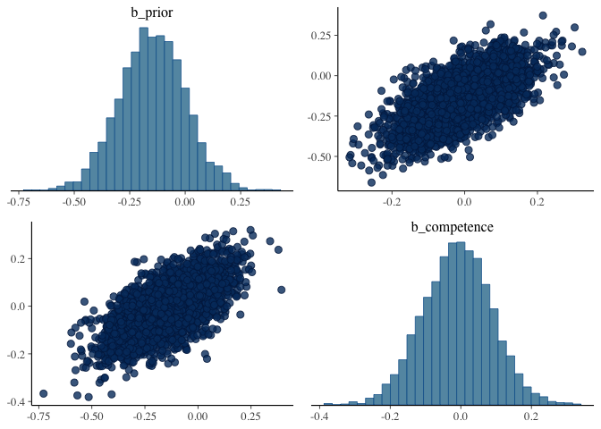<!-- -->

``` r
# xor
model_xor_pri_rel <- brm(
  bf(target ~ prior*relevance + 
    (1 + prior*relevance || submission_id) +
    (1 | title),
    decomp = "QR"),
  data = d_critical_wide %>% filter(main_type == "xor"),
  family = "gaussian",
  control = list(adapt_delta = 0.92),
  cores = 4,
  iter = 3000
)
```

``` r
summary(model_xor_pri_rel)
```

    ##  Family: gaussian 
    ##   Links: mu = identity; sigma = identity 
    ## Formula: target ~ prior * relevance + (1 + prior * relevance || submission_id) + (1 | title) 
    ##    Data: d_critical_wide %>% filter(main_type == "xor") (Number of observations: 396) 
    ## Samples: 4 chains, each with iter = 3000; warmup = 1500; thin = 1;
    ##          total post-warmup samples = 6000
    ## 
    ## Group-Level Effects: 
    ## ~submission_id (Number of levels: 99) 
    ##                     Estimate Est.Error l-95% CI u-95% CI Rhat Bulk_ESS Tail_ESS
    ## sd(Intercept)          18.72      2.40    14.01    23.39 1.00     1443     2077
    ## sd(prior)               0.09      0.06     0.00     0.23 1.01     1038     2012
    ## sd(relevance)           0.09      0.06     0.00     0.21 1.00      767     1459
    ## sd(prior:relevance)     0.00      0.00     0.00     0.00 1.00     1166     2179
    ## 
    ## ~title (Number of levels: 32) 
    ##               Estimate Est.Error l-95% CI u-95% CI Rhat Bulk_ESS Tail_ESS
    ## sd(Intercept)     9.70      2.47     5.05    14.70 1.00     1536     1976
    ## 
    ## Population-Level Effects: 
    ##                 Estimate Est.Error l-95% CI u-95% CI Rhat Bulk_ESS Tail_ESS
    ## Intercept          66.01      5.95    54.06    77.62 1.00     3895     4394
    ## prior               0.03      0.12    -0.21     0.26 1.00     4800     4525
    ## relevance           0.06      0.09    -0.11     0.23 1.00     5147     4599
    ## prior:relevance    -0.00      0.00    -0.00     0.00 1.00     5914     4456
    ## 
    ## Family Specific Parameters: 
    ##       Estimate Est.Error l-95% CI u-95% CI Rhat Bulk_ESS Tail_ESS
    ## sigma    24.96      1.15    22.80    27.35 1.00     2925     4474
    ## 
    ## Samples were drawn using sampling(NUTS). For each parameter, Bulk_ESS
    ## and Tail_ESS are effective sample size measures, and Rhat is the potential
    ## scale reduction factor on split chains (at convergence, Rhat = 1).

``` r
bayesplot::mcmc_pairs(model_xor_pri_rel, pars = c("b_prior", "b_relevance"))
```

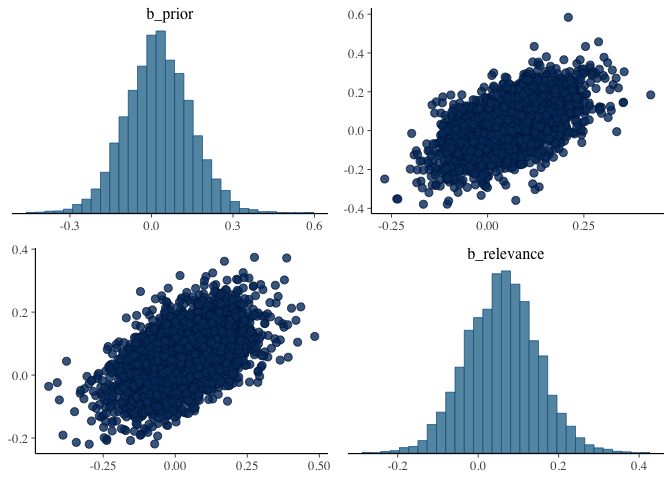<!-- -->

``` r
# xor
model_xor_rel_comp <- brm(
  bf(target ~ relevance*competence + 
    (1 + relevance*competence || submission_id) +
    (1 | title),
    decomp = "QR"),
  data = d_critical_wide %>% filter(main_type == "xor"),
  family = "gaussian",
  cores = 4,
  iter = 3000
)
```

``` r
summary(model_xor_rel_comp)
```

    ##  Family: gaussian 
    ##   Links: mu = identity; sigma = identity 
    ## Formula: target ~ relevance * competence + (1 + relevance * competence || submission_id) + (1 | title) 
    ##    Data: d_critical_wide %>% filter(main_type == "xor") (Number of observations: 396) 
    ## Samples: 4 chains, each with iter = 3000; warmup = 1500; thin = 1;
    ##          total post-warmup samples = 6000
    ## 
    ## Group-Level Effects: 
    ## ~submission_id (Number of levels: 99) 
    ##                          Estimate Est.Error l-95% CI u-95% CI Rhat Bulk_ESS
    ## sd(Intercept)               17.32      2.79    11.55    22.56 1.00      814
    ## sd(relevance)                0.09      0.06     0.00     0.21 1.00      737
    ## sd(competence)               0.14      0.06     0.02     0.25 1.00      533
    ## sd(relevance:competence)     0.00      0.00     0.00     0.00 1.00     1464
    ##                          Tail_ESS
    ## sd(Intercept)                1022
    ## sd(relevance)                2192
    ## sd(competence)               1009
    ## sd(relevance:competence)     2405
    ## 
    ## ~title (Number of levels: 32) 
    ##               Estimate Est.Error l-95% CI u-95% CI Rhat Bulk_ESS Tail_ESS
    ## sd(Intercept)     9.50      2.56     4.69    14.50 1.00      867      484
    ## 
    ## Population-Level Effects: 
    ##                      Estimate Est.Error l-95% CI u-95% CI Rhat Bulk_ESS
    ## Intercept               63.33      6.16    51.31    75.68 1.00     4489
    ## relevance                0.01      0.10    -0.19     0.22 1.00     5384
    ## competence               0.07      0.09    -0.11     0.25 1.00     5209
    ## relevance:competence    -0.00      0.00    -0.00     0.00 1.00     5398
    ##                      Tail_ESS
    ## Intercept                4734
    ## relevance                4659
    ## competence               4514
    ## relevance:competence     4494
    ## 
    ## Family Specific Parameters: 
    ##       Estimate Est.Error l-95% CI u-95% CI Rhat Bulk_ESS Tail_ESS
    ## sigma    24.63      1.19    22.41    27.03 1.00     1367     2885
    ## 
    ## Samples were drawn using sampling(NUTS). For each parameter, Bulk_ESS
    ## and Tail_ESS are effective sample size measures, and Rhat is the potential
    ## scale reduction factor on split chains (at convergence, Rhat = 1).

``` r
bayesplot::mcmc_pairs(model_xor_rel_comp, pars = c("b_competence", "b_relevance"))
```

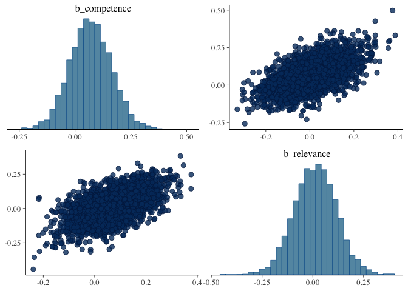<!-- -->

``` r
# some
model_some_pri_comp <- brm(
  bf(target ~ prior*competence + 
    (1 + prior*competence || submission_id) +
    (1 | title),
    decomp = "QR"),
  data = d_critical_wide %>% filter(main_type == "some"),
  family = "gaussian",
  cores = 4,
  iter = 3000
)
```

``` r
summary(model_some_pri_comp)
```

    ##  Family: gaussian 
    ##   Links: mu = identity; sigma = identity 
    ## Formula: target ~ prior * competence + (1 + prior * competence || submission_id) + (1 | title) 
    ##    Data: d_critical_wide %>% filter(main_type == "some") (Number of observations: 396) 
    ## Samples: 4 chains, each with iter = 3000; warmup = 1500; thin = 1;
    ##          total post-warmup samples = 6000
    ## 
    ## Group-Level Effects: 
    ## ~submission_id (Number of levels: 99) 
    ##                      Estimate Est.Error l-95% CI u-95% CI Rhat Bulk_ESS
    ## sd(Intercept)           10.60      1.66     7.39    14.05 1.00     2458
    ## sd(prior)                0.06      0.04     0.00     0.16 1.00     1898
    ## sd(competence)           0.03      0.02     0.00     0.08 1.00     2229
    ## sd(prior:competence)     0.00      0.00     0.00     0.00 1.00     2378
    ##                      Tail_ESS
    ## sd(Intercept)            3715
    ## sd(prior)                2976
    ## sd(competence)           3135
    ## sd(prior:competence)     3570
    ## 
    ## ~title (Number of levels: 32) 
    ##               Estimate Est.Error l-95% CI u-95% CI Rhat Bulk_ESS Tail_ESS
    ## sd(Intercept)     8.51      1.88     5.06    12.52 1.00     2378     3498
    ## 
    ## Population-Level Effects: 
    ##                  Estimate Est.Error l-95% CI u-95% CI Rhat Bulk_ESS Tail_ESS
    ## Intercept           73.39      3.65    66.26    80.64 1.00     6772     5563
    ## prior                0.04      0.09    -0.14     0.21 1.00     8373     5087
    ## competence           0.18      0.05     0.08     0.28 1.00     7308     5155
    ## prior:competence    -0.00      0.00    -0.00     0.00 1.00    10388     4915
    ## 
    ## Family Specific Parameters: 
    ##       Estimate Est.Error l-95% CI u-95% CI Rhat Bulk_ESS Tail_ESS
    ## sigma    19.90      0.89    18.24    21.71 1.00     3766     4496
    ## 
    ## Samples were drawn using sampling(NUTS). For each parameter, Bulk_ESS
    ## and Tail_ESS are effective sample size measures, and Rhat is the potential
    ## scale reduction factor on split chains (at convergence, Rhat = 1).

``` r
bayesplot::mcmc_pairs(model_some_pri_comp, pars = c("b_prior", "b_competence"))
```

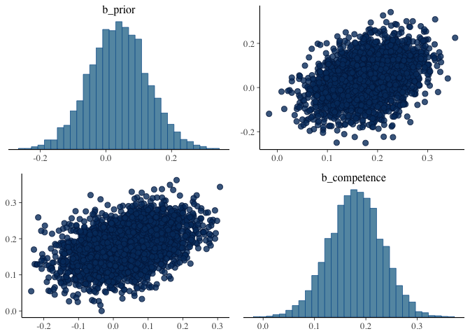<!-- -->

``` r
# some
model_some_pri_rel <- brm(
  bf(target ~ prior*relevance + 
    (1 + prior*relevance || submission_id) +
    (1 | title),
    decomp = "QR"),
  data = d_critical_wide %>% filter(main_type == "some"),
  family = "gaussian",
  cores = 4,
  iter = 3000
)
```

    ## Warning: There were 1 divergent transitions after warmup. Increasing adapt_delta above 0.8 may help. See
    ## http://mc-stan.org/misc/warnings.html#divergent-transitions-after-warmup

    ## Warning: Examine the pairs() plot to diagnose sampling problems

``` r
summary(model_some_pri_rel)
```

    ## Warning: There were 1 divergent transitions after warmup. Increasing adapt_delta
    ## above 0.8 may help. See http://mc-stan.org/misc/warnings.html#divergent-
    ## transitions-after-warmup

    ##  Family: gaussian 
    ##   Links: mu = identity; sigma = identity 
    ## Formula: target ~ prior * relevance + (1 + prior * relevance || submission_id) + (1 | title) 
    ##    Data: d_critical_wide %>% filter(main_type == "some") (Number of observations: 396) 
    ## Samples: 4 chains, each with iter = 3000; warmup = 1500; thin = 1;
    ##          total post-warmup samples = 6000
    ## 
    ## Group-Level Effects: 
    ## ~submission_id (Number of levels: 99) 
    ##                     Estimate Est.Error l-95% CI u-95% CI Rhat Bulk_ESS Tail_ESS
    ## sd(Intercept)          10.62      1.79     7.03    13.99 1.00     1537     2016
    ## sd(prior)               0.06      0.04     0.00     0.16 1.00     1784     2866
    ## sd(relevance)           0.04      0.03     0.00     0.11 1.00     1117     1750
    ## sd(prior:relevance)     0.00      0.00     0.00     0.00 1.00     1680     2921
    ## 
    ## ~title (Number of levels: 32) 
    ##               Estimate Est.Error l-95% CI u-95% CI Rhat Bulk_ESS Tail_ESS
    ## sd(Intercept)    11.14      1.96     7.78    15.43 1.00     2535     3981
    ## 
    ## Population-Level Effects: 
    ##                 Estimate Est.Error l-95% CI u-95% CI Rhat Bulk_ESS Tail_ESS
    ## Intercept          82.70      4.54    73.69    91.46 1.00     5626     4876
    ## prior              -0.02      0.10    -0.21     0.17 1.00     8021     5250
    ## relevance          -0.01      0.06    -0.11     0.11 1.00     7463     4774
    ## prior:relevance     0.00      0.00    -0.00     0.00 1.00     7891     4667
    ## 
    ## Family Specific Parameters: 
    ##       Estimate Est.Error l-95% CI u-95% CI Rhat Bulk_ESS Tail_ESS
    ## sigma    19.80      0.90    18.15    21.67 1.00     4083     4619
    ## 
    ## Samples were drawn using sampling(NUTS). For each parameter, Bulk_ESS
    ## and Tail_ESS are effective sample size measures, and Rhat is the potential
    ## scale reduction factor on split chains (at convergence, Rhat = 1).

``` r
bayesplot::mcmc_pairs(model_some_pri_rel, pars = c("b_prior", "b_relevance"))
```

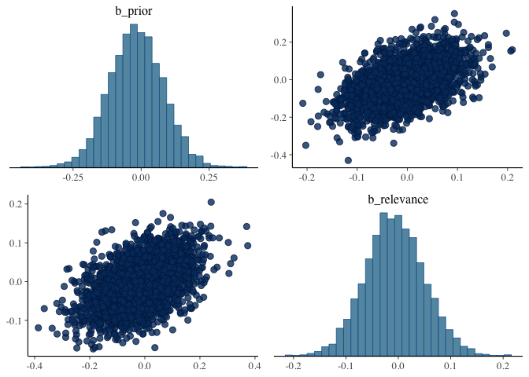<!-- -->

``` r
# some
model_some_rel_comp <- brm(
  bf(target ~ relevance*competence + 
    (1 + relevance*competence || submission_id) +
    (1 | title),
    decomp = "QR"),
  data = d_critical_wide %>% filter(main_type == "some"),
  family = "gaussian",
  cores = 4,
  iter = 3000
)
```

``` r
summary(model_some_rel_comp)
```

    ##  Family: gaussian 
    ##   Links: mu = identity; sigma = identity 
    ## Formula: target ~ relevance * competence + (1 + relevance * competence || submission_id) + (1 | title) 
    ##    Data: d_critical_wide %>% filter(main_type == "some") (Number of observations: 396) 
    ## Samples: 4 chains, each with iter = 3000; warmup = 1500; thin = 1;
    ##          total post-warmup samples = 6000
    ## 
    ## Group-Level Effects: 
    ## ~submission_id (Number of levels: 99) 
    ##                          Estimate Est.Error l-95% CI u-95% CI Rhat Bulk_ESS
    ## sd(Intercept)               10.52      1.72     7.11    13.79 1.00     1920
    ## sd(relevance)                0.04      0.03     0.00     0.10 1.00     1366
    ## sd(competence)               0.03      0.02     0.00     0.08 1.00     2232
    ## sd(relevance:competence)     0.00      0.00     0.00     0.00 1.00     3081
    ##                          Tail_ESS
    ## sd(Intercept)                2490
    ## sd(relevance)                2375
    ## sd(competence)               3146
    ## sd(relevance:competence)     3325
    ## 
    ## ~title (Number of levels: 32) 
    ##               Estimate Est.Error l-95% CI u-95% CI Rhat Bulk_ESS Tail_ESS
    ## sd(Intercept)     8.71      1.90     5.34    12.82 1.00     2446     4013
    ## 
    ## Population-Level Effects: 
    ##                      Estimate Est.Error l-95% CI u-95% CI Rhat Bulk_ESS
    ## Intercept               76.13      5.25    65.91    86.59 1.00     6845
    ## relevance               -0.03      0.07    -0.16     0.10 1.00     8109
    ## competence               0.12      0.08    -0.03     0.26 1.00     8282
    ## relevance:competence     0.00      0.00    -0.00     0.00 1.00     8784
    ##                      Tail_ESS
    ## Intercept                4918
    ## relevance                4945
    ## competence               5146
    ## relevance:competence     5036
    ## 
    ## Family Specific Parameters: 
    ##       Estimate Est.Error l-95% CI u-95% CI Rhat Bulk_ESS Tail_ESS
    ## sigma    19.96      0.90    18.33    21.84 1.00     3847     3786
    ## 
    ## Samples were drawn using sampling(NUTS). For each parameter, Bulk_ESS
    ## and Tail_ESS are effective sample size measures, and Rhat is the potential
    ## scale reduction factor on split chains (at convergence, Rhat = 1).

``` r
bayesplot::mcmc_pairs(model_some_rel_comp, pars = c("b_competence", "b_relevance"))
```

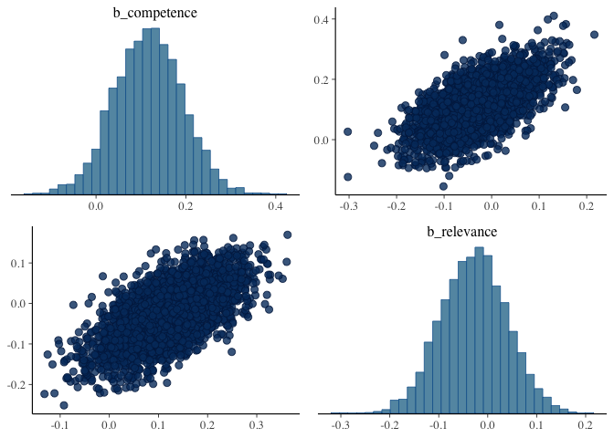<!-- -->

#### Stats on z-scored data

The same stats (full, one predictor, to predictors) on z-scored data:

``` r
# xor, maximal model with interactions and maximal REs on z-scored data
model_xor_zScored <- brm(
  bf(target ~ prior*competence*relevance + 
    (1 + prior + competence + relevance || submission_id) +
    (1 | title),
    decomp = "QR"),
  data = d_critical_zScored_wide %>% filter(main_type == "xor"),
  family = "gaussian",
  cores = 4,
  iter = 3000
)
```

``` r
summary(model_xor_zScored)
```

    ##  Family: gaussian 
    ##   Links: mu = identity; sigma = identity 
    ## Formula: target ~ prior * competence * relevance + (1 + prior + competence + relevance || submission_id) + (1 | title) 
    ##    Data: d_critical_zScored_wide %>% filter(main_type == "x (Number of observations: 396) 
    ## Samples: 4 chains, each with iter = 3000; warmup = 1500; thin = 1;
    ##          total post-warmup samples = 6000
    ## 
    ## Group-Level Effects: 
    ## ~submission_id (Number of levels: 99) 
    ##                Estimate Est.Error l-95% CI u-95% CI Rhat Bulk_ESS Tail_ESS
    ## sd(Intercept)      0.08      0.06     0.00     0.22 1.00     2735     3671
    ## sd(prior)          0.15      0.09     0.01     0.34 1.00     1550     2800
    ## sd(competence)     0.24      0.10     0.03     0.42 1.00     1105     1466
    ## sd(relevance)      0.13      0.08     0.01     0.30 1.00     1810     3051
    ## 
    ## ~title (Number of levels: 32) 
    ##               Estimate Est.Error l-95% CI u-95% CI Rhat Bulk_ESS Tail_ESS
    ## sd(Intercept)     0.36      0.08     0.21     0.53 1.00     1763     3127
    ## 
    ## Population-Level Effects: 
    ##                            Estimate Est.Error l-95% CI u-95% CI Rhat Bulk_ESS
    ## Intercept                     -0.21      0.08    -0.37    -0.04 1.00     4533
    ## prior                         -0.12      0.07    -0.26     0.01 1.00     6083
    ## competence                     0.07      0.07    -0.07     0.21 1.00     6704
    ## relevance                     -0.02      0.06    -0.14     0.11 1.00     7875
    ## prior:competence               0.12      0.07    -0.02     0.26 1.00    10506
    ## prior:relevance                0.04      0.07    -0.10     0.17 1.00     8995
    ## competence:relevance          -0.03      0.06    -0.15     0.09 1.00     8614
    ## prior:competence:relevance    -0.00      0.07    -0.14     0.14 1.00     8770
    ##                            Tail_ESS
    ## Intercept                      4479
    ## prior                          5195
    ## competence                     4125
    ## relevance                      4468
    ## prior:competence               4721
    ## prior:relevance                4629
    ## competence:relevance           4690
    ## prior:competence:relevance     4826
    ## 
    ## Family Specific Parameters: 
    ##       Estimate Est.Error l-95% CI u-95% CI Rhat Bulk_ESS Tail_ESS
    ## sigma     0.84      0.04     0.76     0.93 1.00     2073     3317
    ## 
    ## Samples were drawn using sampling(NUTS). For each parameter, Bulk_ESS
    ## and Tail_ESS are effective sample size measures, and Rhat is the potential
    ## scale reduction factor on split chains (at convergence, Rhat = 1).

``` r
bayesplot::mcmc_pairs(model_xor_zScored, pars = c("b_prior", "b_relevance", "b_competence"))
```

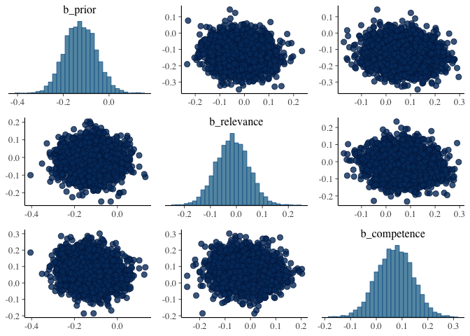<!-- -->

``` r
# some, maximal model with interactions and maximal REs
model_some_zScored <- brm(
  bf(target ~ prior*competence*relevance + 
    (1 + prior + competence + relevance || submission_id) +
    (1 | title),
    decomp = "QR"),
  data = d_critical_zScored_wide %>% filter(main_type == "some"),
  family = "gaussian",
  cores = 4,
  iter = 3000
)
```

``` r
summary(model_some_zScored)
```

    ##  Family: gaussian 
    ##   Links: mu = identity; sigma = identity 
    ## Formula: target ~ prior * competence * relevance + (1 + prior + competence + relevance || submission_id) + (1 | title) 
    ##    Data: d_critical_zScored_wide %>% filter(main_type == "s (Number of observations: 396) 
    ## Samples: 4 chains, each with iter = 3000; warmup = 1500; thin = 1;
    ##          total post-warmup samples = 6000
    ## 
    ## Group-Level Effects: 
    ## ~submission_id (Number of levels: 99) 
    ##                Estimate Est.Error l-95% CI u-95% CI Rhat Bulk_ESS Tail_ESS
    ## sd(Intercept)      0.10      0.07     0.00     0.25 1.00     1955     3128
    ## sd(prior)          0.10      0.06     0.00     0.24 1.00     1827     2365
    ## sd(competence)     0.17      0.08     0.01     0.33 1.00     1168     2067
    ## sd(relevance)      0.07      0.05     0.00     0.19 1.00     2796     3159
    ## 
    ## ~title (Number of levels: 32) 
    ##               Estimate Est.Error l-95% CI u-95% CI Rhat Bulk_ESS Tail_ESS
    ## sd(Intercept)     0.36      0.08     0.22     0.54 1.00     2402     3324
    ## 
    ## Population-Level Effects: 
    ##                            Estimate Est.Error l-95% CI u-95% CI Rhat Bulk_ESS
    ## Intercept                      0.22      0.08     0.06     0.39 1.00     4499
    ## prior                         -0.04      0.05    -0.14     0.05 1.00     7833
    ## competence                     0.13      0.06     0.00     0.25 1.00     7143
    ## relevance                     -0.05      0.06    -0.17     0.07 1.00     7713
    ## prior:competence              -0.08      0.04    -0.17     0.01 1.00     9667
    ## prior:relevance               -0.01      0.04    -0.10     0.08 1.00    10988
    ## competence:relevance           0.02      0.06    -0.09     0.13 1.00     9919
    ## prior:competence:relevance     0.00      0.04    -0.08     0.08 1.00    11424
    ##                            Tail_ESS
    ## Intercept                      4351
    ## prior                          4260
    ## competence                     4837
    ## relevance                      5096
    ## prior:competence               4830
    ## prior:relevance                4819
    ## competence:relevance           5219
    ## prior:competence:relevance     4893
    ## 
    ## Family Specific Parameters: 
    ##       Estimate Est.Error l-95% CI u-95% CI Rhat Bulk_ESS Tail_ESS
    ## sigma     0.82      0.04     0.75     0.90 1.00     3345     4451
    ## 
    ## Samples were drawn using sampling(NUTS). For each parameter, Bulk_ESS
    ## and Tail_ESS are effective sample size measures, and Rhat is the potential
    ## scale reduction factor on split chains (at convergence, Rhat = 1).

``` r
bayesplot::mcmc_pairs(model_some_zScored, pars = c("b_prior", "b_relevance", "b_competence"))
```

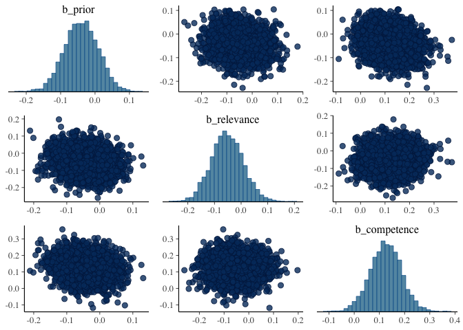<!-- -->

#### Smaller models with z-scored data

``` r
# xor
model_xor_zScored_prior <- brm(
  bf(target ~ prior + 
    (1 + prior | submission_id) +
    (1 | title),
    decomp = "QR"),
  data = d_critical_zScored_wide %>% filter(main_type == "xor"),
  family = "gaussian",
  cores = 4,
  iter = 3000
)
```

``` r
summary(model_xor_zScored_prior)
```

    ##  Family: gaussian 
    ##   Links: mu = identity; sigma = identity 
    ## Formula: target ~ prior + (1 + prior | submission_id) + (1 | title) 
    ##    Data: d_critical_zScored_wide %>% filter(main_type == "x (Number of observations: 396) 
    ## Samples: 4 chains, each with iter = 3000; warmup = 1500; thin = 1;
    ##          total post-warmup samples = 6000
    ## 
    ## Group-Level Effects: 
    ## ~submission_id (Number of levels: 99) 
    ##                      Estimate Est.Error l-95% CI u-95% CI Rhat Bulk_ESS
    ## sd(Intercept)            0.08      0.06     0.00     0.21 1.00     2893
    ## sd(prior)                0.15      0.09     0.01     0.34 1.00     1483
    ## cor(Intercept,prior)    -0.08      0.56    -0.96     0.92 1.00     2353
    ##                      Tail_ESS
    ## sd(Intercept)            3612
    ## sd(prior)                2659
    ## cor(Intercept,prior)     3133
    ## 
    ## ~title (Number of levels: 32) 
    ##               Estimate Est.Error l-95% CI u-95% CI Rhat Bulk_ESS Tail_ESS
    ## sd(Intercept)     0.38      0.08     0.24     0.55 1.00     2269     3199
    ## 
    ## Population-Level Effects: 
    ##           Estimate Est.Error l-95% CI u-95% CI Rhat Bulk_ESS Tail_ESS
    ## Intercept    -0.20      0.08    -0.37    -0.04 1.00     3346     3841
    ## prior        -0.11      0.07    -0.24     0.02 1.00     5968     4362
    ## 
    ## Family Specific Parameters: 
    ##       Estimate Est.Error l-95% CI u-95% CI Rhat Bulk_ESS Tail_ESS
    ## sigma     0.88      0.04     0.81     0.95 1.00     4457     4464
    ## 
    ## Samples were drawn using sampling(NUTS). For each parameter, Bulk_ESS
    ## and Tail_ESS are effective sample size measures, and Rhat is the potential
    ## scale reduction factor on split chains (at convergence, Rhat = 1).

``` r
# xor
model_xor_zScored_comp <- brm(
  bf(target ~ competence + 
    (1 + competence | submission_id) +
    (1 | title),
    decomp = "QR"),
  data = d_critical_zScored_wide %>% filter(main_type == "xor"),
  family = "gaussian",
  cores = 4,
  iter = 3000
)
```

``` r
summary(model_xor_zScored_comp)
```

    ##  Family: gaussian 
    ##   Links: mu = identity; sigma = identity 
    ## Formula: target ~ competence + (1 + competence | submission_id) + (1 | title) 
    ##    Data: d_critical_zScored_wide %>% filter(main_type == "x (Number of observations: 396) 
    ## Samples: 4 chains, each with iter = 3000; warmup = 1500; thin = 1;
    ##          total post-warmup samples = 6000
    ## 
    ## Group-Level Effects: 
    ## ~submission_id (Number of levels: 99) 
    ##                           Estimate Est.Error l-95% CI u-95% CI Rhat Bulk_ESS
    ## sd(Intercept)                 0.08      0.06     0.00     0.22 1.00     2212
    ## sd(competence)                0.25      0.10     0.03     0.43 1.00      977
    ## cor(Intercept,competence)    -0.21      0.54    -0.97     0.89 1.01     1028
    ##                           Tail_ESS
    ## sd(Intercept)                 3027
    ## sd(competence)                1318
    ## cor(Intercept,competence)     2239
    ## 
    ## ~title (Number of levels: 32) 
    ##               Estimate Est.Error l-95% CI u-95% CI Rhat Bulk_ESS Tail_ESS
    ## sd(Intercept)     0.40      0.08     0.25     0.56 1.00     2756     3645
    ## 
    ## Population-Level Effects: 
    ##            Estimate Est.Error l-95% CI u-95% CI Rhat Bulk_ESS Tail_ESS
    ## Intercept     -0.23      0.09    -0.40    -0.06 1.00     3276     4214
    ## competence     0.07      0.07    -0.06     0.20 1.00     7415     5422
    ## 
    ## Family Specific Parameters: 
    ##       Estimate Est.Error l-95% CI u-95% CI Rhat Bulk_ESS Tail_ESS
    ## sigma     0.86      0.04     0.79     0.94 1.00     3298     4656
    ## 
    ## Samples were drawn using sampling(NUTS). For each parameter, Bulk_ESS
    ## and Tail_ESS are effective sample size measures, and Rhat is the potential
    ## scale reduction factor on split chains (at convergence, Rhat = 1).

``` r
# xor
model_xor_zScored_rel <- brm(
  bf(target ~ relevance + 
    (1 + relevance | submission_id) +
    (1 | title),
    decomp = "QR"),
  data = d_critical_zScored_wide %>% filter(main_type == "xor"),
  family = "gaussian",
  cores = 4,
  iter = 3000
)
```

``` r
summary(model_xor_zScored_rel)
```

    ##  Family: gaussian 
    ##   Links: mu = identity; sigma = identity 
    ## Formula: target ~ relevance + (1 + relevance | submission_id) + (1 | title) 
    ##    Data: d_critical_zScored_wide %>% filter(main_type == "x (Number of observations: 396) 
    ## Samples: 4 chains, each with iter = 3000; warmup = 1500; thin = 1;
    ##          total post-warmup samples = 6000
    ## 
    ## Group-Level Effects: 
    ## ~submission_id (Number of levels: 99) 
    ##                          Estimate Est.Error l-95% CI u-95% CI Rhat Bulk_ESS
    ## sd(Intercept)                0.08      0.06     0.00     0.22 1.00     2494
    ## sd(relevance)                0.14      0.09     0.01     0.32 1.00     1524
    ## cor(Intercept,relevance)     0.06      0.58    -0.93     0.95 1.00     1715
    ##                          Tail_ESS
    ## sd(Intercept)                3011
    ## sd(relevance)                2925
    ## cor(Intercept,relevance)     2936
    ## 
    ## ~title (Number of levels: 32) 
    ##               Estimate Est.Error l-95% CI u-95% CI Rhat Bulk_ESS Tail_ESS
    ## sd(Intercept)     0.41      0.08     0.27     0.58 1.00     2229     3685
    ## 
    ## Population-Level Effects: 
    ##           Estimate Est.Error l-95% CI u-95% CI Rhat Bulk_ESS Tail_ESS
    ## Intercept    -0.22      0.09    -0.40    -0.05 1.00     2626     3503
    ## relevance     0.01      0.06    -0.12     0.13 1.00     5193     4386
    ## 
    ## Family Specific Parameters: 
    ##       Estimate Est.Error l-95% CI u-95% CI Rhat Bulk_ESS Tail_ESS
    ## sigma     0.88      0.03     0.82     0.95 1.00     5073     3888
    ## 
    ## Samples were drawn using sampling(NUTS). For each parameter, Bulk_ESS
    ## and Tail_ESS are effective sample size measures, and Rhat is the potential
    ## scale reduction factor on split chains (at convergence, Rhat = 1).

``` r
# some
model_some_zScored_rel <- brm(
  bf(target ~ relevance + 
    (1 + relevance | submission_id) +
    (1 | title),
    decomp = "QR"),
  data = d_critical_zScored_wide %>% filter(main_type == "some"),
  family = "gaussian",
  cores = 4,
  iter = 3000
)
```

``` r
summary(model_some_zScored_rel)
```

    ##  Family: gaussian 
    ##   Links: mu = identity; sigma = identity 
    ## Formula: target ~ relevance + (1 + relevance | submission_id) + (1 | title) 
    ##    Data: d_critical_zScored_wide %>% filter(main_type == "s (Number of observations: 396) 
    ## Samples: 4 chains, each with iter = 3000; warmup = 1500; thin = 1;
    ##          total post-warmup samples = 6000
    ## 
    ## Group-Level Effects: 
    ## ~submission_id (Number of levels: 99) 
    ##                          Estimate Est.Error l-95% CI u-95% CI Rhat Bulk_ESS
    ## sd(Intercept)                0.09      0.06     0.00     0.24 1.00     1841
    ## sd(relevance)                0.06      0.05     0.00     0.18 1.00     2725
    ## cor(Intercept,relevance)     0.02      0.58    -0.94     0.95 1.00     4080
    ##                          Tail_ESS
    ## sd(Intercept)                2160
    ## sd(relevance)                2873
    ## cor(Intercept,relevance)     3782
    ## 
    ## ~title (Number of levels: 32) 
    ##               Estimate Est.Error l-95% CI u-95% CI Rhat Bulk_ESS Tail_ESS
    ## sd(Intercept)     0.46      0.08     0.33     0.62 1.00     2243     3536
    ## 
    ## Population-Level Effects: 
    ##           Estimate Est.Error l-95% CI u-95% CI Rhat Bulk_ESS Tail_ESS
    ## Intercept     0.21      0.09     0.03     0.39 1.00     1754     3214
    ## relevance    -0.04      0.06    -0.15     0.07 1.00     4754     3999
    ## 
    ## Family Specific Parameters: 
    ##       Estimate Est.Error l-95% CI u-95% CI Rhat Bulk_ESS Tail_ESS
    ## sigma     0.84      0.03     0.78     0.91 1.00     5125     4080
    ## 
    ## Samples were drawn using sampling(NUTS). For each parameter, Bulk_ESS
    ## and Tail_ESS are effective sample size measures, and Rhat is the potential
    ## scale reduction factor on split chains (at convergence, Rhat = 1).

``` r
# some
model_some_zScored_prior <- brm(
  bf(target ~ prior + 
    (1 + prior | submission_id) +
    (1 | title),
    decomp = "QR"),
  data = d_critical_zScored_wide %>% filter(main_type == "some"),
  family = "gaussian",
  cores = 4,
  iter = 3000
)
```

``` r
summary(model_some_zScored_prior)
```

    ##  Family: gaussian 
    ##   Links: mu = identity; sigma = identity 
    ## Formula: target ~ prior + (1 + prior | submission_id) + (1 | title) 
    ##    Data: d_critical_zScored_wide %>% filter(main_type == "s (Number of observations: 396) 
    ## Samples: 4 chains, each with iter = 3000; warmup = 1500; thin = 1;
    ##          total post-warmup samples = 6000
    ## 
    ## Group-Level Effects: 
    ## ~submission_id (Number of levels: 99) 
    ##                      Estimate Est.Error l-95% CI u-95% CI Rhat Bulk_ESS
    ## sd(Intercept)            0.10      0.07     0.00     0.25 1.00     2127
    ## sd(prior)                0.11      0.07     0.01     0.26 1.00     1565
    ## cor(Intercept,prior)     0.21      0.57    -0.91     0.98 1.00     2221
    ##                      Tail_ESS
    ## sd(Intercept)            3131
    ## sd(prior)                3217
    ## cor(Intercept,prior)     3802
    ## 
    ## ~title (Number of levels: 32) 
    ##               Estimate Est.Error l-95% CI u-95% CI Rhat Bulk_ESS Tail_ESS
    ## sd(Intercept)     0.46      0.08     0.33     0.64 1.00     2621     4123
    ## 
    ## Population-Level Effects: 
    ##           Estimate Est.Error l-95% CI u-95% CI Rhat Bulk_ESS Tail_ESS
    ## Intercept     0.21      0.09     0.02     0.40 1.00     2932     3767
    ## prior        -0.01      0.05    -0.10     0.08 1.00     9036     5252
    ## 
    ## Family Specific Parameters: 
    ##       Estimate Est.Error l-95% CI u-95% CI Rhat Bulk_ESS Tail_ESS
    ## sigma     0.84      0.03     0.77     0.90 1.00     5384     4575
    ## 
    ## Samples were drawn using sampling(NUTS). For each parameter, Bulk_ESS
    ## and Tail_ESS are effective sample size measures, and Rhat is the potential
    ## scale reduction factor on split chains (at convergence, Rhat = 1).

``` r
# some
model_some_zScored_comp <- brm(
  bf(target ~ competence + 
    (1 + competence | submission_id) +
    (1 | title),
    decomp = "QR"),
  data = d_critical_zScored_wide %>% filter(main_type == "some"),
  family = "gaussian",
  cores = 4,
  iter = 3000
)
```

``` r
summary(model_some_zScored_comp)
```

    ##  Family: gaussian 
    ##   Links: mu = identity; sigma = identity 
    ## Formula: target ~ competence + (1 + competence | submission_id) + (1 | title) 
    ##    Data: d_critical_zScored_wide %>% filter(main_type == "s (Number of observations: 396) 
    ## Samples: 4 chains, each with iter = 3000; warmup = 1500; thin = 1;
    ##          total post-warmup samples = 6000
    ## 
    ## Group-Level Effects: 
    ## ~submission_id (Number of levels: 99) 
    ##                           Estimate Est.Error l-95% CI u-95% CI Rhat Bulk_ESS
    ## sd(Intercept)                 0.15      0.08     0.01     0.30 1.00     1046
    ## sd(competence)                0.21      0.07     0.04     0.34 1.01     1263
    ## cor(Intercept,competence)    -0.62      0.38    -0.99     0.53 1.00     1097
    ##                           Tail_ESS
    ## sd(Intercept)                 1259
    ## sd(competence)                1253
    ## cor(Intercept,competence)     1187
    ## 
    ## ~title (Number of levels: 32) 
    ##               Estimate Est.Error l-95% CI u-95% CI Rhat Bulk_ESS Tail_ESS
    ## sd(Intercept)     0.38      0.08     0.25     0.55 1.00     2106     4054
    ## 
    ## Population-Level Effects: 
    ##            Estimate Est.Error l-95% CI u-95% CI Rhat Bulk_ESS Tail_ESS
    ## Intercept      0.22      0.08     0.05     0.38 1.00     2647     3477
    ## competence     0.15      0.06     0.04     0.27 1.00     4104     4151
    ## 
    ## Family Specific Parameters: 
    ##       Estimate Est.Error l-95% CI u-95% CI Rhat Bulk_ESS Tail_ESS
    ## sigma     0.81      0.04     0.74     0.88 1.00     1839     3939
    ## 
    ## Samples were drawn using sampling(NUTS). For each parameter, Bulk_ESS
    ## and Tail_ESS are effective sample size measures, and Rhat is the potential
    ## scale reduction factor on split chains (at convergence, Rhat = 1).

With two predictors:

``` r
# xor
model_xor_zScored_pri_comp <- brm(
  bf(target ~ prior*competence + 
    (1 + prior*competence || submission_id) +
    (1 | title),
    decomp = "QR"),
  data = d_critical_zScored_wide %>% filter(main_type == "xor"),
  family = "gaussian",
  cores = 4,
  iter = 3000
)
```

``` r
summary(model_xor_zScored_pri_comp)
```

    ##  Family: gaussian 
    ##   Links: mu = identity; sigma = identity 
    ## Formula: target ~ prior * competence + (1 + prior * competence || submission_id) + (1 | title) 
    ##    Data: d_critical_zScored_wide %>% filter(main_type == "x (Number of observations: 396) 
    ## Samples: 4 chains, each with iter = 3000; warmup = 1500; thin = 1;
    ##          total post-warmup samples = 6000
    ## 
    ## Group-Level Effects: 
    ## ~submission_id (Number of levels: 99) 
    ##                      Estimate Est.Error l-95% CI u-95% CI Rhat Bulk_ESS
    ## sd(Intercept)            0.08      0.06     0.00     0.22 1.00     2337
    ## sd(prior)                0.14      0.09     0.01     0.33 1.00     1771
    ## sd(competence)           0.23      0.10     0.02     0.42 1.00     1043
    ## sd(prior:competence)     0.18      0.11     0.01     0.42 1.01     1326
    ##                      Tail_ESS
    ## sd(Intercept)            3085
    ## sd(prior)                3106
    ## sd(competence)           1353
    ## sd(prior:competence)     2805
    ## 
    ## ~title (Number of levels: 32) 
    ##               Estimate Est.Error l-95% CI u-95% CI Rhat Bulk_ESS Tail_ESS
    ## sd(Intercept)     0.35      0.08     0.20     0.53 1.00     2228     3324
    ## 
    ## Population-Level Effects: 
    ##                  Estimate Est.Error l-95% CI u-95% CI Rhat Bulk_ESS Tail_ESS
    ## Intercept           -0.21      0.08    -0.37    -0.05 1.00     3807     3755
    ## prior               -0.13      0.07    -0.26    -0.00 1.00     6194     4372
    ## competence           0.08      0.07    -0.05     0.21 1.00     6464     5021
    ## prior:competence     0.13      0.07    -0.01     0.27 1.00     8717     4626
    ## 
    ## Family Specific Parameters: 
    ##       Estimate Est.Error l-95% CI u-95% CI Rhat Bulk_ESS Tail_ESS
    ## sigma     0.84      0.04     0.77     0.92 1.00     2281     3323
    ## 
    ## Samples were drawn using sampling(NUTS). For each parameter, Bulk_ESS
    ## and Tail_ESS are effective sample size measures, and Rhat is the potential
    ## scale reduction factor on split chains (at convergence, Rhat = 1).

``` r
bayesplot::mcmc_pairs(model_xor_zScored_pri_comp, pars = c("b_prior", "b_competence"))
```

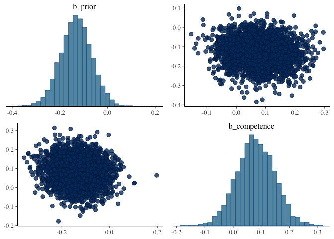<!-- -->

``` r
# xor
model_xor_zScored_pri_rel <- brm(
  bf(target ~ prior*relevance + 
    (1 + prior*relevance || submission_id) +
    (1 | title),
    decomp = "QR"),
  data = d_critical_zScored_wide %>% filter(main_type == "xor"),
  family = "gaussian",
  cores = 4,
  iter = 3000
)
```

``` r
summary(model_xor_zScored_pri_rel)
```

    ##  Family: gaussian 
    ##   Links: mu = identity; sigma = identity 
    ## Formula: target ~ prior * relevance + (1 + prior * relevance || submission_id) + (1 | title) 
    ##    Data: d_critical_zScored_wide %>% filter(main_type == "x (Number of observations: 396) 
    ## Samples: 4 chains, each with iter = 3000; warmup = 1500; thin = 1;
    ##          total post-warmup samples = 6000
    ## 
    ## Group-Level Effects: 
    ## ~submission_id (Number of levels: 99) 
    ##                     Estimate Est.Error l-95% CI u-95% CI Rhat Bulk_ESS Tail_ESS
    ## sd(Intercept)           0.08      0.06     0.00     0.22 1.00     2529     2953
    ## sd(prior)               0.15      0.09     0.01     0.35 1.00     1357     2338
    ## sd(relevance)           0.14      0.09     0.01     0.32 1.00     1741     2977
    ## sd(prior:relevance)     0.15      0.10     0.01     0.36 1.00     1973     3064
    ## 
    ## ~title (Number of levels: 32) 
    ##               Estimate Est.Error l-95% CI u-95% CI Rhat Bulk_ESS Tail_ESS
    ## sd(Intercept)     0.39      0.08     0.24     0.57 1.00     2271     3452
    ## 
    ## Population-Level Effects: 
    ##                 Estimate Est.Error l-95% CI u-95% CI Rhat Bulk_ESS Tail_ESS
    ## Intercept          -0.20      0.09    -0.37    -0.04 1.00     4085     4866
    ## prior              -0.10      0.07    -0.24     0.04 1.00     6806     4720
    ## relevance          -0.00      0.06    -0.13     0.12 1.00     7008     5255
    ## prior:relevance     0.05      0.07    -0.09     0.19 1.00     8180     4359
    ## 
    ## Family Specific Parameters: 
    ##       Estimate Est.Error l-95% CI u-95% CI Rhat Bulk_ESS Tail_ESS
    ## sigma     0.86      0.04     0.79     0.94 1.00     3576     4042
    ## 
    ## Samples were drawn using sampling(NUTS). For each parameter, Bulk_ESS
    ## and Tail_ESS are effective sample size measures, and Rhat is the potential
    ## scale reduction factor on split chains (at convergence, Rhat = 1).

``` r
bayesplot::mcmc_pairs(model_xor_zScored_pri_rel, pars = c("b_prior", "b_relevance"))
```

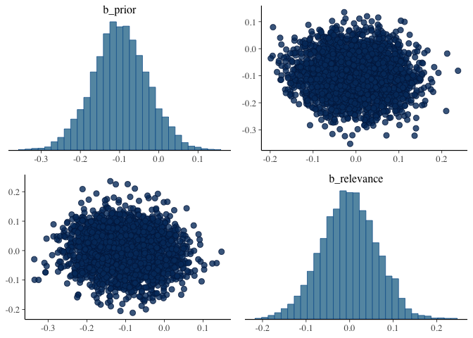<!-- -->

``` r
# xor
model_xor_zScored_rel_comp <- brm(
  bf(target ~ relevance*competence + 
    (1 + relevance*competence || submission_id) +
    (1 | title),
    decomp = "QR"),
  data = d_critical_zScored_wide %>% filter(main_type == "xor"),
  family = "gaussian",
  cores = 4,
  iter = 3000
)
```

``` r
summary(model_xor_zScored_rel_comp)
```

    ##  Family: gaussian 
    ##   Links: mu = identity; sigma = identity 
    ## Formula: target ~ relevance * competence + (1 + relevance * competence || submission_id) + (1 | title) 
    ##    Data: d_critical_zScored_wide %>% filter(main_type == "x (Number of observations: 396) 
    ## Samples: 4 chains, each with iter = 3000; warmup = 1500; thin = 1;
    ##          total post-warmup samples = 6000
    ## 
    ## Group-Level Effects: 
    ## ~submission_id (Number of levels: 99) 
    ##                          Estimate Est.Error l-95% CI u-95% CI Rhat Bulk_ESS
    ## sd(Intercept)                0.08      0.06     0.00     0.22 1.00     2463
    ## sd(relevance)                0.13      0.08     0.01     0.30 1.00     1835
    ## sd(competence)               0.24      0.10     0.03     0.43 1.00     1145
    ## sd(relevance:competence)     0.10      0.08     0.00     0.28 1.00     2130
    ##                          Tail_ESS
    ## sd(Intercept)                3433
    ## sd(relevance)                2868
    ## sd(competence)               1634
    ## sd(relevance:competence)     2878
    ## 
    ## ~title (Number of levels: 32) 
    ##               Estimate Est.Error l-95% CI u-95% CI Rhat Bulk_ESS Tail_ESS
    ## sd(Intercept)     0.40      0.08     0.26     0.57 1.00     2504     3551
    ## 
    ## Population-Level Effects: 
    ##                      Estimate Est.Error l-95% CI u-95% CI Rhat Bulk_ESS
    ## Intercept               -0.23      0.09    -0.40    -0.06 1.00     4346
    ## relevance               -0.00      0.07    -0.13     0.12 1.00     7918
    ## competence               0.06      0.07    -0.08     0.20 1.00     7020
    ## relevance:competence    -0.03      0.06    -0.15     0.09 1.00     5774
    ##                      Tail_ESS
    ## Intercept                4050
    ## relevance                5272
    ## competence               4523
    ## relevance:competence     4273
    ## 
    ## Family Specific Parameters: 
    ##       Estimate Est.Error l-95% CI u-95% CI Rhat Bulk_ESS Tail_ESS
    ## sigma     0.85      0.04     0.77     0.93 1.00     2888     3412
    ## 
    ## Samples were drawn using sampling(NUTS). For each parameter, Bulk_ESS
    ## and Tail_ESS are effective sample size measures, and Rhat is the potential
    ## scale reduction factor on split chains (at convergence, Rhat = 1).

``` r
bayesplot::mcmc_pairs(model_xor_zScored_rel_comp, pars = c("b_relevance", "b_competence"))
```

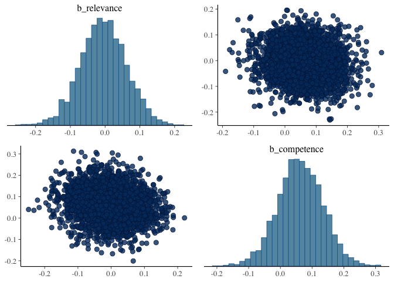<!-- -->

``` r
# some
model_some_zScored_pri_comp <- brm(
  bf(target ~ prior*competence + 
    (1 + prior*competence || submission_id) +
    (1 | title),
    decomp = "QR"),
  data = d_critical_zScored_wide %>% filter(main_type == "some"),
  family = "gaussian",
  cores = 4,
  iter = 3000
)
```

``` r
summary(model_some_zScored_pri_comp)
```

    ##  Family: gaussian 
    ##   Links: mu = identity; sigma = identity 
    ## Formula: target ~ prior * competence + (1 + prior * competence || submission_id) + (1 | title) 
    ##    Data: d_critical_zScored_wide %>% filter(main_type == "s (Number of observations: 396) 
    ## Samples: 4 chains, each with iter = 3000; warmup = 1500; thin = 1;
    ##          total post-warmup samples = 6000
    ## 
    ## Group-Level Effects: 
    ## ~submission_id (Number of levels: 99) 
    ##                      Estimate Est.Error l-95% CI u-95% CI Rhat Bulk_ESS
    ## sd(Intercept)            0.09      0.07     0.00     0.24 1.00     1416
    ## sd(prior)                0.09      0.06     0.00     0.22 1.00     1773
    ## sd(competence)           0.15      0.08     0.01     0.32 1.01     1009
    ## sd(prior:competence)     0.12      0.07     0.01     0.26 1.00     1018
    ##                      Tail_ESS
    ## sd(Intercept)            2320
    ## sd(prior)                2741
    ## sd(competence)           1871
    ## sd(prior:competence)     2227
    ## 
    ## ~title (Number of levels: 32) 
    ##               Estimate Est.Error l-95% CI u-95% CI Rhat Bulk_ESS Tail_ESS
    ## sd(Intercept)     0.37      0.08     0.23     0.53 1.00     2146     3061
    ## 
    ## Population-Level Effects: 
    ##                  Estimate Est.Error l-95% CI u-95% CI Rhat Bulk_ESS Tail_ESS
    ## Intercept            0.21      0.08     0.05     0.37 1.00     3101     4097
    ## prior               -0.04      0.05    -0.13     0.05 1.00     6087     4579
    ## competence           0.13      0.06     0.01     0.25 1.00     5357     4785
    ## prior:competence    -0.08      0.04    -0.17     0.01 1.00     7692     4864
    ## 
    ## Family Specific Parameters: 
    ##       Estimate Est.Error l-95% CI u-95% CI Rhat Bulk_ESS Tail_ESS
    ## sigma     0.81      0.04     0.74     0.88 1.00     2533     4366
    ## 
    ## Samples were drawn using sampling(NUTS). For each parameter, Bulk_ESS
    ## and Tail_ESS are effective sample size measures, and Rhat is the potential
    ## scale reduction factor on split chains (at convergence, Rhat = 1).

``` r
bayesplot::mcmc_pairs(model_some_zScored_pri_comp, pars = c("b_prior", "b_competence"))
```

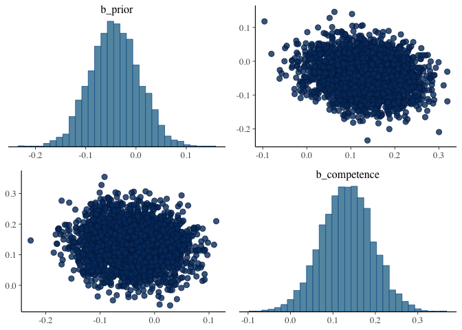<!-- -->

``` r
# some
model_some_zScored_pri_rel <- brm(
  bf(target ~ prior*relevance + 
    (1 + prior*relevance || submission_id) +
    (1 | title),
    decomp = "QR"),
  data = d_critical_zScored_wide %>% filter(main_type == "some"),
  family = "gaussian",
  cores = 4,
  iter = 3000
)
```

``` r
summary(model_some_zScored_pri_rel)
```

    ##  Family: gaussian 
    ##   Links: mu = identity; sigma = identity 
    ## Formula: target ~ prior * relevance + (1 + prior * relevance || submission_id) + (1 | title) 
    ##    Data: d_critical_zScored_wide %>% filter(main_type == "s (Number of observations: 396) 
    ## Samples: 4 chains, each with iter = 3000; warmup = 1500; thin = 1;
    ##          total post-warmup samples = 6000
    ## 
    ## Group-Level Effects: 
    ## ~submission_id (Number of levels: 99) 
    ##                     Estimate Est.Error l-95% CI u-95% CI Rhat Bulk_ESS Tail_ESS
    ## sd(Intercept)           0.09      0.07     0.00     0.24 1.00     2187     3101
    ## sd(prior)               0.11      0.07     0.01     0.24 1.00     1953     2768
    ## sd(relevance)           0.06      0.05     0.00     0.18 1.00     3612     3532
    ## sd(prior:relevance)     0.10      0.06     0.00     0.23 1.00     1814     3304
    ## 
    ## ~title (Number of levels: 32) 
    ##               Estimate Est.Error l-95% CI u-95% CI Rhat Bulk_ESS Tail_ESS
    ## sd(Intercept)     0.46      0.08     0.32     0.64 1.00     2682     3830
    ## 
    ## Population-Level Effects: 
    ##                 Estimate Est.Error l-95% CI u-95% CI Rhat Bulk_ESS Tail_ESS
    ## Intercept           0.21      0.10     0.01     0.40 1.00     3308     4492
    ## prior              -0.02      0.05    -0.11     0.08 1.00     9196     4585
    ## relevance          -0.04      0.06    -0.16     0.08 1.00     8202     4626
    ## prior:relevance    -0.00      0.05    -0.09     0.09 1.00    10192     4750
    ## 
    ## Family Specific Parameters: 
    ##       Estimate Est.Error l-95% CI u-95% CI Rhat Bulk_ESS Tail_ESS
    ## sigma     0.83      0.04     0.76     0.90 1.00     4449     4377
    ## 
    ## Samples were drawn using sampling(NUTS). For each parameter, Bulk_ESS
    ## and Tail_ESS are effective sample size measures, and Rhat is the potential
    ## scale reduction factor on split chains (at convergence, Rhat = 1).

``` r
bayesplot::mcmc_pairs(model_some_zScored_pri_rel, pars = c("b_prior", "b_relevance"))
```

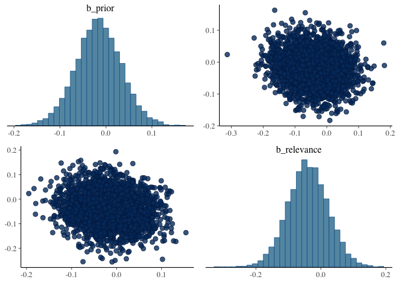<!-- -->

``` r
# some
model_some_zScored_rel_comp <- brm(
  bf(target ~ relevance*competence + 
    (1 + relevance*competence || submission_id) +
    (1 | title),
    decomp = "QR"),
  data = d_critical_zScored_wide %>% filter(main_type == "some"),
  family = "gaussian",
  cores = 4,
  iter = 3000
)
```

``` r
summary(model_some_zScored_rel_comp)
```

    ##  Family: gaussian 
    ##   Links: mu = identity; sigma = identity 
    ## Formula: target ~ relevance * competence + (1 + relevance * competence || submission_id) + (1 | title) 
    ##    Data: d_critical_zScored_wide %>% filter(main_type == "s (Number of observations: 396) 
    ## Samples: 4 chains, each with iter = 3000; warmup = 1500; thin = 1;
    ##          total post-warmup samples = 6000
    ## 
    ## Group-Level Effects: 
    ## ~submission_id (Number of levels: 99) 
    ##                          Estimate Est.Error l-95% CI u-95% CI Rhat Bulk_ESS
    ## sd(Intercept)                0.10      0.07     0.00     0.25 1.00     1689
    ## sd(relevance)                0.06      0.05     0.00     0.18 1.00     2362
    ## sd(competence)               0.16      0.09     0.01     0.32 1.00     1043
    ## sd(relevance:competence)     0.11      0.07     0.01     0.27 1.00     1337
    ##                          Tail_ESS
    ## sd(Intercept)                2250
    ## sd(relevance)                2688
    ## sd(competence)               1834
    ## sd(relevance:competence)     2483
    ## 
    ## ~title (Number of levels: 32) 
    ##               Estimate Est.Error l-95% CI u-95% CI Rhat Bulk_ESS Tail_ESS
    ## sd(Intercept)     0.37      0.08     0.24     0.54 1.00     1794     3291
    ## 
    ## Population-Level Effects: 
    ##                      Estimate Est.Error l-95% CI u-95% CI Rhat Bulk_ESS
    ## Intercept                0.22      0.08     0.06     0.39 1.00     2480
    ## relevance               -0.04      0.06    -0.15     0.07 1.00     5877
    ## competence               0.15      0.06     0.04     0.27 1.00     4959
    ## relevance:competence     0.02      0.05    -0.08     0.12 1.00     5484
    ##                      Tail_ESS
    ## Intercept                3899
    ## relevance                4488
    ## competence               4160
    ## relevance:competence     4299
    ## 
    ## Family Specific Parameters: 
    ##       Estimate Est.Error l-95% CI u-95% CI Rhat Bulk_ESS Tail_ESS
    ## sigma     0.82      0.04     0.75     0.89 1.00     2649     3568
    ## 
    ## Samples were drawn using sampling(NUTS). For each parameter, Bulk_ESS
    ## and Tail_ESS are effective sample size measures, and Rhat is the potential
    ## scale reduction factor on split chains (at convergence, Rhat = 1).

``` r
bayesplot::mcmc_pairs(model_some_zScored_rel_comp, pars = c("b_relevance", "b_competence"))
```

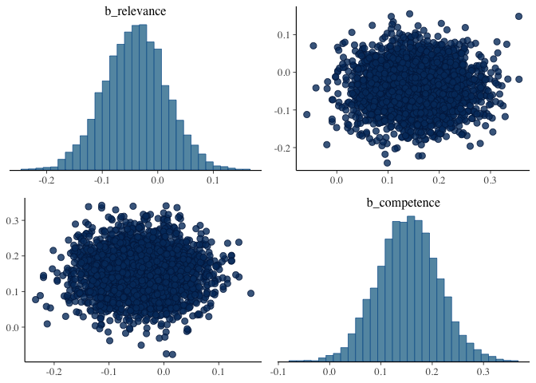<!-- -->

#### Stats with dichotomized predictors

Maximal model on raw inference ratings, using anticipated binary
categorization of items as predictors

``` r
d_critical_long %>% 
  select(submission_id, title, main_type, block_extended, response, prior_class, class_condition) %>% 
  unique() %>% 
  pivot_wider(
    names_from = class_condition, 
    values_from = prior_class
  )  %>%
  mutate(relevance = factor(relevance, levels = c(1, 0)),
         competence = factor(competence, levels = c(1, 0)),
         prior = factor(prior, levels = c(1, 0))) %>% 
  filter(block_extended == "target") -> d_critical_wide_cat
# sum code predictors
# low prior: -1, high prior:: 1 
contrasts(d_critical_wide_cat$prior) <- contr.sum(2)
# low comp : -1, high comp : 1
contrasts(d_critical_wide_cat$competence) <- contr.sum(2)
# low rel: -1, high rel: 1
contrasts(d_critical_wide_cat$relevance) <- contr.sum(2)

# xor, maximal model with interactions and maximal REs
model_xor_cat <- brm(
  bf(response ~ prior*competence*relevance + 
    (1 + prior + competence + relevance || submission_id) +
    (1 | title),
    decomp = "QR"),
  data = d_critical_wide_cat %>% filter(main_type == "xor"),
  family = "gaussian",
  cores = 4,
  iter = 3000
)
```

``` r
summary(model_xor_cat)
```

    ##  Family: gaussian 
    ##   Links: mu = identity; sigma = identity 
    ## Formula: response ~ prior * competence * relevance + (1 + prior + competence + relevance || submission_id) + (1 | title) 
    ##    Data: d_critical_wide_cat %>% filter(main_type == "xor") (Number of observations: 396) 
    ## Samples: 4 chains, each with iter = 3000; warmup = 1500; thin = 1;
    ##          total post-warmup samples = 6000
    ## 
    ## Group-Level Effects: 
    ## ~submission_id (Number of levels: 99) 
    ##                 Estimate Est.Error l-95% CI u-95% CI Rhat Bulk_ESS Tail_ESS
    ## sd(Intercept)      20.69      2.03    16.90    24.90 1.00     2219     3893
    ## sd(prior1)          5.29      2.67     0.38    10.20 1.00      876     1486
    ## sd(competence1)     7.24      2.71     0.98    11.88 1.00      816      927
    ## sd(relevance1)      2.83      1.94     0.13     7.03 1.00     1556     3062
    ## 
    ## ~title (Number of levels: 32) 
    ##               Estimate Est.Error l-95% CI u-95% CI Rhat Bulk_ESS Tail_ESS
    ## sd(Intercept)     8.03      2.81     2.27    13.76 1.00     1317     1163
    ## 
    ## Population-Level Effects: 
    ##                               Estimate Est.Error l-95% CI u-95% CI Rhat
    ## Intercept                        67.76      2.77    62.15    73.00 1.00
    ## prior1                           -2.06      2.04    -6.16     1.82 1.00
    ## competence1                       3.42      2.10    -0.77     7.52 1.00
    ## relevance1                       -0.36      2.01    -4.15     3.80 1.00
    ## prior1:competence1                0.06      2.02    -3.95     3.98 1.00
    ## prior1:relevance1                 2.94      2.03    -1.01     6.99 1.00
    ## competence1:relevance1            4.06      2.03     0.16     8.31 1.00
    ## prior1:competence1:relevance1    -2.76      2.03    -6.80     1.23 1.00
    ##                               Bulk_ESS Tail_ESS
    ## Intercept                         2266     4217
    ## prior1                            4275     4302
    ## competence1                       4329     3976
    ## relevance1                        4347     3933
    ## prior1:competence1                4368     4116
    ## prior1:relevance1                 4248     4140
    ## competence1:relevance1            4246     3651
    ## prior1:competence1:relevance1     4653     4063
    ## 
    ## Family Specific Parameters: 
    ##       Estimate Est.Error l-95% CI u-95% CI Rhat Bulk_ESS Tail_ESS
    ## sigma    22.77      1.45    20.01    25.65 1.00      969     2022
    ## 
    ## Samples were drawn using sampling(NUTS). For each parameter, Bulk_ESS
    ## and Tail_ESS are effective sample size measures, and Rhat is the potential
    ## scale reduction factor on split chains (at convergence, Rhat = 1).

We test the following hypotheses for the categorical predictors models
(identical for both or and some): H1: For higher prior of the stronger
alternative being true, the inference strength is lower H2: For higher
speaker comptence, the inference strength is higher H3: For higher
listener relevance, the inference strength is higher

``` r
# xor
# test H1
hypothesis(model_xor_cat, "prior1 < 0")
```

    ## Hypothesis Tests for class b:
    ##     Hypothesis Estimate Est.Error CI.Lower CI.Upper Evid.Ratio Post.Prob Star
    ## 1 (prior1) < 0    -2.06      2.04    -5.42     1.17       5.67      0.85     
    ## ---
    ## 'CI': 90%-CI for one-sided and 95%-CI for two-sided hypotheses.
    ## '*': For one-sided hypotheses, the posterior probability exceeds 95%;
    ## for two-sided hypotheses, the value tested against lies outside the 95%-CI.
    ## Posterior probabilities of point hypotheses assume equal prior probabilities.

``` r
# test H2
hypothesis(model_xor_cat, "competence1 > 0")
```

    ## Hypothesis Tests for class b:
    ##          Hypothesis Estimate Est.Error CI.Lower CI.Upper Evid.Ratio Post.Prob
    ## 1 (competence1) > 0     3.42       2.1    -0.08     6.78      17.46      0.95
    ##   Star
    ## 1     
    ## ---
    ## 'CI': 90%-CI for one-sided and 95%-CI for two-sided hypotheses.
    ## '*': For one-sided hypotheses, the posterior probability exceeds 95%;
    ## for two-sided hypotheses, the value tested against lies outside the 95%-CI.
    ## Posterior probabilities of point hypotheses assume equal prior probabilities.

``` r
# test H3
hypothesis(model_xor_cat, "relevance1 > 0")
```

    ## Hypothesis Tests for class b:
    ##         Hypothesis Estimate Est.Error CI.Lower CI.Upper Evid.Ratio Post.Prob
    ## 1 (relevance1) > 0    -0.36      2.01    -3.52     2.91       0.73      0.42
    ##   Star
    ## 1     
    ## ---
    ## 'CI': 90%-CI for one-sided and 95%-CI for two-sided hypotheses.
    ## '*': For one-sided hypotheses, the posterior probability exceeds 95%;
    ## for two-sided hypotheses, the value tested against lies outside the 95%-CI.
    ## Posterior probabilities of point hypotheses assume equal prior probabilities.

``` r
model_some_cat <- brm(
  bf(response ~ prior*competence*relevance + 
    (1 + prior + competence + relevance || submission_id) +
    (1 | title),
    decomp = "QR"),
  data = d_critical_wide_cat %>% filter(main_type == "some"),
  family = "gaussian",
  cores = 4,
  iter = 3000
)
```

``` r
summary(model_some_cat)
```

    ##  Family: gaussian 
    ##   Links: mu = identity; sigma = identity 
    ## Formula: response ~ prior * competence * relevance + (1 + prior + competence + relevance || submission_id) + (1 | title) 
    ##    Data: d_critical_wide_cat %>% filter(main_type == "some" (Number of observations: 396) 
    ## Samples: 4 chains, each with iter = 3000; warmup = 1500; thin = 1;
    ##          total post-warmup samples = 6000
    ## 
    ## Group-Level Effects: 
    ## ~submission_id (Number of levels: 99) 
    ##                 Estimate Est.Error l-95% CI u-95% CI Rhat Bulk_ESS Tail_ESS
    ## sd(Intercept)      10.82      1.65     7.56    14.13 1.00     1727     2409
    ## sd(prior1)          1.76      1.28     0.07     4.77 1.00     2438     3203
    ## sd(competence1)     6.43      2.14     1.11    10.09 1.00      954      822
    ## sd(relevance1)      3.63      2.02     0.23     7.59 1.00     1144     2235
    ## 
    ## ~title (Number of levels: 32) 
    ##               Estimate Est.Error l-95% CI u-95% CI Rhat Bulk_ESS Tail_ESS
    ## sd(Intercept)     7.35      2.20     3.07    11.91 1.00     1441     1498
    ## 
    ## Population-Level Effects: 
    ##                               Estimate Est.Error l-95% CI u-95% CI Rhat
    ## Intercept                        82.44      2.01    78.52    86.32 1.00
    ## prior1                           -2.02      1.68    -5.32     1.27 1.00
    ## competence1                       7.21      1.81     3.66    10.89 1.00
    ## relevance1                        1.17      1.73    -2.20     4.67 1.00
    ## prior1:competence1                1.71      1.73    -1.57     5.16 1.00
    ## prior1:relevance1                -3.11      1.69    -6.50     0.18 1.00
    ## competence1:relevance1            1.18      1.70    -2.12     4.60 1.00
    ## prior1:competence1:relevance1     1.33      1.74    -2.17     4.61 1.00
    ##                               Bulk_ESS Tail_ESS
    ## Intercept                         4833     4201
    ## prior1                            5255     4214
    ## competence1                       5365     4691
    ## relevance1                        5041     4126
    ## prior1:competence1                4849     4125
    ## prior1:relevance1                 4880     4498
    ## competence1:relevance1            4873     3973
    ## prior1:competence1:relevance1     4783     4008
    ## 
    ## Family Specific Parameters: 
    ##       Estimate Est.Error l-95% CI u-95% CI Rhat Bulk_ESS Tail_ESS
    ## sigma    18.37      1.07    16.30    20.49 1.00     1429     2278
    ## 
    ## Samples were drawn using sampling(NUTS). For each parameter, Bulk_ESS
    ## and Tail_ESS are effective sample size measures, and Rhat is the potential
    ## scale reduction factor on split chains (at convergence, Rhat = 1).

``` r
# some
# test H1
hypothesis(model_some_cat, "prior1 < 0")
```

    ## Hypothesis Tests for class b:
    ##     Hypothesis Estimate Est.Error CI.Lower CI.Upper Evid.Ratio Post.Prob Star
    ## 1 (prior1) < 0    -2.02      1.68    -4.74     0.81       8.04      0.89     
    ## ---
    ## 'CI': 90%-CI for one-sided and 95%-CI for two-sided hypotheses.
    ## '*': For one-sided hypotheses, the posterior probability exceeds 95%;
    ## for two-sided hypotheses, the value tested against lies outside the 95%-CI.
    ## Posterior probabilities of point hypotheses assume equal prior probabilities.

``` r
# test H2
hypothesis(model_some_cat, "competence1 > 0")
```

    ## Hypothesis Tests for class b:
    ##          Hypothesis Estimate Est.Error CI.Lower CI.Upper Evid.Ratio Post.Prob
    ## 1 (competence1) > 0     7.21      1.81     4.28    10.25       2999         1
    ##   Star
    ## 1    *
    ## ---
    ## 'CI': 90%-CI for one-sided and 95%-CI for two-sided hypotheses.
    ## '*': For one-sided hypotheses, the posterior probability exceeds 95%;
    ## for two-sided hypotheses, the value tested against lies outside the 95%-CI.
    ## Posterior probabilities of point hypotheses assume equal prior probabilities.

``` r
# test H3
hypothesis(model_some_cat, "relevance1 > 0")
```

    ## Hypothesis Tests for class b:
    ##         Hypothesis Estimate Est.Error CI.Lower CI.Upper Evid.Ratio Post.Prob
    ## 1 (relevance1) > 0     1.17      1.73    -1.64     4.08        3.1      0.76
    ##   Star
    ## 1     
    ## ---
    ## 'CI': 90%-CI for one-sided and 95%-CI for two-sided hypotheses.
    ## '*': For one-sided hypotheses, the posterior probability exceeds 95%;
    ## for two-sided hypotheses, the value tested against lies outside the 95%-CI.
    ## Posterior probabilities of point hypotheses assume equal prior probabilities.

Maximal model on z-scored inference ratings, using anticipated binary
categorization of items as predictors

``` r
d_critical_zScored %>% 
  select(submission_id, title, main_type, block_extended, response_centered, prior_class, class_condition) %>% 
  unique() %>% 
  pivot_wider(
    names_from = class_condition, 
    values_from = prior_class
  )  %>%
  mutate(relevance = factor(relevance, levels = c(1, 0)),
         competence = factor(competence, levels = c(1, 0)),
         prior = factor(prior, levels = c(1, 0))) %>% 
  filter(block_extended == "target") -> d_critical_wide_cat_zScored
# sum code predictors
# low prior: -1, high prior:: 1 
contrasts(d_critical_wide_cat_zScored$prior) <- contr.sum(2)
# low comp : -1, high comp : 1
contrasts(d_critical_wide_cat_zScored$competence) <- contr.sum(2)
# low rel: -1, high rel: 1
contrasts(d_critical_wide_cat_zScored$relevance) <- contr.sum(2)

# xor, maximal model with interactions and maximal REs
model_xor_cat_zScored <- brm(
  bf(response_centered ~ prior*competence*relevance + 
    (1 + prior + competence + relevance || submission_id) +
    (1 | title),
    decomp = "QR"),
  data = d_critical_wide_cat_zScored %>% filter(main_type == "xor"),
  family = "gaussian",
  cores = 4,
  iter = 3000
)
```

``` r
summary(model_xor_cat_zScored)
```

    ##  Family: gaussian 
    ##   Links: mu = identity; sigma = identity 
    ## Formula: response_centered ~ prior * competence * relevance + (1 + prior + competence + relevance || submission_id) + (1 | title) 
    ##    Data: d_critical_wide_cat_zScored %>% filter(main_type = (Number of observations: 396) 
    ## Samples: 4 chains, each with iter = 3000; warmup = 1500; thin = 1;
    ##          total post-warmup samples = 6000
    ## 
    ## Group-Level Effects: 
    ## ~submission_id (Number of levels: 99) 
    ##                 Estimate Est.Error l-95% CI u-95% CI Rhat Bulk_ESS Tail_ESS
    ## sd(Intercept)       0.09      0.07     0.00     0.24 1.00     2007     3122
    ## sd(prior1)          0.19      0.09     0.02     0.35 1.00     1208     1570
    ## sd(competence1)     0.22      0.09     0.02     0.39 1.00      961     1448
    ## sd(relevance1)      0.11      0.07     0.01     0.26 1.00     1818     3360
    ## 
    ## ~title (Number of levels: 32) 
    ##               Estimate Est.Error l-95% CI u-95% CI Rhat Bulk_ESS Tail_ESS
    ## sd(Intercept)     0.34      0.09     0.17     0.53 1.00     2015     2651
    ## 
    ## Population-Level Effects: 
    ##                               Estimate Est.Error l-95% CI u-95% CI Rhat
    ## Intercept                        -0.23      0.08    -0.38    -0.08 1.00
    ## prior1                           -0.10      0.08    -0.26     0.06 1.00
    ## competence1                       0.19      0.08     0.03     0.34 1.00
    ## relevance1                        0.03      0.08    -0.12     0.19 1.00
    ## prior1:competence1                0.01      0.08    -0.15     0.16 1.00
    ## prior1:relevance1                 0.10      0.08    -0.05     0.25 1.00
    ## competence1:relevance1            0.15      0.08    -0.01     0.30 1.00
    ## prior1:competence1:relevance1    -0.04      0.08    -0.19     0.11 1.00
    ##                               Bulk_ESS Tail_ESS
    ## Intercept                         4683     4393
    ## prior1                            4953     4141
    ## competence1                       4968     4381
    ## relevance1                        4668     4348
    ## prior1:competence1                4911     4310
    ## prior1:relevance1                 4813     3824
    ## competence1:relevance1            4044     4487
    ## prior1:competence1:relevance1     4647     3961
    ## 
    ## Family Specific Parameters: 
    ##       Estimate Est.Error l-95% CI u-95% CI Rhat Bulk_ESS Tail_ESS
    ## sigma     0.83      0.04     0.75     0.91 1.00     1844     3232
    ## 
    ## Samples were drawn using sampling(NUTS). For each parameter, Bulk_ESS
    ## and Tail_ESS are effective sample size measures, and Rhat is the potential
    ## scale reduction factor on split chains (at convergence, Rhat = 1).

``` r
# xor
# test H1
hypothesis(model_xor_cat_zScored, "prior1 < 0")
```

    ## Hypothesis Tests for class b:
    ##     Hypothesis Estimate Est.Error CI.Lower CI.Upper Evid.Ratio Post.Prob Star
    ## 1 (prior1) < 0     -0.1      0.08    -0.23     0.03       9.26       0.9     
    ## ---
    ## 'CI': 90%-CI for one-sided and 95%-CI for two-sided hypotheses.
    ## '*': For one-sided hypotheses, the posterior probability exceeds 95%;
    ## for two-sided hypotheses, the value tested against lies outside the 95%-CI.
    ## Posterior probabilities of point hypotheses assume equal prior probabilities.

``` r
# test H2
hypothesis(model_xor_cat_zScored, "competence1 > 0")
```

    ## Hypothesis Tests for class b:
    ##          Hypothesis Estimate Est.Error CI.Lower CI.Upper Evid.Ratio Post.Prob
    ## 1 (competence1) > 0     0.19      0.08     0.06     0.31      94.24      0.99
    ##   Star
    ## 1    *
    ## ---
    ## 'CI': 90%-CI for one-sided and 95%-CI for two-sided hypotheses.
    ## '*': For one-sided hypotheses, the posterior probability exceeds 95%;
    ## for two-sided hypotheses, the value tested against lies outside the 95%-CI.
    ## Posterior probabilities of point hypotheses assume equal prior probabilities.

``` r
# test H3
hypothesis(model_xor_cat_zScored, "relevance1 > 0")
```

    ## Hypothesis Tests for class b:
    ##         Hypothesis Estimate Est.Error CI.Lower CI.Upper Evid.Ratio Post.Prob
    ## 1 (relevance1) > 0     0.03      0.08    -0.09     0.16       2.03      0.67
    ##   Star
    ## 1     
    ## ---
    ## 'CI': 90%-CI for one-sided and 95%-CI for two-sided hypotheses.
    ## '*': For one-sided hypotheses, the posterior probability exceeds 95%;
    ## for two-sided hypotheses, the value tested against lies outside the 95%-CI.
    ## Posterior probabilities of point hypotheses assume equal prior probabilities.

``` r
model_some_cat_zScored <- brm(
  bf(response_centered ~ prior*competence*relevance + 
    (1 + prior + competence + relevance || submission_id) +
    (1 | title),
    decomp = "QR"),
  data = d_critical_wide_cat_zScored %>% filter(main_type == "some"),
  family = "gaussian",
  cores = 4,
  iter = 3000
)
```

``` r
summary(model_some_cat_zScored)
```

    ##  Family: gaussian 
    ##   Links: mu = identity; sigma = identity 
    ## Formula: response_centered ~ prior * competence * relevance + (1 + prior + competence + relevance || submission_id) + (1 | title) 
    ##    Data: d_critical_wide_cat_zScored %>% filter(main_type = (Number of observations: 396) 
    ## Samples: 4 chains, each with iter = 3000; warmup = 1500; thin = 1;
    ##          total post-warmup samples = 6000
    ## 
    ## Group-Level Effects: 
    ## ~submission_id (Number of levels: 99) 
    ##                 Estimate Est.Error l-95% CI u-95% CI Rhat Bulk_ESS Tail_ESS
    ## sd(Intercept)       0.10      0.07     0.00     0.25 1.00     1585     2333
    ## sd(prior1)          0.07      0.05     0.00     0.19 1.00     2825     2637
    ## sd(competence1)     0.17      0.09     0.01     0.34 1.00     1173     1806
    ## sd(relevance1)      0.14      0.08     0.01     0.30 1.00     1523     2666
    ## 
    ## ~title (Number of levels: 32) 
    ##               Estimate Est.Error l-95% CI u-95% CI Rhat Bulk_ESS Tail_ESS
    ## sd(Intercept)     0.28      0.09     0.11     0.46 1.00     1568     1905
    ## 
    ## Population-Level Effects: 
    ##                               Estimate Est.Error l-95% CI u-95% CI Rhat
    ## Intercept                         0.22      0.07     0.08     0.36 1.00
    ## prior1                           -0.09      0.07    -0.22     0.05 1.00
    ## competence1                       0.33      0.07     0.18     0.46 1.00
    ## relevance1                        0.03      0.07    -0.10     0.17 1.00
    ## prior1:competence1                0.05      0.07    -0.08     0.18 1.00
    ## prior1:relevance1                -0.12      0.07    -0.26     0.01 1.00
    ## competence1:relevance1            0.09      0.07    -0.04     0.22 1.00
    ## prior1:competence1:relevance1     0.05      0.07    -0.09     0.18 1.00
    ##                               Bulk_ESS Tail_ESS
    ## Intercept                         5153     3840
    ## prior1                            5235     4673
    ## competence1                       5150     4773
    ## relevance1                        5169     4494
    ## prior1:competence1                5117     4198
    ## prior1:relevance1                 4968     4370
    ## competence1:relevance1            4698     4392
    ## prior1:competence1:relevance1     4847     4528
    ## 
    ## Family Specific Parameters: 
    ##       Estimate Est.Error l-95% CI u-95% CI Rhat Bulk_ESS Tail_ESS
    ## sigma     0.81      0.04     0.74     0.89 1.00     2451     3468
    ## 
    ## Samples were drawn using sampling(NUTS). For each parameter, Bulk_ESS
    ## and Tail_ESS are effective sample size measures, and Rhat is the potential
    ## scale reduction factor on split chains (at convergence, Rhat = 1).

``` r
# some
# test H1
hypothesis(model_some_cat_zScored, "prior1 < 0")
```

    ## Hypothesis Tests for class b:
    ##     Hypothesis Estimate Est.Error CI.Lower CI.Upper Evid.Ratio Post.Prob Star
    ## 1 (prior1) < 0    -0.09      0.07     -0.2     0.03       8.45      0.89     
    ## ---
    ## 'CI': 90%-CI for one-sided and 95%-CI for two-sided hypotheses.
    ## '*': For one-sided hypotheses, the posterior probability exceeds 95%;
    ## for two-sided hypotheses, the value tested against lies outside the 95%-CI.
    ## Posterior probabilities of point hypotheses assume equal prior probabilities.

``` r
# test H2
hypothesis(model_some_cat_zScored, "competence1 > 0")
```

    ## Hypothesis Tests for class b:
    ##          Hypothesis Estimate Est.Error CI.Lower CI.Upper Evid.Ratio Post.Prob
    ## 1 (competence1) > 0     0.33      0.07     0.21     0.44        Inf         1
    ##   Star
    ## 1    *
    ## ---
    ## 'CI': 90%-CI for one-sided and 95%-CI for two-sided hypotheses.
    ## '*': For one-sided hypotheses, the posterior probability exceeds 95%;
    ## for two-sided hypotheses, the value tested against lies outside the 95%-CI.
    ## Posterior probabilities of point hypotheses assume equal prior probabilities.

``` r
# test H3
hypothesis(model_some_cat_zScored, "relevance1 > 0")
```

    ## Hypothesis Tests for class b:
    ##         Hypothesis Estimate Est.Error CI.Lower CI.Upper Evid.Ratio Post.Prob
    ## 1 (relevance1) > 0     0.03      0.07    -0.08     0.14       2.15      0.68
    ##   Star
    ## 1     
    ## ---
    ## 'CI': 90%-CI for one-sided and 95%-CI for two-sided hypotheses.
    ## '*': For one-sided hypotheses, the posterior probability exceeds 95%;
    ## for two-sided hypotheses, the value tested against lies outside the 95%-CI.
    ## Posterior probabilities of point hypotheses assume equal prior probabilities.

#### Single predictor z-scored models with categorical predictors

For xor:

``` r
model_xor_cat_zScored_pri <- brm(
  bf(response_centered ~ prior + 
    (1 + prior | submission_id) +
    (1 | title),
    decomp = "QR"),
  data = d_critical_wide_cat_zScored %>% filter(main_type == "xor"),
  family = "gaussian",
  cores = 4,
  iter = 3000
)
```

``` r
summary(model_xor_cat_zScored_pri)
```

    ##  Family: gaussian 
    ##   Links: mu = identity; sigma = identity 
    ## Formula: response_centered ~ prior + (1 + prior | submission_id) + (1 | title) 
    ##    Data: d_critical_wide_cat_zScored %>% filter(main_type = (Number of observations: 396) 
    ## Samples: 4 chains, each with iter = 3000; warmup = 1500; thin = 1;
    ##          total post-warmup samples = 6000
    ## 
    ## Group-Level Effects: 
    ## ~submission_id (Number of levels: 99) 
    ##                       Estimate Est.Error l-95% CI u-95% CI Rhat Bulk_ESS
    ## sd(Intercept)             0.08      0.06     0.00     0.22 1.00     2240
    ## sd(prior1)                0.19      0.09     0.01     0.35 1.00     1447
    ## cor(Intercept,prior1)     0.13      0.55    -0.92     0.96 1.00     1548
    ##                       Tail_ESS
    ## sd(Intercept)             3461
    ## sd(prior1)                2119
    ## cor(Intercept,prior1)     2638
    ## 
    ## ~title (Number of levels: 32) 
    ##               Estimate Est.Error l-95% CI u-95% CI Rhat Bulk_ESS Tail_ESS
    ## sd(Intercept)     0.42      0.08     0.28     0.60 1.00     2274     3264
    ## 
    ## Population-Level Effects: 
    ##           Estimate Est.Error l-95% CI u-95% CI Rhat Bulk_ESS Tail_ESS
    ## Intercept    -0.22      0.09    -0.40    -0.05 1.00     3120     3814
    ## prior1       -0.11      0.09    -0.28     0.06 1.00     3325     3864
    ## 
    ## Family Specific Parameters: 
    ##       Estimate Est.Error l-95% CI u-95% CI Rhat Bulk_ESS Tail_ESS
    ## sigma     0.87      0.04     0.80     0.94 1.00     3920     3916
    ## 
    ## Samples were drawn using sampling(NUTS). For each parameter, Bulk_ESS
    ## and Tail_ESS are effective sample size measures, and Rhat is the potential
    ## scale reduction factor on split chains (at convergence, Rhat = 1).

``` r
model_xor_cat_zScored_comp <- brm(
  bf(response_centered ~ competence + 
    (1 + competence | submission_id) +
    (1 | title),
    decomp = "QR"),
  data = d_critical_wide_cat_zScored %>% filter(main_type == "xor"),
  family = "gaussian",
  cores = 4,
  iter = 3000
)
```

``` r
summary(model_xor_cat_zScored_comp)
```

    ##  Family: gaussian 
    ##   Links: mu = identity; sigma = identity 
    ## Formula: response_centered ~ competence + (1 + competence | submission_id) + (1 | title) 
    ##    Data: d_critical_wide_cat_zScored %>% filter(main_type = (Number of observations: 396) 
    ## Samples: 4 chains, each with iter = 3000; warmup = 1500; thin = 1;
    ##          total post-warmup samples = 6000
    ## 
    ## Group-Level Effects: 
    ## ~submission_id (Number of levels: 99) 
    ##                            Estimate Est.Error l-95% CI u-95% CI Rhat Bulk_ESS
    ## sd(Intercept)                  0.08      0.06     0.00     0.22 1.00     1911
    ## sd(competence1)                0.25      0.09     0.04     0.41 1.00     1296
    ## cor(Intercept,competence1)    -0.17      0.54    -0.96     0.90 1.01      751
    ##                            Tail_ESS
    ## sd(Intercept)                  2658
    ## sd(competence1)                1248
    ## cor(Intercept,competence1)     1486
    ## 
    ## ~title (Number of levels: 32) 
    ##               Estimate Est.Error l-95% CI u-95% CI Rhat Bulk_ESS Tail_ESS
    ## sd(Intercept)     0.35      0.08     0.20     0.52 1.00     1627     3353
    ## 
    ## Population-Level Effects: 
    ##             Estimate Est.Error l-95% CI u-95% CI Rhat Bulk_ESS Tail_ESS
    ## Intercept      -0.23      0.08    -0.39    -0.08 1.00     3907     4280
    ## competence1     0.19      0.08     0.03     0.36 1.00     3266     4090
    ## 
    ## Family Specific Parameters: 
    ##       Estimate Est.Error l-95% CI u-95% CI Rhat Bulk_ESS Tail_ESS
    ## sigma     0.86      0.04     0.79     0.93 1.00     2474     3213
    ## 
    ## Samples were drawn using sampling(NUTS). For each parameter, Bulk_ESS
    ## and Tail_ESS are effective sample size measures, and Rhat is the potential
    ## scale reduction factor on split chains (at convergence, Rhat = 1).

``` r
model_xor_cat_zScored_rel <- brm(
  bf(response_centered ~ relevance + 
    (1 + relevance | submission_id) +
    (1 | title),
    decomp = "QR"),
  data = d_critical_wide_cat_zScored %>% filter(main_type == "xor"),
  family = "gaussian",
  cores = 4,
  iter = 3000
)
```

``` r
summary(model_xor_cat_zScored_rel)
```

    ##  Family: gaussian 
    ##   Links: mu = identity; sigma = identity 
    ## Formula: response_centered ~ relevance + (1 + relevance | submission_id) + (1 | title) 
    ##    Data: d_critical_wide_cat_zScored %>% filter(main_type = (Number of observations: 396) 
    ## Samples: 4 chains, each with iter = 3000; warmup = 1500; thin = 1;
    ##          total post-warmup samples = 6000
    ## 
    ## Group-Level Effects: 
    ## ~submission_id (Number of levels: 99) 
    ##                           Estimate Est.Error l-95% CI u-95% CI Rhat Bulk_ESS
    ## sd(Intercept)                 0.08      0.06     0.00     0.21 1.00     2928
    ## sd(relevance1)                0.10      0.07     0.00     0.27 1.00     2045
    ## cor(Intercept,relevance1)     0.00      0.57    -0.95     0.94 1.00     3620
    ##                           Tail_ESS
    ## sd(Intercept)                 2984
    ## sd(relevance1)                2864
    ## cor(Intercept,relevance1)     4354
    ## 
    ## ~title (Number of levels: 32) 
    ##               Estimate Est.Error l-95% CI u-95% CI Rhat Bulk_ESS Tail_ESS
    ## sd(Intercept)     0.43      0.08     0.28     0.61 1.00     2018     3590
    ## 
    ## Population-Level Effects: 
    ##            Estimate Est.Error l-95% CI u-95% CI Rhat Bulk_ESS Tail_ESS
    ## Intercept     -0.22      0.09    -0.41    -0.04 1.00     3441     3832
    ## relevance1     0.05      0.09    -0.13     0.23 1.00     3273     3705
    ## 
    ## Family Specific Parameters: 
    ##       Estimate Est.Error l-95% CI u-95% CI Rhat Bulk_ESS Tail_ESS
    ## sigma     0.88      0.03     0.82     0.95 1.00     5460     3958
    ## 
    ## Samples were drawn using sampling(NUTS). For each parameter, Bulk_ESS
    ## and Tail_ESS are effective sample size measures, and Rhat is the potential
    ## scale reduction factor on split chains (at convergence, Rhat = 1).

For some:

``` r
model_some_cat_zScored_pri <- brm(
  bf(response_centered ~ prior + 
    (1 + prior | submission_id) +
    (1 | title),
    decomp = "QR"),
  data = d_critical_wide_cat_zScored %>% filter(main_type == "some"),
  family = "gaussian",
  cores = 4,
  iter = 3000
)
```

``` r
summary(model_some_cat_zScored_pri)
```

    ##  Family: gaussian 
    ##   Links: mu = identity; sigma = identity 
    ## Formula: response_centered ~ prior + (1 + prior | submission_id) + (1 | title) 
    ##    Data: d_critical_wide_cat_zScored %>% filter(main_type = (Number of observations: 396) 
    ## Samples: 4 chains, each with iter = 3000; warmup = 1500; thin = 1;
    ##          total post-warmup samples = 6000
    ## 
    ## Group-Level Effects: 
    ## ~submission_id (Number of levels: 99) 
    ##                       Estimate Est.Error l-95% CI u-95% CI Rhat Bulk_ESS
    ## sd(Intercept)             0.10      0.07     0.00     0.24 1.00     1592
    ## sd(prior1)                0.07      0.05     0.00     0.18 1.00     2560
    ## cor(Intercept,prior1)     0.07      0.57    -0.94     0.96 1.00     3415
    ##                       Tail_ESS
    ## sd(Intercept)             2041
    ## sd(prior1)                2796
    ## cor(Intercept,prior1)     3474
    ## 
    ## ~title (Number of levels: 32) 
    ##               Estimate Est.Error l-95% CI u-95% CI Rhat Bulk_ESS Tail_ESS
    ## sd(Intercept)     0.46      0.08     0.32     0.65 1.00     1862     3028
    ## 
    ## Population-Level Effects: 
    ##           Estimate Est.Error l-95% CI u-95% CI Rhat Bulk_ESS Tail_ESS
    ## Intercept     0.21      0.09     0.02     0.39 1.00     1806     2525
    ## prior1       -0.08      0.09    -0.26     0.10 1.00     1935     3016
    ## 
    ## Family Specific Parameters: 
    ##       Estimate Est.Error l-95% CI u-95% CI Rhat Bulk_ESS Tail_ESS
    ## sigma     0.84      0.03     0.78     0.91 1.00     4241     3172
    ## 
    ## Samples were drawn using sampling(NUTS). For each parameter, Bulk_ESS
    ## and Tail_ESS are effective sample size measures, and Rhat is the potential
    ## scale reduction factor on split chains (at convergence, Rhat = 1).

``` r
model_some_cat_zScored_comp <- brm(
  bf(response_centered ~ competence + 
    (1 + competence | submission_id) +
    (1 | title),
    decomp = "QR"),
  data = d_critical_wide_cat_zScored %>% filter(main_type == "some"),
  family = "gaussian",
  cores = 4,
  iter = 3000
)
```

``` r
summary(model_some_cat_zScored_comp)
```

    ##  Family: gaussian 
    ##   Links: mu = identity; sigma = identity 
    ## Formula: response_centered ~ competence + (1 + competence | submission_id) + (1 | title) 
    ##    Data: d_critical_wide_cat_zScored %>% filter(main_type = (Number of observations: 396) 
    ## Samples: 4 chains, each with iter = 3000; warmup = 1500; thin = 1;
    ##          total post-warmup samples = 6000
    ## 
    ## Group-Level Effects: 
    ## ~submission_id (Number of levels: 99) 
    ##                            Estimate Est.Error l-95% CI u-95% CI Rhat Bulk_ESS
    ## sd(Intercept)                  0.18      0.07     0.03     0.30 1.00     1115
    ## sd(competence1)                0.22      0.08     0.05     0.36 1.00     1069
    ## cor(Intercept,competence1)    -0.72      0.32    -0.99     0.26 1.00     1162
    ##                            Tail_ESS
    ## sd(Intercept)                  1348
    ## sd(competence1)                 848
    ## cor(Intercept,competence1)     1278
    ## 
    ## ~title (Number of levels: 32) 
    ##               Estimate Est.Error l-95% CI u-95% CI Rhat Bulk_ESS Tail_ESS
    ## sd(Intercept)     0.31      0.07     0.18     0.46 1.00     1998     3026
    ## 
    ## Population-Level Effects: 
    ##             Estimate Est.Error l-95% CI u-95% CI Rhat Bulk_ESS Tail_ESS
    ## Intercept       0.22      0.07     0.07     0.36 1.00     3819     4032
    ## competence1     0.32      0.07     0.18     0.47 1.00     3941     4329
    ## 
    ## Family Specific Parameters: 
    ##       Estimate Est.Error l-95% CI u-95% CI Rhat Bulk_ESS Tail_ESS
    ## sigma     0.80      0.04     0.73     0.88 1.00     1684     2240
    ## 
    ## Samples were drawn using sampling(NUTS). For each parameter, Bulk_ESS
    ## and Tail_ESS are effective sample size measures, and Rhat is the potential
    ## scale reduction factor on split chains (at convergence, Rhat = 1).

``` r
model_some_cat_zScored_rel <- brm(
  bf(response_centered ~ relevance + 
    (1 + relevance | submission_id) +
    (1 | title),
    decomp = "QR"),
  data = d_critical_wide_cat_zScored %>% filter(main_type == "some"),
  family = "gaussian",
  cores = 4,
  iter = 3000
)
```

    ## Warning: There were 1 divergent transitions after warmup. Increasing adapt_delta above 0.8 may help. See
    ## http://mc-stan.org/misc/warnings.html#divergent-transitions-after-warmup

    ## Warning: Examine the pairs() plot to diagnose sampling problems

``` r
summary(model_some_cat_zScored_rel)
```

    ## Warning: There were 1 divergent transitions after warmup. Increasing adapt_delta
    ## above 0.8 may help. See http://mc-stan.org/misc/warnings.html#divergent-
    ## transitions-after-warmup

    ##  Family: gaussian 
    ##   Links: mu = identity; sigma = identity 
    ## Formula: response_centered ~ relevance + (1 + relevance | submission_id) + (1 | title) 
    ##    Data: d_critical_wide_cat_zScored %>% filter(main_type = (Number of observations: 396) 
    ## Samples: 4 chains, each with iter = 3000; warmup = 1500; thin = 1;
    ##          total post-warmup samples = 6000
    ## 
    ## Group-Level Effects: 
    ## ~submission_id (Number of levels: 99) 
    ##                           Estimate Est.Error l-95% CI u-95% CI Rhat Bulk_ESS
    ## sd(Intercept)                 0.09      0.07     0.00     0.24 1.00     1686
    ## sd(relevance1)                0.12      0.08     0.01     0.29 1.00     1265
    ## cor(Intercept,relevance1)     0.13      0.56    -0.91     0.96 1.00     2060
    ##                           Tail_ESS
    ## sd(Intercept)                 2781
    ## sd(relevance1)                2131
    ## cor(Intercept,relevance1)     3214
    ## 
    ## ~title (Number of levels: 32) 
    ##               Estimate Est.Error l-95% CI u-95% CI Rhat Bulk_ESS Tail_ESS
    ## sd(Intercept)     0.47      0.08     0.34     0.65 1.00     2077     3023
    ## 
    ## Population-Level Effects: 
    ##            Estimate Est.Error l-95% CI u-95% CI Rhat Bulk_ESS Tail_ESS
    ## Intercept      0.21      0.09     0.02     0.39 1.00     2015     2961
    ## relevance1     0.05      0.10    -0.14     0.24 1.00     1847     3372
    ## 
    ## Family Specific Parameters: 
    ##       Estimate Est.Error l-95% CI u-95% CI Rhat Bulk_ESS Tail_ESS
    ## sigma     0.83      0.03     0.77     0.90 1.00     3211     2609
    ## 
    ## Samples were drawn using sampling(NUTS). For each parameter, Bulk_ESS
    ## and Tail_ESS are effective sample size measures, and Rhat is the potential
    ## scale reduction factor on split chains (at convergence, Rhat = 1).
