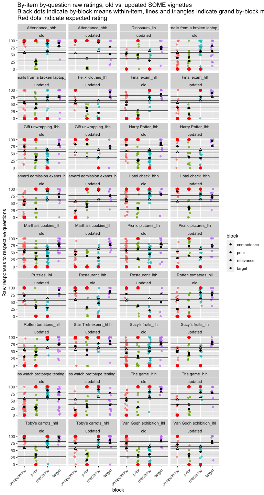

XOR-Some Prolific Pilot 3
================
Polina Tsvilodub
7/24/2021

In this third pilot on Prolific we gather pilot data for the vignettes
that were substantially updated based on the results from the [second
pilot](https://github.com/magpie-ea/magpie-xor-experiment/blob/master/analysis/xor-some-prolific-pilot2.md).
The used vignettes were selected based on manual comparison and comprise
38 out of 64 vignettes.

The structure of the experiment was as follows: Participants read
instructions, completed three example trials, and then completed 8 main
blocks consisting of 4 xor and 4 some items. Each main block had the
following structure: Participants read the background story, answered
one comprehension question, then answered competence / relevance / prior
questions in randomized order; then they read another 3 comprehension
questions, after which the critical utterance was added below the
background story. They answered the inference strength question. The
second round of relevance/competence questions was removed for the
pilot.

N=50 participants were recruited for this pilot and compensated 2
pounds/participant. 8 items (4 some + 4 xor) were sampled at random for
each participant such that each participant saw one item in each
condition (relevance X competence X prior = 8 unique conditions).

## Checks & Exclusions

Checking if there are any comments indicating technical issues which is
not the case:

``` r
d %>% distinct(comments) %>% View()
```

Check native languages. Participants not indicating English as (one of)
their native language(s) are be excluded. We also compute some
participant demographics.

``` r
d %>% distinct(languages)
```

    ## # A tibble: 12 x 1
    ##    languages                  
    ##    <chr>                      
    ##  1 english                    
    ##  2 IsiXhosa,Sotho             
    ##  3 English                    
    ##  4 English/ Irish             
    ##  5 English, isiZulu, Afrikaans
    ##  6 <NA>                       
    ##  7 ENGLISH                    
    ##  8 English, Hungarian         
    ##  9 English, french            
    ## 10 English, Cantonese         
    ## 11 Polish                     
    ## 12 English, Vietnamese

``` r
cat("Number of participants before excluding non-natives: ", d %>% distinct(submission_id) %>% count() %>% pull() ) 
```

    ## Number of participants before excluding non-natives:  50

``` r
# exclude non-natives if necessary
d_native <- d %>% 
 # filter(("en" | "En" | "bri") %in% languages)
  filter(grepl("[(en)(br)]", languages, ignore.case = T))

cat(" Number of participants after excluding non-natives: ", d_native %>% distinct(submission_id) %>% count() %>% pull() )
```

    ##  Number of participants after excluding non-natives:  47

``` r
cat(" Mean age: ", d_native %>% pull(age) %>% mean(., na.rm = T) )
```

    ##  Mean age:  34.48936

``` r
d_native  %>% count(gender) %>% mutate(n = n/72)
```

    ## # A tibble: 3 x 2
    ##   gender     n
    ##   <chr>  <dbl>
    ## 1 female    33
    ## 2 male      11
    ## 3 other      3

Next, we check whether all the conditions were used correctly.

``` r
# check xor/some vs. trial type; there are more xor critical conditions because there are 2 prior questions
d_native %>% count(main_type, condition) 
```

    ## # A tibble: 5 x 3
    ##   main_type condition     n
    ##   <chr>     <chr>     <int>
    ## 1 some      critical    752
    ## 2 some      test        752
    ## 3 xor       critical    940
    ## 4 xor       test        752
    ## 5 <NA>      example     188

``` r
# check experimental conditions
d_native %>% count(exp_condition)
```

    ## # A tibble: 9 x 2
    ##   exp_condition     n
    ##   <chr>         <int>
    ## 1 hhh             400
    ## 2 hhl             402
    ## 3 hlh             397
    ## 4 hll             398
    ## 5 lhh             404
    ## 6 lhl             400
    ## 7 llh             397
    ## 8 lll             398
    ## 9 <NA>            188

``` r
# check xor/some vs. experimental condition
d_native %>% count(main_type, exp_condition)
```

    ## # A tibble: 17 x 3
    ##    main_type exp_condition     n
    ##    <chr>     <chr>         <int>
    ##  1 some      hhh             184
    ##  2 some      hhl             168
    ##  3 some      hlh             208
    ##  4 some      hll             200
    ##  5 some      lhh             152
    ##  6 some      lhl             184
    ##  7 some      llh             208
    ##  8 some      lll             200
    ##  9 xor       hhh             216
    ## 10 xor       hhl             234
    ## 11 xor       hlh             189
    ## 12 xor       hll             198
    ## 13 xor       lhh             252
    ## 14 xor       lhl             216
    ## 15 xor       llh             189
    ## 16 xor       lll             198
    ## 17 <NA>      <NA>            188

``` r
# count items used
d_native %>% count(title)
```

    ## # A tibble: 39 x 2
    ##    title                                                                       n
    ##    <chr>                                                                   <int>
    ##  1 "<font size=\"4\" color= \"#00BFFF\"> EXAMPLE </font> <br/> Joe's shop…   188
    ##  2 "Attendance"                                                               48
    ##  3 "Carl's party"                                                             72
    ##  4 "College"                                                                  54
    ##  5 "Crime"                                                                    81
    ##  6 "Dave's kids"                                                             117
    ##  7 "Dinosaurs"                                                                80
    ##  8 "Emails from a broken laptop"                                             104
    ##  9 "Eyewitness"                                                               72
    ## 10 "Felix' clothes"                                                           56
    ## # … with 29 more rows

Check the time participants spent overall on the experiment before
cleaning the data:

``` r
overall_timeSpent <- d_native %>% mutate(timeSpent = round(timeSpent, 2)) %>% distinct(timeSpent) 

#  summarize(timeCounts = count(timeSpent) / d_native %>% )
ggplot(data = overall_timeSpent, aes(y=timeSpent, alpha = 0.7)) +
  geom_boxplot() +
  ggtitle("Overall time participants took in mins")
```

<!-- -->

Investigate very fast completion times (we have none in this pilot):

``` r
 d_native %>% mutate(timeSpent = round(timeSpent, 2)) %>%
  filter(timeSpent < 8) -> fast_completions

# check if their responses look somehow peculiar
#fast_completions %>%
#  ggplot(., aes(x = response)) +
#  geom_histogram()

cat("number of fast-responders (below 8 mins):", fast_completions %>% distinct(submission_id) %>% pull() %>% length())
```

    ## number of fast-responders (below 8 mins): 0

Data frames preparation:

``` r
d_main <- d_native %>% select(-age, -botresponse, -comments, -education, -endTime, 
                              -gender, -languages, -optionLeft, -optionRight, -startDate,
                              -startTime, -timeSpent) %>%
  filter(trial_name != "example")
d_exmpl <- d_native %>% select(-age, -botresponse, -comments, -education, -endTime, 
                              -gender, -languages, -optionLeft, -optionRight, -startDate,
                              -startTime, -timeSpent) %>%
  filter(trial_name == "example")
d_critical <- d_main %>% filter(condition == "critical")
```

Plot responses on comprehension questions by type before applying
exclusion criteria:

    ## Warning: `as_data_frame()` is deprecated as of tibble 2.0.0.
    ## Please use `as_tibble()` instead.
    ## The signature and semantics have changed, see `?as_tibble`.
    ## This warning is displayed once every 8 hours.
    ## Call `lifecycle::last_warnings()` to see where this warning was generated.

    ## Warning: `cols` is now required when using unnest().
    ## Please use `cols = c(strap)`

<!-- -->

Next, we exclude participants based on their ratings in the main trials:
Participants who gave all responses within the range of 10 and
participants who failed more than 0.2 of the comprehension questions are
excluded from analysis. Participants who failed all example trials are
excluded, as well. The bot check trial is not considered for exclusions.

``` r
# get participants failing example trials
d_exmpl_fail <- d_exmpl %>% group_by(submission_id) %>% 
  mutate(example_condition = ifelse(grepl("as certainly true", question), "true", 
                                    ifelse(grepl("as certainly false", question), "false",
                                           "uncertain")),
         passed_example_trial = case_when(example_condition == "true" ~ response >= 80,
                                    example_condition == "false" ~ response <= 20,
                                    example_condition == "uncertain" ~ response >= 30),
       #  check if all trials passed
         passed_example = case_when(sum(passed_example_trial) == 0 ~ FALSE,
                                    TRUE ~ TRUE)
         ) %>% filter(passed_example == F)

cat("Subjects failing the example trials: ", d_exmpl_fail %>% distinct(submission_id) %>% pull() %>% length())
```

    ## Subjects failing the example trials:  0

``` r
# apply exclusion criteria to main trials
# check range of responses per participant
d_main_fail <- d_main %>% group_by(submission_id) %>%
  mutate(passed_main = case_when(max(response) - min(response) <= 10 ~ FALSE,
                                 TRUE ~ TRUE)
         ) %>% filter(passed_main == F)
cat(" Subjects providing the same ratings throughout the trials: ", d_main_fail %>% distinct(submission_id) %>% pull() %>% length())
```

    ##  Subjects providing the same ratings throughout the trials:  0

``` r
# get participants failing comprehension questions
d_test <- d_test %>%
  group_by(submission_id) %>%
  mutate(passed_filler_trial = case_when(test_condition == "true" ~ response >= 60,
                                   test_condition == "false" ~ response <= 40,
                                   test_condition == "uncertain" ~ response %in% (0:90)),
         mean_comprehension = mean(passed_filler_trial),
         passed_filler = mean_comprehension >= 0.8
         ) 

d_test_fail <- d_test %>% 
  filter(passed_filler == F)

cat(" Subjects failing the comprehension trials: ", d_test_fail %>% distinct(submission_id) %>% pull() %>% length())
```

    ##  Subjects failing the comprehension trials:  6

``` r
# plot by-participant means on comprehension questions, and mark red excluded points, 
# to see if the participants performed in a peculiar way
d_test %>% 
  group_by(submission_id, main_type, test_condition) %>%
  mutate(subj_mean = mean(response)) %>%
  ggplot(., aes(x = test_condition, y = subj_mean)) +
  geom_point(size = 2, alpha = 0.3, position = position_jitter(width = 0.1)) +
  geom_point(data = . %>% filter(passed_filler == F), aes(x = test_condition, y = subj_mean), color = "red", 
             size = 2) +
  facet_wrap(~main_type) +
  ggtitle("Red points mark subject response means for subjects\nwith a mean comprehension question accuracy < 0.8")
```

<!-- -->

``` r
# put it all together
d_full_clean <- anti_join(d_main, d_main_fail, by = "submission_id")
d_full_clean <- anti_join(d_full_clean, d_exmpl_fail, d_test, by = "submission_id")
d_full_clean <- anti_join(d_full_clean, d_test_fail, by = "submission_id")

cat(" Nr. of participants left after cleaning: ", d_full_clean %>% distinct(submission_id) %>% pull() %>% length())
```

    ##  Nr. of participants left after cleaning:  41

``` r
# get overall mean ratings / subject across comprehension and critical trials 
d_full_clean %>% group_by(submission_id) %>% summarise(mean_rating = mean(response)) %>% arrange(mean_rating)
```

    ## # A tibble: 41 x 2
    ##    submission_id mean_rating
    ##            <dbl>       <dbl>
    ##  1          2107        39.1
    ##  2          2115        39.6
    ##  3          2109        44.5
    ##  4          2112        44.8
    ##  5          2116        45.1
    ##  6          2098        45.5
    ##  7          2069        45.8
    ##  8          2118        46.9
    ##  9          2071        48.4
    ## 10          2106        48.5
    ## # … with 31 more rows

``` r
# get mean ratings / subject in critical trials 
d_full_clean %>% filter(condition == "critical") %>% group_by(submission_id) %>% summarise(mean_rating = mean(response)) %>% arrange(mean_rating)
```

    ## # A tibble: 41 x 2
    ##    submission_id mean_rating
    ##            <dbl>       <dbl>
    ##  1          2101        44.8
    ##  2          2073        45.0
    ##  3          2107        45.6
    ##  4          2069        46.5
    ##  5          2114        46.6
    ##  6          2085        47.1
    ##  7          2098        48.7
    ##  8          2071        50.1
    ##  9          2075        51.4
    ## 10          2115        52.4
    ## # … with 31 more rows

Create more extensive condition labels, including information about
whether a rating was produced with or without the utterance given (no
such condition in this pilot).

``` r
# extending 'conditions' labels to include whether the utterance was present or not
d_critical_long <- d_critical_long %>% 
  mutate(block_extended = ifelse(
    !w_utterance, 
    block, 
    ifelse(block %in% c("some", "xor"), "target", str_c(block, "_wUtt", ""))
  ))
```

Average nr of responses per question per vignette:

``` r
d_critical_long %>% 
  filter(class_condition == block | block == "xor" | block == "some") %>%
  select(-class_condition, -prior_class) %>%
  unique() %>% count(title, block_extended, main_type) %>%
  mutate(n = ifelse(main_type == "xor" & block_extended == "prior", n/2, n)) %>%
  summarize(mean_observations = mean(n))
```

    ## # A tibble: 1 x 1
    ##   mean_observations
    ##               <dbl>
    ## 1              8.63

Compute the average deviation from expected responses for each vignette,
individually for each dimension (rel / comp / pri). Only half as many
items deviate from expectations by \>= 50 points compared to the last
pilot.

``` r
d_critical_long %>% 
  filter(block != "xor" & block != "some") %>%
  filter(block == class_condition) %>%
  mutate(expected_rating = prior_class * 100,
         response_deviation = abs(response - expected_rating),
         block = ifelse(block == "xor" | block == "some", "target", block)
         ) %>%
  group_by(title, block) %>%
  summarize(mean_deviation = mean(response_deviation)) %>%
  arrange(desc(mean_deviation), .by_group = T) %>%
  # get the largest deviations - over 50 
  filter(mean_deviation >= 50) -> d_critical_deviations

# d_critical_deviations %>% write_csv("../data/pilots/pilot3_byItem_rating_deviations.csv")

print(d_critical_deviations)
```

    ## # A tibble: 24 x 3
    ## # Groups:   title [19]
    ##    title                       block      mean_deviation
    ##    <chr>                       <chr>               <dbl>
    ##  1 Attendance                  prior                97.4
    ##  2 College                     competence           61.3
    ##  3 Crime                       relevance            55.5
    ##  4 Crime                       prior                50.5
    ##  5 Dinosaurs                   competence           54  
    ##  6 Emails from a broken laptop relevance            75.4
    ##  7 Emails from a broken laptop competence           57.6
    ##  8 Emails from a broken laptop prior                52.9
    ##  9 Eyewitness                  relevance            52.8
    ## 10 Gigi's exams                prior                55.8
    ## # … with 14 more rows

``` r
# count which dimension is the most problematic - the prior
d_critical_deviations %>% group_by(block) %>% count()
```

    ## # A tibble: 3 x 2
    ## # Groups:   block [3]
    ##   block          n
    ##   <chr>      <int>
    ## 1 competence     6
    ## 2 prior         12
    ## 3 relevance      6

``` r
# check which items have the most deviations over 50 
d_critical_deviations %>% group_by(title) %>% count() %>% arrange(desc(.$n))
```

    ## # A tibble: 19 x 2
    ## # Groups:   title [19]
    ##    title                             n
    ##    <chr>                         <int>
    ##  1 Emails from a broken laptop       3
    ##  2 Crime                             2
    ##  3 Gigi's exams                      2
    ##  4 Suzy's fruits                     2
    ##  5 Attendance                        1
    ##  6 College                           1
    ##  7 Dinosaurs                         1
    ##  8 Eyewitness                        1
    ##  9 Greg's movie                      1
    ## 10 Harry Potter                      1
    ## 11 Harvard admission exams           1
    ## 12 Hotel check                       1
    ## 13 Jimmy's trip                      1
    ## 14 Mrs. Gibbs' worry                 1
    ## 15 Presents                          1
    ## 16 Restaurant                        1
    ## 17 Swiss watch prototype testing     1
    ## 18 The game                          1
    ## 19 Tony's clubbing                   1

Compute the standard deviation for each question for each item as an
additional measure of spread in the participants’ responses within-item:

``` r
d_critical_long %>% 
  filter(block != "xor" & block != "some") %>%
  filter(block == class_condition) %>%
  mutate(
         block = ifelse(block == "xor" | block == "some", "target", block)
         ) %>%
  group_by(title, block) %>%
  summarize(item_sd = sd(response)) %>%
  arrange(desc(item_sd), .by_group = T) %>%
  # arbitrary set to 25
  filter(item_sd >= 25) -> d_critical_sd
d_critical_sd
```

    ## # A tibble: 48 x 3
    ## # Groups:   title [30]
    ##    title                       block      item_sd
    ##    <chr>                       <chr>        <dbl>
    ##  1 Carl's party                relevance     25.1
    ##  2 Dinosaurs                   relevance     27.2
    ##  3 Dinosaurs                   prior         26.0
    ##  4 Emails from a broken laptop competence    41.5
    ##  5 Emails from a broken laptop prior         33.2
    ##  6 Emails from a broken laptop relevance     25.3
    ##  7 Eyewitness                  prior         27.9
    ##  8 Eyewitness                  relevance     25.3
    ##  9 Final exam                  relevance     33.8
    ## 10 Final exam                  competence    31.9
    ## # … with 38 more rows

``` r
# d_critical_sd %>% write_csv("../data/pilots/pilot3_byItem_rating_SDs.csv")
```

Get the vignettes and dimensions that were strongly deviating from
expectations in the previous pilot and still did not improve:

``` r
deviating_item_pilot2 <- read_csv("../data/pilots/pilot2_byItem_rating_deviations.csv") %>% select(-mean_deviation)
d_critical_deviations %>% select(-mean_deviation) %>% semi_join(., deviating_item_pilot2)
```

    ## # A tibble: 14 x 2
    ## # Groups:   title [13]
    ##    title                         block     
    ##    <chr>                         <chr>     
    ##  1 Attendance                    prior     
    ##  2 College                       competence
    ##  3 Crime                         prior     
    ##  4 Emails from a broken laptop   relevance 
    ##  5 Greg's movie                  competence
    ##  6 Harry Potter                  prior     
    ##  7 Harvard admission exams       prior     
    ##  8 Hotel check                   prior     
    ##  9 Jimmy's trip                  competence
    ## 10 Restaurant                    prior     
    ## 11 Suzy's fruits                 prior     
    ## 12 Suzy's fruits                 relevance 
    ## 13 Swiss watch prototype testing prior     
    ## 14 The game                      prior

Visually check the spread of by-item ratings among subjects for each
question:
<!-- -->

Visually compare the updated vignettes (pilot 2 vs current pilot)

<!-- -->

<!-- -->

Check by-vignette by-predictor empirical means, to see if the range is
somewhat covered:

``` r
d_critical_long %>% 
  mutate(title = paste(title, exp_condition, sep = "_"),
         block = ifelse(block == "xor" | block == "some", "target", block)) %>%
  filter(block == class_condition | block == "target") %>%
  group_by(title, block) %>%
  summarise(mean_response = mean(response)) %>%
  arrange(mean_response)
```

    ## # A tibble: 152 x 3
    ## # Groups:   title [38]
    ##    title                             block      mean_response
    ##    <chr>                             <chr>              <dbl>
    ##  1 Attendance_hhh                    prior                2.6
    ##  2 Final exam_hll                    prior               14.6
    ##  3 Toby's carrots_hhl                prior               15.2
    ##  4 Dave's kids_lll                   competence          18.1
    ##  5 Swiss watch prototype testing_hlh competence          18.2
    ##  6 Dave's kids_lll                   relevance           18.9
    ##  7 Jimmy's trip_lll                  prior               19  
    ##  8 Felix' clothes_lhl                relevance           19.7
    ##  9 Greg's movie_llh                  relevance           20.4
    ## 10 Restaurant_lhh                    relevance           21  
    ## # … with 142 more rows

## Plots

First, compare the two prior ratings in the xor condition:

``` r
# check whether the ratings in the two prior questions are the same in xor 
d_critical_long %>% 
  filter(block != "xor" & block != "some") %>%
  filter(block == class_condition) %>%
  filter(block == "prior", main_type == "xor") %>%
  mutate(priorQ_nr = rep(c(1,2), nrow(.)/2),
         unique_ID = paste(submission_id, ID, sep="_")) -> d_xor_priors
d_xor_priors %>% group_by(priorQ_nr, prior_class) %>%
  summarise(mean = mean(response)) -> d_xor_priors_summary

d_xor_priors %>%
  ggplot(., aes(x = as.factor(priorQ_nr), y = response )) +
  geom_point(size = 2, alpha = 0.6) +
  geom_point(data = d_xor_priors_summary, aes(x = as.factor(priorQ_nr), y = mean), color = "red", size = 3) +
  geom_path(aes(group = "unique_ID"), alpha = 0.6) +
  ylab("Responses to prior questions") +
  xlab("First vs Second prior question for high vs low prior conditions") +
  facet_wrap(~as.factor(prior_class)) + # get ratings from the respective trials only 
  ggtitle("Xor prior question ratings.\nLines indicate the two responses provided by one participant for a specific item.")
```

<!-- -->

``` r
# check analytically how many subjects rate prior questions differently
d_xor_priors %>% select(-trial_number, -RT, -prompt) %>% 
  pivot_wider(names_from = "priorQ_nr", values_from = "response") %>%
  mutate(response_difference = abs(`1` - `2`),
         bigDifference = ifelse(response_difference > 15, T, F)) -> d_xor_priors_differences

# 19 responses with difference > 15 between first and second rating
d_xor_priors_differences %>% count(bigDifference)
```

    ## # A tibble: 2 x 2
    ##   bigDifference     n
    ##   <lgl>         <int>
    ## 1 FALSE           145
    ## 2 TRUE             19

``` r
# proportion of big differences in prior responses by prior type (high vs low)
d_xor_priors_differences %>% group_by(prior_class) %>% summarise(prop_big_diffs = mean(bigDifference))
```

    ## # A tibble: 2 x 2
    ##   prior_class prop_big_diffs
    ##         <dbl>          <dbl>
    ## 1           0          0.106
    ## 2           1          0.127

As planned, all the primary visualizations and analyses below are
conducted on data z-scored by-subject by-block.

Plot main rel / comp / prior questions by main condition and by prior
classification of the item (x-axis):

``` r
d_critical_zScored <- d_critical_long %>% group_by(submission_id, block_extended) %>%
  mutate(block_mean = mean(response),
         block_sd = sd(response),
         response_centered = (response - block_mean)/block_sd,
         # catch the cases where sd is 0 
         response_centered = ifelse(is.na(response_centered), 0, response_centered))

d_critical_zScored %>% 
  filter(block != "xor" & block != "some") %>%
  filter(block == class_condition) %>%
  group_by(main_type, class_condition, w_utterance, prior_class) %>% 
  summarize(mean_response = mean(response_centered)) -> d_critical_zScore_summary

d_critical_zScored %>% 
  filter(block != "xor" & block != "some") %>%
  filter(block == class_condition) %>%
  ggplot(., aes(x = as.factor(prior_class), y = response_centered, shape = w_utterance)) +
  geom_point(size = 2, alpha = 0.6, position = position_jitter(width = 0.1)) +
  geom_point(data = d_critical_zScore_summary, aes(x = as.factor(prior_class), y = mean_response), 
             color = "red", size = 3) +
  ylab("Responses to respective predictor questions") +
  xlab("Anticipated categorization of the items (low / high)") +
  facet_wrap(main_type~class_condition) + # get ratings from the respective trials only 
  ggtitle("Centered responses to by-predictor questions")
```

<!-- -->
Plot inference ratings as a function of *anticipated* rating of the
explanatory factor, similar to the paper:

``` r
d_critical_zScored %>% 
  filter(block == "xor" | block == "some") %>%
  ggplot(., aes(x = prior_class, y = response_centered)) +
  geom_point(size = 2, alpha = 0.5) +
  geom_smooth(method="lm") +
  ylab("Inference strength ratings") +
  facet_wrap(block~class_condition) +
  xlab("Anticipated categorization of the items") +
  ggtitle("Inference strength ratings by-predictor")
```

<!-- -->

Plot the empirical predictor ratings against target inference ratings:

``` r
d_critical_zScored_wide <- d_critical_zScored %>% 
  select(submission_id, title, main_type, block_extended, response_centered) %>% 
  unique() %>% 
  pivot_wider(
    names_from = block_extended, 
    values_from = response_centered, 
    values_fn = mean # getting means for double prior measurement in "xor"
  ) 
  
d_critical_zScored_wide %>%
  ggplot(., aes(x = relevance, y = target)) +
  geom_point(size = 2, alpha = 0.7) +
  ylab("Inference strength ratings") +
  geom_smooth(method = "lm") +
  facet_wrap(~main_type, ncol = 1) -> p.rel.z

d_critical_zScored_wide %>%
  ggplot(., aes(x = competence, y = target)) +
  geom_point(size = 2, alpha = 0.7) +
  geom_smooth(method = "lm") +
  ylab("") +
  facet_wrap(~main_type, ncol = 1) -> p.comp.z

d_critical_zScored_wide %>%
  ggplot(., aes(x = prior, y = target)) +
  geom_point(size = 2, alpha = 0.7) +
  geom_smooth(method = "lm") +
  ylab("") +
  facet_wrap(~main_type, ncol = 1) -> p.pri.z

gridExtra::grid.arrange(p.rel.z, p.comp.z, p.pri.z, ncol = 3) 
```

<!-- -->
Plot by-item trends between predictor ratings and target inference
strength ratings (relevance / competence ratings with utterance are
omitted):

``` r
# make a versatile wide representation of the critical data
d_critical_predictorsXtarget <- d_critical_zScored_wide %>% 
  pivot_longer(
    cols = c(relevance, prior, competence),
    names_to = "predictors",
    values_to = "predictor_response"
  ) 
d_critical_predictorsXtarget %>%
  ggplot(., aes(x = predictor_response, y = target)) +
  geom_point() +
  facet_wrap(title~predictors, ncol= 6) +
  xlab("Response to predictor questions") +
  ylab("Inference strength rating") +
  ggtitle("By-item Inference Strength Ratings vs. Predictor Ratings (left to right)")
```

<!-- -->

Plot inference strength ratings against predictor ratings, by-item,
using by-item mean ratings across participants.

``` r
d_critical_predictorsXtarget_summary <- d_critical_predictorsXtarget %>% 
  group_by(title, predictors, main_type) %>%
  summarise(mean_target = mean(target),
            mean_predictor = mean(predictor_response), 
            sd_target = sd(target),
            sd_predictor = sd(predictor_response))  


d_critical_predictorsXtarget_summary %>%
  ggplot(., aes(x = mean_predictor, y = mean_target)) +
  geom_point() +
  geom_text(aes(label=title), size = 2.5) +
  geom_smooth(method = "lm") +
  ylab("Mean inference strength rating") +
  xlab("Mean predictor ratings") + 
  facet_wrap(main_type~predictors)
```

<!-- -->

Correlation plots of z-scored data:

``` r
# correlation plot for "some"
GGally::ggpairs(
  filter(d_critical_zScored_wide, main_type == "some") %>% ungroup() %>%  
    select(prior, competence, relevance, target)
)
```

<!-- -->

``` r
# correlation plot for "or"
GGally::ggpairs(
  filter(d_critical_zScored_wide, main_type == "xor") %>%  ungroup() %>%
    select(prior, competence, relevance, target)
  )
```

<!-- -->

## Stats

Our primary analysis is also conducted on z-scored data. First, maximal
models on the ratings provided by the subjects are run:

``` r
# xor, maximal model with interactions and maximal REs on z-scored data
model_xor_zScored <- brm(
  bf(target ~ prior*competence*relevance + 
    (1 + prior + competence + relevance || submission_id) +
    (1 | title),
    decomp = "QR"),
  data = d_critical_zScored_wide %>% filter(main_type == "xor"),
  family = "gaussian",
  cores = 4,
  iter = 3000
)
```

``` r
summary(model_xor_zScored)
```

    ##  Family: gaussian 
    ##   Links: mu = identity; sigma = identity 
    ## Formula: target ~ prior * competence * relevance + (1 + prior + competence + relevance || submission_id) + (1 | title) 
    ##    Data: d_critical_zScored_wide %>% filter(main_type == "x (Number of observations: 164) 
    ## Samples: 4 chains, each with iter = 3000; warmup = 1500; thin = 1;
    ##          total post-warmup samples = 6000
    ## 
    ## Group-Level Effects: 
    ## ~submission_id (Number of levels: 41) 
    ##                Estimate Est.Error l-95% CI u-95% CI Rhat Bulk_ESS Tail_ESS
    ## sd(Intercept)      0.13      0.10     0.01     0.35 1.00     2664     3192
    ## sd(prior)          0.15      0.11     0.01     0.39 1.00     2902     3499
    ## sd(competence)     0.19      0.12     0.01     0.46 1.00     1976     3310
    ## sd(relevance)      0.34      0.15     0.04     0.63 1.00     1294     1968
    ## 
    ## ~title (Number of levels: 18) 
    ##               Estimate Est.Error l-95% CI u-95% CI Rhat Bulk_ESS Tail_ESS
    ## sd(Intercept)     0.11      0.09     0.00     0.32 1.00     3461     3798
    ## 
    ## Population-Level Effects: 
    ##                            Estimate Est.Error l-95% CI u-95% CI Rhat Bulk_ESS
    ## Intercept                     -0.04      0.09    -0.22     0.15 1.00     9532
    ## prior                         -0.11      0.11    -0.31     0.11 1.00    10243
    ## competence                     0.09      0.10    -0.11     0.29 1.00     9560
    ## relevance                     -0.01      0.11    -0.23     0.20 1.00     7385
    ## prior:competence              -0.13      0.13    -0.38     0.13 1.00    12315
    ## prior:relevance                0.06      0.12    -0.17     0.30 1.00    10927
    ## competence:relevance           0.06      0.09    -0.13     0.25 1.00     9670
    ## prior:competence:relevance    -0.16      0.13    -0.42     0.09 1.00     7391
    ##                            Tail_ESS
    ## Intercept                      4434
    ## prior                          4797
    ## competence                     4879
    ## relevance                      4731
    ## prior:competence               5107
    ## prior:relevance                3809
    ## competence:relevance           4965
    ## prior:competence:relevance     4425
    ## 
    ## Family Specific Parameters: 
    ##       Estimate Est.Error l-95% CI u-95% CI Rhat Bulk_ESS Tail_ESS
    ## sigma     0.93      0.07     0.80     1.08 1.00     2668     3807
    ## 
    ## Samples were drawn using sampling(NUTS). For each parameter, Bulk_ESS
    ## and Tail_ESS are effective sample size measures, and Rhat is the potential
    ## scale reduction factor on split chains (at convergence, Rhat = 1).

Plot correlations of main effects

``` r
bayesplot::mcmc_pairs(model_xor_zScored, pars = c("b_prior", "b_relevance", "b_competence"))
```

<!-- -->

``` r
# some, maximal model with interactions and maximal REs
model_some_zScored <- brm(
  bf(target ~ prior*competence*relevance + 
    (1 + prior + competence + relevance || submission_id) +
    (1 | title),
    decomp = "QR"),
  data = d_critical_zScored_wide %>% filter(main_type == "some"),
  family = "gaussian",
  cores = 4,
  iter = 3000
)
```

``` r
summary(model_some_zScored)
```

    ##  Family: gaussian 
    ##   Links: mu = identity; sigma = identity 
    ## Formula: target ~ prior * competence * relevance + (1 + prior + competence + relevance || submission_id) + (1 | title) 
    ##    Data: d_critical_zScored_wide %>% filter(main_type == "s (Number of observations: 164) 
    ## Samples: 4 chains, each with iter = 3000; warmup = 1500; thin = 1;
    ##          total post-warmup samples = 6000
    ## 
    ## Group-Level Effects: 
    ## ~submission_id (Number of levels: 41) 
    ##                Estimate Est.Error l-95% CI u-95% CI Rhat Bulk_ESS Tail_ESS
    ## sd(Intercept)      0.15      0.10     0.01     0.36 1.00     1701     3176
    ## sd(prior)          0.09      0.07     0.00     0.26 1.00     3083     3198
    ## sd(competence)     0.23      0.12     0.02     0.45 1.00     1265     1921
    ## sd(relevance)      0.17      0.11     0.01     0.39 1.00     1655     2676
    ## 
    ## ~title (Number of levels: 20) 
    ##               Estimate Est.Error l-95% CI u-95% CI Rhat Bulk_ESS Tail_ESS
    ## sd(Intercept)     0.35      0.12     0.13     0.60 1.00     1829     1637
    ## 
    ## Population-Level Effects: 
    ##                            Estimate Est.Error l-95% CI u-95% CI Rhat Bulk_ESS
    ## Intercept                      0.06      0.11    -0.16     0.27 1.00     5640
    ## prior                         -0.11      0.07    -0.25     0.02 1.00     8276
    ## competence                     0.04      0.09    -0.14     0.22 1.00     6936
    ## relevance                     -0.10      0.09    -0.29     0.08 1.00     6563
    ## prior:competence              -0.01      0.07    -0.14     0.12 1.00     8339
    ## prior:relevance                0.21      0.07     0.07     0.34 1.00     9511
    ## competence:relevance          -0.01      0.08    -0.17     0.16 1.00     6713
    ## prior:competence:relevance    -0.15      0.08    -0.30    -0.00 1.00     7233
    ##                            Tail_ESS
    ## Intercept                      4767
    ## prior                          5169
    ## competence                     4781
    ## relevance                      4480
    ## prior:competence               4474
    ## prior:relevance                5429
    ## competence:relevance           4547
    ## prior:competence:relevance     4467
    ## 
    ## Family Specific Parameters: 
    ##       Estimate Est.Error l-95% CI u-95% CI Rhat Bulk_ESS Tail_ESS
    ## sigma     0.78      0.06     0.67     0.90 1.00     2275     3253
    ## 
    ## Samples were drawn using sampling(NUTS). For each parameter, Bulk_ESS
    ## and Tail_ESS are effective sample size measures, and Rhat is the potential
    ## scale reduction factor on split chains (at convergence, Rhat = 1).

Plot correlations of main effects

``` r
bayesplot::mcmc_pairs(model_some_zScored, pars = c("b_prior", "b_relevance", "b_competence"))
```

<!-- -->

#### Smaller models with z-scored data to check for collinearity

Models with only one predictor:

``` r
# xor
model_xor_zScored_prior <- brm(
  bf(target ~ prior + 
    (1 + prior | submission_id) +
    (1 | title),
    decomp = "QR"),
  data = d_critical_zScored_wide %>% filter(main_type == "xor"),
  family = "gaussian",
  cores = 4,
  iter = 3000
)
```

``` r
summary(model_xor_zScored_prior)
```

    ##  Family: gaussian 
    ##   Links: mu = identity; sigma = identity 
    ## Formula: target ~ prior + (1 + prior | submission_id) + (1 | title) 
    ##    Data: d_critical_zScored_wide %>% filter(main_type == "x (Number of observations: 164) 
    ## Samples: 4 chains, each with iter = 3000; warmup = 1500; thin = 1;
    ##          total post-warmup samples = 6000
    ## 
    ## Group-Level Effects: 
    ## ~submission_id (Number of levels: 41) 
    ##                      Estimate Est.Error l-95% CI u-95% CI Rhat Bulk_ESS
    ## sd(Intercept)            0.11      0.08     0.00     0.31 1.00     2732
    ## sd(prior)                0.14      0.10     0.01     0.38 1.00     2941
    ## cor(Intercept,prior)    -0.04      0.57    -0.95     0.94 1.00     4274
    ##                      Tail_ESS
    ## sd(Intercept)            2287
    ## sd(prior)                2746
    ## cor(Intercept,prior)     3659
    ## 
    ## ~title (Number of levels: 18) 
    ##               Estimate Est.Error l-95% CI u-95% CI Rhat Bulk_ESS Tail_ESS
    ## sd(Intercept)     0.11      0.09     0.00     0.32 1.00     3036     2263
    ## 
    ## Population-Level Effects: 
    ##           Estimate Est.Error l-95% CI u-95% CI Rhat Bulk_ESS Tail_ESS
    ## Intercept    -0.03      0.09    -0.21     0.14 1.00     6621     3399
    ## prior        -0.14      0.10    -0.34     0.05 1.00     6586     3973
    ## 
    ## Family Specific Parameters: 
    ##       Estimate Est.Error l-95% CI u-95% CI Rhat Bulk_ESS Tail_ESS
    ## sigma     0.99      0.06     0.88     1.11 1.00     7664     4242
    ## 
    ## Samples were drawn using sampling(NUTS). For each parameter, Bulk_ESS
    ## and Tail_ESS are effective sample size measures, and Rhat is the potential
    ## scale reduction factor on split chains (at convergence, Rhat = 1).

``` r
# xor
model_xor_zScored_comp <- brm(
  bf(target ~ competence + 
    (1 + competence | submission_id) +
    (1 | title),
    decomp = "QR"),
  data = d_critical_zScored_wide %>% filter(main_type == "xor"),
  family = "gaussian",
  cores = 4,
  iter = 3000
)
```

``` r
summary(model_xor_zScored_comp)
```

    ##  Family: gaussian 
    ##   Links: mu = identity; sigma = identity 
    ## Formula: target ~ competence + (1 + competence | submission_id) + (1 | title) 
    ##    Data: d_critical_zScored_wide %>% filter(main_type == "x (Number of observations: 164) 
    ## Samples: 4 chains, each with iter = 3000; warmup = 1500; thin = 1;
    ##          total post-warmup samples = 6000
    ## 
    ## Group-Level Effects: 
    ## ~submission_id (Number of levels: 41) 
    ##                           Estimate Est.Error l-95% CI u-95% CI Rhat Bulk_ESS
    ## sd(Intercept)                 0.11      0.08     0.00     0.30 1.00     2807
    ## sd(competence)                0.17      0.12     0.01     0.45 1.00     2019
    ## cor(Intercept,competence)     0.06      0.58    -0.95     0.96 1.00     3262
    ##                           Tail_ESS
    ## sd(Intercept)                 2697
    ## sd(competence)                2721
    ## cor(Intercept,competence)     3688
    ## 
    ## ~title (Number of levels: 18) 
    ##               Estimate Est.Error l-95% CI u-95% CI Rhat Bulk_ESS Tail_ESS
    ## sd(Intercept)     0.13      0.10     0.01     0.37 1.00     2367     2725
    ## 
    ## Population-Level Effects: 
    ##            Estimate Est.Error l-95% CI u-95% CI Rhat Bulk_ESS Tail_ESS
    ## Intercept     -0.04      0.09    -0.22     0.14 1.00     5529     4154
    ## competence     0.05      0.10    -0.15     0.23 1.00     5984     4336
    ## 
    ## Family Specific Parameters: 
    ##       Estimate Est.Error l-95% CI u-95% CI Rhat Bulk_ESS Tail_ESS
    ## sigma     0.99      0.06     0.88     1.11 1.00     5788     4012
    ## 
    ## Samples were drawn using sampling(NUTS). For each parameter, Bulk_ESS
    ## and Tail_ESS are effective sample size measures, and Rhat is the potential
    ## scale reduction factor on split chains (at convergence, Rhat = 1).

``` r
# xor
model_xor_zScored_rel <- brm(
  bf(target ~ relevance + 
    (1 + relevance | submission_id) +
    (1 | title),
    decomp = "QR"),
  data = d_critical_zScored_wide %>% filter(main_type == "xor"),
  family = "gaussian",
  cores = 4,
  iter = 3000
)
```

``` r
summary(model_xor_zScored_rel)
```

    ##  Family: gaussian 
    ##   Links: mu = identity; sigma = identity 
    ## Formula: target ~ relevance + (1 + relevance | submission_id) + (1 | title) 
    ##    Data: d_critical_zScored_wide %>% filter(main_type == "x (Number of observations: 164) 
    ## Samples: 4 chains, each with iter = 3000; warmup = 1500; thin = 1;
    ##          total post-warmup samples = 6000
    ## 
    ## Group-Level Effects: 
    ## ~submission_id (Number of levels: 41) 
    ##                          Estimate Est.Error l-95% CI u-95% CI Rhat Bulk_ESS
    ## sd(Intercept)                0.12      0.09     0.01     0.32 1.00     2832
    ## sd(relevance)                0.26      0.14     0.02     0.54 1.00     1470
    ## cor(Intercept,relevance)     0.11      0.57    -0.93     0.96 1.00     1774
    ##                          Tail_ESS
    ## sd(Intercept)                2387
    ## sd(relevance)                2557
    ## cor(Intercept,relevance)     2917
    ## 
    ## ~title (Number of levels: 18) 
    ##               Estimate Est.Error l-95% CI u-95% CI Rhat Bulk_ESS Tail_ESS
    ## sd(Intercept)     0.13      0.10     0.01     0.38 1.00     2833     3026
    ## 
    ## Population-Level Effects: 
    ##           Estimate Est.Error l-95% CI u-95% CI Rhat Bulk_ESS Tail_ESS
    ## Intercept    -0.04      0.09    -0.23     0.14 1.00     5919     4523
    ## relevance     0.01      0.10    -0.19     0.21 1.00     6181     3899
    ## 
    ## Family Specific Parameters: 
    ##       Estimate Est.Error l-95% CI u-95% CI Rhat Bulk_ESS Tail_ESS
    ## sigma     0.97      0.06     0.86     1.10 1.00     4574     4317
    ## 
    ## Samples were drawn using sampling(NUTS). For each parameter, Bulk_ESS
    ## and Tail_ESS are effective sample size measures, and Rhat is the potential
    ## scale reduction factor on split chains (at convergence, Rhat = 1).

``` r
# some
model_some_zScored_rel <- brm(
  bf(target ~ relevance + 
    (1 + relevance | submission_id) +
    (1 | title),
    decomp = "QR"),
  data = d_critical_zScored_wide %>% filter(main_type == "some"),
  family = "gaussian",
  cores = 4,
  iter = 3000
)
```

``` r
summary(model_some_zScored_rel)
```

    ##  Family: gaussian 
    ##   Links: mu = identity; sigma = identity 
    ## Formula: target ~ relevance + (1 + relevance | submission_id) + (1 | title) 
    ##    Data: d_critical_zScored_wide %>% filter(main_type == "s (Number of observations: 164) 
    ## Samples: 4 chains, each with iter = 3000; warmup = 1500; thin = 1;
    ##          total post-warmup samples = 6000
    ## 
    ## Group-Level Effects: 
    ## ~submission_id (Number of levels: 41) 
    ##                          Estimate Est.Error l-95% CI u-95% CI Rhat Bulk_ESS
    ## sd(Intercept)                0.11      0.08     0.00     0.30 1.00     2591
    ## sd(relevance)                0.15      0.10     0.01     0.38 1.00     1957
    ## cor(Intercept,relevance)    -0.00      0.58    -0.94     0.95 1.00     3002
    ##                          Tail_ESS
    ## sd(Intercept)                2583
    ## sd(relevance)                2874
    ## cor(Intercept,relevance)     3656
    ## 
    ## ~title (Number of levels: 20) 
    ##               Estimate Est.Error l-95% CI u-95% CI Rhat Bulk_ESS Tail_ESS
    ## sd(Intercept)     0.39      0.11     0.18     0.64 1.00     2115     2586
    ## 
    ## Population-Level Effects: 
    ##           Estimate Est.Error l-95% CI u-95% CI Rhat Bulk_ESS Tail_ESS
    ## Intercept     0.04      0.11    -0.19     0.27 1.00     3396     3623
    ## relevance    -0.14      0.09    -0.32     0.05 1.00     4603     4309
    ## 
    ## Family Specific Parameters: 
    ##       Estimate Est.Error l-95% CI u-95% CI Rhat Bulk_ESS Tail_ESS
    ## sigma     0.86      0.06     0.76     0.97 1.00     4557     4348
    ## 
    ## Samples were drawn using sampling(NUTS). For each parameter, Bulk_ESS
    ## and Tail_ESS are effective sample size measures, and Rhat is the potential
    ## scale reduction factor on split chains (at convergence, Rhat = 1).

``` r
# some
model_some_zScored_prior <- brm(
  bf(target ~ prior + 
    (1 + prior | submission_id) +
    (1 | title),
    decomp = "QR"),
  data = d_critical_zScored_wide %>% filter(main_type == "some"),
  family = "gaussian",
  cores = 4,
  iter = 3000
)
```

``` r
summary(model_some_zScored_prior)
```

    ##  Family: gaussian 
    ##   Links: mu = identity; sigma = identity 
    ## Formula: target ~ prior + (1 + prior | submission_id) + (1 | title) 
    ##    Data: d_critical_zScored_wide %>% filter(main_type == "s (Number of observations: 164) 
    ## Samples: 4 chains, each with iter = 3000; warmup = 1500; thin = 1;
    ##          total post-warmup samples = 6000
    ## 
    ## Group-Level Effects: 
    ## ~submission_id (Number of levels: 41) 
    ##                      Estimate Est.Error l-95% CI u-95% CI Rhat Bulk_ESS
    ## sd(Intercept)            0.12      0.08     0.01     0.30 1.00     2422
    ## sd(prior)                0.10      0.07     0.00     0.28 1.00     2468
    ## cor(Intercept,prior)     0.04      0.58    -0.95     0.96 1.00     3530
    ##                      Tail_ESS
    ## sd(Intercept)            2562
    ## sd(prior)                2643
    ## cor(Intercept,prior)     3032
    ## 
    ## ~title (Number of levels: 20) 
    ##               Estimate Est.Error l-95% CI u-95% CI Rhat Bulk_ESS Tail_ESS
    ## sd(Intercept)     0.40      0.11     0.19     0.65 1.00     2206     2867
    ## 
    ## Population-Level Effects: 
    ##           Estimate Est.Error l-95% CI u-95% CI Rhat Bulk_ESS Tail_ESS
    ## Intercept     0.01      0.12    -0.23     0.24 1.00     2573     3409
    ## prior        -0.12      0.07    -0.26     0.03 1.00     5835     4754
    ## 
    ## Family Specific Parameters: 
    ##       Estimate Est.Error l-95% CI u-95% CI Rhat Bulk_ESS Tail_ESS
    ## sigma     0.86      0.05     0.76     0.97 1.00     4863     4217
    ## 
    ## Samples were drawn using sampling(NUTS). For each parameter, Bulk_ESS
    ## and Tail_ESS are effective sample size measures, and Rhat is the potential
    ## scale reduction factor on split chains (at convergence, Rhat = 1).

``` r
# some
model_some_zScored_comp <- brm(
  bf(target ~ competence + 
    (1 + competence | submission_id) +
    (1 | title),
    decomp = "QR"),
  data = d_critical_zScored_wide %>% filter(main_type == "some"),
  family = "gaussian",
  cores = 4,
  iter = 3000
)
```

``` r
summary(model_some_zScored_comp)
```

    ##  Family: gaussian 
    ##   Links: mu = identity; sigma = identity 
    ## Formula: target ~ competence + (1 + competence | submission_id) + (1 | title) 
    ##    Data: d_critical_zScored_wide %>% filter(main_type == "s (Number of observations: 164) 
    ## Samples: 4 chains, each with iter = 3000; warmup = 1500; thin = 1;
    ##          total post-warmup samples = 6000
    ## 
    ## Group-Level Effects: 
    ## ~submission_id (Number of levels: 41) 
    ##                           Estimate Est.Error l-95% CI u-95% CI Rhat Bulk_ESS
    ## sd(Intercept)                 0.11      0.08     0.00     0.30 1.00     2935
    ## sd(competence)                0.32      0.11     0.08     0.55 1.01     1597
    ## cor(Intercept,competence)     0.08      0.54    -0.92     0.95 1.00     1097
    ##                           Tail_ESS
    ## sd(Intercept)                 3984
    ## sd(competence)                1776
    ## cor(Intercept,competence)     2177
    ## 
    ## ~title (Number of levels: 20) 
    ##               Estimate Est.Error l-95% CI u-95% CI Rhat Bulk_ESS Tail_ESS
    ## sd(Intercept)     0.34      0.12     0.10     0.58 1.00     1867     1839
    ## 
    ## Population-Level Effects: 
    ##            Estimate Est.Error l-95% CI u-95% CI Rhat Bulk_ESS Tail_ESS
    ## Intercept      0.03      0.11    -0.18     0.24 1.00     5464     4634
    ## competence     0.09      0.10    -0.09     0.29 1.00     5332     4819
    ## 
    ## Family Specific Parameters: 
    ##       Estimate Est.Error l-95% CI u-95% CI Rhat Bulk_ESS Tail_ESS
    ## sigma     0.82      0.06     0.71     0.94 1.00     3454     3941
    ## 
    ## Samples were drawn using sampling(NUTS). For each parameter, Bulk_ESS
    ## and Tail_ESS are effective sample size measures, and Rhat is the potential
    ## scale reduction factor on split chains (at convergence, Rhat = 1).

With two predictors:

``` r
# xor
model_xor_zScored_pri_comp <- brm(
  bf(target ~ prior*competence + 
    (1 + prior*competence || submission_id) +
    (1 | title),
    decomp = "QR"),
  data = d_critical_zScored_wide %>% filter(main_type == "xor"),
  family = "gaussian",
  cores = 4,
  iter = 3000
)
```

``` r
summary(model_xor_zScored_pri_comp)
```

    ##  Family: gaussian 
    ##   Links: mu = identity; sigma = identity 
    ## Formula: target ~ prior * competence + (1 + prior * competence || submission_id) + (1 | title) 
    ##    Data: d_critical_zScored_wide %>% filter(main_type == "x (Number of observations: 164) 
    ## Samples: 4 chains, each with iter = 3000; warmup = 1500; thin = 1;
    ##          total post-warmup samples = 6000
    ## 
    ## Group-Level Effects: 
    ## ~submission_id (Number of levels: 41) 
    ##                      Estimate Est.Error l-95% CI u-95% CI Rhat Bulk_ESS
    ## sd(Intercept)            0.12      0.09     0.01     0.33 1.00     3166
    ## sd(prior)                0.14      0.10     0.01     0.38 1.00     3264
    ## sd(competence)           0.17      0.12     0.01     0.44 1.00     1865
    ## sd(prior:competence)     0.18      0.13     0.01     0.49 1.00     2939
    ##                      Tail_ESS
    ## sd(Intercept)            3260
    ## sd(prior)                3311
    ## sd(competence)           2409
    ## sd(prior:competence)     3609
    ## 
    ## ~title (Number of levels: 18) 
    ##               Estimate Est.Error l-95% CI u-95% CI Rhat Bulk_ESS Tail_ESS
    ## sd(Intercept)     0.11      0.09     0.00     0.34 1.00     3223     3617
    ## 
    ## Population-Level Effects: 
    ##                  Estimate Est.Error l-95% CI u-95% CI Rhat Bulk_ESS Tail_ESS
    ## Intercept           -0.03      0.09    -0.20     0.15 1.00     7118     4182
    ## prior               -0.14      0.10    -0.34     0.07 1.00     7273     4472
    ## competence           0.05      0.10    -0.14     0.23 1.00     8617     4583
    ## prior:competence    -0.05      0.12    -0.28     0.18 1.00     7940     4597
    ## 
    ## Family Specific Parameters: 
    ##       Estimate Est.Error l-95% CI u-95% CI Rhat Bulk_ESS Tail_ESS
    ## sigma     0.98      0.06     0.87     1.10 1.00     6710     4279
    ## 
    ## Samples were drawn using sampling(NUTS). For each parameter, Bulk_ESS
    ## and Tail_ESS are effective sample size measures, and Rhat is the potential
    ## scale reduction factor on split chains (at convergence, Rhat = 1).

``` r
bayesplot::mcmc_pairs(model_xor_zScored_pri_comp, pars = c("b_prior", "b_competence"))
```

<!-- -->

``` r
# xor
model_xor_zScored_pri_rel <- brm(
  bf(target ~ prior*relevance + 
    (1 + prior*relevance || submission_id) +
    (1 | title),
    decomp = "QR"),
  data = d_critical_zScored_wide %>% filter(main_type == "xor"),
  family = "gaussian",
  cores = 4,
  iter = 3000
)
```

``` r
summary(model_xor_zScored_pri_rel)
```

    ##  Family: gaussian 
    ##   Links: mu = identity; sigma = identity 
    ## Formula: target ~ prior * relevance + (1 + prior * relevance || submission_id) + (1 | title) 
    ##    Data: d_critical_zScored_wide %>% filter(main_type == "x (Number of observations: 164) 
    ## Samples: 4 chains, each with iter = 3000; warmup = 1500; thin = 1;
    ##          total post-warmup samples = 6000
    ## 
    ## Group-Level Effects: 
    ## ~submission_id (Number of levels: 41) 
    ##                     Estimate Est.Error l-95% CI u-95% CI Rhat Bulk_ESS Tail_ESS
    ## sd(Intercept)           0.12      0.09     0.01     0.33 1.00     3119     3880
    ## sd(prior)               0.14      0.10     0.01     0.38 1.00     3036     3297
    ## sd(relevance)           0.28      0.15     0.02     0.58 1.00     1229     1849
    ## sd(prior:relevance)     0.20      0.14     0.01     0.52 1.00     1753     2812
    ## 
    ## ~title (Number of levels: 18) 
    ##               Estimate Est.Error l-95% CI u-95% CI Rhat Bulk_ESS Tail_ESS
    ## sd(Intercept)     0.10      0.08     0.00     0.31 1.00     3154     3251
    ## 
    ## Population-Level Effects: 
    ##                 Estimate Est.Error l-95% CI u-95% CI Rhat Bulk_ESS Tail_ESS
    ## Intercept          -0.03      0.09    -0.21     0.14 1.00     9386     4593
    ## prior              -0.14      0.11    -0.34     0.07 1.00     7080     4460
    ## relevance           0.02      0.10    -0.17     0.21 1.00     8319     4331
    ## prior:relevance     0.03      0.11    -0.19     0.26 1.00     7105     4184
    ## 
    ## Family Specific Parameters: 
    ##       Estimate Est.Error l-95% CI u-95% CI Rhat Bulk_ESS Tail_ESS
    ## sigma     0.94      0.07     0.82     1.08 1.00     3571     4352
    ## 
    ## Samples were drawn using sampling(NUTS). For each parameter, Bulk_ESS
    ## and Tail_ESS are effective sample size measures, and Rhat is the potential
    ## scale reduction factor on split chains (at convergence, Rhat = 1).

``` r
bayesplot::mcmc_pairs(model_xor_zScored_pri_rel, pars = c("b_prior", "b_relevance"))
```

<!-- -->

``` r
# xor
model_xor_zScored_rel_comp <- brm(
  bf(target ~ relevance*competence + 
    (1 + relevance*competence || submission_id) +
    (1 | title),
    decomp = "QR"),
  data = d_critical_zScored_wide %>% filter(main_type == "xor"),
  family = "gaussian",
  cores = 4,
  iter = 3000
)
```

``` r
summary(model_xor_zScored_rel_comp)
```

    ##  Family: gaussian 
    ##   Links: mu = identity; sigma = identity 
    ## Formula: target ~ relevance * competence + (1 + relevance * competence || submission_id) + (1 | title) 
    ##    Data: d_critical_zScored_wide %>% filter(main_type == "x (Number of observations: 164) 
    ## Samples: 4 chains, each with iter = 3000; warmup = 1500; thin = 1;
    ##          total post-warmup samples = 6000
    ## 
    ## Group-Level Effects: 
    ## ~submission_id (Number of levels: 41) 
    ##                          Estimate Est.Error l-95% CI u-95% CI Rhat Bulk_ESS
    ## sd(Intercept)                0.12      0.09     0.00     0.32 1.00     3103
    ## sd(relevance)                0.26      0.15     0.01     0.55 1.00     1383
    ## sd(competence)               0.18      0.13     0.01     0.46 1.00     2079
    ## sd(relevance:competence)     0.22      0.13     0.01     0.50 1.00     1965
    ##                          Tail_ESS
    ## sd(Intercept)                3451
    ## sd(relevance)                2441
    ## sd(competence)               3147
    ## sd(relevance:competence)     3415
    ## 
    ## ~title (Number of levels: 18) 
    ##               Estimate Est.Error l-95% CI u-95% CI Rhat Bulk_ESS Tail_ESS
    ## sd(Intercept)     0.13      0.10     0.01     0.37 1.00     2743     3545
    ## 
    ## Population-Level Effects: 
    ##                      Estimate Est.Error l-95% CI u-95% CI Rhat Bulk_ESS
    ## Intercept               -0.05      0.09    -0.23     0.13 1.00    10130
    ## relevance               -0.02      0.10    -0.23     0.18 1.00     8606
    ## competence               0.08      0.10    -0.12     0.28 1.00     9896
    ## relevance:competence     0.07      0.10    -0.14     0.27 1.00     8670
    ##                      Tail_ESS
    ## Intercept                4836
    ## relevance                4658
    ## competence               5149
    ## relevance:competence     4947
    ## 
    ## Family Specific Parameters: 
    ##       Estimate Est.Error l-95% CI u-95% CI Rhat Bulk_ESS Tail_ESS
    ## sigma     0.94      0.07     0.82     1.07 1.00     3396     3923
    ## 
    ## Samples were drawn using sampling(NUTS). For each parameter, Bulk_ESS
    ## and Tail_ESS are effective sample size measures, and Rhat is the potential
    ## scale reduction factor on split chains (at convergence, Rhat = 1).

``` r
bayesplot::mcmc_pairs(model_xor_zScored_rel_comp, pars = c("b_relevance", "b_competence"))
```

<!-- -->

``` r
# some
model_some_zScored_pri_comp <- brm(
  bf(target ~ prior*competence + 
    (1 + prior*competence || submission_id) +
    (1 | title),
    decomp = "QR"),
  data = d_critical_zScored_wide %>% filter(main_type == "some"),
  family = "gaussian",
  cores = 4,
  iter = 3000
)
```

``` r
summary(model_some_zScored_pri_comp)
```

    ##  Family: gaussian 
    ##   Links: mu = identity; sigma = identity 
    ## Formula: target ~ prior * competence + (1 + prior * competence || submission_id) + (1 | title) 
    ##    Data: d_critical_zScored_wide %>% filter(main_type == "s (Number of observations: 164) 
    ## Samples: 4 chains, each with iter = 3000; warmup = 1500; thin = 1;
    ##          total post-warmup samples = 6000
    ## 
    ## Group-Level Effects: 
    ## ~submission_id (Number of levels: 41) 
    ##                      Estimate Est.Error l-95% CI u-95% CI Rhat Bulk_ESS
    ## sd(Intercept)            0.13      0.09     0.01     0.32 1.00     2620
    ## sd(prior)                0.10      0.07     0.00     0.26 1.00     2999
    ## sd(competence)           0.30      0.12     0.04     0.52 1.00     1295
    ## sd(prior:competence)     0.17      0.11     0.01     0.40 1.00     1275
    ##                      Tail_ESS
    ## sd(Intercept)            3503
    ## sd(prior)                3322
    ## sd(competence)           1336
    ## sd(prior:competence)     2877
    ## 
    ## ~title (Number of levels: 20) 
    ##               Estimate Est.Error l-95% CI u-95% CI Rhat Bulk_ESS Tail_ESS
    ## sd(Intercept)     0.34      0.13     0.08     0.60 1.00     1444     1091
    ## 
    ## Population-Level Effects: 
    ##                  Estimate Est.Error l-95% CI u-95% CI Rhat Bulk_ESS Tail_ESS
    ## Intercept            0.02      0.11    -0.21     0.23 1.00     5655     4342
    ## prior               -0.09      0.07    -0.23     0.05 1.00     7334     5084
    ## competence           0.08      0.10    -0.11     0.28 1.00     4656     3974
    ## prior:competence    -0.03      0.07    -0.18     0.12 1.00     7144     4522
    ## 
    ## Family Specific Parameters: 
    ##       Estimate Est.Error l-95% CI u-95% CI Rhat Bulk_ESS Tail_ESS
    ## sigma     0.80      0.06     0.68     0.92 1.00     2405     3721
    ## 
    ## Samples were drawn using sampling(NUTS). For each parameter, Bulk_ESS
    ## and Tail_ESS are effective sample size measures, and Rhat is the potential
    ## scale reduction factor on split chains (at convergence, Rhat = 1).

``` r
bayesplot::mcmc_pairs(model_some_zScored_pri_comp, pars = c("b_prior", "b_competence"))
```

<!-- -->

``` r
# some
model_some_zScored_pri_rel <- brm(
  bf(target ~ prior*relevance + 
    (1 + prior*relevance || submission_id) +
    (1 | title),
    decomp = "QR"),
  data = d_critical_zScored_wide %>% filter(main_type == "some"),
  family = "gaussian",
  cores = 4,
  iter = 3000
)
```

``` r
summary(model_some_zScored_pri_rel)
```

    ##  Family: gaussian 
    ##   Links: mu = identity; sigma = identity 
    ## Formula: target ~ prior * relevance + (1 + prior * relevance || submission_id) + (1 | title) 
    ##    Data: d_critical_zScored_wide %>% filter(main_type == "s (Number of observations: 164) 
    ## Samples: 4 chains, each with iter = 3000; warmup = 1500; thin = 1;
    ##          total post-warmup samples = 6000
    ## 
    ## Group-Level Effects: 
    ## ~submission_id (Number of levels: 41) 
    ##                     Estimate Est.Error l-95% CI u-95% CI Rhat Bulk_ESS Tail_ESS
    ## sd(Intercept)           0.14      0.10     0.01     0.36 1.00     1936     3120
    ## sd(prior)               0.10      0.07     0.00     0.27 1.00     2274     2222
    ## sd(relevance)           0.15      0.10     0.01     0.37 1.00     1782     2182
    ## sd(prior:relevance)     0.14      0.09     0.01     0.35 1.00     1338     2460
    ## 
    ## ~title (Number of levels: 20) 
    ##               Estimate Est.Error l-95% CI u-95% CI Rhat Bulk_ESS Tail_ESS
    ## sd(Intercept)     0.36      0.11     0.17     0.60 1.00     2196     2518
    ## 
    ## Population-Level Effects: 
    ##                 Estimate Est.Error l-95% CI u-95% CI Rhat Bulk_ESS Tail_ESS
    ## Intercept           0.04      0.11    -0.19     0.27 1.00     4595     4176
    ## prior              -0.12      0.08    -0.27     0.03 1.00     5379     4921
    ## relevance          -0.12      0.09    -0.31     0.06 1.00     5389     4227
    ## prior:relevance     0.18      0.08     0.04     0.33 1.00     5029     4540
    ## 
    ## Family Specific Parameters: 
    ##       Estimate Est.Error l-95% CI u-95% CI Rhat Bulk_ESS Tail_ESS
    ## sigma     0.81      0.06     0.71     0.93 1.00     2809     3083
    ## 
    ## Samples were drawn using sampling(NUTS). For each parameter, Bulk_ESS
    ## and Tail_ESS are effective sample size measures, and Rhat is the potential
    ## scale reduction factor on split chains (at convergence, Rhat = 1).

``` r
bayesplot::mcmc_pairs(model_some_zScored_pri_rel, pars = c("b_prior", "b_relevance"))
```

<!-- -->

``` r
# some
model_some_zScored_rel_comp <- brm(
  bf(target ~ relevance*competence + 
    (1 + relevance*competence || submission_id) +
    (1 | title),
    decomp = "QR"),
  data = d_critical_zScored_wide %>% filter(main_type == "some"),
  family = "gaussian",
  cores = 4,
  iter = 3000
)
```

``` r
summary(model_some_zScored_rel_comp)
```

    ##  Family: gaussian 
    ##   Links: mu = identity; sigma = identity 
    ## Formula: target ~ relevance * competence + (1 + relevance * competence || submission_id) + (1 | title) 
    ##    Data: d_critical_zScored_wide %>% filter(main_type == "s (Number of observations: 164) 
    ## Samples: 4 chains, each with iter = 3000; warmup = 1500; thin = 1;
    ##          total post-warmup samples = 6000
    ## 
    ## Group-Level Effects: 
    ## ~submission_id (Number of levels: 41) 
    ##                          Estimate Est.Error l-95% CI u-95% CI Rhat Bulk_ESS
    ## sd(Intercept)                0.13      0.09     0.00     0.32 1.00     1973
    ## sd(relevance)                0.17      0.11     0.01     0.41 1.00     1409
    ## sd(competence)               0.26      0.13     0.02     0.50 1.00     1225
    ## sd(relevance:competence)     0.18      0.12     0.01     0.42 1.00     1221
    ##                          Tail_ESS
    ## sd(Intercept)                2443
    ## sd(relevance)                2816
    ## sd(competence)               1879
    ## sd(relevance:competence)     2129
    ## 
    ## ~title (Number of levels: 20) 
    ##               Estimate Est.Error l-95% CI u-95% CI Rhat Bulk_ESS Tail_ESS
    ## sd(Intercept)     0.35      0.12     0.10     0.60 1.00     1574     1425
    ## 
    ## Population-Level Effects: 
    ##                      Estimate Est.Error l-95% CI u-95% CI Rhat Bulk_ESS
    ## Intercept                0.05      0.11    -0.18     0.27 1.00     4098
    ## relevance               -0.12      0.10    -0.31     0.07 1.00     5044
    ## competence               0.08      0.09    -0.10     0.27 1.00     4341
    ## relevance:competence     0.00      0.09    -0.18     0.19 1.00     4725
    ##                      Tail_ESS
    ## Intercept                3378
    ## relevance                4188
    ## competence               4533
    ## relevance:competence     4436
    ## 
    ## Family Specific Parameters: 
    ##       Estimate Est.Error l-95% CI u-95% CI Rhat Bulk_ESS Tail_ESS
    ## sigma     0.80      0.06     0.68     0.92 1.00     1838     2758
    ## 
    ## Samples were drawn using sampling(NUTS). For each parameter, Bulk_ESS
    ## and Tail_ESS are effective sample size measures, and Rhat is the potential
    ## scale reduction factor on split chains (at convergence, Rhat = 1).

``` r
bayesplot::mcmc_pairs(model_some_zScored_rel_comp, pars = c("b_relevance", "b_competence"))
```

<!-- -->

#### Stats with dichotomized predictors

Maximal model on z-scored inference ratings, using anticipated binary
categorization of items as predictors

``` r
d_critical_zScored %>% 
  select(submission_id, title, main_type, block_extended, response_centered, prior_class, class_condition) %>% 
  unique() %>% 
  pivot_wider(
    names_from = class_condition, 
    values_from = prior_class
  )  %>%
  mutate(relevance = factor(relevance, levels = c(1, 0)),
         competence = factor(competence, levels = c(1, 0)),
         prior = factor(prior, levels = c(1, 0))) %>% 
  filter(block_extended == "target") -> d_critical_wide_cat_zScored
# sum code predictors
# low prior: -1, high prior:: 1 
contrasts(d_critical_wide_cat_zScored$prior) <- contr.sum(2)
# low comp : -1, high comp : 1
contrasts(d_critical_wide_cat_zScored$competence) <- contr.sum(2)
# low rel: -1, high rel: 1
contrasts(d_critical_wide_cat_zScored$relevance) <- contr.sum(2)

# xor, maximal model with interactions and maximal REs
model_xor_cat_zScored <- brm(
  bf(response_centered ~ prior*competence*relevance + 
    (1 + prior + competence + relevance || submission_id) +
    (1 | title),
    decomp = "QR"),
  data = d_critical_wide_cat_zScored %>% filter(main_type == "xor"),
  family = "gaussian",
  cores = 4,
  iter = 3000
)
```

    ## Warning: There were 4 divergent transitions after warmup. Increasing adapt_delta above 0.8 may help. See
    ## http://mc-stan.org/misc/warnings.html#divergent-transitions-after-warmup

    ## Warning: Examine the pairs() plot to diagnose sampling problems

``` r
summary(model_xor_cat_zScored)
```

    ## Warning: There were 4 divergent transitions after warmup. Increasing adapt_delta
    ## above 0.8 may help. See http://mc-stan.org/misc/warnings.html#divergent-
    ## transitions-after-warmup

    ##  Family: gaussian 
    ##   Links: mu = identity; sigma = identity 
    ## Formula: response_centered ~ prior * competence * relevance + (1 + prior + competence + relevance || submission_id) + (1 | title) 
    ##    Data: d_critical_wide_cat_zScored %>% filter(main_type = (Number of observations: 164) 
    ## Samples: 4 chains, each with iter = 3000; warmup = 1500; thin = 1;
    ##          total post-warmup samples = 6000
    ## 
    ## Group-Level Effects: 
    ## ~submission_id (Number of levels: 41) 
    ##                 Estimate Est.Error l-95% CI u-95% CI Rhat Bulk_ESS Tail_ESS
    ## sd(Intercept)       0.12      0.09     0.01     0.33 1.00     3044     3178
    ## sd(prior1)          0.16      0.11     0.01     0.40 1.00     1995     3371
    ## sd(competence1)     0.15      0.11     0.01     0.40 1.00     2265     3111
    ## sd(relevance1)      0.16      0.11     0.01     0.40 1.00     2140     2793
    ## 
    ## ~title (Number of levels: 18) 
    ##               Estimate Est.Error l-95% CI u-95% CI Rhat Bulk_ESS Tail_ESS
    ## sd(Intercept)     0.18      0.14     0.01     0.52 1.00     1691     2189
    ## 
    ## Population-Level Effects: 
    ##                               Estimate Est.Error l-95% CI u-95% CI Rhat
    ## Intercept                        -0.06      0.10    -0.25     0.15 1.00
    ## prior1                           -0.21      0.10    -0.41    -0.01 1.00
    ## competence1                       0.02      0.10    -0.17     0.23 1.00
    ## relevance1                       -0.10      0.10    -0.30     0.10 1.00
    ## prior1:competence1                0.03      0.10    -0.16     0.22 1.00
    ## prior1:relevance1                 0.02      0.10    -0.17     0.21 1.00
    ## competence1:relevance1            0.03      0.10    -0.16     0.23 1.00
    ## prior1:competence1:relevance1    -0.09      0.10    -0.28     0.10 1.00
    ##                               Bulk_ESS Tail_ESS
    ## Intercept                         6300     4089
    ## prior1                            5437     3784
    ## competence1                       4639     2962
    ## relevance1                        6102     3736
    ## prior1:competence1                6399     3823
    ## prior1:relevance1                 5294     3870
    ## competence1:relevance1            6439     3946
    ## prior1:competence1:relevance1     6411     3615
    ## 
    ## Family Specific Parameters: 
    ##       Estimate Est.Error l-95% CI u-95% CI Rhat Bulk_ESS Tail_ESS
    ## sigma     0.95      0.06     0.84     1.09 1.00     4465     4351
    ## 
    ## Samples were drawn using sampling(NUTS). For each parameter, Bulk_ESS
    ## and Tail_ESS are effective sample size measures, and Rhat is the potential
    ## scale reduction factor on split chains (at convergence, Rhat = 1).

We test the following hypotheses for the categorical predictors models
(identical for both or and some):

H1: For higher prior of the stronger alternative being true, the
inference strength is lower

H2: For higher speaker comptence, the inference strength is higher

H3: For higher listener relevance, the inference strength is higher

``` r
# xor
# test H1
hypothesis(model_xor_cat_zScored, "prior1 < 0")
```

    ## Hypothesis Tests for class b:
    ##     Hypothesis Estimate Est.Error CI.Lower CI.Upper Evid.Ratio Post.Prob Star
    ## 1 (prior1) < 0    -0.21       0.1    -0.37    -0.05      44.45      0.98    *
    ## ---
    ## 'CI': 90%-CI for one-sided and 95%-CI for two-sided hypotheses.
    ## '*': For one-sided hypotheses, the posterior probability exceeds 95%;
    ## for two-sided hypotheses, the value tested against lies outside the 95%-CI.
    ## Posterior probabilities of point hypotheses assume equal prior probabilities.

``` r
# test H2
hypothesis(model_xor_cat_zScored, "competence1 > 0")
```

    ## Hypothesis Tests for class b:
    ##          Hypothesis Estimate Est.Error CI.Lower CI.Upper Evid.Ratio Post.Prob
    ## 1 (competence1) > 0     0.02       0.1    -0.13     0.19       1.47       0.6
    ##   Star
    ## 1     
    ## ---
    ## 'CI': 90%-CI for one-sided and 95%-CI for two-sided hypotheses.
    ## '*': For one-sided hypotheses, the posterior probability exceeds 95%;
    ## for two-sided hypotheses, the value tested against lies outside the 95%-CI.
    ## Posterior probabilities of point hypotheses assume equal prior probabilities.

``` r
# test H3
hypothesis(model_xor_cat_zScored, "relevance1 > 0")
```

    ## Hypothesis Tests for class b:
    ##         Hypothesis Estimate Est.Error CI.Lower CI.Upper Evid.Ratio Post.Prob
    ## 1 (relevance1) > 0     -0.1       0.1    -0.26     0.06       0.18      0.15
    ##   Star
    ## 1     
    ## ---
    ## 'CI': 90%-CI for one-sided and 95%-CI for two-sided hypotheses.
    ## '*': For one-sided hypotheses, the posterior probability exceeds 95%;
    ## for two-sided hypotheses, the value tested against lies outside the 95%-CI.
    ## Posterior probabilities of point hypotheses assume equal prior probabilities.

``` r
model_some_cat_zScored <- brm(
  bf(response_centered ~ prior*competence*relevance + 
    (1 + prior + competence + relevance || submission_id) +
    (1 | title),
    decomp = "QR"),
  data = d_critical_wide_cat_zScored %>% filter(main_type == "some"),
  family = "gaussian",
  cores = 4,
  iter = 3000
)
```

    ## Warning: There were 1 divergent transitions after warmup. Increasing adapt_delta above 0.8 may help. See
    ## http://mc-stan.org/misc/warnings.html#divergent-transitions-after-warmup

    ## Warning: Examine the pairs() plot to diagnose sampling problems

``` r
summary(model_some_cat_zScored)
```

    ## Warning: There were 1 divergent transitions after warmup. Increasing adapt_delta
    ## above 0.8 may help. See http://mc-stan.org/misc/warnings.html#divergent-
    ## transitions-after-warmup

    ##  Family: gaussian 
    ##   Links: mu = identity; sigma = identity 
    ## Formula: response_centered ~ prior * competence * relevance + (1 + prior + competence + relevance || submission_id) + (1 | title) 
    ##    Data: d_critical_wide_cat_zScored %>% filter(main_type = (Number of observations: 164) 
    ## Samples: 4 chains, each with iter = 3000; warmup = 1500; thin = 1;
    ##          total post-warmup samples = 6000
    ## 
    ## Group-Level Effects: 
    ## ~submission_id (Number of levels: 41) 
    ##                 Estimate Est.Error l-95% CI u-95% CI Rhat Bulk_ESS Tail_ESS
    ## sd(Intercept)       0.13      0.09     0.01     0.34 1.00     2335     2835
    ## sd(prior1)          0.21      0.12     0.01     0.44 1.01     1278     2060
    ## sd(competence1)     0.14      0.10     0.00     0.35 1.00     1515     2243
    ## sd(relevance1)      0.18      0.11     0.01     0.40 1.00     1594     2693
    ## 
    ## ~title (Number of levels: 20) 
    ##               Estimate Est.Error l-95% CI u-95% CI Rhat Bulk_ESS Tail_ESS
    ## sd(Intercept)     0.33      0.16     0.04     0.67 1.00     1340     1937
    ## 
    ## Population-Level Effects: 
    ##                               Estimate Est.Error l-95% CI u-95% CI Rhat
    ## Intercept                         0.06      0.11    -0.16     0.28 1.00
    ## prior1                           -0.22      0.11    -0.44     0.01 1.00
    ## competence1                       0.21      0.11    -0.02     0.41 1.00
    ## relevance1                       -0.06      0.11    -0.28     0.17 1.00
    ## prior1:competence1               -0.04      0.11    -0.28     0.17 1.00
    ## prior1:relevance1                -0.03      0.11    -0.25     0.20 1.00
    ## competence1:relevance1            0.00      0.11    -0.22     0.23 1.00
    ## prior1:competence1:relevance1     0.07      0.11    -0.15     0.29 1.00
    ##                               Bulk_ESS Tail_ESS
    ## Intercept                         5205     4242
    ## prior1                            5264     4043
    ## competence1                       4897     3759
    ## relevance1                        4907     3740
    ## prior1:competence1                5193     3722
    ## prior1:relevance1                 5137     3520
    ## competence1:relevance1            5185     3918
    ## prior1:competence1:relevance1     4537     3984
    ## 
    ## Family Specific Parameters: 
    ##       Estimate Est.Error l-95% CI u-95% CI Rhat Bulk_ESS Tail_ESS
    ## sigma     0.81      0.06     0.68     0.94 1.00     1980     2031
    ## 
    ## Samples were drawn using sampling(NUTS). For each parameter, Bulk_ESS
    ## and Tail_ESS are effective sample size measures, and Rhat is the potential
    ## scale reduction factor on split chains (at convergence, Rhat = 1).

``` r
# some
# test H1
hypothesis(model_some_cat_zScored, "prior1 < 0")
```

    ## Hypothesis Tests for class b:
    ##     Hypothesis Estimate Est.Error CI.Lower CI.Upper Evid.Ratio Post.Prob Star
    ## 1 (prior1) < 0    -0.22      0.11     -0.4    -0.03       32.9      0.97    *
    ## ---
    ## 'CI': 90%-CI for one-sided and 95%-CI for two-sided hypotheses.
    ## '*': For one-sided hypotheses, the posterior probability exceeds 95%;
    ## for two-sided hypotheses, the value tested against lies outside the 95%-CI.
    ## Posterior probabilities of point hypotheses assume equal prior probabilities.

``` r
# test H2
hypothesis(model_some_cat_zScored, "competence1 > 0")
```

    ## Hypothesis Tests for class b:
    ##          Hypothesis Estimate Est.Error CI.Lower CI.Upper Evid.Ratio Post.Prob
    ## 1 (competence1) > 0     0.21      0.11     0.03     0.38      28.13      0.97
    ##   Star
    ## 1    *
    ## ---
    ## 'CI': 90%-CI for one-sided and 95%-CI for two-sided hypotheses.
    ## '*': For one-sided hypotheses, the posterior probability exceeds 95%;
    ## for two-sided hypotheses, the value tested against lies outside the 95%-CI.
    ## Posterior probabilities of point hypotheses assume equal prior probabilities.

``` r
# test H3
hypothesis(model_some_cat_zScored, "relevance1 > 0")
```

    ## Hypothesis Tests for class b:
    ##         Hypothesis Estimate Est.Error CI.Lower CI.Upper Evid.Ratio Post.Prob
    ## 1 (relevance1) > 0    -0.06      0.11    -0.23     0.13       0.41      0.29
    ##   Star
    ## 1     
    ## ---
    ## 'CI': 90%-CI for one-sided and 95%-CI for two-sided hypotheses.
    ## '*': For one-sided hypotheses, the posterior probability exceeds 95%;
    ## for two-sided hypotheses, the value tested against lies outside the 95%-CI.
    ## Posterior probabilities of point hypotheses assume equal prior probabilities.

#### Single predictor z-scored models with categorical predictors

For xor:

``` r
model_xor_cat_zScored_pri <- brm(
  bf(response_centered ~ prior + 
    (1 + prior | submission_id) +
    (1 | title),
    decomp = "QR"),
  data = d_critical_wide_cat_zScored %>% filter(main_type == "xor"),
  family = "gaussian",
  cores = 4,
  iter = 3000
)
```

``` r
summary(model_xor_cat_zScored_pri)
```

    ##  Family: gaussian 
    ##   Links: mu = identity; sigma = identity 
    ## Formula: response_centered ~ prior + (1 + prior | submission_id) + (1 | title) 
    ##    Data: d_critical_wide_cat_zScored %>% filter(main_type = (Number of observations: 164) 
    ## Samples: 4 chains, each with iter = 3000; warmup = 1500; thin = 1;
    ##          total post-warmup samples = 6000
    ## 
    ## Group-Level Effects: 
    ## ~submission_id (Number of levels: 41) 
    ##                       Estimate Est.Error l-95% CI u-95% CI Rhat Bulk_ESS
    ## sd(Intercept)             0.12      0.08     0.00     0.31 1.00     2918
    ## sd(prior1)                0.15      0.10     0.01     0.37 1.00     2425
    ## cor(Intercept,prior1)     0.01      0.57    -0.94     0.95 1.00     4018
    ##                       Tail_ESS
    ## sd(Intercept)             3215
    ## sd(prior1)                2830
    ## cor(Intercept,prior1)     3855
    ## 
    ## ~title (Number of levels: 18) 
    ##               Estimate Est.Error l-95% CI u-95% CI Rhat Bulk_ESS Tail_ESS
    ## sd(Intercept)     0.11      0.09     0.00     0.32 1.00     2951     3210
    ## 
    ## Population-Level Effects: 
    ##           Estimate Est.Error l-95% CI u-95% CI Rhat Bulk_ESS Tail_ESS
    ## Intercept    -0.05      0.09    -0.23     0.12 1.00     6359     4112
    ## prior1       -0.20      0.09    -0.39    -0.03 1.00     6197     3988
    ## 
    ## Family Specific Parameters: 
    ##       Estimate Est.Error l-95% CI u-95% CI Rhat Bulk_ESS Tail_ESS
    ## sigma     0.97      0.06     0.87     1.09 1.00     6534     4368
    ## 
    ## Samples were drawn using sampling(NUTS). For each parameter, Bulk_ESS
    ## and Tail_ESS are effective sample size measures, and Rhat is the potential
    ## scale reduction factor on split chains (at convergence, Rhat = 1).

``` r
model_xor_cat_zScored_comp <- brm(
  bf(response_centered ~ competence + 
    (1 + competence | submission_id) +
    (1 | title),
    decomp = "QR"),
  data = d_critical_wide_cat_zScored %>% filter(main_type == "xor"),
  family = "gaussian",
  cores = 4,
  iter = 3000
)
```

``` r
summary(model_xor_cat_zScored_comp)
```

    ##  Family: gaussian 
    ##   Links: mu = identity; sigma = identity 
    ## Formula: response_centered ~ competence + (1 + competence | submission_id) + (1 | title) 
    ##    Data: d_critical_wide_cat_zScored %>% filter(main_type = (Number of observations: 164) 
    ## Samples: 4 chains, each with iter = 3000; warmup = 1500; thin = 1;
    ##          total post-warmup samples = 6000
    ## 
    ## Group-Level Effects: 
    ## ~submission_id (Number of levels: 41) 
    ##                            Estimate Est.Error l-95% CI u-95% CI Rhat Bulk_ESS
    ## sd(Intercept)                  0.11      0.08     0.00     0.32 1.00     2652
    ## sd(competence1)                0.16      0.10     0.01     0.39 1.00     2234
    ## cor(Intercept,competence1)     0.07      0.57    -0.94     0.95 1.00     3280
    ##                            Tail_ESS
    ## sd(Intercept)                  2277
    ## sd(competence1)                2662
    ## cor(Intercept,competence1)     3422
    ## 
    ## ~title (Number of levels: 18) 
    ##               Estimate Est.Error l-95% CI u-95% CI Rhat Bulk_ESS Tail_ESS
    ## sd(Intercept)     0.14      0.10     0.00     0.39 1.00     2486     3089
    ## 
    ## Population-Level Effects: 
    ##             Estimate Est.Error l-95% CI u-95% CI Rhat Bulk_ESS Tail_ESS
    ## Intercept      -0.04      0.09    -0.23     0.14 1.00     5956     3845
    ## competence1     0.02      0.09    -0.16     0.21 1.00     5654     3972
    ## 
    ## Family Specific Parameters: 
    ##       Estimate Est.Error l-95% CI u-95% CI Rhat Bulk_ESS Tail_ESS
    ## sigma     0.99      0.06     0.88     1.11 1.00     5691     4135
    ## 
    ## Samples were drawn using sampling(NUTS). For each parameter, Bulk_ESS
    ## and Tail_ESS are effective sample size measures, and Rhat is the potential
    ## scale reduction factor on split chains (at convergence, Rhat = 1).

``` r
model_xor_cat_zScored_rel <- brm(
  bf(response_centered ~ relevance + 
    (1 + relevance | submission_id) +
    (1 | title),
    decomp = "QR"),
  data = d_critical_wide_cat_zScored %>% filter(main_type == "xor"),
  family = "gaussian",
  cores = 4,
  iter = 3000
)
```

    ## Warning: There were 1 divergent transitions after warmup. Increasing adapt_delta above 0.8 may help. See
    ## http://mc-stan.org/misc/warnings.html#divergent-transitions-after-warmup

    ## Warning: Examine the pairs() plot to diagnose sampling problems

``` r
summary(model_xor_cat_zScored_rel)
```

    ## Warning: There were 1 divergent transitions after warmup. Increasing adapt_delta
    ## above 0.8 may help. See http://mc-stan.org/misc/warnings.html#divergent-
    ## transitions-after-warmup

    ##  Family: gaussian 
    ##   Links: mu = identity; sigma = identity 
    ## Formula: response_centered ~ relevance + (1 + relevance | submission_id) + (1 | title) 
    ##    Data: d_critical_wide_cat_zScored %>% filter(main_type = (Number of observations: 164) 
    ## Samples: 4 chains, each with iter = 3000; warmup = 1500; thin = 1;
    ##          total post-warmup samples = 6000
    ## 
    ## Group-Level Effects: 
    ## ~submission_id (Number of levels: 41) 
    ##                           Estimate Est.Error l-95% CI u-95% CI Rhat Bulk_ESS
    ## sd(Intercept)                 0.12      0.08     0.00     0.31 1.00     2225
    ## sd(relevance1)                0.14      0.10     0.00     0.37 1.00     1919
    ## cor(Intercept,relevance1)    -0.01      0.57    -0.94     0.95 1.00     2951
    ##                           Tail_ESS
    ## sd(Intercept)                 1816
    ## sd(relevance1)                2265
    ## cor(Intercept,relevance1)     3630
    ## 
    ## ~title (Number of levels: 18) 
    ##               Estimate Est.Error l-95% CI u-95% CI Rhat Bulk_ESS Tail_ESS
    ## sd(Intercept)     0.14      0.11     0.00     0.39 1.00     1854     2255
    ## 
    ## Population-Level Effects: 
    ##            Estimate Est.Error l-95% CI u-95% CI Rhat Bulk_ESS Tail_ESS
    ## Intercept     -0.05      0.09    -0.22     0.13 1.00     4711     4161
    ## relevance1    -0.10      0.09    -0.29     0.08 1.00     4579     3296
    ## 
    ## Family Specific Parameters: 
    ##       Estimate Est.Error l-95% CI u-95% CI Rhat Bulk_ESS Tail_ESS
    ## sigma     0.99      0.06     0.88     1.11 1.00     5572     3831
    ## 
    ## Samples were drawn using sampling(NUTS). For each parameter, Bulk_ESS
    ## and Tail_ESS are effective sample size measures, and Rhat is the potential
    ## scale reduction factor on split chains (at convergence, Rhat = 1).

For some:

``` r
model_some_cat_zScored_pri <- brm(
  bf(response_centered ~ prior + 
    (1 + prior | submission_id) +
    (1 | title),
    decomp = "QR"),
  data = d_critical_wide_cat_zScored %>% filter(main_type == "some"),
  family = "gaussian",
  cores = 4,
  iter = 3000
)
```

    ## Warning: There were 1 divergent transitions after warmup. Increasing adapt_delta above 0.8 may help. See
    ## http://mc-stan.org/misc/warnings.html#divergent-transitions-after-warmup

    ## Warning: Examine the pairs() plot to diagnose sampling problems

``` r
summary(model_some_cat_zScored_pri)
```

    ## Warning: There were 1 divergent transitions after warmup. Increasing adapt_delta
    ## above 0.8 may help. See http://mc-stan.org/misc/warnings.html#divergent-
    ## transitions-after-warmup

    ##  Family: gaussian 
    ##   Links: mu = identity; sigma = identity 
    ## Formula: response_centered ~ prior + (1 + prior | submission_id) + (1 | title) 
    ##    Data: d_critical_wide_cat_zScored %>% filter(main_type = (Number of observations: 164) 
    ## Samples: 4 chains, each with iter = 3000; warmup = 1500; thin = 1;
    ##          total post-warmup samples = 6000
    ## 
    ## Group-Level Effects: 
    ## ~submission_id (Number of levels: 41) 
    ##                       Estimate Est.Error l-95% CI u-95% CI Rhat Bulk_ESS
    ## sd(Intercept)             0.11      0.08     0.00     0.31 1.00     2106
    ## sd(prior1)                0.18      0.11     0.01     0.42 1.00     1599
    ## cor(Intercept,prior1)     0.09      0.57    -0.93     0.96 1.00     2339
    ##                       Tail_ESS
    ## sd(Intercept)             1926
    ## sd(prior1)                2192
    ## cor(Intercept,prior1)     3530
    ## 
    ## ~title (Number of levels: 20) 
    ##               Estimate Est.Error l-95% CI u-95% CI Rhat Bulk_ESS Tail_ESS
    ## sd(Intercept)     0.33      0.12     0.10     0.58 1.00     1782     1317
    ## 
    ## Population-Level Effects: 
    ##           Estimate Est.Error l-95% CI u-95% CI Rhat Bulk_ESS Tail_ESS
    ## Intercept     0.05      0.11    -0.16     0.26 1.00     4046     3899
    ## prior1       -0.22      0.11    -0.44    -0.00 1.00     4069     3216
    ## 
    ## Family Specific Parameters: 
    ##       Estimate Est.Error l-95% CI u-95% CI Rhat Bulk_ESS Tail_ESS
    ## sigma     0.85      0.06     0.75     0.96 1.00     3791     3001
    ## 
    ## Samples were drawn using sampling(NUTS). For each parameter, Bulk_ESS
    ## and Tail_ESS are effective sample size measures, and Rhat is the potential
    ## scale reduction factor on split chains (at convergence, Rhat = 1).

``` r
model_some_cat_zScored_comp <- brm(
  bf(response_centered ~ competence + 
    (1 + competence | submission_id) +
    (1 | title),
    decomp = "QR"),
  data = d_critical_wide_cat_zScored %>% filter(main_type == "some"),
  family = "gaussian",
  cores = 4,
  iter = 3000
)
```

``` r
summary(model_some_cat_zScored_comp)
```

    ##  Family: gaussian 
    ##   Links: mu = identity; sigma = identity 
    ## Formula: response_centered ~ competence + (1 + competence | submission_id) + (1 | title) 
    ##    Data: d_critical_wide_cat_zScored %>% filter(main_type = (Number of observations: 164) 
    ## Samples: 4 chains, each with iter = 3000; warmup = 1500; thin = 1;
    ##          total post-warmup samples = 6000
    ## 
    ## Group-Level Effects: 
    ## ~submission_id (Number of levels: 41) 
    ##                            Estimate Est.Error l-95% CI u-95% CI Rhat Bulk_ESS
    ## sd(Intercept)                  0.12      0.08     0.00     0.31 1.00     2084
    ## sd(competence1)                0.12      0.08     0.01     0.31 1.00     2680
    ## cor(Intercept,competence1)    -0.05      0.57    -0.95     0.93 1.00     3174
    ##                            Tail_ESS
    ## sd(Intercept)                  2436
    ## sd(competence1)                2692
    ## cor(Intercept,competence1)     3848
    ## 
    ## ~title (Number of levels: 20) 
    ##               Estimate Est.Error l-95% CI u-95% CI Rhat Bulk_ESS Tail_ESS
    ## sd(Intercept)     0.32      0.13     0.08     0.59 1.00     1542     1223
    ## 
    ## Population-Level Effects: 
    ##             Estimate Est.Error l-95% CI u-95% CI Rhat Bulk_ESS Tail_ESS
    ## Intercept       0.04      0.11    -0.18     0.26 1.00     3429     3923
    ## competence1     0.21      0.11    -0.01     0.42 1.00     3639     3676
    ## 
    ## Family Specific Parameters: 
    ##       Estimate Est.Error l-95% CI u-95% CI Rhat Bulk_ESS Tail_ESS
    ## sigma     0.87      0.05     0.77     0.98 1.00     4374     4104
    ## 
    ## Samples were drawn using sampling(NUTS). For each parameter, Bulk_ESS
    ## and Tail_ESS are effective sample size measures, and Rhat is the potential
    ## scale reduction factor on split chains (at convergence, Rhat = 1).

``` r
model_some_cat_zScored_rel <- brm(
  bf(response_centered ~ relevance + 
    (1 + relevance | submission_id) +
    (1 | title),
    decomp = "QR"),
  data = d_critical_wide_cat_zScored %>% filter(main_type == "some"),
  family = "gaussian",
  cores = 4,
  iter = 3000
)
```

``` r
summary(model_some_cat_zScored_rel)
```

    ##  Family: gaussian 
    ##   Links: mu = identity; sigma = identity 
    ## Formula: response_centered ~ relevance + (1 + relevance | submission_id) + (1 | title) 
    ##    Data: d_critical_wide_cat_zScored %>% filter(main_type = (Number of observations: 164) 
    ## Samples: 4 chains, each with iter = 3000; warmup = 1500; thin = 1;
    ##          total post-warmup samples = 6000
    ## 
    ## Group-Level Effects: 
    ## ~submission_id (Number of levels: 41) 
    ##                           Estimate Est.Error l-95% CI u-95% CI Rhat Bulk_ESS
    ## sd(Intercept)                 0.11      0.08     0.00     0.30 1.00     2260
    ## sd(relevance1)                0.17      0.10     0.01     0.39 1.00     1542
    ## cor(Intercept,relevance1)     0.12      0.56    -0.93     0.96 1.00     1642
    ##                           Tail_ESS
    ## sd(Intercept)                 2741
    ## sd(relevance1)                2432
    ## cor(Intercept,relevance1)     3056
    ## 
    ## ~title (Number of levels: 20) 
    ##               Estimate Est.Error l-95% CI u-95% CI Rhat Bulk_ESS Tail_ESS
    ## sd(Intercept)     0.40      0.12     0.20     0.66 1.00     2387     3161
    ## 
    ## Population-Level Effects: 
    ##            Estimate Est.Error l-95% CI u-95% CI Rhat Bulk_ESS Tail_ESS
    ## Intercept      0.02      0.12    -0.21     0.25 1.00     2892     3238
    ## relevance1    -0.10      0.12    -0.33     0.14 1.00     2783     3659
    ## 
    ## Family Specific Parameters: 
    ##       Estimate Est.Error l-95% CI u-95% CI Rhat Bulk_ESS Tail_ESS
    ## sigma     0.86      0.06     0.75     0.97 1.00     3302     4003
    ## 
    ## Samples were drawn using sampling(NUTS). For each parameter, Bulk_ESS
    ## and Tail_ESS are effective sample size measures, and Rhat is the potential
    ## scale reduction factor on split chains (at convergence, Rhat = 1).

#### Tertiary analysis with by-item means (from paper)

Now we explore the original analysis with the by-item means:

``` r
d_critical_zScored_wide_byItem_xor <- d_critical_zScored_wide %>% ungroup() %>%
  filter(main_type == "xor") %>%
  group_by(title) %>%
  summarize(mean_response = mean(target),
            mean_prior = mean(prior),
            mean_relevance = mean(relevance),
            mean_competence = mean(competence))

d_critical_zScored_wide_byItem_some <- d_critical_zScored_wide %>% ungroup() %>%
  filter(main_type == "some") %>%
  group_by(title) %>%
  summarize(mean_response = mean(target),
            mean_prior = mean(prior),
            mean_relevance = mean(relevance),
            mean_competence = mean(competence))

model_xor_means <- brm(bf(mean_response ~ mean_prior + mean_relevance + mean_competence,
                          decomp="QR"),
                       data = d_critical_zScored_wide_byItem_xor,
                       family = "gaussian",
                       cores = 4,
                       iter = 3000
                       )

model_some_means <- brm(bf(mean_response ~ mean_prior + mean_relevance + mean_competence,
                          decomp="QR"),
                       data = d_critical_zScored_wide_byItem_some,
                       family = "gaussian",
                       cores = 4,
                       iter = 3000
                       )
```

``` r
summary(model_xor_means)
```

    ##  Family: gaussian 
    ##   Links: mu = identity; sigma = identity 
    ## Formula: mean_response ~ mean_prior + mean_relevance + mean_competence 
    ##    Data: d_critical_zScored_wide_byItem_xor (Number of observations: 18) 
    ## Samples: 4 chains, each with iter = 3000; warmup = 1500; thin = 1;
    ##          total post-warmup samples = 6000
    ## 
    ## Population-Level Effects: 
    ##                 Estimate Est.Error l-95% CI u-95% CI Rhat Bulk_ESS Tail_ESS
    ## Intercept          -0.08      0.07    -0.21     0.05 1.00     6062     3465
    ## mean_prior         -0.40      0.10    -0.59    -0.21 1.00     6579     3882
    ## mean_relevance     -0.25      0.11    -0.46    -0.03 1.00     6601     4009
    ## mean_competence     0.09      0.12    -0.16     0.33 1.00     7281     4108
    ## 
    ## Family Specific Parameters: 
    ##       Estimate Est.Error l-95% CI u-95% CI Rhat Bulk_ESS Tail_ESS
    ## sigma     0.27      0.06     0.19     0.41 1.00     4200     3813
    ## 
    ## Samples were drawn using sampling(NUTS). For each parameter, Bulk_ESS
    ## and Tail_ESS are effective sample size measures, and Rhat is the potential
    ## scale reduction factor on split chains (at convergence, Rhat = 1).

``` r
summary(model_some_means)
```

    ##  Family: gaussian 
    ##   Links: mu = identity; sigma = identity 
    ## Formula: mean_response ~ mean_prior + mean_relevance + mean_competence 
    ##    Data: d_critical_zScored_wide_byItem_some (Number of observations: 20) 
    ## Samples: 4 chains, each with iter = 3000; warmup = 1500; thin = 1;
    ##          total post-warmup samples = 6000
    ## 
    ## Population-Level Effects: 
    ##                 Estimate Est.Error l-95% CI u-95% CI Rhat Bulk_ESS Tail_ESS
    ## Intercept           0.01      0.12    -0.23     0.24 1.00     6840     4416
    ## mean_prior         -0.14      0.18    -0.48     0.22 1.00     6627     4003
    ## mean_relevance     -0.17      0.15    -0.48     0.13 1.00     6554     4114
    ## mean_competence     0.18      0.16    -0.14     0.50 1.00     6435     3986
    ## 
    ## Family Specific Parameters: 
    ##       Estimate Est.Error l-95% CI u-95% CI Rhat Bulk_ESS Tail_ESS
    ## sigma     0.49      0.10     0.34     0.72 1.00     4094     3659
    ## 
    ## Samples were drawn using sampling(NUTS). For each parameter, Bulk_ESS
    ## and Tail_ESS are effective sample size measures, and Rhat is the potential
    ## scale reduction factor on split chains (at convergence, Rhat = 1).
