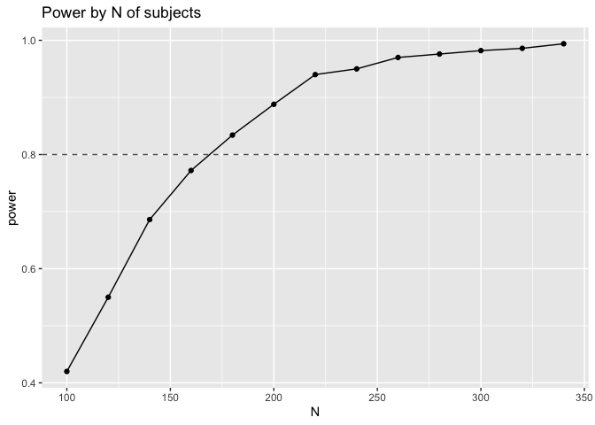

XOr-Some Bayesian Power analysis
================
Polina Tsvilodub
9/14/2021

For the main xor-some experiment, we conduct a simulation-based Bayesian
power analysis (used in a (loose) sense of determining the required
sample size here). This power analysis aims at determining how many
participants are required in order to detect a theoretically motivated
conjunctive effect of the predictors prior, relevance and competence
with a confidence of at least .8. The simulations are based on an
assumed effect size \(\beta = 0.15\) for all predictors, and a region of
practical equivalence (ROPE) \(\delta = 0.05\) for judging evidence for
the directionality of a coefficient given the data. The simulations are
further based on the maximal desired model justified theoretically and
by the design: `rating = trigger * prior * competence * relevance`

In general, the power analysis proceeds as follows:

  - the desired effect sizes of the critical predictors are set to
    \(0.15\)
  - hypothetical experimental data is simulated by drawing samples from
    a Normal distribution with the parameters described above
  - the desired maximal Bayesian regression model is computed on the
    simulated data
  - the N of subjects for which the data is simulated is increased
    iteratively in steps of 20 starting at 100 up to 340.
  - for each N, the model is re-computed on the simulated samples for
    k=100 iterations (the more, the better the power estimate, but there
    are computational constraints)
  - for each iteration \(i_k\), the conjunctive hypothesis of interest
    is tested
  - the power for the given number of participants is calculated as the
    proportion of iterations for which the conjunctive hypothesis was
    credible (i.e., if the posterior probability
    \(P(\beta_X > \delta \mid D)\) is at least \(.95\), for
    \(\delta = 0.05\) the parameter that defines our ROPE for the
    conjunction of all three predictor coefficients, for all six
    sub-hypotheses).
  - we aim to determine the number of participants for which that
    proportion is at least .8.

## Simulate initial data

We assume an effect size of 0.15 for the predictors prior, competence
and relevance. We simulate data as coming from a Normal distribution
with \(\mu=0\) and \(\sigma=1\) and z -score it, to follow the
experiemental procedure.

The target response variable is simulated via \(\mathcal{N}(\mu_t, 1)\),
with
\(\mu_t = 0.15 * ( \beta_\text{pri} + \beta_\text{comp} + \beta_\text{rel} + \beta_\text{trigger} ) + \text{interactions}\).
The multiplication by 0.15 represent hereby the assumed effect size. The
coefficients for interactions and the trigger effect are assumed to be
0.

From each participant, we get four data points for xor and four data
points for some, one data point per condition (prior X competence X
relevance, mapped to triggers at random). Therefore, we simulate 8
trials per subject.

``` r
# create fake data
create_fake_data <- function(N = 100, seed = 1) {
  set.seed(seed)
  beta_rel  <- 0.15
  beta_comp <- 0.15
  beta_pri  <- 0.15
  map_df(
    1:N, 
    function(i) {
      tibble(
        subj    = rep(str_c("subj_",i), times = 8),
        trigger = rep(c('or', 'some'), times= 4), 
        rel     = rnorm(8),
        comp    = rnorm(8),
        pri     = rnorm(8)
      ) %>% 
        group_by(subj) %>% 
        mutate(
          rel     = (rel-mean(rel)) / sd(rel),
          comp    = (comp-mean(comp)) / sd(comp),
          pri     = (pri-mean(pri)) / sd(pri)
        ) %>% 
        ungroup() %>% 
        mutate(
          target  = rnorm(8, beta_rel * rel + beta_comp * comp + beta_pri * pri)
        )
    }
  )
}
```

## Compute initial model

Next, the seed model is computed on the initial simulated dataset. This
model will only be updated in further steps when the model is re-fit.

``` r
# create initial dataset 
initial_fake_data <- create_fake_data(N=100, seed = 1234)

# initial fit
fit_initial <- brm(bf(target ~ rel * comp * pri,
                      decomp = "QR"), 
                   initial_fake_data)
```

    ## Compiling the C++ model

    ## Trying to compile a simple C file

    ## Running /Library/Frameworks/R.framework/Resources/bin/R CMD SHLIB foo.c
    ## clang -I"/Library/Frameworks/R.framework/Resources/include" -DNDEBUG   -I"/Library/Frameworks/R.framework/Versions/3.6/Resources/library/Rcpp/include/"  -I"/Library/Frameworks/R.framework/Versions/3.6/Resources/library/RcppEigen/include/"  -I"/Library/Frameworks/R.framework/Versions/3.6/Resources/library/RcppEigen/include/unsupported"  -I"/Library/Frameworks/R.framework/Versions/3.6/Resources/library/BH/include" -I"/Library/Frameworks/R.framework/Versions/3.6/Resources/library/StanHeaders/include/src/"  -I"/Library/Frameworks/R.framework/Versions/3.6/Resources/library/StanHeaders/include/"  -I"/Library/Frameworks/R.framework/Versions/3.6/Resources/library/rstan/include" -DEIGEN_NO_DEBUG  -D_REENTRANT  -DBOOST_DISABLE_ASSERTS -DBOOST_PENDING_INTEGER_LOG2_HPP -include stan/math/prim/mat/fun/Eigen.hpp   -isysroot /Library/Developer/CommandLineTools/SDKs/MacOSX.sdk -I/usr/local/include  -fPIC  -isysroot /Library/Developer/CommandLineTools/SDKs/MacOSX.sdk -c foo.c -o foo.o
    ## In file included from <built-in>:1:
    ## In file included from /Library/Frameworks/R.framework/Versions/3.6/Resources/library/StanHeaders/include/stan/math/prim/mat/fun/Eigen.hpp:13:
    ## In file included from /Library/Frameworks/R.framework/Versions/3.6/Resources/library/RcppEigen/include/Eigen/Dense:1:
    ## In file included from /Library/Frameworks/R.framework/Versions/3.6/Resources/library/RcppEigen/include/Eigen/Core:88:
    ## /Library/Frameworks/R.framework/Versions/3.6/Resources/library/RcppEigen/include/Eigen/src/Core/util/Macros.h:613:1: error: unknown type name 'namespace'
    ## namespace Eigen {
    ## ^
    ## /Library/Frameworks/R.framework/Versions/3.6/Resources/library/RcppEigen/include/Eigen/src/Core/util/Macros.h:613:16: error: expected ';' after top level declarator
    ## namespace Eigen {
    ##                ^
    ##                ;
    ## In file included from <built-in>:1:
    ## In file included from /Library/Frameworks/R.framework/Versions/3.6/Resources/library/StanHeaders/include/stan/math/prim/mat/fun/Eigen.hpp:13:
    ## In file included from /Library/Frameworks/R.framework/Versions/3.6/Resources/library/RcppEigen/include/Eigen/Dense:1:
    ## /Library/Frameworks/R.framework/Versions/3.6/Resources/library/RcppEigen/include/Eigen/Core:96:10: fatal error: 'complex' file not found
    ## #include <complex>
    ##          ^~~~~~~~~
    ## 3 errors generated.
    ## make: *** [foo.o] Error 1

    ## Start sampling

    ## 
    ## SAMPLING FOR MODEL 'ba1d84526fb4d3f52dfdcc0b1a659da2' NOW (CHAIN 1).
    ## Chain 1: 
    ## Chain 1: Gradient evaluation took 2.3e-05 seconds
    ## Chain 1: 1000 transitions using 10 leapfrog steps per transition would take 0.23 seconds.
    ## Chain 1: Adjust your expectations accordingly!
    ## Chain 1: 
    ## Chain 1: 
    ## Chain 1: Iteration:    1 / 2000 [  0%]  (Warmup)
    ## Chain 1: Iteration:  200 / 2000 [ 10%]  (Warmup)
    ## Chain 1: Iteration:  400 / 2000 [ 20%]  (Warmup)
    ## Chain 1: Iteration:  600 / 2000 [ 30%]  (Warmup)
    ## Chain 1: Iteration:  800 / 2000 [ 40%]  (Warmup)
    ## Chain 1: Iteration: 1000 / 2000 [ 50%]  (Warmup)
    ## Chain 1: Iteration: 1001 / 2000 [ 50%]  (Sampling)
    ## Chain 1: Iteration: 1200 / 2000 [ 60%]  (Sampling)
    ## Chain 1: Iteration: 1400 / 2000 [ 70%]  (Sampling)
    ## Chain 1: Iteration: 1600 / 2000 [ 80%]  (Sampling)
    ## Chain 1: Iteration: 1800 / 2000 [ 90%]  (Sampling)
    ## Chain 1: Iteration: 2000 / 2000 [100%]  (Sampling)
    ## Chain 1: 
    ## Chain 1:  Elapsed Time: 0.051216 seconds (Warm-up)
    ## Chain 1:                0.056423 seconds (Sampling)
    ## Chain 1:                0.107639 seconds (Total)
    ## Chain 1: 
    ## 
    ## SAMPLING FOR MODEL 'ba1d84526fb4d3f52dfdcc0b1a659da2' NOW (CHAIN 2).
    ## Chain 2: 
    ## Chain 2: Gradient evaluation took 1e-05 seconds
    ## Chain 2: 1000 transitions using 10 leapfrog steps per transition would take 0.1 seconds.
    ## Chain 2: Adjust your expectations accordingly!
    ## Chain 2: 
    ## Chain 2: 
    ## Chain 2: Iteration:    1 / 2000 [  0%]  (Warmup)
    ## Chain 2: Iteration:  200 / 2000 [ 10%]  (Warmup)
    ## Chain 2: Iteration:  400 / 2000 [ 20%]  (Warmup)
    ## Chain 2: Iteration:  600 / 2000 [ 30%]  (Warmup)
    ## Chain 2: Iteration:  800 / 2000 [ 40%]  (Warmup)
    ## Chain 2: Iteration: 1000 / 2000 [ 50%]  (Warmup)
    ## Chain 2: Iteration: 1001 / 2000 [ 50%]  (Sampling)
    ## Chain 2: Iteration: 1200 / 2000 [ 60%]  (Sampling)
    ## Chain 2: Iteration: 1400 / 2000 [ 70%]  (Sampling)
    ## Chain 2: Iteration: 1600 / 2000 [ 80%]  (Sampling)
    ## Chain 2: Iteration: 1800 / 2000 [ 90%]  (Sampling)
    ## Chain 2: Iteration: 2000 / 2000 [100%]  (Sampling)
    ## Chain 2: 
    ## Chain 2:  Elapsed Time: 0.051632 seconds (Warm-up)
    ## Chain 2:                0.055 seconds (Sampling)
    ## Chain 2:                0.106632 seconds (Total)
    ## Chain 2: 
    ## 
    ## SAMPLING FOR MODEL 'ba1d84526fb4d3f52dfdcc0b1a659da2' NOW (CHAIN 3).
    ## Chain 3: 
    ## Chain 3: Gradient evaluation took 9e-06 seconds
    ## Chain 3: 1000 transitions using 10 leapfrog steps per transition would take 0.09 seconds.
    ## Chain 3: Adjust your expectations accordingly!
    ## Chain 3: 
    ## Chain 3: 
    ## Chain 3: Iteration:    1 / 2000 [  0%]  (Warmup)
    ## Chain 3: Iteration:  200 / 2000 [ 10%]  (Warmup)
    ## Chain 3: Iteration:  400 / 2000 [ 20%]  (Warmup)
    ## Chain 3: Iteration:  600 / 2000 [ 30%]  (Warmup)
    ## Chain 3: Iteration:  800 / 2000 [ 40%]  (Warmup)
    ## Chain 3: Iteration: 1000 / 2000 [ 50%]  (Warmup)
    ## Chain 3: Iteration: 1001 / 2000 [ 50%]  (Sampling)
    ## Chain 3: Iteration: 1200 / 2000 [ 60%]  (Sampling)
    ## Chain 3: Iteration: 1400 / 2000 [ 70%]  (Sampling)
    ## Chain 3: Iteration: 1600 / 2000 [ 80%]  (Sampling)
    ## Chain 3: Iteration: 1800 / 2000 [ 90%]  (Sampling)
    ## Chain 3: Iteration: 2000 / 2000 [100%]  (Sampling)
    ## Chain 3: 
    ## Chain 3:  Elapsed Time: 0.051368 seconds (Warm-up)
    ## Chain 3:                0.054247 seconds (Sampling)
    ## Chain 3:                0.105615 seconds (Total)
    ## Chain 3: 
    ## 
    ## SAMPLING FOR MODEL 'ba1d84526fb4d3f52dfdcc0b1a659da2' NOW (CHAIN 4).
    ## Chain 4: 
    ## Chain 4: Gradient evaluation took 1e-05 seconds
    ## Chain 4: 1000 transitions using 10 leapfrog steps per transition would take 0.1 seconds.
    ## Chain 4: Adjust your expectations accordingly!
    ## Chain 4: 
    ## Chain 4: 
    ## Chain 4: Iteration:    1 / 2000 [  0%]  (Warmup)
    ## Chain 4: Iteration:  200 / 2000 [ 10%]  (Warmup)
    ## Chain 4: Iteration:  400 / 2000 [ 20%]  (Warmup)
    ## Chain 4: Iteration:  600 / 2000 [ 30%]  (Warmup)
    ## Chain 4: Iteration:  800 / 2000 [ 40%]  (Warmup)
    ## Chain 4: Iteration: 1000 / 2000 [ 50%]  (Warmup)
    ## Chain 4: Iteration: 1001 / 2000 [ 50%]  (Sampling)
    ## Chain 4: Iteration: 1200 / 2000 [ 60%]  (Sampling)
    ## Chain 4: Iteration: 1400 / 2000 [ 70%]  (Sampling)
    ## Chain 4: Iteration: 1600 / 2000 [ 80%]  (Sampling)
    ## Chain 4: Iteration: 1800 / 2000 [ 90%]  (Sampling)
    ## Chain 4: Iteration: 2000 / 2000 [100%]  (Sampling)
    ## Chain 4: 
    ## Chain 4:  Elapsed Time: 0.05362 seconds (Warm-up)
    ## Chain 4:                0.056917 seconds (Sampling)
    ## Chain 4:                0.110537 seconds (Total)
    ## Chain 4:

## Build pipeline for simulating more data and fitting models

Build helper function for simulating and computing regression model for
k iterations (tracked as seeds). Also extract contrasts of interest
here.

``` r
# main results
start_N <- 100
step <- 20
stop_N <-340
seed <- 500

sim_data_fit <- function(N, k){
 results <- map_dbl(
  1:k, 
  function(i) {
    fake_data <- create_fake_data(N=N, seed = i)
    fit <- update(fit_initial, newdata = fake_data, seed = i, cores = 4)
    lower_bounds <- rbind(
      aida::summarize_sample_vector(brms::posterior_samples(fit)[,'b_rel'], "rel"),
      aida::summarize_sample_vector(brms::posterior_samples(fit)[,'b_comp'], "comp"),
      aida::summarize_sample_vector(brms::posterior_samples(fit)[,'b_pri'], "pri")
    ) %>% pull("|95%")
    min(lower_bounds)
  }
 )
 # create path for file
 stream_out <- paste("./results/power_sim_N", N, "_iter", k, ".csv", sep="")
 # create tibble for intermediate saving
 tibble(
   seed = 1:k, lower_bounds = results
 ) %>%
   write_csv(., stream_out)
}

sim_power <- function(seed, start_N, step, stop_N) {
  # iterate over different Ns of subjects
  sim_full <- tibble( N = seq(start_N, stop_N, step)) %>%
    mutate(
      tidy = map(N, sim_data_fit, k = seed)
    ) %>%
    unnest(tidy)
  write_csv(sim_full, paste("./results/power_sim_full_N", start_N, "-N", stop_N, "_iter", seed, ".csv", sep=""), append = T, col_names = T)
}

power_df_500 <- sim_power(seed, start_N, step, stop_N)
```

Below, the results are summarized by simulated N of subjects to obtain
the power estimates (i.e., proportion of simulation runs where all three
effects were \>0.05).

``` r
# analyse power summary
power_results_500 <- power_df_500 %>% group_by(N) %>% 
  summarise(power = mean(lower_bounds > 0.05))
```

    ## `summarise()` ungrouping output (override with `.groups` argument)

``` r
write_csv(power_results_500, "./results/power_sim_500_results_summary.csv")

power_results_500
```

    ## # A tibble: 13 x 2
    ##        N power
    ##    <dbl> <dbl>
    ##  1   100 0.42 
    ##  2   120 0.55 
    ##  3   140 0.686
    ##  4   160 0.772
    ##  5   180 0.834
    ##  6   200 0.888
    ##  7   220 0.94 
    ##  8   240 0.95 
    ##  9   260 0.97 
    ## 10   280 0.976
    ## 11   300 0.982
    ## 12   320 0.986
    ## 13   340 0.994

Finally, power results are visualized as a function of the N of
subjects:

``` r
power_results_500 %>%
  ggplot(., aes(x = N, y = power)) +
  geom_line() +
  geom_point() +
  geom_hline(yintercept = 0.8, alpha = 0.7, linetype = 2) +
  ggtitle("Power by N of subjects") 
```

<!-- -->

``` r
ggsave("./results/power_sim_results_plot.png")
```

    ## Saving 7 x 5 in image
