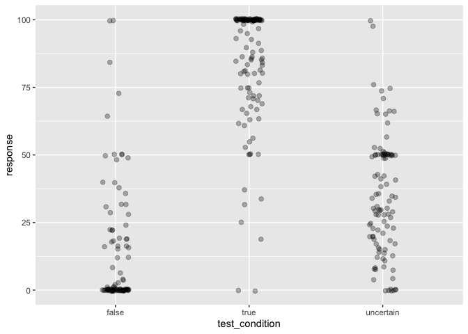
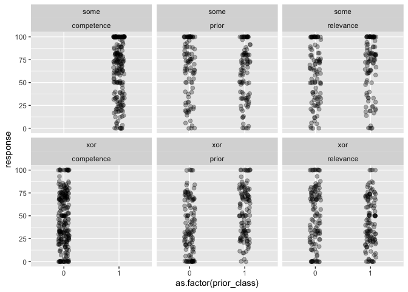
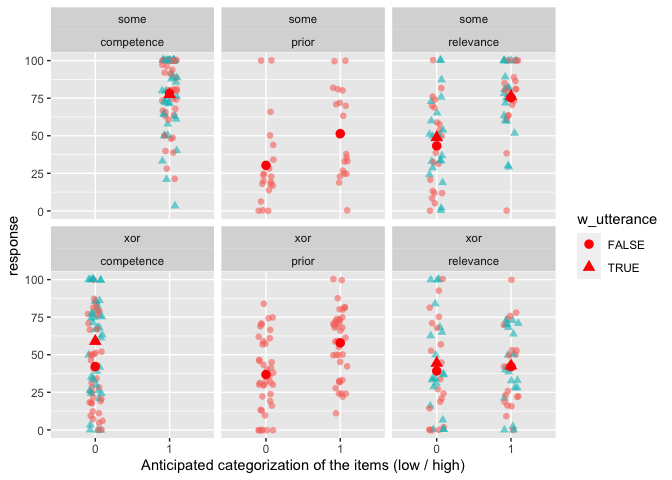

XOR-Some Prolific Pilot 1
================
Polina Tsvilodub
3/24/2021

In this first pilot on Prolific we test the implementation of the xor
study in magpie. The structure of the experiment was as follows:
Participants read instructions, completed three example trials, and then
completed 8 main blocks consisting of 4 xor and 4 some items. Each main
block had the following structure: Participants read the background
story, answered one comprehension question, then answered competence /
relevance / prior questions in randomized order; then they read another
3 comprehension questions, after which the critical utterance was added
below the background story. They answered the inference strength
question, and then competence / relevance questions in randomized order
again.

N=10 participants were recruited for this pilot and compensated 2
pounds/participant.

``` r
library(tidyverse)
```

    ## -- Attaching packages --------------------------------------- tidyverse 1.3.0 --

    ## v ggplot2 3.3.2     v purrr   0.3.4
    ## v tibble  3.0.4     v dplyr   1.0.2
    ## v tidyr   1.1.2     v stringr 1.4.0
    ## v readr   1.4.0     v forcats 0.5.0

    ## -- Conflicts ------------------------------------------ tidyverse_conflicts() --
    ## x dplyr::filter() masks stats::filter()
    ## x dplyr::lag()    masks stats::lag()

``` r
d <- read_csv("../data/pilots/results_58_xor-some-Prolific-pilot1_N10.csv")
```

    ## 
    ## -- Column specification --------------------------------------------------------
    ## cols(
    ##   .default = col_character(),
    ##   submission_id = col_double(),
    ##   ID = col_double(),
    ##   RT = col_double(),
    ##   age = col_double(),
    ##   competence = col_double(),
    ##   endTime = col_double(),
    ##   experiment_id = col_double(),
    ##   prior = col_double(),
    ##   relevance = col_double(),
    ##   response = col_double(),
    ##   startTime = col_double(),
    ##   timeSpent = col_double(),
    ##   trial_number = col_double()
    ## )
    ## i Use `spec()` for the full column specifications.

Checking if there are any comments indicating technical issues:

``` r
d %>% distinct(comments)
```

    ## # A tibble: 2 x 1
    ##   comments
    ##   <chr>   
    ## 1 N/A     
    ## 2 <NA>

Check native languages. In the main experiment, participants not
indicating English as (one of) their native language(s) will be
excluded. We also compute some participant demographics.

``` r
d %>% distinct(languages)
```

    ## # A tibble: 4 x 1
    ##   languages         
    ##   <chr>             
    ## 1 English           
    ## 2 english           
    ## 3 Australian English
    ## 4 Setswana

``` r
# exclude non-natives if necessary
d_native <- d

d_native %>% pull(age) %>% mean(., na.rm = T) 
```

    ## [1] 28.2

``` r
d_native %>% count(gender) %>% mutate(n = n/88)
```

    ## # A tibble: 3 x 2
    ##   gender     n
    ##   <chr>  <dbl>
    ## 1 female     5
    ## 2 male       4
    ## 3 other      1

Next, we check whether all the conditions were used correctly.

``` r
# check xor/some vs. trial type
d_native %>% count(main_type, condition) 
```

    ## # A tibble: 5 x 3
    ##   main_type condition     n
    ##   <chr>     <chr>     <int>
    ## 1 some      critical    240
    ## 2 some      test        160
    ## 3 xor       critical    280
    ## 4 xor       test        160
    ## 5 <NA>      example      40

``` r
# check xor/some vs. experimental condition
d_native %>% count(main_type, exp_condition)
```

    ## # A tibble: 9 x 3
    ##   main_type exp_condition     n
    ##   <chr>     <chr>         <int>
    ## 1 some      hhh             100
    ## 2 some      hhl             100
    ## 3 some      lhh             100
    ## 4 some      lhl             100
    ## 5 xor       hlh             110
    ## 6 xor       hll             110
    ## 7 xor       llh             110
    ## 8 xor       lll             110
    ## 9 <NA>      <NA>             40

``` r
# count items used
d_native %>% count(title)
```

    ## # A tibble: 9 x 2
    ##   title                                                                        n
    ##   <chr>                                                                    <int>
    ## 1 "<font size=\"4\" color= \"#00BFFF\"> EXAMPLE </font> <br/> Joe's shopp~    40
    ## 2 "Brad's clothes"                                                           110
    ## 3 "Carl's party"                                                             110
    ## 4 "Harry Potter"                                                             100
    ## 5 "Jimmy's trip"                                                             110
    ## 6 "Joshua's delay"                                                           110
    ## 7 "Teacher problems"                                                         100
    ## 8 "Van Gogh exhibition"                                                      100
    ## 9 "Youth hostel"                                                             100

Next, we would exclude participants based on their ratings in the main /
example trials (and possibly the bot check) according to preregistered
exclusion criteria. For now, all the data is considered.

``` r
d_native %>% group_by(submission_id) %>% count(response)
```

    ## # A tibble: 398 x 3
    ## # Groups:   submission_id [10]
    ##    submission_id response     n
    ##            <dbl>    <dbl> <int>
    ##  1          1828        0     3
    ##  2          1828        4     1
    ##  3          1828        7     1
    ##  4          1828       12     3
    ##  5          1828       16     1
    ##  6          1828       22     1
    ##  7          1828       24     3
    ##  8          1828       25     2
    ##  9          1828       26     1
    ## 10          1828       28     3
    ## # ... with 388 more rows

``` r
d_main <- d_native %>% filter(trial_name != "example")
d_exmpl <- d_native %>% filter(trial_name == "example")
d_critical <- d_main %>% filter(condition == "critical")

# get overall mean ratings / subject
d_native %>% group_by(submission_id) %>% summarise(mean_rating = mean(response)) %>% arrange(mean_rating)
```

    ## `summarise()` ungrouping output (override with `.groups` argument)

    ## # A tibble: 10 x 2
    ##    submission_id mean_rating
    ##            <dbl>       <dbl>
    ##  1          1837        47.7
    ##  2          1831        51.1
    ##  3          1832        52.9
    ##  4          1836        52.9
    ##  5          1829        53.3
    ##  6          1828        53.6
    ##  7          1834        53.7
    ##  8          1830        57.1
    ##  9          1833        60.3
    ## 10          1835        62.7

Plot responses on example questions by question type

Plot test questions by type

``` r
d_test <- d_main %>% rowwise() %>% filter(condition == "test") %>% 
  mutate(test_condition = substr(test_question, 6, 9),
         test_condition = ifelse(test_condition == "fals", "false", 
                                 ifelse(test_condition == "unce", "uncertain",
                                        test_condition)))

d_test %>% 
  ggplot(., aes(x = test_condition, y = response)) +
  geom_point(size = 2, alpha = 0.3, position = position_jitter(width = 0.1))
```

<!-- -->

``` r
# add mean / CI
```

Plot main rel / comp / pri questions by main condition

``` r
d_critical <- d_critical %>% 
  pivot_longer(c(competence, relevance, prior), 
               names_to = "class_condition", 
               values_to = "prior_class")
d_critical %>% 
  filter(block != "xor" & block != "some") %>%
  ggplot(., aes(x = as.factor(prior_class), y = response)) +
  geom_point(size = 2, alpha = 0.3, position = position_jitter(width = 0.1)) +
    facet_wrap(main_type~class_condition)
```

<!-- -->
Plot main rel / comp questions by main condition, separated into with /
without critical utterance

``` r
# add info to already record this
d_critical <- d_critical %>% 
  mutate(w_utterance = ifelse(is.na(critical_question), F, T),
         block = ifelse(block == "comp", "competence", 
                        ifelse(block == "rel", "relevance", ifelse(block == "pri", "prior", block) )))

d_critical %>% 
  filter(block != "xor" & block != "some") %>%
  filter(block == class_condition) %>%
  ggplot(., aes(x = as.factor(prior_class), y = response, color = w_utterance)) +
  geom_point(size = 2, alpha = 0.3, position = position_jitter(width = 0.1)) +
    facet_wrap(main_type~class_condition) # get ratings from the respective trials only 
```

<!-- -->

``` r
# use block for getting the actual correct ratings, but class_condition for subsetting the prior classification fo the respective predictor 

# # some condition was wrongly recorded as pri
# d_critical %>% 
#      filter(block != "xor" & block != "some") %>%
#      filter(block == class_condition) %>% filter(block == "prior" & w_utterance == T) %>%
#   View()
 
d_critical %>% 
  filter(block != "xor" & block != "some") %>%
  filter(block == class_condition) %>%
  group_by(main_type, class_condition, w_utterance, prior_class) %>% 
  summarize(mean_response = mean(response))
```

    ## `summarise()` regrouping output by 'main_type', 'class_condition', 'w_utterance' (override with `.groups` argument)

    ## # A tibble: 16 x 5
    ## # Groups:   main_type, class_condition, w_utterance [10]
    ##    main_type class_condition w_utterance prior_class mean_response
    ##    <chr>     <chr>           <lgl>             <dbl>         <dbl>
    ##  1 some      competence      FALSE                 1          78.1
    ##  2 some      competence      TRUE                  1          77.5
    ##  3 some      prior           FALSE                 0          30.3
    ##  4 some      prior           FALSE                 1          51.4
    ##  5 some      relevance       FALSE                 0          43.2
    ##  6 some      relevance       FALSE                 1          75.3
    ##  7 some      relevance       TRUE                  0          48.8
    ##  8 some      relevance       TRUE                  1          76.4
    ##  9 xor       competence      FALSE                 0          42.2
    ## 10 xor       competence      TRUE                  0          59  
    ## 11 xor       prior           FALSE                 0          36.8
    ## 12 xor       prior           FALSE                 1          57.9
    ## 13 xor       relevance       FALSE                 0          39.2
    ## 14 xor       relevance       FALSE                 1          42.0
    ## 15 xor       relevance       TRUE                  0          44.4
    ## 16 xor       relevance       TRUE                  1          42.8

plot inference rating as a function of respective rating of the
explanatory factor (think about a plot where one would see an
interaction)
