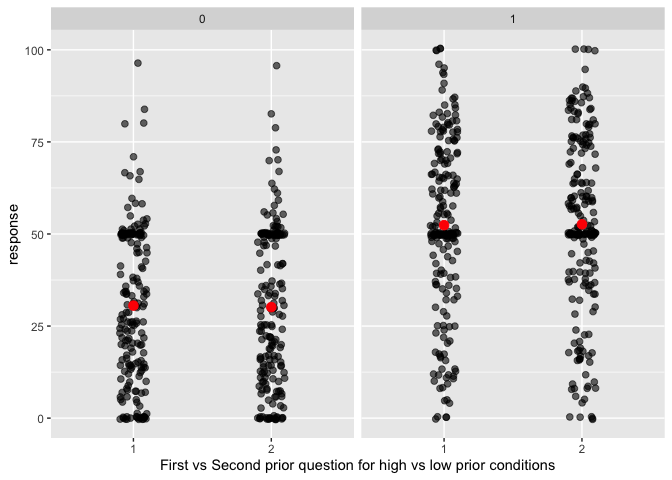
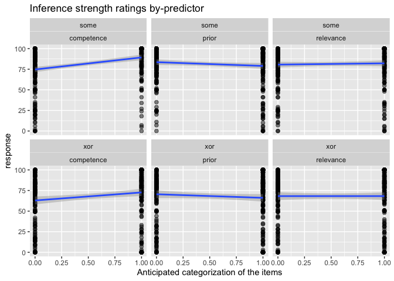
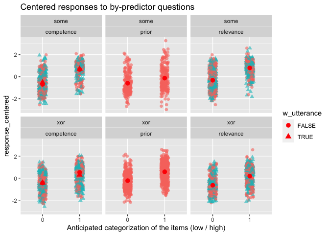

XOR-Some Prolific Pilot 2
================
Polina Tsvilodub
4/2/2021

In this second pilot on Prolific we gather a more substantial amount of
pilot data for the xor-some study on Prolific. The structure of the
experiment was as follows: Participants read instructions, completed
three example trials, and then completed 8 main blocks consisting of 4
xor and 4 some items. Each main block had the following structure:
Participants read the background story, answered one comprehension
question, then answered competence / relevance / prior questions in
randomized order; then they read another 3 comprehension questions,
after which the critical utterance was added below the background story.
They answered the inference strength question, and then competence /
relevance questions in randomized order again.

N=118 participants were recruited for this pilot and compensated 2
pounds/participant. 8 items (4 some + 4 xor) were sampled at random for
each participant such that each participant saw one item in each
condition (relevance X competence X prior = 8 unique conditions).

## Checks & Exclusions

Checking if there are any comments indicating technical issues which is
not the case:

``` r
d %>% distinct(comments) %>% View()
```

Check native languages. Participants not indicating English as (one of)
their native language(s) are be excluded. We also compute some
participant demographics.

``` r
d %>% distinct(languages)
```

    ## # A tibble: 17 x 1
    ##    languages          
    ##    <chr>              
    ##  1 English            
    ##  2 engish             
    ##  3 english            
    ##  4 English & Yoruba   
    ##  5 Polish/English     
    ##  6 <NA>               
    ##  7 English, Arabic    
    ##  8 Englid             
    ##  9 ENGLISH            
    ## 10 English; Portuguese
    ## 11 british            
    ## 12 Englks             
    ## 13 Spanish            
    ## 14 English. Afrikaans 
    ## 15 English, Malay     
    ## 16 english, punjabi   
    ## 17 English, French

``` r
cat("Number of partiipants before excluding non-natives: ", d %>% distinct(submission_id) %>% count() %>% pull() ) 
```

    ## Number of partiipants before excluding non-natives:  118

``` r
# exclude non-natives if necessary
d_native <- d %>% 
 # filter(("en" | "En" | "bri") %in% languages)
  filter(grepl("[(en)(br)]", languages, ignore.case = T))

cat("Number of partiipants after excluding non-natives: ", d_native %>% distinct(submission_id) %>% count() %>% pull() )
```

    ## Number of partiipants after excluding non-natives:  116

``` r
cat("Mean age: ", d_native %>% pull(age) %>% mean(., na.rm = T) )
```

    ## Mean age:  35.25

``` r
d_native %>% count(gender) %>% mutate(n = n/88)
```

    ## # A tibble: 2 x 2
    ##   gender     n
    ##   <chr>  <dbl>
    ## 1 female    75
    ## 2 male      41

Next, we check whether all the conditions were used correctly.

``` r
# check xor/some vs. trial type
d_native %>% count(main_type, condition) 
```

    ## # A tibble: 5 x 3
    ##   main_type condition     n
    ##   <chr>     <chr>     <int>
    ## 1 some      critical   2784
    ## 2 some      test       1856
    ## 3 xor       critical   3248
    ## 4 xor       test       1856
    ## 5 <NA>      example     464

``` r
# check xor/some vs. experimental condition
d_native %>% count(main_type, exp_condition)
```

    ## # A tibble: 17 x 3
    ##    main_type exp_condition     n
    ##    <chr>     <chr>         <int>
    ##  1 some      hhh             490
    ##  2 some      hhl             550
    ##  3 some      hlh             620
    ##  4 some      hll             620
    ##  5 some      lhh             510
    ##  6 some      lhl             570
    ##  7 some      llh             620
    ##  8 some      lll             660
    ##  9 xor       hhh             737
    ## 10 xor       hhl             671
    ## 11 xor       hlh             594
    ## 12 xor       hll             594
    ## 13 xor       lhh             715
    ## 14 xor       lhl             649
    ## 15 xor       llh             594
    ## 16 xor       lll             550
    ## 17 <NA>      <NA>            464

``` r
# count items used
d_native %>% count(title)
```

    ## # A tibble: 65 x 2
    ##    title                                                                       n
    ##    <chr>                                                                   <int>
    ##  1 "<font size=\"4\" color= \"#00BFFF\"> EXAMPLE </font> <br/> Joe's shop…   464
    ##  2 "Alex's racket"                                                           231
    ##  3 "Alissa's paint"                                                          132
    ##  4 "Attendance"                                                              150
    ##  5 "Bill's order"                                                            220
    ##  6 "Brad Pitt"                                                                66
    ##  7 "Brad's clothes"                                                          154
    ##  8 "Carl's party"                                                            198
    ##  9 "Champagne reception"                                                     160
    ## 10 "Chloe's holiday"                                                         143
    ## # … with 55 more rows

Check the time participants spent overall on the experiment before
cleaning the data:

``` r
overall_timeSpent <- d_native %>% mutate(timeSpent = round(timeSpent, 2)) %>% distinct(timeSpent) 

#  summarize(timeCounts = count(timeSpent) / d_native %>% )
ggplot(data = overall_timeSpent, aes(y=timeSpent, alpha = 0.7)) +
  geom_boxplot() +
  ggtitle("Overall time participants took in mins")
```

<!-- -->

``` r
d_main <- d_native %>% select(-age, -botresponse, -comments, -education, -endTime, 
                              -gender, -languages, -optionLeft, -optionRight, -startDate,
                              -startTime, -timeSpent) %>%
  filter(trial_name != "example")
d_exmpl <- d_native %>% select(-age, -botresponse, -comments, -education, -endTime, 
                              -gender, -languages, -optionLeft, -optionRight, -startDate,
                              -startTime, -timeSpent) %>%
  filter(trial_name == "example")
d_critical <- d_main %>% filter(condition == "critical")
```

Plot responses on comprehension questions by type before applying
exclusion criteria:

    ## Warning: `as_data_frame()` is deprecated as of tibble 2.0.0.
    ## Please use `as_tibble()` instead.
    ## The signature and semantics have changed, see `?as_tibble`.
    ## This warning is displayed once every 8 hours.
    ## Call `lifecycle::last_warnings()` to see where this warning was generated.

    ## Warning: `cols` is now required when using unnest().
    ## Please use `cols = c(strap)`

<!-- -->

Next, we exclude participants based on their ratings in the main trials:
Participants who gave all responses within the range of 10 and
participants who failed more than 0.2 of the comprehension questions are
excluded from analysis. Participants who failed all example trials are
excluded, as well. The bot check trial is not considered for exclusions.

``` r
# get participants failing example trials
d_exmpl <- d_exmpl %>% group_by(submission_id) %>% 
  mutate(example_condition = ifelse(grepl("as certainly true", question), "true", 
                                    ifelse(grepl("as certainly false", question), "false",
                                           "uncertain")),
         passed_example_trial = case_when(example_condition == "true" ~ response >= 80,
                                    example_condition == "false" ~ response <= 20,
                                    example_condition == "uncertain" ~ response >= 30),
       #  check if all trials passed
         passed_example = case_when(sum(passed_example_trial) == 0 ~ FALSE,
                                    TRUE ~ TRUE)
         ) %>% filter(passed_example == F)

cat("Subjects failing the example trials: ", d_exmpl %>% distinct(submission_id) %>% pull() %>% length())
```

    ## Subjects failing the example trials:  0

``` r
# apply exclusion criteria to main trials
# check range of responses per participant
d_main_fail <- d_main %>% group_by(submission_id) %>%
  mutate(passed_main = case_when(max(response) - min(response) <= 10 ~ FALSE,
                                 TRUE ~ TRUE)
         ) %>% filter(passed_main == F)
cat("Subjects providing the same ratings throughout the trials: ", d_main_fail %>% distinct(submission_id) %>% pull() %>% length())
```

    ## Subjects providing the same ratings throughout the trials:  0

``` r
# get participants failing comprehension questions
d_test <- d_test %>%
  group_by(submission_id) %>%
  mutate(passed_filler_trial = case_when(test_condition == "true" ~ response >= 70,
                                   test_condition == "false" ~ response <= 40,
                                   test_condition == "uncertain" ~ response %in% (0:90)),
         mean_comprehension = mean(passed_filler_trial),
         passed_filler = mean_comprehension >= 0.8
         ) %>%
  filter(passed_filler == F)

cat("Subjects failing the comprehension trials: ", d_test %>% distinct(submission_id) %>% pull() %>% length())
```

    ## Subjects failing the comprehension trials:  17

``` r
# put it all together
d_full_clean <- anti_join(d_main, d_main_fail, by = "submission_id")
d_full_clean <- anti_join(d_full_clean, d_exmpl, d_test, by = "submission_id")
d_full_clean <- anti_join(d_full_clean, d_test, by = "submission_id")

cat("Nr. of participants left after cleaning: ", d_full_clean %>% distinct(submission_id) %>% pull() %>% length())
```

    ## Nr. of participants left after cleaning:  99

``` r
# get overall mean ratings / subject
d_full_clean %>% group_by(submission_id) %>% summarise(mean_rating = mean(response)) %>% arrange(mean_rating)
```

    ## # A tibble: 99 x 2
    ##    submission_id mean_rating
    ##            <dbl>       <dbl>
    ##  1          1960        30.0
    ##  2          1956        36.7
    ##  3          1920        39.3
    ##  4          1864        39.7
    ##  5          1950        40.4
    ##  6          1896        42.6
    ##  7          1901        43.2
    ##  8          1878        44.1
    ##  9          1900        44.8
    ## 10          1935        45.0
    ## # … with 89 more rows

## Plots

Plot main rel / comp / prior questions by main condition and by prior
classification of the item (x-axis), separated into with / without
critical utterance (shape, color). The prior questions were only used
without the utterance.

``` r
d_critical_long <- d_critical_long %>% 
  mutate(w_utterance = ifelse(is.na(critical_question), F, T),
         block = ifelse(block == "comp", "competence", 
                        ifelse(block == "rel", "relevance", ifelse(block == "pri", "prior", block) )))
d_critical_long %>% 
  filter(block != "xor" & block != "some") %>%
  filter(block == class_condition) %>%
  group_by(main_type, class_condition, w_utterance, prior_class) %>% 
  summarize(mean_response = mean(response)) -> d_critical_summary

d_critical_long %>% 
  filter(block != "xor" & block != "some") %>%
  filter(block == class_condition) %>%
  ggplot(., aes(x = as.factor(prior_class), y = response, shape = w_utterance, color = w_utterance)) +
  geom_point(size = 2, alpha = 0.6, position = position_jitter(width = 0.1)) +
  geom_point(data = d_critical_summary, aes(x = as.factor(prior_class), y = mean_response, shape = w_utterance), 
             color = "red", size = 3) +
  xlab("Anticipated categorization of the items (low / high)") +
  facet_wrap(main_type~class_condition) # get ratings from the respective trials only 
```

<!-- -->

``` r
# check whether the ratings in the two prior questions are the same in xor 
d_critical_long %>% 
  filter(block != "xor" & block != "some") %>%
  filter(block == class_condition) %>%
  filter(block == "prior", main_type == "xor") %>%
  mutate(priorQ_nr = rep(c(1,2), 396)) -> d_xor_priors
d_xor_priors %>% group_by(priorQ_nr, prior_class) %>%
  summarise(mean = mean(response)) -> d_xor_priors_summary
d_xor_priors %>%
  ggplot(., aes(x = as.factor(priorQ_nr), y = response )) +
  geom_point(size = 2, alpha = 0.6, position = position_jitter(width = 0.1)) +
  geom_point(data = d_xor_priors_summary, aes(x = as.factor(priorQ_nr), y = mean), color = "red", size = 3) +
  xlab("First vs Second prior question for high vs low prior conditions") +
  facet_wrap(~as.factor(prior_class)) # get ratings from the respective trials only 
```

<!-- -->

Plot inference ratings as a function of *anticipated* rating of the
explanatory factor, similar to the paper:

``` r
d_critical_long %>% 
  filter(block == "xor" | block == "some") %>%
  #group_by(block, class_condition, prior_class) %>%
  #summarize(mean_rating = mean(response)) %>%
  ggplot(., aes(x = prior_class, y = response)) +
  geom_point(size = 2, alpha = 0.5) +
  geom_smooth(method="lm") +
  facet_wrap(block~class_condition) +
  xlab("Anticipated categorization of the items") +
  ggtitle("Inference strength ratings by-predictor")
```

<!-- -->
Create more extensive condition labels, including information about
whether a rating was produced with or without the utterance given.

``` r
# extending 'conditions' labels to include whether the utterance was present or not
d_critical_long <- d_critical_long %>% 
  mutate(block_extended = ifelse(
    !w_utterance, 
    block, 
    ifelse(block %in% c("some", "xor"), "target", str_c(block, "_wUtt", ""))
  ))
```

``` r
# make a versatile wide representation of the critical data
d_critical_wide <- d_critical_long %>% 
  select(submission_id, title, main_type, block_extended, response) %>% 
  unique() %>% 
  pivot_wider(
    names_from = block_extended, 
    values_from = response, 
    values_fn = mean # getting means for double prior measurement in "xor"
  ) 
```

Plot inference strength ratings against raw predictor ratings for each
participant / each item:

``` r
d_critical_wide %>%
  ggplot(., aes(x = relevance, y = target)) +
  geom_point(size = 2, alpha = 0.7) +
  geom_smooth(method = "lm") +
  facet_wrap(~main_type, ncol = 1) -> p.rel

d_critical_wide %>%
  ggplot(., aes(x = competence, y = target)) +
  geom_point(size = 2, alpha = 0.7) +
  geom_smooth(method = "lm") +
  ylab("") +
  facet_wrap(~main_type, ncol = 1) -> p.comp

d_critical_wide %>%
  ggplot(., aes(x = prior, y = target)) +
  geom_point(size = 2, alpha = 0.7) +
  geom_smooth(method = "lm") +
  ylab("") +
  facet_wrap(~main_type, ncol = 1) -> p.pri

gridExtra::grid.arrange(p.rel, p.comp, p.pri, ncol = 3) 
```

<!-- -->

Plot mean ratings (across all participants) for each vignette (with its
respective condition indicated in the facet title, in the order
relevance/competence/prior), in each condition. For relevance and
competence, the color indicates whether it was presented without the
utterance or with.

``` r
bar.width = 0.8
d_critical_long %>% 
  mutate(title = paste(title, exp_condition, sep = "_")) %>%
  filter(block == class_condition | block == "xor" | block == "some") %>%
  group_by(block_extended, title, w_utterance, main_type) %>%
  summarize(mean_rating = mean(response)) %>% 
  ggplot(., aes(x = block_extended, y = mean_rating, fill = w_utterance)) +
  geom_col(alpha = 0.7, width = bar.width, position = position_dodge(width = bar.width)) +
  #geom_point(size = 2, alpha = 0.5, position = position_jitter(width = 0.1)) +
  facet_wrap(main_type~title, ncol = 4) +
  theme(axis.text.x = element_text(angle = 45, hjust = 1)) +
  ggtitle("By-item by-question mean ratings")
```

<!-- -->

``` r
# correlation plot for "some"
GGally::ggpairs(
  filter(d_critical_wide, main_type == "some") %>%  
    select(prior:ncol(d_critical_wide))
)
```

<!-- -->

``` r
# correlation plot for "or"
GGally::ggpairs(
  filter(d_critical_wide, main_type == "xor") %>%  
    select(prior:ncol(d_critical_wide))
  )
```

<!-- -->

Check by-participant behavior to see if they show versatile response
strategies for the different questions for xor vs. some. Participants
show a sufficient range of responses across conditions.

``` r
d_critical_long %>%
  filter(block == class_condition | block == "xor" | block == "some") %>%
  ggplot(., aes(x = block, y = response, color = block)) +
  geom_point(alpha = 0.7, size = 2) + 
  facet_wrap(main_type~submission_id, ncol = 10) +
  theme(axis.text.x = element_text(angle = 45, hjust = 1)) +
  ggtitle("By-participant ratings all xor vs. some trials")
```

<!-- -->

## Explore z-scoring

Visual exploration of z-scoring each measure (rel / comp / pri / target
/ comp-wUtterance / rel-wUtterance) per participant, collapsing some and
or together.

``` r
d_critical_zScored <- d_critical_long %>% group_by(submission_id, block_extended) %>%
  mutate(block_mean = mean(response),
         block_sd = sd(response),
         response_centered = (response - block_mean)/block_sd)

d_critical_zScored %>% 
  filter(block != "xor" & block != "some") %>%
  filter(block == class_condition) %>%
  group_by(main_type, class_condition, w_utterance, prior_class) %>% 
  summarize(mean_response = mean(response_centered)) -> d_critical_zScore_summary

d_critical_zScored %>% 
  filter(block != "xor" & block != "some") %>%
  filter(block == class_condition) %>%
  ggplot(., aes(x = as.factor(prior_class), y = response_centered, shape = w_utterance, color = w_utterance)) +
  geom_point(size = 2, alpha = 0.6, position = position_jitter(width = 0.1)) +
  geom_point(data = d_critical_zScore_summary, aes(x = as.factor(prior_class), y = mean_response, shape = w_utterance), 
             color = "red", size = 3) +
  xlab("Anticipated categorization of the items (low / high)") +
  facet_wrap(main_type~class_condition) + # get ratings from the respective trials only 
  ggtitle("Centered responses to by-predictor questions")
```

    ## Warning: Removed 8 rows containing missing values (geom_point).

    ## Warning: Removed 4 rows containing missing values (geom_point).

<!-- -->

Plot z-scored predictor ratings against z-scored target ratings

``` r
d_critical_zScored_wide <- d_critical_zScored %>% 
  select(submission_id, title, main_type, block_extended, response_centered) %>% 
  unique() %>% 
  pivot_wider(
    names_from = block_extended, 
    values_from = response_centered, 
    values_fn = mean # getting means for double prior measurement in "xor"
  ) 
  
d_critical_zScored_wide %>%
  ggplot(., aes(x = relevance, y = target)) +
  geom_point(size = 2, alpha = 0.7) +
  geom_smooth(method = "lm") +
  facet_wrap(~main_type, ncol = 1) -> p.rel.z

d_critical_zScored_wide %>%
  ggplot(., aes(x = competence, y = target)) +
  geom_point(size = 2, alpha = 0.7) +
  geom_smooth(method = "lm") +
  ylab("") +
  facet_wrap(~main_type, ncol = 1) -> p.comp.z

d_critical_zScored_wide %>%
  ggplot(., aes(x = prior, y = target)) +
  geom_point(size = 2, alpha = 0.7) +
  geom_smooth(method = "lm") +
  ylab("") +
  facet_wrap(~main_type, ncol = 1) -> p.pri.z

gridExtra::grid.arrange(p.rel.z, p.comp.z, p.pri.z, ncol = 3) 
```

<!-- -->

## Stats

Maximal models on raw ratings:

``` r
# xor, maximal model with interactions and maximal REs
model_xor <- brm(
  target ~ prior*competence*relevance + 
    (1 + prior + competence + relevance || submission_id) +
    (1 | title),
  data = d_critical_wide %>% filter(main_type == "xor"),
  family = "gaussian",
  cores = 4,
  iter = 3000
)
```

    ## Warning: There were 6000 transitions after warmup that exceeded the maximum treedepth. Increase max_treedepth above 10. See
    ## http://mc-stan.org/misc/warnings.html#maximum-treedepth-exceeded

    ## Warning: Examine the pairs() plot to diagnose sampling problems

    ## Warning: Tail Effective Samples Size (ESS) is too low, indicating posterior variances and tail quantiles may be unreliable.
    ## Running the chains for more iterations may help. See
    ## http://mc-stan.org/misc/warnings.html#tail-ess

``` r
summary(model_xor)
```

    ##  Family: gaussian 
    ##   Links: mu = identity; sigma = identity 
    ## Formula: target ~ prior * competence * relevance + (1 + prior + competence + relevance || submission_id) + (1 | title) 
    ##    Data: d_critical_wide %>% filter(main_type == "xor") (Number of observations: 396) 
    ## Samples: 4 chains, each with iter = 3000; warmup = 1500; thin = 1;
    ##          total post-warmup samples = 6000
    ## 
    ## Group-Level Effects: 
    ## ~submission_id (Number of levels: 99) 
    ##                Estimate Est.Error l-95% CI u-95% CI Rhat Bulk_ESS Tail_ESS
    ## sd(Intercept)     17.07      2.94    10.93    22.46 1.00      909     1493
    ## sd(prior)          0.10      0.07     0.01     0.25 1.00      641     1372
    ## sd(competence)     0.14      0.06     0.01     0.25 1.01      420      612
    ## sd(relevance)      0.09      0.06     0.01     0.21 1.00      659     1531
    ## 
    ## ~title (Number of levels: 32) 
    ##               Estimate Est.Error l-95% CI u-95% CI Rhat Bulk_ESS Tail_ESS
    ## sd(Intercept)     9.52      4.17     3.98    15.11 1.01      520      296
    ## 
    ## Population-Level Effects: 
    ##                            Estimate Est.Error l-95% CI u-95% CI Rhat Bulk_ESS
    ## Intercept                     62.85     10.82    42.18    82.36 1.00      714
    ## prior                         -0.01      0.23    -0.46     0.45 1.00     2644
    ## competence                     0.06      0.15    -0.24     0.36 1.00     2595
    ## relevance                      0.17      0.18    -0.18     0.52 1.00     2868
    ## prior:competence               0.00      0.00    -0.01     0.01 1.00     2660
    ## prior:relevance               -0.00      0.00    -0.01     0.00 1.00     2863
    ## competence:relevance          -0.00      0.00    -0.01     0.00 1.00     2730
    ## prior:competence:relevance     0.00      0.00    -0.00     0.00 1.00     2775
    ##                            Tail_ESS
    ## Intercept                       392
    ## prior                          3780
    ## competence                     4112
    ## relevance                      4036
    ## prior:competence               4210
    ## prior:relevance                4305
    ## competence:relevance           4277
    ## prior:competence:relevance     3954
    ## 
    ## Family Specific Parameters: 
    ##       Estimate Est.Error l-95% CI u-95% CI Rhat Bulk_ESS Tail_ESS
    ## sigma    24.78      1.24    22.53    27.33 1.00     1763     3159
    ## 
    ## Samples were drawn using sampling(NUTS). For each parameter, Bulk_ESS
    ## and Tail_ESS are effective sample size measures, and Rhat is the potential
    ## scale reduction factor on split chains (at convergence, Rhat = 1).

``` r
# some, maximal model with interactions and maximal REs
model_some <- brm(
  target ~ prior*competence*relevance + 
    (1 + prior + competence + relevance || submission_id) +
    (1 | title),
  data = d_critical_wide %>% filter(main_type == "some"),
  family = "gaussian",
  cores = 4,
  iter = 3000
)
```

    ## Warning: There were 6000 transitions after warmup that exceeded the maximum treedepth. Increase max_treedepth above 10. See
    ## http://mc-stan.org/misc/warnings.html#maximum-treedepth-exceeded

    ## Warning: Examine the pairs() plot to diagnose sampling problems

    ## Warning: Bulk Effective Samples Size (ESS) is too low, indicating posterior means and medians may be unreliable.
    ## Running the chains for more iterations may help. See
    ## http://mc-stan.org/misc/warnings.html#bulk-ess

``` r
summary(model_some)
```

    ##  Family: gaussian 
    ##   Links: mu = identity; sigma = identity 
    ## Formula: target ~ prior * competence * relevance + (1 + prior + competence + relevance || submission_id) + (1 | title) 
    ##    Data: d_critical_wide %>% filter(main_type == "some") (Number of observations: 396) 
    ## Samples: 4 chains, each with iter = 3000; warmup = 1500; thin = 1;
    ##          total post-warmup samples = 6000
    ## 
    ## Group-Level Effects: 
    ## ~submission_id (Number of levels: 99) 
    ##                Estimate Est.Error l-95% CI u-95% CI Rhat Bulk_ESS Tail_ESS
    ## sd(Intercept)     10.12      1.98     6.05    13.71 1.01      848      637
    ## sd(prior)          0.06      0.05     0.00     0.16 1.01      360      484
    ## sd(competence)     0.03      0.02     0.00     0.08 1.00      821     1507
    ## sd(relevance)      0.04      0.03     0.00     0.11 1.01      563     1323
    ## 
    ## ~title (Number of levels: 32) 
    ##               Estimate Est.Error l-95% CI u-95% CI Rhat Bulk_ESS Tail_ESS
    ## sd(Intercept)     8.57      1.91     5.11    12.62 1.00     1661     2887
    ## 
    ## Population-Level Effects: 
    ##                            Estimate Est.Error l-95% CI u-95% CI Rhat Bulk_ESS
    ## Intercept                     77.50      5.99    65.94    89.37 1.00     2311
    ## prior                         -0.15      0.21    -0.55     0.24 1.00     2318
    ## competence                     0.13      0.10    -0.05     0.32 1.00     2515
    ## relevance                     -0.07      0.08    -0.23     0.09 1.00     2709
    ## prior:competence               0.00      0.00    -0.00     0.01 1.00     2230
    ## prior:relevance                0.00      0.00    -0.00     0.01 1.00     2546
    ## competence:relevance           0.00      0.00    -0.00     0.00 1.00     2772
    ## prior:competence:relevance    -0.00      0.00    -0.00     0.00 1.00     2447
    ##                            Tail_ESS
    ## Intercept                      3848
    ## prior                          3110
    ## competence                     3499
    ## relevance                      4142
    ## prior:competence               3446
    ## prior:relevance                3423
    ## competence:relevance           3799
    ## prior:competence:relevance     3291
    ## 
    ## Family Specific Parameters: 
    ##       Estimate Est.Error l-95% CI u-95% CI Rhat Bulk_ESS Tail_ESS
    ## sigma    19.98      0.93    18.19    21.86 1.00     2294     3539
    ## 
    ## Samples were drawn using sampling(NUTS). For each parameter, Bulk_ESS
    ## and Tail_ESS are effective sample size measures, and Rhat is the potential
    ## scale reduction factor on split chains (at convergence, Rhat = 1).

#### Stats on z-scored data

``` r
# xor, maximal model with interactions and maximal REs on z-scored data
model_xor_zScored <- brm(
  target ~ prior*competence*relevance + 
    (1 + prior + competence + relevance || submission_id) +
    (1 | title),
  data = d_critical_zScored_wide %>% filter(main_type == "xor"),
  family = "gaussian",
  cores = 4,
  iter = 3000
)
```

``` r
summary(model_xor_zScored)
```

    ##  Family: gaussian 
    ##   Links: mu = identity; sigma = identity 
    ## Formula: target ~ prior * competence * relevance + (1 + prior + competence + relevance || submission_id) + (1 | title) 
    ##    Data: d_critical_zScored_wide %>% filter(main_type == "x (Number of observations: 396) 
    ## Samples: 4 chains, each with iter = 3000; warmup = 1500; thin = 1;
    ##          total post-warmup samples = 6000
    ## 
    ## Group-Level Effects: 
    ## ~submission_id (Number of levels: 99) 
    ##                Estimate Est.Error l-95% CI u-95% CI Rhat Bulk_ESS Tail_ESS
    ## sd(Intercept)      0.09      0.06     0.00     0.23 1.00     1941     2696
    ## sd(prior)          0.15      0.09     0.01     0.34 1.00     1380     2501
    ## sd(competence)     0.24      0.10     0.03     0.42 1.01      772      881
    ## sd(relevance)      0.13      0.08     0.01     0.30 1.00     1282     2410
    ## 
    ## ~title (Number of levels: 32) 
    ##               Estimate Est.Error l-95% CI u-95% CI Rhat Bulk_ESS Tail_ESS
    ## sd(Intercept)     0.36      0.08     0.21     0.53 1.00     1399     2393
    ## 
    ## Population-Level Effects: 
    ##                            Estimate Est.Error l-95% CI u-95% CI Rhat Bulk_ESS
    ## Intercept                     -0.21      0.08    -0.38    -0.04 1.00     2730
    ## prior                         -0.12      0.07    -0.26     0.01 1.00     4816
    ## competence                     0.07      0.07    -0.07     0.21 1.00     4407
    ## relevance                     -0.02      0.07    -0.14     0.11 1.00     4609
    ## prior:competence               0.12      0.07    -0.02     0.26 1.00     5622
    ## prior:relevance                0.04      0.07    -0.10     0.17 1.00     5707
    ## competence:relevance          -0.03      0.06    -0.14     0.09 1.00     4210
    ## prior:competence:relevance    -0.00      0.07    -0.14     0.13 1.00     5032
    ##                            Tail_ESS
    ## Intercept                      3352
    ## prior                          4102
    ## competence                     4270
    ## relevance                      4222
    ## prior:competence               3916
    ## prior:relevance                4337
    ## competence:relevance           3590
    ## prior:competence:relevance     4327
    ## 
    ## Family Specific Parameters: 
    ##       Estimate Est.Error l-95% CI u-95% CI Rhat Bulk_ESS Tail_ESS
    ## sigma     0.84      0.04     0.76     0.92 1.00     1570     3531
    ## 
    ## Samples were drawn using sampling(NUTS). For each parameter, Bulk_ESS
    ## and Tail_ESS are effective sample size measures, and Rhat is the potential
    ## scale reduction factor on split chains (at convergence, Rhat = 1).

``` r
# some, maximal model with interactions and maximal REs
model_some_zScored <- brm(
  target ~ prior*competence*relevance + 
    (1 + prior + competence + relevance || submission_id) +
    (1 | title),
  data = d_critical_zScored_wide %>% filter(main_type == "some"),
  family = "gaussian",
  cores = 4,
  iter = 3000
)
```

``` r
summary(model_some_zScored)
```

    ##  Family: gaussian 
    ##   Links: mu = identity; sigma = identity 
    ## Formula: target ~ prior * competence * relevance + (1 + prior + competence + relevance || submission_id) + (1 | title) 
    ##    Data: d_critical_zScored_wide %>% filter(main_type == "s (Number of observations: 396) 
    ## Samples: 4 chains, each with iter = 3000; warmup = 1500; thin = 1;
    ##          total post-warmup samples = 6000
    ## 
    ## Group-Level Effects: 
    ## ~submission_id (Number of levels: 99) 
    ##                Estimate Est.Error l-95% CI u-95% CI Rhat Bulk_ESS Tail_ESS
    ## sd(Intercept)      0.10      0.07     0.00     0.24 1.00     2118     3263
    ## sd(prior)          0.10      0.07     0.00     0.24 1.00     1428     2737
    ## sd(competence)     0.17      0.08     0.01     0.33 1.00     1207     2355
    ## sd(relevance)      0.07      0.05     0.00     0.19 1.00     2636     3409
    ## 
    ## ~title (Number of levels: 32) 
    ##               Estimate Est.Error l-95% CI u-95% CI Rhat Bulk_ESS Tail_ESS
    ## sd(Intercept)     0.36      0.08     0.22     0.54 1.00     1950     3893
    ## 
    ## Population-Level Effects: 
    ##                            Estimate Est.Error l-95% CI u-95% CI Rhat Bulk_ESS
    ## Intercept                      0.22      0.08     0.06     0.39 1.00     3567
    ## prior                         -0.04      0.05    -0.14     0.06 1.00     6955
    ## competence                     0.13      0.06    -0.00     0.25 1.00     5886
    ## relevance                     -0.05      0.06    -0.17     0.06 1.00     6781
    ## prior:competence              -0.08      0.04    -0.17     0.01 1.00     7242
    ## prior:relevance               -0.01      0.05    -0.10     0.08 1.00     7570
    ## competence:relevance           0.02      0.06    -0.09     0.13 1.00     6953
    ## prior:competence:relevance     0.00      0.04    -0.08     0.09 1.00     7591
    ##                            Tail_ESS
    ## Intercept                      4005
    ## prior                          5201
    ## competence                     4730
    ## relevance                      4977
    ## prior:competence               4461
    ## prior:relevance                4421
    ## competence:relevance           4786
    ## prior:competence:relevance     5048
    ## 
    ## Family Specific Parameters: 
    ##       Estimate Est.Error l-95% CI u-95% CI Rhat Bulk_ESS Tail_ESS
    ## sigma     0.82      0.04     0.75     0.89 1.00     2725     3808
    ## 
    ## Samples were drawn using sampling(NUTS). For each parameter, Bulk_ESS
    ## and Tail_ESS are effective sample size measures, and Rhat is the potential
    ## scale reduction factor on split chains (at convergence, Rhat = 1).

#### Stats with dichotomized predictors

Maximal model on raw inference ratings, using anticipated binary
categorization of items as predictors

``` r
d_critical_long %>% 
  select(submission_id, title, main_type, block_extended, response, prior_class, class_condition) %>% 
  unique() %>% 
  pivot_wider(
    names_from = class_condition, 
    values_from = prior_class
  )  %>%
  mutate(relevance = as.factor(relevance),
         competence = as.factor(competence),
         prior = as.factor(prior)) %>% 
  filter(block_extended == "target") -> d_critical_wide_cat
# sum code predictors
# low prior: 1, high prior:: -1 
contrasts(d_critical_wide_cat$prior) <- contr.sum(2)
# low comp : 1, high comp : -1
contrasts(d_critical_wide_cat$competence) <- contr.sum(2)
# low rel: 1, high rel: -1
contrasts(d_critical_wide_cat$relevance) <- contr.sum(2)

# xor, maximal model with interactions and maximal REs
model_xor_cat <- brm(
  response ~ prior*competence*relevance + 
    (1 + prior + competence + relevance || submission_id) +
    (1 | title),
  data = d_critical_wide_cat %>% filter(main_type == "xor"),
  family = "gaussian",
  cores = 4,
  iter = 3000
)
```

``` r
summary(model_xor_cat)
```

    ##  Family: gaussian 
    ##   Links: mu = identity; sigma = identity 
    ## Formula: response ~ prior * competence * relevance + (1 + prior + competence + relevance || submission_id) + (1 | title) 
    ##    Data: d_critical_wide_cat %>% filter(main_type == "xor") (Number of observations: 396) 
    ## Samples: 4 chains, each with iter = 3000; warmup = 1500; thin = 1;
    ##          total post-warmup samples = 6000
    ## 
    ## Group-Level Effects: 
    ## ~submission_id (Number of levels: 99) 
    ##                 Estimate Est.Error l-95% CI u-95% CI Rhat Bulk_ESS Tail_ESS
    ## sd(Intercept)      20.72      2.07    16.83    24.96 1.00     2111     3610
    ## sd(prior1)          5.39      2.61     0.43    10.13 1.00      872     1395
    ## sd(competence1)     7.27      2.70     1.26    11.97 1.01      739      983
    ## sd(relevance1)      2.92      2.00     0.14     7.38 1.00     1506     2600
    ## 
    ## ~title (Number of levels: 32) 
    ##               Estimate Est.Error l-95% CI u-95% CI Rhat Bulk_ESS Tail_ESS
    ## sd(Intercept)     7.99      2.77     2.26    13.63 1.00     1324     1264
    ## 
    ## Population-Level Effects: 
    ##                               Estimate Est.Error l-95% CI u-95% CI Rhat
    ## Intercept                        67.87      2.79    62.36    73.41 1.00
    ## prior1                            2.03      2.06    -2.01     6.07 1.00
    ## competence1                      -3.47      2.11    -7.68     0.66 1.00
    ## relevance1                        0.33      2.07    -3.82     4.39 1.00
    ## prior1:competence1                0.07      2.00    -3.89     4.11 1.00
    ## prior1:relevance1                 2.93      2.00    -1.03     6.86 1.00
    ## competence1:relevance1            3.98      1.94     0.19     7.80 1.00
    ## prior1:competence1:relevance1     2.74      2.02    -1.33     6.80 1.00
    ##                               Bulk_ESS Tail_ESS
    ## Intercept                         3230     4037
    ## prior1                            5479     4435
    ## competence1                       5246     4179
    ## relevance1                        5047     3502
    ## prior1:competence1                5260     3914
    ## prior1:relevance1                 5197     4305
    ## competence1:relevance1            5092     4171
    ## prior1:competence1:relevance1     5231     4103
    ## 
    ## Family Specific Parameters: 
    ##       Estimate Est.Error l-95% CI u-95% CI Rhat Bulk_ESS Tail_ESS
    ## sigma    22.73      1.48    19.82    25.63 1.00      847     2037
    ## 
    ## Samples were drawn using sampling(NUTS). For each parameter, Bulk_ESS
    ## and Tail_ESS are effective sample size measures, and Rhat is the potential
    ## scale reduction factor on split chains (at convergence, Rhat = 1).

``` r
model_some_cat <- brm(
  response ~ prior*competence*relevance + 
    (1 + prior + competence + relevance || submission_id) +
    (1 | title),
  data = d_critical_wide_cat %>% filter(main_type == "some"),
  family = "gaussian",
  cores = 4,
  iter = 3000
)
```

``` r
summary(model_some_cat)
```

    ##  Family: gaussian 
    ##   Links: mu = identity; sigma = identity 
    ## Formula: response ~ prior * competence * relevance + (1 + prior + competence + relevance || submission_id) + (1 | title) 
    ##    Data: d_critical_wide_cat %>% filter(main_type == "some" (Number of observations: 396) 
    ## Samples: 4 chains, each with iter = 3000; warmup = 1500; thin = 1;
    ##          total post-warmup samples = 6000
    ## 
    ## Group-Level Effects: 
    ## ~submission_id (Number of levels: 99) 
    ##                 Estimate Est.Error l-95% CI u-95% CI Rhat Bulk_ESS Tail_ESS
    ## sd(Intercept)      10.84      1.61     7.75    14.14 1.00     1946     2723
    ## sd(prior1)          1.76      1.29     0.07     4.82 1.00     2329     3497
    ## sd(competence1)     6.51      2.10     1.40    10.18 1.01      874      830
    ## sd(relevance1)      3.66      2.03     0.25     7.62 1.00     1131     2289
    ## 
    ## ~title (Number of levels: 32) 
    ##               Estimate Est.Error l-95% CI u-95% CI Rhat Bulk_ESS Tail_ESS
    ## sd(Intercept)     7.31      2.13     3.14    11.65 1.00     1574     2249
    ## 
    ## Population-Level Effects: 
    ##                               Estimate Est.Error l-95% CI u-95% CI Rhat
    ## Intercept                        82.38      1.98    78.51    86.26 1.00
    ## prior1                            2.00      1.70    -1.45     5.32 1.00
    ## competence1                      -7.23      1.79   -10.76    -3.67 1.00
    ## relevance1                       -1.20      1.77    -4.66     2.33 1.00
    ## prior1:competence1                1.73      1.65    -1.57     5.00 1.00
    ## prior1:relevance1                -3.08      1.72    -6.41     0.39 1.00
    ## competence1:relevance1            1.17      1.65    -2.12     4.40 1.00
    ## prior1:competence1:relevance1    -1.28      1.70    -4.63     2.19 1.00
    ##                               Bulk_ESS Tail_ESS
    ## Intercept                         5709     4385
    ## prior1                            6046     4865
    ## competence1                       6136     4624
    ## relevance1                        5197     3517
    ## prior1:competence1                5983     4471
    ## prior1:relevance1                 5635     4157
    ## competence1:relevance1            6098     4567
    ## prior1:competence1:relevance1     5766     4280
    ## 
    ## Family Specific Parameters: 
    ##       Estimate Est.Error l-95% CI u-95% CI Rhat Bulk_ESS Tail_ESS
    ## sigma    18.32      1.09    16.25    20.56 1.00     1272     2340
    ## 
    ## Samples were drawn using sampling(NUTS). For each parameter, Bulk_ESS
    ## and Tail_ESS are effective sample size measures, and Rhat is the potential
    ## scale reduction factor on split chains (at convergence, Rhat = 1).

Maximal model on z-scored inference ratings, using anticipated binary
categorization of items as predictors

``` r
d_critical_zScored %>% 
  select(submission_id, title, main_type, block_extended, response_centered, prior_class, class_condition) %>% 
  unique() %>% 
  pivot_wider(
    names_from = class_condition, 
    values_from = prior_class
  )  %>%
  mutate(relevance = as.factor(relevance),
         competence = as.factor(competence),
         prior = as.factor(prior)) %>% 
  filter(block_extended == "target") -> d_critical_wide_cat_zScored
# sum code predictors
# low prior: 1, high prior:: -1 
contrasts(d_critical_wide_cat_zScored$prior) <- contr.sum(2)
# low comp : 1, high comp : -1
contrasts(d_critical_wide_cat_zScored$competence) <- contr.sum(2)
# low rel: 1, high rel: -1
contrasts(d_critical_wide_cat_zScored$relevance) <- contr.sum(2)

# xor, maximal model with interactions and maximal REs
model_xor_cat_zScored <- brm(
  response_centered ~ prior*competence*relevance + 
    (1 + prior + competence + relevance || submission_id) +
    (1 | title),
  data = d_critical_wide_cat_zScored %>% filter(main_type == "xor"),
  family = "gaussian",
  cores = 4,
  iter = 3000
)
```

``` r
summary(model_xor_cat_zScored)
```

    ##  Family: gaussian 
    ##   Links: mu = identity; sigma = identity 
    ## Formula: response_centered ~ prior * competence * relevance + (1 + prior + competence + relevance || submission_id) + (1 | title) 
    ##    Data: d_critical_wide_cat_zScored %>% filter(main_type = (Number of observations: 396) 
    ## Samples: 4 chains, each with iter = 3000; warmup = 1500; thin = 1;
    ##          total post-warmup samples = 6000
    ## 
    ## Group-Level Effects: 
    ## ~submission_id (Number of levels: 99) 
    ##                 Estimate Est.Error l-95% CI u-95% CI Rhat Bulk_ESS Tail_ESS
    ## sd(Intercept)       0.10      0.07     0.00     0.25 1.00     1830     2747
    ## sd(prior1)          0.19      0.09     0.02     0.35 1.00     1329     1893
    ## sd(competence1)     0.23      0.09     0.03     0.39 1.00     1057     1849
    ## sd(relevance1)      0.11      0.07     0.00     0.26 1.00     1519     3097
    ## 
    ## ~title (Number of levels: 32) 
    ##               Estimate Est.Error l-95% CI u-95% CI Rhat Bulk_ESS Tail_ESS
    ## sd(Intercept)     0.34      0.09     0.18     0.54 1.00     2109     3125
    ## 
    ## Population-Level Effects: 
    ##                               Estimate Est.Error l-95% CI u-95% CI Rhat
    ## Intercept                        -0.23      0.08    -0.38    -0.08 1.00
    ## prior1                            0.10      0.08    -0.05     0.26 1.00
    ## competence1                      -0.19      0.08    -0.34    -0.03 1.00
    ## relevance1                       -0.03      0.08    -0.19     0.11 1.00
    ## prior1:competence1                0.01      0.08    -0.14     0.16 1.00
    ## prior1:relevance1                 0.10      0.08    -0.05     0.25 1.00
    ## competence1:relevance1            0.15      0.08    -0.01     0.30 1.00
    ## prior1:competence1:relevance1     0.04      0.08    -0.11     0.19 1.00
    ##                               Bulk_ESS Tail_ESS
    ## Intercept                         4848     4343
    ## prior1                            5024     3558
    ## competence1                       4955     4505
    ## relevance1                        4902     4304
    ## prior1:competence1                4791     4360
    ## prior1:relevance1                 4782     4371
    ## competence1:relevance1            4800     4222
    ## prior1:competence1:relevance1     4977     4191
    ## 
    ## Family Specific Parameters: 
    ##       Estimate Est.Error l-95% CI u-95% CI Rhat Bulk_ESS Tail_ESS
    ## sigma     0.82      0.04     0.74     0.91 1.00     1510     2455
    ## 
    ## Samples were drawn using sampling(NUTS). For each parameter, Bulk_ESS
    ## and Tail_ESS are effective sample size measures, and Rhat is the potential
    ## scale reduction factor on split chains (at convergence, Rhat = 1).

``` r
model_some_cat_zScored <- brm(
  response_centered ~ prior*competence*relevance + 
    (1 + prior + competence + relevance || submission_id) +
    (1 | title),
  data = d_critical_wide_cat_zScored %>% filter(main_type == "some"),
  family = "gaussian",
  cores = 4,
  iter = 3000
)
```

``` r
summary(model_some_cat_zScored)
```

    ##  Family: gaussian 
    ##   Links: mu = identity; sigma = identity 
    ## Formula: response_centered ~ prior * competence * relevance + (1 + prior + competence + relevance || submission_id) + (1 | title) 
    ##    Data: d_critical_wide_cat_zScored %>% filter(main_type = (Number of observations: 396) 
    ## Samples: 4 chains, each with iter = 3000; warmup = 1500; thin = 1;
    ##          total post-warmup samples = 6000
    ## 
    ## Group-Level Effects: 
    ## ~submission_id (Number of levels: 99) 
    ##                 Estimate Est.Error l-95% CI u-95% CI Rhat Bulk_ESS Tail_ESS
    ## sd(Intercept)       0.10      0.07     0.00     0.25 1.00     1435     2775
    ## sd(prior1)          0.06      0.05     0.00     0.18 1.00     2745     2871
    ## sd(competence1)     0.16      0.09     0.01     0.32 1.00      911     2072
    ## sd(relevance1)      0.14      0.08     0.01     0.29 1.00     1294     2116
    ## 
    ## ~title (Number of levels: 32) 
    ##               Estimate Est.Error l-95% CI u-95% CI Rhat Bulk_ESS Tail_ESS
    ## sd(Intercept)     0.28      0.09     0.12     0.46 1.00     1420     1478
    ## 
    ## Population-Level Effects: 
    ##                               Estimate Est.Error l-95% CI u-95% CI Rhat
    ## Intercept                         0.22      0.07     0.08     0.35 1.00
    ## prior1                            0.09      0.07    -0.05     0.21 1.00
    ## competence1                      -0.33      0.07    -0.46    -0.19 1.00
    ## relevance1                       -0.03      0.07    -0.17     0.10 1.00
    ## prior1:competence1                0.05      0.07    -0.08     0.19 1.00
    ## prior1:relevance1                -0.12      0.07    -0.26     0.01 1.00
    ## competence1:relevance1            0.09      0.07    -0.05     0.22 1.00
    ## prior1:competence1:relevance1    -0.05      0.07    -0.18     0.08 1.00
    ##                               Bulk_ESS Tail_ESS
    ## Intercept                         4420     3913
    ## prior1                            4258     4559
    ## competence1                       3999     4066
    ## relevance1                        4310     3941
    ## prior1:competence1                4165     3790
    ## prior1:relevance1                 3854     3616
    ## competence1:relevance1            4522     4266
    ## prior1:competence1:relevance1     3938     4715
    ## 
    ## Family Specific Parameters: 
    ##       Estimate Est.Error l-95% CI u-95% CI Rhat Bulk_ESS Tail_ESS
    ## sigma     0.82      0.04     0.74     0.89 1.00     2056     3319
    ## 
    ## Samples were drawn using sampling(NUTS). For each parameter, Bulk_ESS
    ## and Tail_ESS are effective sample size measures, and Rhat is the potential
    ## scale reduction factor on split chains (at convergence, Rhat = 1).

In summary, the different models provide somewhat different results,
specially when using raw ratings vs. binary predictors. Since
interpreting the categorical models in relation to the plots might be
not as straight-forward, I am not entirely sure whether the qualitative
results match in all models. Using centered data seems to provide a
little tighter estimates in the models; not sure where the slight
qualitative differences come from.
