XOR-Some Prolific Pilot 2
================
Polina Tsvilodub
4/2/2021

In this second pilot on Prolific we gather a more substantial amount of
pilot data for the xor-some study on Prolific. The structure of the
experiment was as follows: Participants read instructions, completed
three example trials, and then completed 8 main blocks consisting of 4
xor and 4 some items. Each main block had the following structure:
Participants read the background story, answered one comprehension
question, then answered competence / relevance / prior questions in
randomized order; then they read another 3 comprehension questions,
after which the critical utterance was added below the background story.
They answered the inference strength question, and then competence /
relevance questions in randomized order again.

N=118 participants were recruited for this pilot and compensated 2
pounds/participant. 8 items (4 some + 4 xor) were sampled at random for
each participant such that each participant saw one item in each
condition (relevance X competence X prior = 8 unique conditions).

## Checks & Exclusions

Checking if there are any comments indicating technical issues which is
not the case:

``` r
d %>% distinct(comments) %>% View()
```

Check native languages. Participants not indicating English as (one of)
their native language(s) are be excluded. We also compute some
participant demographics.

``` r
d %>% distinct(languages)
```

    ## # A tibble: 17 x 1
    ##    languages          
    ##    <chr>              
    ##  1 English            
    ##  2 engish             
    ##  3 english            
    ##  4 English & Yoruba   
    ##  5 Polish/English     
    ##  6 <NA>               
    ##  7 English, Arabic    
    ##  8 Englid             
    ##  9 ENGLISH            
    ## 10 English; Portuguese
    ## 11 british            
    ## 12 Englks             
    ## 13 Spanish            
    ## 14 English. Afrikaans 
    ## 15 English, Malay     
    ## 16 english, punjabi   
    ## 17 English, French

``` r
cat("Number of partiipants before excluding non-natives: ", d %>% distinct(submission_id) %>% count() %>% pull() ) 
```

    ## Number of partiipants before excluding non-natives:  118

``` r
# exclude non-natives if necessary
d_native <- d %>% 
 # filter(("en" | "En" | "bri") %in% languages)
  filter(grepl("[(en)(br)]", languages, ignore.case = T))

cat("Number of partiipants after excluding non-natives: ", d_native %>% distinct(submission_id) %>% count() %>% pull() )
```

    ## Number of partiipants after excluding non-natives:  116

``` r
cat("Mean age: ", d_native %>% pull(age) %>% mean(., na.rm = T) )
```

    ## Mean age:  35.25

``` r
d_native %>% count(gender) %>% mutate(n = n/88)
```

    ## # A tibble: 2 x 2
    ##   gender     n
    ##   <chr>  <dbl>
    ## 1 female    75
    ## 2 male      41

Next, we check whether all the conditions were used correctly.

``` r
# check xor/some vs. trial type
d_native %>% count(main_type, condition) 
```

    ## # A tibble: 5 x 3
    ##   main_type condition     n
    ##   <chr>     <chr>     <int>
    ## 1 some      critical   2784
    ## 2 some      test       1856
    ## 3 xor       critical   3248
    ## 4 xor       test       1856
    ## 5 <NA>      example     464

``` r
# check xor/some vs. experimental condition
d_native %>% count(main_type, exp_condition)
```

    ## # A tibble: 17 x 3
    ##    main_type exp_condition     n
    ##    <chr>     <chr>         <int>
    ##  1 some      hhh             490
    ##  2 some      hhl             550
    ##  3 some      hlh             620
    ##  4 some      hll             620
    ##  5 some      lhh             510
    ##  6 some      lhl             570
    ##  7 some      llh             620
    ##  8 some      lll             660
    ##  9 xor       hhh             737
    ## 10 xor       hhl             671
    ## 11 xor       hlh             594
    ## 12 xor       hll             594
    ## 13 xor       lhh             715
    ## 14 xor       lhl             649
    ## 15 xor       llh             594
    ## 16 xor       lll             550
    ## 17 <NA>      <NA>            464

``` r
# count items used
d_native %>% count(title)
```

    ## # A tibble: 65 x 2
    ##    title                                                                       n
    ##    <chr>                                                                   <int>
    ##  1 "<font size=\"4\" color= \"#00BFFF\"> EXAMPLE </font> <br/> Joe's shop…   464
    ##  2 "Alex's racket"                                                           231
    ##  3 "Alissa's paint"                                                          132
    ##  4 "Attendance"                                                              150
    ##  5 "Bill's order"                                                            220
    ##  6 "Brad Pitt"                                                                66
    ##  7 "Brad's clothes"                                                          154
    ##  8 "Carl's party"                                                            198
    ##  9 "Champagne reception"                                                     160
    ## 10 "Chloe's holiday"                                                         143
    ## # … with 55 more rows

Check the time participants spent overall on the experiment before
cleaning the data:

``` r
overall_timeSpent <- d_native %>% mutate(timeSpent = round(timeSpent, 2)) %>% distinct(timeSpent) 

#  summarize(timeCounts = count(timeSpent) / d_native %>% )
ggplot(data = overall_timeSpent, aes(y=timeSpent, alpha = 0.7)) +
  geom_boxplot() +
  ggtitle("Overall time participants took in mins")
```

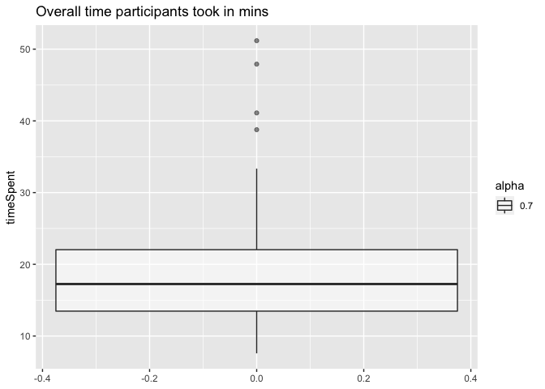<!-- -->

``` r
d_main <- d_native %>% select(-age, -botresponse, -comments, -education, -endTime, 
                              -gender, -languages, -optionLeft, -optionRight, -startDate,
                              -startTime, -timeSpent) %>%
  filter(trial_name != "example")
d_exmpl <- d_native %>% select(-age, -botresponse, -comments, -education, -endTime, 
                              -gender, -languages, -optionLeft, -optionRight, -startDate,
                              -startTime, -timeSpent) %>%
  filter(trial_name == "example")
d_critical <- d_main %>% filter(condition == "critical")
```

Plot responses on comprehension questions by type before applying
exclusion criteria:

    ## Warning: `as_data_frame()` is deprecated as of tibble 2.0.0.
    ## Please use `as_tibble()` instead.
    ## The signature and semantics have changed, see `?as_tibble`.
    ## This warning is displayed once every 8 hours.
    ## Call `lifecycle::last_warnings()` to see where this warning was generated.

    ## Warning: `cols` is now required when using unnest().
    ## Please use `cols = c(strap)`

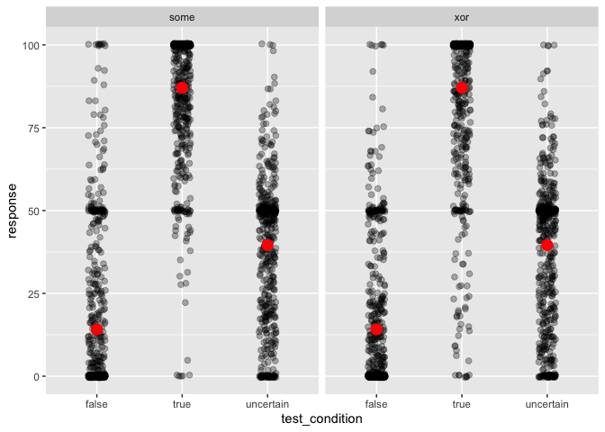<!-- -->

Next, we exclude participants based on their ratings in the main trials:
Participants who gave all responses within the range of 10 and
participants who failed more than 0.2 of the comprehension questions are
excluded from analysis. Participants who failed all example trials are
excluded, as well. The bot check trial is not considered for exclusions.

``` r
# get participants failing example trials
d_exmpl <- d_exmpl %>% group_by(submission_id) %>% 
  mutate(example_condition = ifelse(grepl("as certainly true", question), "true", 
                                    ifelse(grepl("as certainly false", question), "false",
                                           "uncertain")),
         passed_example_trial = case_when(example_condition == "true" ~ response >= 80,
                                    example_condition == "false" ~ response <= 20,
                                    example_condition == "uncertain" ~ response >= 30),
       #  check if all trials passed
         passed_example = case_when(sum(passed_example_trial) == 0 ~ FALSE,
                                    TRUE ~ TRUE)
         ) %>% filter(passed_example == F)

cat("Subjects failing the example trials: ", d_exmpl %>% distinct(submission_id) %>% pull() %>% length())
```

    ## Subjects failing the example trials:  0

``` r
# apply exclusion criteria to main trials
# check range of responses per participant
d_main_fail <- d_main %>% group_by(submission_id) %>%
  mutate(passed_main = case_when(max(response) - min(response) <= 10 ~ FALSE,
                                 TRUE ~ TRUE)
         ) %>% filter(passed_main == F)
cat("Subjects providing the same ratings throughout the trials: ", d_main_fail %>% distinct(submission_id) %>% pull() %>% length())
```

    ## Subjects providing the same ratings throughout the trials:  0

``` r
# get participants failing comprehension questions
d_test <- d_test %>%
  group_by(submission_id) %>%
  mutate(passed_filler_trial = case_when(test_condition == "true" ~ response >= 70,
                                   test_condition == "false" ~ response <= 40,
                                   test_condition == "uncertain" ~ response %in% (0:90)),
         mean_comprehension = mean(passed_filler_trial),
         passed_filler = mean_comprehension >= 0.8
         ) %>%
  filter(passed_filler == F)

cat("Subjects failing the comprehension trials: ", d_test %>% distinct(submission_id) %>% pull() %>% length())
```

    ## Subjects failing the comprehension trials:  17

``` r
# put it all together
d_full_clean <- anti_join(d_main, d_main_fail, by = "submission_id")
d_full_clean <- anti_join(d_full_clean, d_exmpl, d_test, by = "submission_id")
d_full_clean <- anti_join(d_full_clean, d_test, by = "submission_id")

cat("Nr. of participants left after cleaning: ", d_full_clean %>% distinct(submission_id) %>% pull() %>% length())
```

    ## Nr. of participants left after cleaning:  99

``` r
# get overall mean ratings / subject
d_full_clean %>% group_by(submission_id) %>% summarise(mean_rating = mean(response)) %>% arrange(mean_rating)
```

    ## # A tibble: 99 x 2
    ##    submission_id mean_rating
    ##            <dbl>       <dbl>
    ##  1          1960        30.0
    ##  2          1956        36.7
    ##  3          1920        39.3
    ##  4          1864        39.7
    ##  5          1950        40.4
    ##  6          1896        42.6
    ##  7          1901        43.2
    ##  8          1878        44.1
    ##  9          1900        44.8
    ## 10          1935        45.0
    ## # … with 89 more rows

Create more extensive condition labels, including information about
whether a rating was produced with or without the utterance given.

``` r
# extending 'conditions' labels to include whether the utterance was present or not
d_critical_long <- d_critical_long %>% 
  mutate(block_extended = ifelse(
    !w_utterance, 
    block, 
    ifelse(block %in% c("some", "xor"), "target", str_c(block, "_wUtt", ""))
  ))
```

Average nr of responses per question per vignette:

``` r
d_critical_long %>% 
  filter(class_condition == block | block == "xor" | block == "some") %>%
  select(-class_condition, -prior_class) %>%
  unique() %>% count(title, block_extended, main_type) %>%
  mutate(n = ifelse(main_type == "xor" & block_extended == "prior", n/2, n)) %>%
  summarize(mean_observations = mean(n))
```

    ## # A tibble: 1 x 1
    ##   mean_observations
    ##               <dbl>
    ## 1              12.4

Compute the average deviation from expected responses for each vignette,
individually for each dimension (rel / comp / pri):

``` r
d_critical_long %>% 
  filter(block != "xor" & block != "some") %>%
  filter(block == class_condition) %>%
  mutate(expected_rating = prior_class * 100,
         response_deviation = abs(response - expected_rating),
         block = ifelse(block == "xor" | block == "some", "target", block)
         ) %>%
  group_by(title, block) %>%
  summarize(mean_deviation = mean(response_deviation)) %>%
  arrange(desc(mean_deviation), .by_group = T) %>%
  # get the largest deviations - over 50 
  filter(mean_deviation >= 50) -> d_critical_deviations

#d_critical_deviations %>% write_csv("../data/pilots/pilot2_byItem_rating_deviations.csv")

print(d_critical_deviations)
```

    ## # A tibble: 47 x 3
    ## # Groups:   title [37]
    ##    title          block      mean_deviation
    ##    <chr>          <chr>               <dbl>
    ##  1 Alex's racket  prior                61.8
    ##  2 Alex's racket  relevance            54.8
    ##  3 Alissa's paint competence           54.2
    ##  4 Attendance     prior                82.9
    ##  5 Bill's order   prior                52.7
    ##  6 Brad Pitt      competence           52.3
    ##  7 Brad's clothes relevance            65.6
    ##  8 Brad's clothes prior                58.6
    ##  9 College        competence           51.0
    ## 10 Crime          prior                51.4
    ## # … with 37 more rows

``` r
# count which dimension is the most problematic - the prior
d_critical_deviations %>% group_by(block) %>% count()
```

    ## # A tibble: 3 x 2
    ## # Groups:   block [3]
    ##   block          n
    ##   <chr>      <int>
    ## 1 competence    13
    ## 2 prior         22
    ## 3 relevance     12

``` r
# check which items have the most deviations over 50 
d_critical_deviations %>% group_by(title) %>% count() %>% arrange(desc(.$n))
```

    ## # A tibble: 37 x 2
    ## # Groups:   title [37]
    ##    title                n
    ##    <chr>            <int>
    ##  1 Greg's movie         3
    ##  2 Shelter              3
    ##  3 Alex's racket        2
    ##  4 Brad's clothes       2
    ##  5 Gourmet desserts     2
    ##  6 Health inspector     2
    ##  7 Suzy's fruits        2
    ##  8 The game             2
    ##  9 Alissa's paint       1
    ## 10 Attendance           1
    ## # … with 27 more rows

Compute the standard deviation for each question for each item as an
additional measure of spread in the participants’ responses within-item:

``` r
d_critical_long %>% 
  filter(block != "xor" & block != "some") %>%
  filter(block == class_condition) %>%
  mutate(
         block = ifelse(block == "xor" | block == "some", "target", block)
         ) %>%
  group_by(title, block) %>%
  summarize(item_sd = sd(response)) %>%
  arrange(desc(item_sd), .by_group = T) %>%
  # arbitrary set to 25
  filter(item_sd >= 25) -> d_critical_sd
d_critical_sd
```

    ## # A tibble: 90 x 3
    ## # Groups:   title [59]
    ##    title               block      item_sd
    ##    <chr>               <chr>        <dbl>
    ##  1 Alex's racket       competence    26.6
    ##  2 Alissa's paint      competence    26.9
    ##  3 Attendance          prior         25.0
    ##  4 Bill's order        relevance     25.6
    ##  5 Brad Pitt           competence    25.5
    ##  6 Brad's clothes      competence    34.4
    ##  7 Brad's clothes      relevance     28.0
    ##  8 Carl's party        relevance     33.2
    ##  9 Carl's party        competence    28.8
    ## 10 Champagne reception relevance     28.1
    ## # … with 80 more rows

``` r
#d_critical_sd %>% write_csv("../data/pilots/pilot2_byItem_rating_SDs.csv")
```

Visually check the spread of by-item ratings among subjects for each
question:

``` r
d_critical_long %>% 
  mutate(title = paste(title, exp_condition, sep = "_"),
         block = ifelse(block == "xor" | block == "some", "target", block)) %>%
  filter(block == class_condition | block == "target") %>%
  ggplot(., aes(x = block, y = response, color = block)) +
  geom_point(alpha = 0.7, position = position_jitter(width = 0.1)) +
  ylab("Raw responses to respective questions") +
  facet_wrap(main_type~title, ncol = 4) +
  theme(axis.text.x = element_text(angle = 45, hjust = 1)) +
  ggtitle("By-item by-question raw ratings")
```

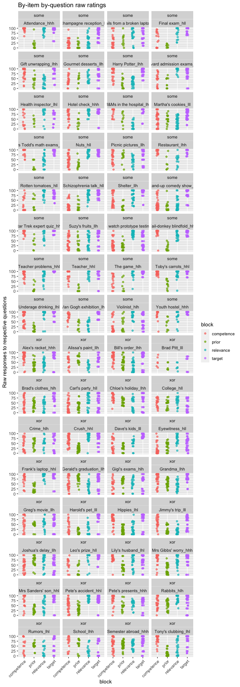<!-- -->
For the following items, participants seem to *disagree* in their
judgments for all of the predictors: Emails from a broken laptop, Gift
unwrapping, Martha’s cookies, Suzie’s fruits, Brad’s clothes, Crime,
maybe more..

Check by-vignette by-predictor empirical means, to see if the range is
somewhat covered:

``` r
d_critical_long %>% 
  mutate(title = paste(title, exp_condition, sep = "_"),
         block = ifelse(block == "xor" | block == "some", "target", block)) %>%
  filter(block == class_condition | block == "target") %>%
  group_by(title, block) %>%
  summarise(mean_response = mean(response)) %>%
  arrange(mean_response)
```

    ## # A tibble: 256 x 3
    ## # Groups:   title [64]
    ##    title                     block mean_response
    ##    <chr>                     <chr>         <dbl>
    ##  1 Final exam_hll            prior          10.6
    ##  2 Teacher_hhl               prior          10.8
    ##  3 Champagne reception_lll   prior          12  
    ##  4 Mrs Todd's math exams_lhl prior          13.1
    ##  5 Teacher problems_hhl      prior          14.3
    ##  6 Underage drinking_lhl     prior          14.3
    ##  7 Harold's pet_lll          prior          15.0
    ##  8 Shelter_llh               prior          15.4
    ##  9 Tail-donkey blindfold_hhl prior          16.2
    ## 10 Stand-up comedy show_lll  prior          17  
    ## # … with 246 more rows

## Plots

Plot main rel / comp / prior questions by main condition and by prior
classification of the item (x-axis), separated into with / without
critical utterance (shape, color). The prior questions were only used
without the utterance.

``` r
d_critical_long %>% 
  filter(block != "xor" & block != "some") %>%
  filter(block == class_condition) %>%
  group_by(main_type, class_condition, w_utterance, prior_class) %>% 
  summarize(mean_response = mean(response)) -> d_critical_summary

d_critical_long %>% 
  filter(block != "xor" & block != "some") %>%
  filter(block == class_condition) %>%
  ggplot(., aes(x = as.factor(prior_class), y = response, shape = w_utterance, color = w_utterance)) +
  geom_point(size = 2, alpha = 0.6, position = position_jitter(width = 0.1)) +
  geom_point(data = d_critical_summary, aes(x = as.factor(prior_class), y = mean_response, shape = w_utterance), 
             color = "red", size = 3) +
  ylab("Responses to respective predictor question") +
  xlab("Anticipated categorization of the items (low / high)") +
  facet_wrap(main_type~class_condition) # get ratings from the respective trials only 
```

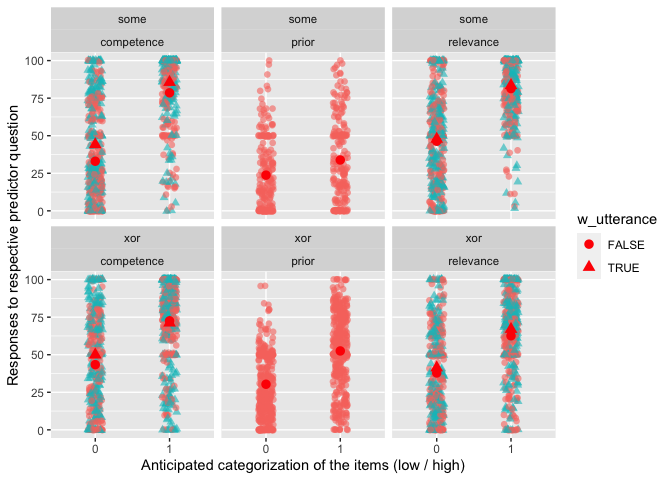<!-- -->

``` r
# check whether the ratings in the two prior questions are the same in xor 
d_critical_long %>% 
  filter(block != "xor" & block != "some") %>%
  filter(block == class_condition) %>%
  filter(block == "prior", main_type == "xor") %>%
  mutate(priorQ_nr = rep(c(1,2), 396)) -> d_xor_priors
d_xor_priors %>% group_by(priorQ_nr, prior_class) %>%
  summarise(mean = mean(response)) -> d_xor_priors_summary
d_xor_priors %>%
  ggplot(., aes(x = as.factor(priorQ_nr), y = response )) +
  geom_point(size = 2, alpha = 0.6, position = position_jitter(width = 0.1)) +
  geom_point(data = d_xor_priors_summary, aes(x = as.factor(priorQ_nr), y = mean), color = "red", size = 3) +
  ylab("Responses to prior questions") +
  xlab("First vs Second prior question for high vs low prior conditions") +
  facet_wrap(~as.factor(prior_class)) # get ratings from the respective trials only 
```

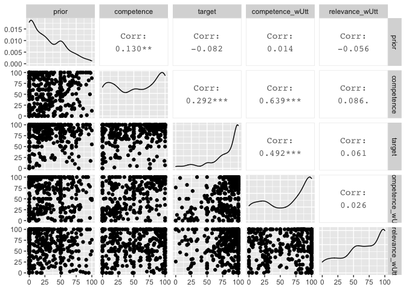<!-- -->

Plot inference ratings as a function of *anticipated* rating of the
explanatory factor, similar to the paper:

``` r
d_critical_long %>% 
  filter(block == "xor" | block == "some") %>%
  ggplot(., aes(x = prior_class, y = response)) +
  geom_point(size = 2, alpha = 0.5) +
  geom_smooth(method="lm") +
  ylab("Inference strength ratings") +
  facet_wrap(block~class_condition) +
  xlab("Anticipated categorization of the items") +
  ggtitle("Inference strength ratings by-predictor")
```

<!-- -->

``` r
# make a versatile wide representation of the critical data
d_critical_wide <- d_critical_long %>% 
  select(submission_id, title, main_type, block_extended, response) %>% 
  unique() %>% 
  pivot_wider(
    names_from = block_extended, 
    values_from = response, 
    values_fn = mean # getting means for double prior measurement in "xor"
  ) 
```

Plot inference strength ratings against raw predictor ratings from each
participant across items:

``` r
d_critical_wide %>%
  ggplot(., aes(x = relevance, y = target)) +
  geom_point(size = 2, alpha = 0.7) +
  geom_smooth(method = "lm") +
  ylab("Inference strength ratings") +
  facet_wrap(~main_type, ncol = 1) -> p.rel

d_critical_wide %>%
  ggplot(., aes(x = competence, y = target)) +
  geom_point(size = 2, alpha = 0.7) +
  geom_smooth(method = "lm") +
  ylab("") +
  facet_wrap(~main_type, ncol = 1) -> p.comp

d_critical_wide %>%
  ggplot(., aes(x = prior, y = target)) +
  geom_point(size = 2, alpha = 0.7) +
  geom_smooth(method = "lm") +
  ylab("") +
  facet_wrap(~main_type, ncol = 1) -> p.pri

gridExtra::grid.arrange(p.rel, p.comp, p.pri, ncol = 3) 
```

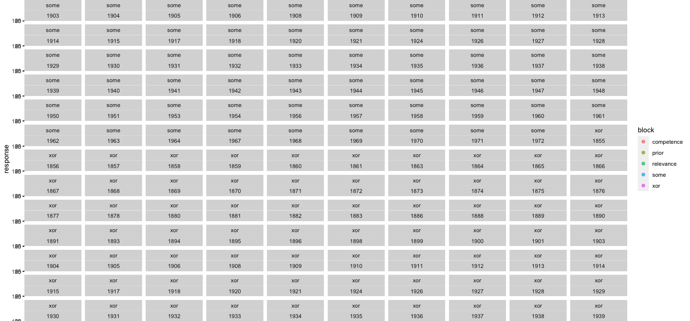<!-- -->

Plot mean ratings (across all participants) for each vignette (with its
respective condition indicated in the facet title, in the order
relevance/competence/prior), in each condition. For relevance and
competence, the color indicates whether it was presented without the
utterance or with.

``` r
bar.width = 0.8
d_critical_long %>% 
  mutate(title = paste(title, exp_condition, sep = "_")) %>%
  filter(block == class_condition | block == "xor" | block == "some") %>%
  group_by(block_extended, title, w_utterance, main_type) %>%
  summarize(mean_rating = mean(response)) %>% 
  ggplot(., aes(x = block_extended, y = mean_rating, fill = w_utterance)) +
  geom_col(alpha = 0.7, width = bar.width, position = position_dodge(width = bar.width)) +
  #geom_point(size = 2, alpha = 0.5, position = position_jitter(width = 0.1)) +
  ylab("Mean responses to respective questions") +
  xlab("Question type") +
  facet_wrap(main_type~title, ncol = 4) +
  theme(axis.text.x = element_text(angle = 45, hjust = 1)) +
  ggtitle("By-item by-question mean ratings")
```

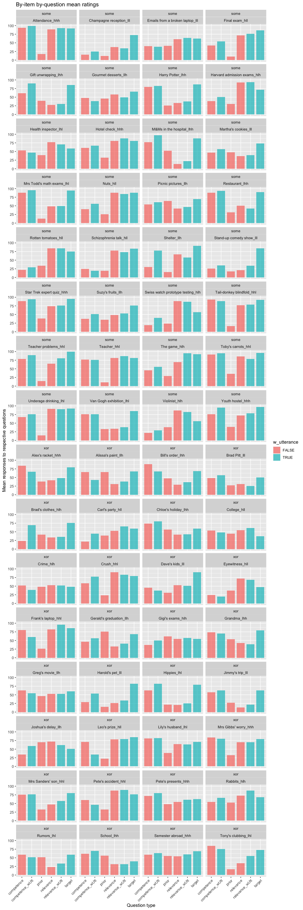<!-- -->

Plot by-item trends between predictor ratings and target inference
strength ratings (relevance / competence ratings with utterance are
omitted):

``` r
# make a versatile wide representation of the critical data
d_critical_predictorsXtarget <- d_critical_wide %>% 
  pivot_longer(
    cols = c(relevance, prior, competence, relevance_wUtt, competence_wUtt),
    names_to = "predictors",
    values_to = "predictor_response"
  ) %>%
  filter(predictors != "relevance_wUtt", predictors != "competence_wUtt") 

d_critical_predictorsXtarget %>%
  ggplot(., aes(x = predictor_response, y = target)) +
  geom_point() +
  facet_wrap(title~predictors, ncol= 6) +
  xlab("Response to predictor questions") +
  ylab("Inference strength rating") +
  ggtitle("By-item Inference Strength Ratings vs. Predictor Ratings (left to right)")
```

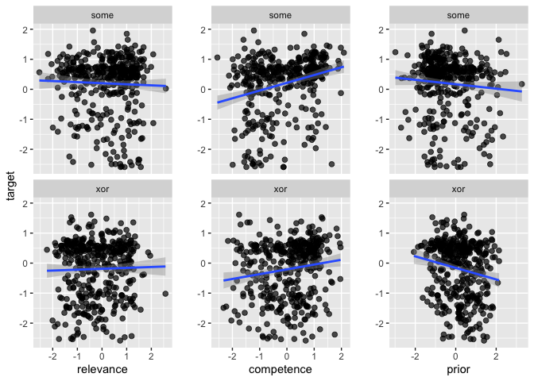<!-- -->

Plot inference strength ratings against predictor ratings, by-item,
using by-item mean ratings across participants. Error bars indicate the
standard deviation of the mean:

``` r
d_critical_predictorsXtarget_summary <- d_critical_predictorsXtarget %>% 
  group_by(title, predictors, main_type) %>%
  summarise(mean_target = mean(target),
            mean_predictor = mean(predictor_response), 
            sd_target = sd(target),
            sd_predictor = sd(predictor_response))  


d_critical_predictorsXtarget_summary %>%
  ggplot(., aes(x = mean_predictor, y = mean_target)) +
  geom_point() +
  geom_errorbar(aes(ymin = mean_target - sd_target, ymax = mean_target + sd_target), alpha = 0.7) +
  geom_errorbarh(aes(xmin = mean_predictor - sd_predictor, xmax = mean_predictor + sd_predictor), alpha = 0.7) +
  geom_text(aes(label=title), size = 1.5, nudge_y = 4) +
  geom_smooth(method = "lm") +
  ylab("Mean inference strength rating") +
  xlab("Mean predictor ratings") + 
  facet_wrap(main_type~predictors)
```

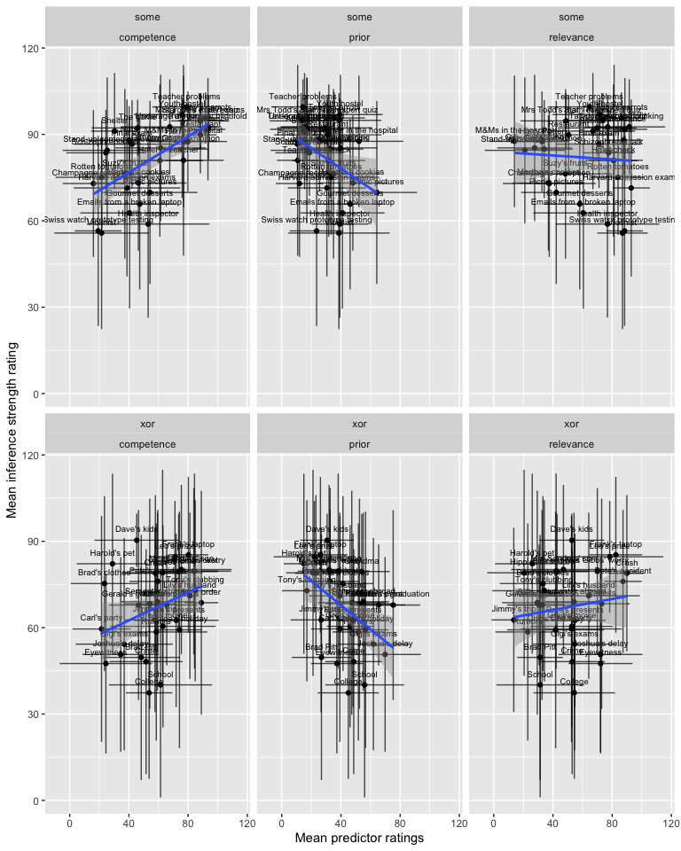<!-- -->

``` r
# correlation plot for "some"
GGally::ggpairs(
  filter(d_critical_wide, main_type == "some") %>%  
    select(prior, competence, relevance, target, competence_wUtt, relevance_wUtt) 
)
```

<!-- -->

``` r
# correlation plot for "or"
GGally::ggpairs(
  filter(d_critical_wide, main_type == "xor") %>%  
    select(prior, competence, relevance, target, competence_wUtt, relevance_wUtt)
  )
```

<!-- -->

## Explore z-scoring

Visual exploration of z-scoring each measure (rel / comp / pri / target
/ comp-wUtterance / rel-wUtterance) per participant, collapsing some and
or together.

``` r
d_critical_zScored <- d_critical_long %>% group_by(submission_id, block_extended) %>%
  mutate(block_mean = mean(response),
         block_sd = sd(response),
         response_centered = (response - block_mean)/block_sd,
         # catch the cases where sd is 0 
         response_centered = ifelse(is.na(response_centered), 0, response_centered))

d_critical_zScored %>% 
  filter(block != "xor" & block != "some") %>%
  filter(block == class_condition) %>%
  group_by(main_type, class_condition, w_utterance, prior_class) %>% 
  summarize(mean_response = mean(response_centered)) -> d_critical_zScore_summary

d_critical_zScored %>% 
  filter(block != "xor" & block != "some") %>%
  filter(block == class_condition) %>%
  ggplot(., aes(x = as.factor(prior_class), y = response_centered, shape = w_utterance, color = w_utterance)) +
  geom_point(size = 2, alpha = 0.6, position = position_jitter(width = 0.1)) +
  geom_point(data = d_critical_zScore_summary, aes(x = as.factor(prior_class), y = mean_response, shape = w_utterance), 
             color = "red", size = 3) +
  ylab("Responses to respective predictor questions") +
  xlab("Anticipated categorization of the items (low / high)") +
  facet_wrap(main_type~class_condition) + # get ratings from the respective trials only 
  ggtitle("Centered responses to by-predictor questions")
```

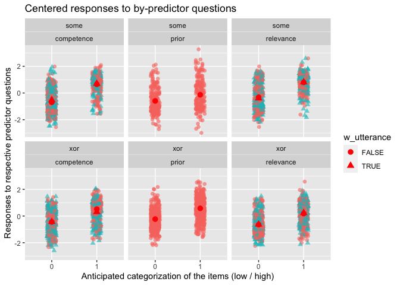<!-- -->

Plot z-scored predictor ratings against z-scored target inference
ratings

``` r
d_critical_zScored_wide <- d_critical_zScored %>% 
  select(submission_id, title, main_type, block_extended, response_centered) %>% 
  unique() %>% 
  pivot_wider(
    names_from = block_extended, 
    values_from = response_centered, 
    values_fn = mean # getting means for double prior measurement in "xor"
  ) 
  
d_critical_zScored_wide %>%
  ggplot(., aes(x = relevance, y = target)) +
  geom_point(size = 2, alpha = 0.7) +
  ylab("Inference strength ratings") +
  geom_smooth(method = "lm") +
  facet_wrap(~main_type, ncol = 1) -> p.rel.z

d_critical_zScored_wide %>%
  ggplot(., aes(x = competence, y = target)) +
  geom_point(size = 2, alpha = 0.7) +
  geom_smooth(method = "lm") +
  ylab("") +
  facet_wrap(~main_type, ncol = 1) -> p.comp.z

d_critical_zScored_wide %>%
  ggplot(., aes(x = prior, y = target)) +
  geom_point(size = 2, alpha = 0.7) +
  geom_smooth(method = "lm") +
  ylab("") +
  facet_wrap(~main_type, ncol = 1) -> p.pri.z

gridExtra::grid.arrange(p.rel.z, p.comp.z, p.pri.z, ncol = 3) 
```

<!-- -->

Correlation plots of z-scored data:

``` r
# correlation plot for "some"
GGally::ggpairs(
  filter(d_critical_zScored_wide, main_type == "some") %>% ungroup() %>%  
    select(prior, competence, relevance, target, competence_wUtt, relevance_wUtt)
)
```

<!-- -->

``` r
# correlation plot for "or"
GGally::ggpairs(
  filter(d_critical_zScored_wide, main_type == "xor") %>%  ungroup() %>%
    select(prior, competence, relevance, target, competence_wUtt, relevance_wUtt)
  )
```

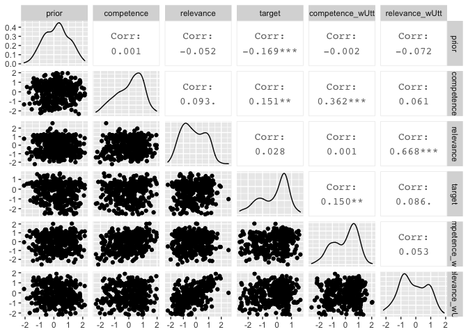<!-- -->

## Stats

Maximal models on raw ratings:

``` r
# xor, maximal model with interactions and maximal REs
model_xor <- brm(
  target ~ prior*competence*relevance + 
    (1 + prior + competence + relevance || submission_id) +
    (1 | title),
  data = d_critical_wide %>% filter(main_type == "xor"),
  family = "gaussian",
  cores = 4,
  iter = 3000
)
```

    ## Warning: There were 6000 transitions after warmup that exceeded the maximum treedepth. Increase max_treedepth above 10. See
    ## http://mc-stan.org/misc/warnings.html#maximum-treedepth-exceeded

    ## Warning: Examine the pairs() plot to diagnose sampling problems

``` r
summary(model_xor)
```

    ##  Family: gaussian 
    ##   Links: mu = identity; sigma = identity 
    ## Formula: target ~ prior * competence * relevance + (1 + prior + competence + relevance || submission_id) + (1 | title) 
    ##    Data: d_critical_wide %>% filter(main_type == "xor") (Number of observations: 396) 
    ## Samples: 4 chains, each with iter = 3000; warmup = 1500; thin = 1;
    ##          total post-warmup samples = 6000
    ## 
    ## Group-Level Effects: 
    ## ~submission_id (Number of levels: 99) 
    ##                Estimate Est.Error l-95% CI u-95% CI Rhat Bulk_ESS Tail_ESS
    ## sd(Intercept)     16.96      2.97    10.85    22.44 1.00     1046     1491
    ## sd(prior)          0.10      0.07     0.01     0.25 1.00      921     1688
    ## sd(competence)     0.14      0.06     0.01     0.25 1.01      417      504
    ## sd(relevance)      0.09      0.06     0.00     0.22 1.00      779     1446
    ## 
    ## ~title (Number of levels: 32) 
    ##               Estimate Est.Error l-95% CI u-95% CI Rhat Bulk_ESS Tail_ESS
    ## sd(Intercept)     9.26      2.54     4.42    14.50 1.00     1323     1974
    ## 
    ## Population-Level Effects: 
    ##                            Estimate Est.Error l-95% CI u-95% CI Rhat Bulk_ESS
    ## Intercept                     62.46      9.73    43.48    81.76 1.00     2060
    ## prior                          0.01      0.23    -0.45     0.46 1.00     2017
    ## competence                     0.07      0.15    -0.22     0.37 1.00     2147
    ## relevance                      0.18      0.18    -0.17     0.52 1.00     2227
    ## prior:competence               0.00      0.00    -0.01     0.01 1.00     2221
    ## prior:relevance               -0.00      0.00    -0.01     0.00 1.00     2300
    ## competence:relevance          -0.00      0.00    -0.01     0.00 1.00     2208
    ## prior:competence:relevance     0.00      0.00    -0.00     0.00 1.00     2373
    ##                            Tail_ESS
    ## Intercept                      3424
    ## prior                          3530
    ## competence                     3286
    ## relevance                      4096
    ## prior:competence               3565
    ## prior:relevance                3392
    ## competence:relevance           3759
    ## prior:competence:relevance     3487
    ## 
    ## Family Specific Parameters: 
    ##       Estimate Est.Error l-95% CI u-95% CI Rhat Bulk_ESS Tail_ESS
    ## sigma    24.68      1.20    22.45    27.14 1.00     1755     3791
    ## 
    ## Samples were drawn using sampling(NUTS). For each parameter, Bulk_ESS
    ## and Tail_ESS are effective sample size measures, and Rhat is the potential
    ## scale reduction factor on split chains (at convergence, Rhat = 1).

Exploring plots of posterior samples for pairwise parameters shows that
there is a visible correlation between prior & competence, and a
somewhat weaker correlation between competence & relevance. The
interaction estimates also show a correlation with the main effects (as
a rough overall judgment).

``` r
#shinystan::launch_shinystan(model_xor)
```

Plot correlations of main effects

``` r
bayesplot::mcmc_pairs(model_xor, pars = c("b_prior", "b_competence", "b_relevance"))
```

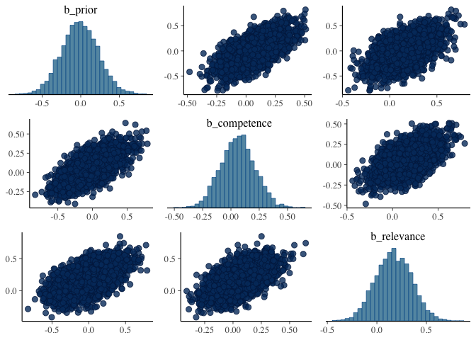<!-- -->

``` r
# some, maximal model with interactions and maximal REs
model_some <- brm(
  target ~ prior*competence*relevance + 
    (1 + prior + competence + relevance || submission_id) +
    (1 | title),
  data = d_critical_wide %>% filter(main_type == "some"),
  family = "gaussian",
  cores = 4,
  iter = 3000
)
```

    ## Warning: There were 6000 transitions after warmup that exceeded the maximum treedepth. Increase max_treedepth above 10. See
    ## http://mc-stan.org/misc/warnings.html#maximum-treedepth-exceeded

    ## Warning: Examine the pairs() plot to diagnose sampling problems

``` r
summary(model_some)
```

    ##  Family: gaussian 
    ##   Links: mu = identity; sigma = identity 
    ## Formula: target ~ prior * competence * relevance + (1 + prior + competence + relevance || submission_id) + (1 | title) 
    ##    Data: d_critical_wide %>% filter(main_type == "some") (Number of observations: 396) 
    ## Samples: 4 chains, each with iter = 3000; warmup = 1500; thin = 1;
    ##          total post-warmup samples = 6000
    ## 
    ## Group-Level Effects: 
    ## ~submission_id (Number of levels: 99) 
    ##                Estimate Est.Error l-95% CI u-95% CI Rhat Bulk_ESS Tail_ESS
    ## sd(Intercept)     10.26      1.89     6.27    13.76 1.00     1127     1280
    ## sd(prior)          0.06      0.04     0.00     0.16 1.00      859     2167
    ## sd(competence)     0.03      0.02     0.00     0.08 1.00     1258     2075
    ## sd(relevance)      0.04      0.03     0.00     0.10 1.00      769     1550
    ## 
    ## ~title (Number of levels: 32) 
    ##               Estimate Est.Error l-95% CI u-95% CI Rhat Bulk_ESS Tail_ESS
    ## sd(Intercept)     8.61      1.97     4.93    12.68 1.00     1039      677
    ## 
    ## Population-Level Effects: 
    ##                            Estimate Est.Error l-95% CI u-95% CI Rhat Bulk_ESS
    ## Intercept                     77.62      5.99    65.93    88.97 1.00     1862
    ## prior                         -0.15      0.21    -0.54     0.25 1.00     1749
    ## competence                     0.13      0.09    -0.06     0.32 1.00     2017
    ## relevance                     -0.07      0.08    -0.23     0.09 1.00     2031
    ## prior:competence               0.00      0.00    -0.00     0.01 1.00     1857
    ## prior:relevance                0.00      0.00    -0.00     0.01 1.00     1816
    ## competence:relevance           0.00      0.00    -0.00     0.00 1.00     2271
    ## prior:competence:relevance    -0.00      0.00    -0.00     0.00 1.00     1928
    ##                            Tail_ESS
    ## Intercept                      2825
    ## prior                          2994
    ## competence                     2866
    ## relevance                      3051
    ## prior:competence               2878
    ## prior:relevance                3042
    ## competence:relevance           3196
    ## prior:competence:relevance     3238
    ## 
    ## Family Specific Parameters: 
    ##       Estimate Est.Error l-95% CI u-95% CI Rhat Bulk_ESS Tail_ESS
    ## sigma    19.97      0.93    18.27    21.92 1.00     2086     2794
    ## 
    ## Samples were drawn using sampling(NUTS). For each parameter, Bulk_ESS
    ## and Tail_ESS are effective sample size measures, and Rhat is the potential
    ## scale reduction factor on split chains (at convergence, Rhat = 1).

For “some”, the correlation of prior and relevance is higher than for
prior and competence; there is also a visible correlation of competence
and relevance.

``` r
#shinystan::launch_shinystan(model_some)
```

``` r
bayesplot::mcmc_pairs(model_some, pars = c("b_prior", "b_competence", "b_relevance"))
```

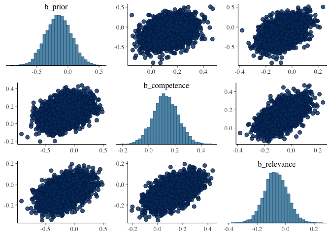<!-- -->

#### Smaller models with raw data to check for collinearity

Models on raw data with only one predictor:

``` r
# xor
model_xor_prior <- brm(
  target ~ prior + 
    (1 + prior | submission_id) +
    (1 | title),
  data = d_critical_wide %>% filter(main_type == "xor"),
  family = "gaussian",
  cores = 4,
  iter = 3000
)
```

    ## Warning: There were 52 divergent transitions after warmup. Increasing adapt_delta above 0.8 may help. See
    ## http://mc-stan.org/misc/warnings.html#divergent-transitions-after-warmup

    ## Warning: Examine the pairs() plot to diagnose sampling problems

``` r
summary(model_xor_prior)
```

    ## Warning: There were 52 divergent transitions after warmup. Increasing
    ## adapt_delta above 0.8 may help. See http://mc-stan.org/misc/
    ## warnings.html#divergent-transitions-after-warmup

    ##  Family: gaussian 
    ##   Links: mu = identity; sigma = identity 
    ## Formula: target ~ prior + (1 + prior | submission_id) + (1 | title) 
    ##    Data: d_critical_wide %>% filter(main_type == "xor") (Number of observations: 396) 
    ## Samples: 4 chains, each with iter = 3000; warmup = 1500; thin = 1;
    ##          total post-warmup samples = 6000
    ## 
    ## Group-Level Effects: 
    ## ~submission_id (Number of levels: 99) 
    ##                      Estimate Est.Error l-95% CI u-95% CI Rhat Bulk_ESS
    ## sd(Intercept)           20.55      2.78    15.43    26.42 1.01     1576
    ## sd(prior)                0.08      0.06     0.00     0.23 1.01      528
    ## cor(Intercept,prior)    -0.11      0.52    -0.94     0.91 1.00     2964
    ##                      Tail_ESS
    ## sd(Intercept)            2608
    ## sd(prior)                 586
    ## cor(Intercept,prior)     2707
    ## 
    ## ~title (Number of levels: 32) 
    ##               Estimate Est.Error l-95% CI u-95% CI Rhat Bulk_ESS Tail_ESS
    ## sd(Intercept)     9.62      2.36     5.23    14.68 1.00     1434     1967
    ## 
    ## Population-Level Effects: 
    ##           Estimate Est.Error l-95% CI u-95% CI Rhat Bulk_ESS Tail_ESS
    ## Intercept    69.20      4.28    60.87    77.68 1.00     2096     2796
    ## prior        -0.03      0.07    -0.18     0.11 1.00     1958     3076
    ## 
    ## Family Specific Parameters: 
    ##       Estimate Est.Error l-95% CI u-95% CI Rhat Bulk_ESS Tail_ESS
    ## sigma    25.19      1.12    23.13    27.54 1.00     2249     2373
    ## 
    ## Samples were drawn using sampling(NUTS). For each parameter, Bulk_ESS
    ## and Tail_ESS are effective sample size measures, and Rhat is the potential
    ## scale reduction factor on split chains (at convergence, Rhat = 1).

``` r
# xor
model_xor_comp <- brm(
  target ~ competence + 
    (1 + competence | submission_id) +
    (1 | title),
  data = d_critical_wide %>% filter(main_type == "xor"),
  family = "gaussian",
  cores = 4,
  iter = 3000
)
```

    ## Warning: There were 517 divergent transitions after warmup. Increasing adapt_delta above 0.8 may help. See
    ## http://mc-stan.org/misc/warnings.html#divergent-transitions-after-warmup

    ## Warning: Examine the pairs() plot to diagnose sampling problems

    ## Warning: The largest R-hat is 1.07, indicating chains have not mixed.
    ## Running the chains for more iterations may help. See
    ## http://mc-stan.org/misc/warnings.html#r-hat

    ## Warning: Bulk Effective Samples Size (ESS) is too low, indicating posterior means and medians may be unreliable.
    ## Running the chains for more iterations may help. See
    ## http://mc-stan.org/misc/warnings.html#bulk-ess

    ## Warning: Tail Effective Samples Size (ESS) is too low, indicating posterior variances and tail quantiles may be unreliable.
    ## Running the chains for more iterations may help. See
    ## http://mc-stan.org/misc/warnings.html#tail-ess

``` r
summary(model_xor_comp)
```

    ## Warning: There were 517 divergent transitions after warmup. Increasing
    ## adapt_delta above 0.8 may help. See http://mc-stan.org/misc/
    ## warnings.html#divergent-transitions-after-warmup

    ##  Family: gaussian 
    ##   Links: mu = identity; sigma = identity 
    ## Formula: target ~ competence + (1 + competence | submission_id) + (1 | title) 
    ##    Data: d_critical_wide %>% filter(main_type == "xor") (Number of observations: 396) 
    ## Samples: 4 chains, each with iter = 3000; warmup = 1500; thin = 1;
    ##          total post-warmup samples = 6000
    ## 
    ## Group-Level Effects: 
    ## ~submission_id (Number of levels: 99) 
    ##                           Estimate Est.Error l-95% CI u-95% CI Rhat Bulk_ESS
    ## sd(Intercept)                21.03      4.07    13.47    29.73 1.02      260
    ## sd(competence)                0.20      0.09     0.02     0.37 1.04       98
    ## cor(Intercept,competence)    -0.23      0.40    -0.74     0.80 1.03      144
    ##                           Tail_ESS
    ## sd(Intercept)                  781
    ## sd(competence)                 322
    ## cor(Intercept,competence)      940
    ## 
    ## ~title (Number of levels: 32) 
    ##               Estimate Est.Error l-95% CI u-95% CI Rhat Bulk_ESS Tail_ESS
    ## sd(Intercept)     9.39      2.31     5.09    14.10 1.01      537     1346
    ## 
    ## Population-Level Effects: 
    ##            Estimate Est.Error l-95% CI u-95% CI Rhat Bulk_ESS Tail_ESS
    ## Intercept     63.81      4.59    54.74    72.77 1.00      341      505
    ## competence     0.07      0.06    -0.05     0.21 1.02      169      104
    ## 
    ## Family Specific Parameters: 
    ##       Estimate Est.Error l-95% CI u-95% CI Rhat Bulk_ESS Tail_ESS
    ## sigma    24.39      1.24    22.13    26.93 1.02      227      458
    ## 
    ## Samples were drawn using sampling(NUTS). For each parameter, Bulk_ESS
    ## and Tail_ESS are effective sample size measures, and Rhat is the potential
    ## scale reduction factor on split chains (at convergence, Rhat = 1).

``` r
# xor
model_xor_rel <- brm(
  target ~ relevance + 
    (1 + relevance | submission_id) +
    (1 | title),
  data = d_critical_wide %>% filter(main_type == "xor"),
  family = "gaussian",
  cores = 4,
  iter = 3000
)
```

    ## Warning: There were 38 divergent transitions after warmup. Increasing adapt_delta above 0.8 may help. See
    ## http://mc-stan.org/misc/warnings.html#divergent-transitions-after-warmup

    ## Warning: Examine the pairs() plot to diagnose sampling problems

``` r
summary(model_xor_rel)
```

    ## Warning: There were 38 divergent transitions after warmup. Increasing
    ## adapt_delta above 0.8 may help. See http://mc-stan.org/misc/
    ## warnings.html#divergent-transitions-after-warmup

    ##  Family: gaussian 
    ##   Links: mu = identity; sigma = identity 
    ## Formula: target ~ relevance + (1 + relevance | submission_id) + (1 | title) 
    ##    Data: d_critical_wide %>% filter(main_type == "xor") (Number of observations: 396) 
    ## Samples: 4 chains, each with iter = 3000; warmup = 1500; thin = 1;
    ##          total post-warmup samples = 6000
    ## 
    ## Group-Level Effects: 
    ## ~submission_id (Number of levels: 99) 
    ##                          Estimate Est.Error l-95% CI u-95% CI Rhat Bulk_ESS
    ## sd(Intercept)               19.74      2.85    14.30    25.62 1.00     2533
    ## sd(relevance)                0.08      0.06     0.00     0.21 1.01      677
    ## cor(Intercept,relevance)     0.06      0.50    -0.86     0.94 1.00     4094
    ##                          Tail_ESS
    ## sd(Intercept)                2335
    ## sd(relevance)                 726
    ## cor(Intercept,relevance)     3731
    ## 
    ## ~title (Number of levels: 32) 
    ##               Estimate Est.Error l-95% CI u-95% CI Rhat Bulk_ESS Tail_ESS
    ## sd(Intercept)     9.96      2.29     5.80    14.73 1.00     2152     3363
    ## 
    ## Population-Level Effects: 
    ##           Estimate Est.Error l-95% CI u-95% CI Rhat Bulk_ESS Tail_ESS
    ## Intercept    67.06      4.01    59.27    74.89 1.00     4121     4014
    ## relevance     0.02      0.05    -0.09     0.13 1.00     5632     4065
    ## 
    ## Family Specific Parameters: 
    ##       Estimate Est.Error l-95% CI u-95% CI Rhat Bulk_ESS Tail_ESS
    ## sigma    25.07      1.14    22.90    27.39 1.00     3107     2295
    ## 
    ## Samples were drawn using sampling(NUTS). For each parameter, Bulk_ESS
    ## and Tail_ESS are effective sample size measures, and Rhat is the potential
    ## scale reduction factor on split chains (at convergence, Rhat = 1).

``` r
# some
model_some_rel <- brm(
  target ~ relevance + 
    (1 + relevance | submission_id) +
    (1 | title),
  data = d_critical_wide %>% filter(main_type == "some"),
  family = "gaussian",
  cores = 4,
  iter = 3000
)
```

    ## Warning: There were 20 divergent transitions after warmup. Increasing adapt_delta above 0.8 may help. See
    ## http://mc-stan.org/misc/warnings.html#divergent-transitions-after-warmup

    ## Warning: Examine the pairs() plot to diagnose sampling problems

``` r
summary(model_some_rel)
```

    ## Warning: There were 20 divergent transitions after warmup. Increasing
    ## adapt_delta above 0.8 may help. See http://mc-stan.org/misc/
    ## warnings.html#divergent-transitions-after-warmup

    ##  Family: gaussian 
    ##   Links: mu = identity; sigma = identity 
    ## Formula: target ~ relevance + (1 + relevance | submission_id) + (1 | title) 
    ##    Data: d_critical_wide %>% filter(main_type == "some") (Number of observations: 396) 
    ## Samples: 4 chains, each with iter = 3000; warmup = 1500; thin = 1;
    ##          total post-warmup samples = 6000
    ## 
    ## Group-Level Effects: 
    ## ~submission_id (Number of levels: 99) 
    ##                          Estimate Est.Error l-95% CI u-95% CI Rhat Bulk_ESS
    ## sd(Intercept)               11.60      2.26     7.16    16.34 1.00     1929
    ## sd(relevance)                0.04      0.03     0.00     0.11 1.00     1110
    ## cor(Intercept,relevance)    -0.16      0.55    -0.96     0.92 1.00     4630
    ##                          Tail_ESS
    ## sd(Intercept)                1943
    ## sd(relevance)                1237
    ## cor(Intercept,relevance)     3416
    ## 
    ## ~title (Number of levels: 32) 
    ##               Estimate Est.Error l-95% CI u-95% CI Rhat Bulk_ESS Tail_ESS
    ## sd(Intercept)    11.03      1.89     7.74    15.25 1.00     2212     4052
    ## 
    ## Population-Level Effects: 
    ##           Estimate Est.Error l-95% CI u-95% CI Rhat Bulk_ESS Tail_ESS
    ## Intercept    82.16      3.74    74.90    89.54 1.00     3541     3825
    ## relevance    -0.00      0.04    -0.09     0.08 1.00     4089     3856
    ## 
    ## Family Specific Parameters: 
    ##       Estimate Est.Error l-95% CI u-95% CI Rhat Bulk_ESS Tail_ESS
    ## sigma    19.82      0.87    18.16    21.53 1.00     3170     4286
    ## 
    ## Samples were drawn using sampling(NUTS). For each parameter, Bulk_ESS
    ## and Tail_ESS are effective sample size measures, and Rhat is the potential
    ## scale reduction factor on split chains (at convergence, Rhat = 1).

``` r
# some
model_some_prior <- brm(
  target ~ prior + 
    (1 + prior | submission_id) +
    (1 | title),
  data = d_critical_wide %>% filter(main_type == "some"),
  family = "gaussian",
  cores = 4,
  iter = 3000
)
```

    ## Warning: There were 38 divergent transitions after warmup. Increasing adapt_delta above 0.8 may help. See
    ## http://mc-stan.org/misc/warnings.html#divergent-transitions-after-warmup

    ## Warning: Examine the pairs() plot to diagnose sampling problems

``` r
summary(model_some_prior)
```

    ## Warning: There were 38 divergent transitions after warmup. Increasing
    ## adapt_delta above 0.8 may help. See http://mc-stan.org/misc/
    ## warnings.html#divergent-transitions-after-warmup

    ##  Family: gaussian 
    ##   Links: mu = identity; sigma = identity 
    ## Formula: target ~ prior + (1 + prior | submission_id) + (1 | title) 
    ##    Data: d_critical_wide %>% filter(main_type == "some") (Number of observations: 396) 
    ## Samples: 4 chains, each with iter = 3000; warmup = 1500; thin = 1;
    ##          total post-warmup samples = 6000
    ## 
    ## Group-Level Effects: 
    ## ~submission_id (Number of levels: 99) 
    ##                      Estimate Est.Error l-95% CI u-95% CI Rhat Bulk_ESS
    ## sd(Intercept)           11.93      1.88     8.44    15.82 1.00     1904
    ## sd(prior)                0.09      0.06     0.00     0.23 1.00      860
    ## cor(Intercept,prior)    -0.33      0.47    -0.95     0.82 1.00     3797
    ##                      Tail_ESS
    ## sd(Intercept)            2988
    ## sd(prior)                 889
    ## cor(Intercept,prior)     3700
    ## 
    ## ~title (Number of levels: 32) 
    ##               Estimate Est.Error l-95% CI u-95% CI Rhat Bulk_ESS Tail_ESS
    ## sd(Intercept)    10.93      1.89     7.65    15.04 1.00     1952     2957
    ## 
    ## Population-Level Effects: 
    ##           Estimate Est.Error l-95% CI u-95% CI Rhat Bulk_ESS Tail_ESS
    ## Intercept    82.40      2.90    76.74    88.13 1.00     2222     3016
    ## prior        -0.01      0.05    -0.11     0.09 1.00     5128     3824
    ## 
    ## Family Specific Parameters: 
    ##       Estimate Est.Error l-95% CI u-95% CI Rhat Bulk_ESS Tail_ESS
    ## sigma    19.78      0.87    18.13    21.53 1.00     3248     3129
    ## 
    ## Samples were drawn using sampling(NUTS). For each parameter, Bulk_ESS
    ## and Tail_ESS are effective sample size measures, and Rhat is the potential
    ## scale reduction factor on split chains (at convergence, Rhat = 1).

``` r
# some
model_some_comp <- brm(
  target ~ competence + 
    (1 + competence | submission_id) +
    (1 | title),
  data = d_critical_wide %>% filter(main_type == "some"),
  family = "gaussian",
  cores = 4,
  iter = 3000
)
```

``` r
summary(model_some_comp)
```

    ##  Family: gaussian 
    ##   Links: mu = identity; sigma = identity 
    ## Formula: target ~ competence + (1 + competence | submission_id) + (1 | title) 
    ##    Data: d_critical_wide %>% filter(main_type == "some") (Number of observations: 396) 
    ## Samples: 4 chains, each with iter = 3000; warmup = 1500; thin = 1;
    ##          total post-warmup samples = 6000
    ## 
    ## Group-Level Effects: 
    ## ~submission_id (Number of levels: 99) 
    ##                           Estimate Est.Error l-95% CI u-95% CI Rhat Bulk_ESS
    ## sd(Intercept)                15.39      2.84    10.00    21.02 1.00     1906
    ## sd(competence)                0.10      0.04     0.01     0.18 1.00     1796
    ## cor(Intercept,competence)    -0.81      0.25    -1.00    -0.02 1.00     2707
    ##                           Tail_ESS
    ## sd(Intercept)                 2975
    ## sd(competence)                1921
    ## cor(Intercept,competence)     2729
    ## 
    ## ~title (Number of levels: 32) 
    ##               Estimate Est.Error l-95% CI u-95% CI Rhat Bulk_ESS Tail_ESS
    ## sd(Intercept)     8.69      1.80     5.51    12.51 1.00     2258     3269
    ## 
    ## Population-Level Effects: 
    ##            Estimate Est.Error l-95% CI u-95% CI Rhat Bulk_ESS Tail_ESS
    ## Intercept     74.17      3.30    67.78    80.74 1.00     4133     4032
    ## competence     0.14      0.04     0.06     0.22 1.00     4950     4350
    ## 
    ## Family Specific Parameters: 
    ##       Estimate Est.Error l-95% CI u-95% CI Rhat Bulk_ESS Tail_ESS
    ## sigma    19.44      0.90    17.78    21.29 1.00     3418     4405
    ## 
    ## Samples were drawn using sampling(NUTS). For each parameter, Bulk_ESS
    ## and Tail_ESS are effective sample size measures, and Rhat is the potential
    ## scale reduction factor on split chains (at convergence, Rhat = 1).

With two predictors:

``` r
# xor
model_xor_pri_comp <- brm(
  target ~ prior*competence + 
    (1 + prior*competence || submission_id) +
    (1 | title),
  data = d_critical_wide %>% filter(main_type == "xor"),
  family = "gaussian",
  cores = 4,
  iter = 3000
)
```

``` r
summary(model_xor_pri_comp)
```

    ##  Family: gaussian 
    ##   Links: mu = identity; sigma = identity 
    ## Formula: target ~ prior * competence + (1 + prior * competence || submission_id) + (1 | title) 
    ##    Data: d_critical_wide %>% filter(main_type == "xor") (Number of observations: 396) 
    ## Samples: 4 chains, each with iter = 3000; warmup = 1500; thin = 1;
    ##          total post-warmup samples = 6000
    ## 
    ## Group-Level Effects: 
    ## ~submission_id (Number of levels: 99) 
    ##                      Estimate Est.Error l-95% CI u-95% CI Rhat Bulk_ESS
    ## sd(Intercept)           17.95      2.61    12.72    22.97 1.01     1028
    ## sd(prior)                0.09      0.06     0.00     0.24 1.01      820
    ## sd(competence)           0.13      0.06     0.01     0.25 1.01      551
    ## sd(prior:competence)     0.00      0.00     0.00     0.00 1.00     1176
    ##                      Tail_ESS
    ## sd(Intercept)            1760
    ## sd(prior)                1364
    ## sd(competence)            955
    ## sd(prior:competence)     2077
    ## 
    ## ~title (Number of levels: 32) 
    ##               Estimate Est.Error l-95% CI u-95% CI Rhat Bulk_ESS Tail_ESS
    ## sd(Intercept)     9.12      2.57     4.34    14.45 1.00     1565     1523
    ## 
    ## Population-Level Effects: 
    ##                  Estimate Est.Error l-95% CI u-95% CI Rhat Bulk_ESS Tail_ESS
    ## Intercept           69.77      6.96    56.14    83.50 1.00     2839     4032
    ## prior               -0.15      0.14    -0.43     0.13 1.00     2631     3638
    ## competence          -0.01      0.10    -0.20     0.18 1.00     3013     3697
    ## prior:competence     0.00      0.00    -0.00     0.01 1.00     2870     4282
    ## 
    ## Family Specific Parameters: 
    ##       Estimate Est.Error l-95% CI u-95% CI Rhat Bulk_ESS Tail_ESS
    ## sigma    24.74      1.16    22.58    27.10 1.00     2420     3399
    ## 
    ## Samples were drawn using sampling(NUTS). For each parameter, Bulk_ESS
    ## and Tail_ESS are effective sample size measures, and Rhat is the potential
    ## scale reduction factor on split chains (at convergence, Rhat = 1).

``` r
bayesplot::mcmc_pairs(model_xor_pri_comp, pars = c("b_prior", "b_competence"))
```

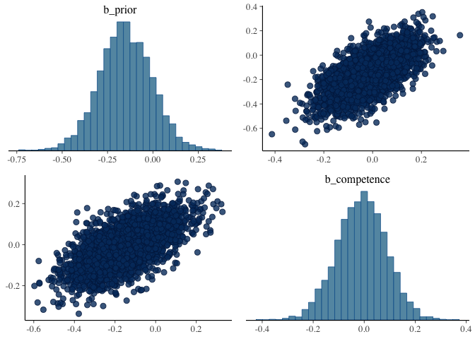<!-- -->

``` r
# xor
model_xor_pri_rel <- brm(
  target ~ prior*relevance + 
    (1 + prior*relevance || submission_id) +
    (1 | title),
  data = d_critical_wide %>% filter(main_type == "xor"),
  family = "gaussian",
  cores = 4,
  iter = 3000
)
```

    ## Warning: There were 2 divergent transitions after warmup. Increasing adapt_delta above 0.8 may help. See
    ## http://mc-stan.org/misc/warnings.html#divergent-transitions-after-warmup

    ## Warning: Examine the pairs() plot to diagnose sampling problems

``` r
summary(model_xor_pri_rel)
```

    ## Warning: There were 2 divergent transitions after warmup. Increasing adapt_delta
    ## above 0.8 may help. See http://mc-stan.org/misc/warnings.html#divergent-
    ## transitions-after-warmup

    ##  Family: gaussian 
    ##   Links: mu = identity; sigma = identity 
    ## Formula: target ~ prior * relevance + (1 + prior * relevance || submission_id) + (1 | title) 
    ##    Data: d_critical_wide %>% filter(main_type == "xor") (Number of observations: 396) 
    ## Samples: 4 chains, each with iter = 3000; warmup = 1500; thin = 1;
    ##          total post-warmup samples = 6000
    ## 
    ## Group-Level Effects: 
    ## ~submission_id (Number of levels: 99) 
    ##                     Estimate Est.Error l-95% CI u-95% CI Rhat Bulk_ESS Tail_ESS
    ## sd(Intercept)          18.84      2.44    14.10    23.78 1.00     1576     2207
    ## sd(prior)               0.09      0.06     0.00     0.23 1.01      950     1975
    ## sd(relevance)           0.09      0.06     0.00     0.21 1.00      750     1647
    ## sd(prior:relevance)     0.00      0.00     0.00     0.00 1.00     1170     2087
    ## 
    ## ~title (Number of levels: 32) 
    ##               Estimate Est.Error l-95% CI u-95% CI Rhat Bulk_ESS Tail_ESS
    ## sd(Intercept)     9.71      2.43     5.21    14.86 1.00     2133     2898
    ## 
    ## Population-Level Effects: 
    ##                 Estimate Est.Error l-95% CI u-95% CI Rhat Bulk_ESS Tail_ESS
    ## Intercept          66.20      5.89    54.59    77.58 1.00     2698     4054
    ## prior               0.02      0.12    -0.21     0.26 1.00     2985     4071
    ## relevance           0.06      0.09    -0.11     0.23 1.00     3420     3734
    ## prior:relevance    -0.00      0.00    -0.00     0.00 1.00     3342     4238
    ## 
    ## Family Specific Parameters: 
    ##       Estimate Est.Error l-95% CI u-95% CI Rhat Bulk_ESS Tail_ESS
    ## sigma    24.97      1.13    22.91    27.30 1.00     3020     4182
    ## 
    ## Samples were drawn using sampling(NUTS). For each parameter, Bulk_ESS
    ## and Tail_ESS are effective sample size measures, and Rhat is the potential
    ## scale reduction factor on split chains (at convergence, Rhat = 1).

``` r
bayesplot::mcmc_pairs(model_xor_pri_rel, pars = c("b_prior", "b_relevance"))
```

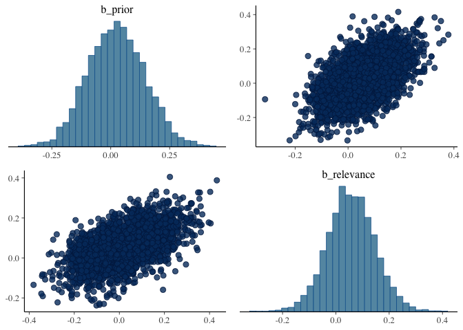<!-- -->

``` r
# xor
model_xor_rel_comp <- brm(
  target ~ relevance*competence + 
    (1 + relevance*competence || submission_id) +
    (1 | title),
  data = d_critical_wide %>% filter(main_type == "xor"),
  family = "gaussian",
  cores = 4,
  iter = 3000
)
```

``` r
summary(model_xor_rel_comp)
```

    ##  Family: gaussian 
    ##   Links: mu = identity; sigma = identity 
    ## Formula: target ~ relevance * competence + (1 + relevance * competence || submission_id) + (1 | title) 
    ##    Data: d_critical_wide %>% filter(main_type == "xor") (Number of observations: 396) 
    ## Samples: 4 chains, each with iter = 3000; warmup = 1500; thin = 1;
    ##          total post-warmup samples = 6000
    ## 
    ## Group-Level Effects: 
    ## ~submission_id (Number of levels: 99) 
    ##                          Estimate Est.Error l-95% CI u-95% CI Rhat Bulk_ESS
    ## sd(Intercept)               17.41      2.75    11.74    22.86 1.00      929
    ## sd(relevance)                0.09      0.06     0.00     0.21 1.00      716
    ## sd(competence)               0.14      0.06     0.02     0.25 1.01      498
    ## sd(relevance:competence)     0.00      0.00     0.00     0.00 1.00     1372
    ##                          Tail_ESS
    ## sd(Intercept)                1562
    ## sd(relevance)                1662
    ## sd(competence)                724
    ## sd(relevance:competence)     2420
    ## 
    ## ~title (Number of levels: 32) 
    ##               Estimate Est.Error l-95% CI u-95% CI Rhat Bulk_ESS Tail_ESS
    ## sd(Intercept)     9.64      2.34     5.29    14.58 1.00     1970     1712
    ## 
    ## Population-Level Effects: 
    ##                      Estimate Est.Error l-95% CI u-95% CI Rhat Bulk_ESS
    ## Intercept               63.21      6.08    51.30    75.20 1.00     3460
    ## relevance                0.01      0.10    -0.19     0.21 1.00     3518
    ## competence               0.07      0.09    -0.11     0.25 1.00     4090
    ## relevance:competence    -0.00      0.00    -0.00     0.00 1.00     3698
    ##                      Tail_ESS
    ## Intercept                3847
    ## relevance                3989
    ## competence               4359
    ## relevance:competence     3920
    ## 
    ## Family Specific Parameters: 
    ##       Estimate Est.Error l-95% CI u-95% CI Rhat Bulk_ESS Tail_ESS
    ## sigma    24.58      1.17    22.34    26.97 1.00     2686     3560
    ## 
    ## Samples were drawn using sampling(NUTS). For each parameter, Bulk_ESS
    ## and Tail_ESS are effective sample size measures, and Rhat is the potential
    ## scale reduction factor on split chains (at convergence, Rhat = 1).

``` r
bayesplot::mcmc_pairs(model_xor_rel_comp, pars = c("b_competence", "b_relevance"))
```

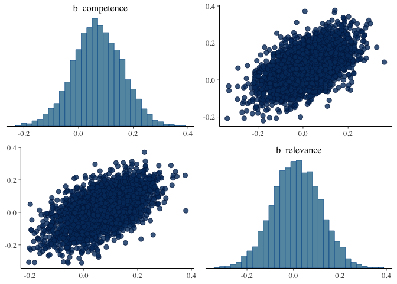<!-- -->

``` r
# some
model_some_pri_comp <- brm(
  target ~ prior*competence + 
    (1 + prior*competence || submission_id) +
    (1 | title),
  data = d_critical_wide %>% filter(main_type == "some"),
  family = "gaussian",
  cores = 4,
  iter = 3000
)
```

``` r
summary(model_some_pri_comp)
```

    ##  Family: gaussian 
    ##   Links: mu = identity; sigma = identity 
    ## Formula: target ~ prior * competence + (1 + prior * competence || submission_id) + (1 | title) 
    ##    Data: d_critical_wide %>% filter(main_type == "some") (Number of observations: 396) 
    ## Samples: 4 chains, each with iter = 3000; warmup = 1500; thin = 1;
    ##          total post-warmup samples = 6000
    ## 
    ## Group-Level Effects: 
    ## ~submission_id (Number of levels: 99) 
    ##                      Estimate Est.Error l-95% CI u-95% CI Rhat Bulk_ESS
    ## sd(Intercept)           10.60      1.66     7.28    13.83 1.00     2044
    ## sd(prior)                0.06      0.04     0.00     0.15 1.01     1944
    ## sd(competence)           0.03      0.02     0.00     0.08 1.00     2299
    ## sd(prior:competence)     0.00      0.00     0.00     0.00 1.00     2491
    ##                      Tail_ESS
    ## sd(Intercept)            2824
    ## sd(prior)                3279
    ## sd(competence)           3064
    ## sd(prior:competence)     3758
    ## 
    ## ~title (Number of levels: 32) 
    ##               Estimate Est.Error l-95% CI u-95% CI Rhat Bulk_ESS Tail_ESS
    ## sd(Intercept)     8.51      1.90     5.15    12.62 1.00     2464     3530
    ## 
    ## Population-Level Effects: 
    ##                  Estimate Est.Error l-95% CI u-95% CI Rhat Bulk_ESS Tail_ESS
    ## Intercept           73.27      3.59    66.35    80.35 1.00     5142     4901
    ## prior                0.04      0.09    -0.14     0.21 1.00     6835     4819
    ## competence           0.18      0.05     0.08     0.28 1.00     5282     4700
    ## prior:competence    -0.00      0.00    -0.00     0.00 1.00     7219     4890
    ## 
    ## Family Specific Parameters: 
    ##       Estimate Est.Error l-95% CI u-95% CI Rhat Bulk_ESS Tail_ESS
    ## sigma    19.91      0.90    18.24    21.75 1.00     3632     4331
    ## 
    ## Samples were drawn using sampling(NUTS). For each parameter, Bulk_ESS
    ## and Tail_ESS are effective sample size measures, and Rhat is the potential
    ## scale reduction factor on split chains (at convergence, Rhat = 1).

``` r
bayesplot::mcmc_pairs(model_some_pri_comp, pars = c("b_prior", "b_competence"))
```

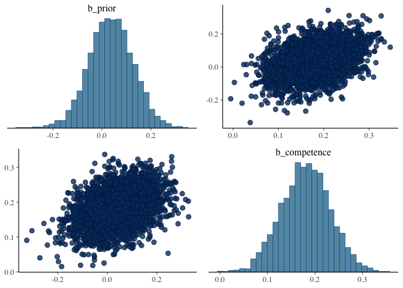<!-- -->

``` r
# some
model_some_pri_rel <- brm(
  target ~ prior*relevance + 
    (1 + prior*relevance || submission_id) +
    (1 | title),
  data = d_critical_wide %>% filter(main_type == "some"),
  family = "gaussian",
  cores = 4,
  iter = 3000
)
```

``` r
summary(model_some_pri_rel)
```

    ##  Family: gaussian 
    ##   Links: mu = identity; sigma = identity 
    ## Formula: target ~ prior * relevance + (1 + prior * relevance || submission_id) + (1 | title) 
    ##    Data: d_critical_wide %>% filter(main_type == "some") (Number of observations: 396) 
    ## Samples: 4 chains, each with iter = 3000; warmup = 1500; thin = 1;
    ##          total post-warmup samples = 6000
    ## 
    ## Group-Level Effects: 
    ## ~submission_id (Number of levels: 99) 
    ##                     Estimate Est.Error l-95% CI u-95% CI Rhat Bulk_ESS Tail_ESS
    ## sd(Intercept)          10.60      1.76     7.02    13.96 1.00     1663     2314
    ## sd(prior)               0.06      0.04     0.00     0.16 1.00     1591     3224
    ## sd(relevance)           0.04      0.03     0.00     0.10 1.00     1258     1876
    ## sd(prior:relevance)     0.00      0.00     0.00     0.00 1.00     1730     3063
    ## 
    ## ~title (Number of levels: 32) 
    ##               Estimate Est.Error l-95% CI u-95% CI Rhat Bulk_ESS Tail_ESS
    ## sd(Intercept)    11.06      1.89     7.78    15.07 1.00     2656     4172
    ## 
    ## Population-Level Effects: 
    ##                 Estimate Est.Error l-95% CI u-95% CI Rhat Bulk_ESS Tail_ESS
    ## Intercept          82.74      4.45    73.86    91.30 1.00     3889     4861
    ## prior              -0.02      0.10    -0.21     0.17 1.00     5094     5279
    ## relevance          -0.01      0.06    -0.11     0.10 1.00     5173     4983
    ## prior:relevance     0.00      0.00    -0.00     0.00 1.00     5651     5071
    ## 
    ## Family Specific Parameters: 
    ##       Estimate Est.Error l-95% CI u-95% CI Rhat Bulk_ESS Tail_ESS
    ## sigma    19.81      0.90    18.17    21.64 1.00     4020     4665
    ## 
    ## Samples were drawn using sampling(NUTS). For each parameter, Bulk_ESS
    ## and Tail_ESS are effective sample size measures, and Rhat is the potential
    ## scale reduction factor on split chains (at convergence, Rhat = 1).

``` r
bayesplot::mcmc_pairs(model_some_pri_rel, pars = c("b_prior", "b_relevance"))
```

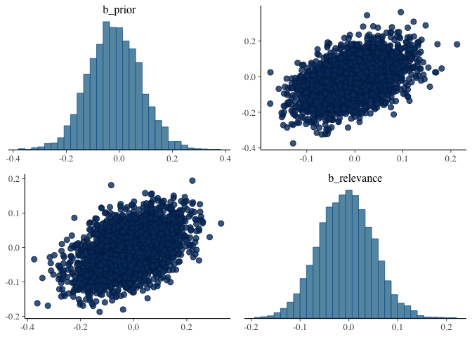<!-- -->

``` r
# some
model_some_rel_comp <- brm(
  target ~ relevance*competence + 
    (1 + relevance*competence || submission_id) +
    (1 | title),
  data = d_critical_wide %>% filter(main_type == "some"),
  family = "gaussian",
  cores = 4,
  iter = 3000
)
```

``` r
summary(model_some_rel_comp)
```

    ##  Family: gaussian 
    ##   Links: mu = identity; sigma = identity 
    ## Formula: target ~ relevance * competence + (1 + relevance * competence || submission_id) + (1 | title) 
    ##    Data: d_critical_wide %>% filter(main_type == "some") (Number of observations: 396) 
    ## Samples: 4 chains, each with iter = 3000; warmup = 1500; thin = 1;
    ##          total post-warmup samples = 6000
    ## 
    ## Group-Level Effects: 
    ## ~submission_id (Number of levels: 99) 
    ##                          Estimate Est.Error l-95% CI u-95% CI Rhat Bulk_ESS
    ## sd(Intercept)               10.48      1.80     6.77    13.87 1.00     1347
    ## sd(relevance)                0.04      0.03     0.00     0.11 1.00      987
    ## sd(competence)               0.03      0.02     0.00     0.08 1.00     2140
    ## sd(relevance:competence)     0.00      0.00     0.00     0.00 1.00     2651
    ##                          Tail_ESS
    ## sd(Intercept)                1564
    ## sd(relevance)                1640
    ## sd(competence)               2738
    ## sd(relevance:competence)     2853
    ## 
    ## ~title (Number of levels: 32) 
    ##               Estimate Est.Error l-95% CI u-95% CI Rhat Bulk_ESS Tail_ESS
    ## sd(Intercept)     8.70      1.87     5.30    12.78 1.00     2019     2954
    ## 
    ## Population-Level Effects: 
    ##                      Estimate Est.Error l-95% CI u-95% CI Rhat Bulk_ESS
    ## Intercept               76.05      5.19    65.88    86.23 1.00     3240
    ## relevance               -0.03      0.07    -0.16     0.11 1.00     3571
    ## competence               0.12      0.07    -0.03     0.27 1.00     3537
    ## relevance:competence     0.00      0.00    -0.00     0.00 1.00     3746
    ##                      Tail_ESS
    ## Intercept                3667
    ## relevance                4368
    ## competence               4309
    ## relevance:competence     4547
    ## 
    ## Family Specific Parameters: 
    ##       Estimate Est.Error l-95% CI u-95% CI Rhat Bulk_ESS Tail_ESS
    ## sigma    19.95      0.89    18.30    21.81 1.00     3155     3611
    ## 
    ## Samples were drawn using sampling(NUTS). For each parameter, Bulk_ESS
    ## and Tail_ESS are effective sample size measures, and Rhat is the potential
    ## scale reduction factor on split chains (at convergence, Rhat = 1).

``` r
bayesplot::mcmc_pairs(model_some_rel_comp, pars = c("b_competence", "b_relevance"))
```

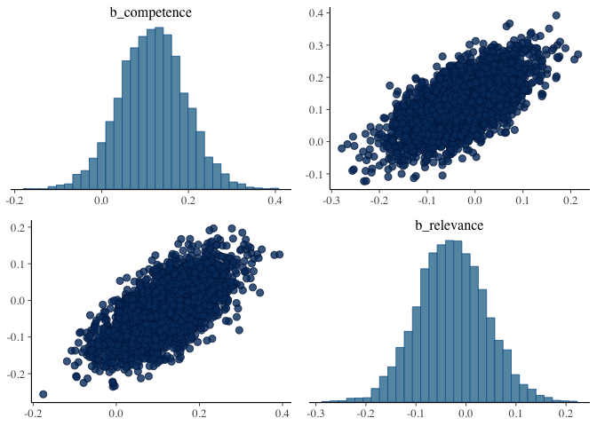<!-- -->

#### Stats on z-scored data

The same stats (full, one predictor, to predictors) on z-scored data:

``` r
# xor, maximal model with interactions and maximal REs on z-scored data
model_xor_zScored <- brm(
  target ~ prior*competence*relevance + 
    (1 + prior + competence + relevance || submission_id) +
    (1 | title),
  data = d_critical_zScored_wide %>% filter(main_type == "xor"),
  family = "gaussian",
  cores = 4,
  iter = 3000
)
```

``` r
summary(model_xor_zScored)
```

    ##  Family: gaussian 
    ##   Links: mu = identity; sigma = identity 
    ## Formula: target ~ prior * competence * relevance + (1 + prior + competence + relevance || submission_id) + (1 | title) 
    ##    Data: d_critical_zScored_wide %>% filter(main_type == "x (Number of observations: 396) 
    ## Samples: 4 chains, each with iter = 3000; warmup = 1500; thin = 1;
    ##          total post-warmup samples = 6000
    ## 
    ## Group-Level Effects: 
    ## ~submission_id (Number of levels: 99) 
    ##                Estimate Est.Error l-95% CI u-95% CI Rhat Bulk_ESS Tail_ESS
    ## sd(Intercept)      0.08      0.06     0.00     0.22 1.00     2442     3082
    ## sd(prior)          0.15      0.09     0.01     0.34 1.00     1255     2412
    ## sd(competence)     0.24      0.10     0.03     0.42 1.00     1110     1454
    ## sd(relevance)      0.13      0.08     0.01     0.30 1.00     1391     2643
    ## 
    ## ~title (Number of levels: 32) 
    ##               Estimate Est.Error l-95% CI u-95% CI Rhat Bulk_ESS Tail_ESS
    ## sd(Intercept)     0.35      0.08     0.20     0.53 1.00     1923     2740
    ## 
    ## Population-Level Effects: 
    ##                            Estimate Est.Error l-95% CI u-95% CI Rhat Bulk_ESS
    ## Intercept                     -0.21      0.08    -0.37    -0.05 1.00     3814
    ## prior                         -0.13      0.07    -0.26     0.01 1.00     6384
    ## competence                     0.07      0.07    -0.06     0.21 1.00     5172
    ## relevance                     -0.02      0.06    -0.14     0.11 1.00     6436
    ## prior:competence               0.12      0.07    -0.02     0.26 1.00     7844
    ## prior:relevance                0.04      0.07    -0.10     0.18 1.00     6425
    ## competence:relevance          -0.03      0.06    -0.14     0.09 1.00     6640
    ## prior:competence:relevance    -0.00      0.07    -0.14     0.14 1.00     7377
    ##                            Tail_ESS
    ## Intercept                      4287
    ## prior                          5015
    ## competence                     4841
    ## relevance                      5009
    ## prior:competence               4958
    ## prior:relevance                4735
    ## competence:relevance           4577
    ## prior:competence:relevance     4423
    ## 
    ## Family Specific Parameters: 
    ##       Estimate Est.Error l-95% CI u-95% CI Rhat Bulk_ESS Tail_ESS
    ## sigma     0.85      0.04     0.77     0.93 1.00     2246     3382
    ## 
    ## Samples were drawn using sampling(NUTS). For each parameter, Bulk_ESS
    ## and Tail_ESS are effective sample size measures, and Rhat is the potential
    ## scale reduction factor on split chains (at convergence, Rhat = 1).

``` r
bayesplot::mcmc_pairs(model_xor_zScored, pars = c("b_prior", "b_relevance", "b_competence"))
```

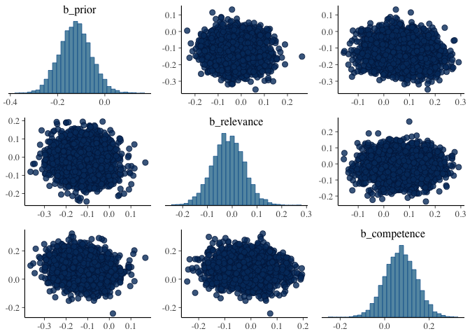<!-- -->

``` r
# some, maximal model with interactions and maximal REs
model_some_zScored <- brm(
  target ~ prior*competence*relevance + 
    (1 + prior + competence + relevance || submission_id) +
    (1 | title),
  data = d_critical_zScored_wide %>% filter(main_type == "some"),
  family = "gaussian",
  cores = 4,
  iter = 3000
)
```

``` r
summary(model_some_zScored)
```

    ##  Family: gaussian 
    ##   Links: mu = identity; sigma = identity 
    ## Formula: target ~ prior * competence * relevance + (1 + prior + competence + relevance || submission_id) + (1 | title) 
    ##    Data: d_critical_zScored_wide %>% filter(main_type == "s (Number of observations: 396) 
    ## Samples: 4 chains, each with iter = 3000; warmup = 1500; thin = 1;
    ##          total post-warmup samples = 6000
    ## 
    ## Group-Level Effects: 
    ## ~submission_id (Number of levels: 99) 
    ##                Estimate Est.Error l-95% CI u-95% CI Rhat Bulk_ESS Tail_ESS
    ## sd(Intercept)      0.10      0.07     0.00     0.24 1.00     1974     2778
    ## sd(prior)          0.10      0.07     0.00     0.24 1.01     1658     3126
    ## sd(competence)     0.17      0.09     0.01     0.33 1.00     1224     2268
    ## sd(relevance)      0.07      0.05     0.00     0.19 1.00     2861     3862
    ## 
    ## ~title (Number of levels: 32) 
    ##               Estimate Est.Error l-95% CI u-95% CI Rhat Bulk_ESS Tail_ESS
    ## sd(Intercept)     0.36      0.08     0.22     0.54 1.00     2595     3742
    ## 
    ## Population-Level Effects: 
    ##                            Estimate Est.Error l-95% CI u-95% CI Rhat Bulk_ESS
    ## Intercept                      0.22      0.08     0.06     0.38 1.00     4999
    ## prior                         -0.04      0.05    -0.14     0.06 1.00     7237
    ## competence                     0.13      0.06     0.00     0.25 1.00     6957
    ## relevance                     -0.05      0.06    -0.17     0.06 1.00     8136
    ## prior:competence              -0.08      0.04    -0.17     0.00 1.00     9884
    ## prior:relevance               -0.01      0.04    -0.10     0.07 1.00     8492
    ## competence:relevance           0.02      0.06    -0.09     0.13 1.00     9211
    ## prior:competence:relevance     0.00      0.04    -0.08     0.08 1.00     9730
    ##                            Tail_ESS
    ## Intercept                      4204
    ## prior                          4775
    ## competence                     4211
    ## relevance                      5105
    ## prior:competence               4819
    ## prior:relevance                4515
    ## competence:relevance           5289
    ## prior:competence:relevance     5152
    ## 
    ## Family Specific Parameters: 
    ##       Estimate Est.Error l-95% CI u-95% CI Rhat Bulk_ESS Tail_ESS
    ## sigma     0.82      0.04     0.75     0.89 1.00     3499     4532
    ## 
    ## Samples were drawn using sampling(NUTS). For each parameter, Bulk_ESS
    ## and Tail_ESS are effective sample size measures, and Rhat is the potential
    ## scale reduction factor on split chains (at convergence, Rhat = 1).

``` r
bayesplot::mcmc_pairs(model_some_zScored, pars = c("b_prior", "b_relevance", "b_competence"))
```

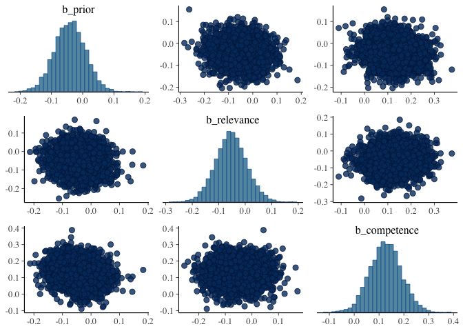<!-- -->

#### Smaller models with z-scored data

``` r
# xor
model_xor_zScored_prior <- brm(
  target ~ prior + 
    (1 + prior | submission_id) +
    (1 | title),
  data = d_critical_zScored_wide %>% filter(main_type == "xor"),
  family = "gaussian",
  cores = 4,
  iter = 3000
)
```

``` r
summary(model_xor_zScored_prior)
```

    ##  Family: gaussian 
    ##   Links: mu = identity; sigma = identity 
    ## Formula: target ~ prior + (1 + prior | submission_id) + (1 | title) 
    ##    Data: d_critical_zScored_wide %>% filter(main_type == "x (Number of observations: 396) 
    ## Samples: 4 chains, each with iter = 3000; warmup = 1500; thin = 1;
    ##          total post-warmup samples = 6000
    ## 
    ## Group-Level Effects: 
    ## ~submission_id (Number of levels: 99) 
    ##                      Estimate Est.Error l-95% CI u-95% CI Rhat Bulk_ESS
    ## sd(Intercept)            0.08      0.06     0.00     0.21 1.00     2369
    ## sd(prior)                0.15      0.09     0.01     0.34 1.00     1616
    ## cor(Intercept,prior)    -0.06      0.57    -0.95     0.94 1.00     1914
    ##                      Tail_ESS
    ## sd(Intercept)            2813
    ## sd(prior)                2940
    ## cor(Intercept,prior)     2591
    ## 
    ## ~title (Number of levels: 32) 
    ##               Estimate Est.Error l-95% CI u-95% CI Rhat Bulk_ESS Tail_ESS
    ## sd(Intercept)     0.38      0.08     0.24     0.56 1.00     2368     3768
    ## 
    ## Population-Level Effects: 
    ##           Estimate Est.Error l-95% CI u-95% CI Rhat Bulk_ESS Tail_ESS
    ## Intercept    -0.20      0.08    -0.36    -0.04 1.00     3267     4243
    ## prior        -0.11      0.07    -0.24     0.02 1.00     5576     4800
    ## 
    ## Family Specific Parameters: 
    ##       Estimate Est.Error l-95% CI u-95% CI Rhat Bulk_ESS Tail_ESS
    ## sigma     0.88      0.04     0.82     0.96 1.00     5053     4328
    ## 
    ## Samples were drawn using sampling(NUTS). For each parameter, Bulk_ESS
    ## and Tail_ESS are effective sample size measures, and Rhat is the potential
    ## scale reduction factor on split chains (at convergence, Rhat = 1).

``` r
# xor
model_xor_zScored_comp <- brm(
  target ~ competence + 
    (1 + competence | submission_id) +
    (1 | title),
  data = d_critical_zScored_wide %>% filter(main_type == "xor"),
  family = "gaussian",
  cores = 4,
  iter = 3000
)
```

``` r
summary(model_xor_zScored_comp)
```

    ##  Family: gaussian 
    ##   Links: mu = identity; sigma = identity 
    ## Formula: target ~ competence + (1 + competence | submission_id) + (1 | title) 
    ##    Data: d_critical_zScored_wide %>% filter(main_type == "x (Number of observations: 396) 
    ## Samples: 4 chains, each with iter = 3000; warmup = 1500; thin = 1;
    ##          total post-warmup samples = 6000
    ## 
    ## Group-Level Effects: 
    ## ~submission_id (Number of levels: 99) 
    ##                           Estimate Est.Error l-95% CI u-95% CI Rhat Bulk_ESS
    ## sd(Intercept)                 0.09      0.06     0.00     0.23 1.00     2563
    ## sd(competence)                0.25      0.10     0.04     0.42 1.00     1440
    ## cor(Intercept,competence)    -0.22      0.55    -0.97     0.91 1.01     1006
    ##                           Tail_ESS
    ## sd(Intercept)                 3582
    ## sd(competence)                1564
    ## cor(Intercept,competence)     1916
    ## 
    ## ~title (Number of levels: 32) 
    ##               Estimate Est.Error l-95% CI u-95% CI Rhat Bulk_ESS Tail_ESS
    ## sd(Intercept)     0.39      0.08     0.25     0.57 1.00     2511     3919
    ## 
    ## Population-Level Effects: 
    ##            Estimate Est.Error l-95% CI u-95% CI Rhat Bulk_ESS Tail_ESS
    ## Intercept     -0.23      0.09    -0.40    -0.06 1.00     3852     3765
    ## competence     0.08      0.07    -0.06     0.21 1.00     7496     5108
    ## 
    ## Family Specific Parameters: 
    ##       Estimate Est.Error l-95% CI u-95% CI Rhat Bulk_ESS Tail_ESS
    ## sigma     0.86      0.04     0.79     0.93 1.00     3298     4156
    ## 
    ## Samples were drawn using sampling(NUTS). For each parameter, Bulk_ESS
    ## and Tail_ESS are effective sample size measures, and Rhat is the potential
    ## scale reduction factor on split chains (at convergence, Rhat = 1).

``` r
# xor
model_xor_zScored_rel <- brm(
  target ~ relevance + 
    (1 + relevance | submission_id) +
    (1 | title),
  data = d_critical_zScored_wide %>% filter(main_type == "xor"),
  family = "gaussian",
  cores = 4,
  iter = 3000
)
```

``` r
summary(model_xor_zScored_rel)
```

    ##  Family: gaussian 
    ##   Links: mu = identity; sigma = identity 
    ## Formula: target ~ relevance + (1 + relevance | submission_id) + (1 | title) 
    ##    Data: d_critical_zScored_wide %>% filter(main_type == "x (Number of observations: 396) 
    ## Samples: 4 chains, each with iter = 3000; warmup = 1500; thin = 1;
    ##          total post-warmup samples = 6000
    ## 
    ## Group-Level Effects: 
    ## ~submission_id (Number of levels: 99) 
    ##                          Estimate Est.Error l-95% CI u-95% CI Rhat Bulk_ESS
    ## sd(Intercept)                0.08      0.06     0.00     0.22 1.00     2788
    ## sd(relevance)                0.14      0.09     0.01     0.32 1.00     1453
    ## cor(Intercept,relevance)     0.08      0.56    -0.93     0.95 1.00     2517
    ##                          Tail_ESS
    ## sd(Intercept)                2579
    ## sd(relevance)                2278
    ## cor(Intercept,relevance)     3059
    ## 
    ## ~title (Number of levels: 32) 
    ##               Estimate Est.Error l-95% CI u-95% CI Rhat Bulk_ESS Tail_ESS
    ## sd(Intercept)     0.41      0.08     0.27     0.59 1.00     2329     3598
    ## 
    ## Population-Level Effects: 
    ##           Estimate Est.Error l-95% CI u-95% CI Rhat Bulk_ESS Tail_ESS
    ## Intercept    -0.22      0.09    -0.40    -0.06 1.00     3143     3888
    ## relevance     0.01      0.06    -0.12     0.13 1.00     6038     4992
    ## 
    ## Family Specific Parameters: 
    ##       Estimate Est.Error l-95% CI u-95% CI Rhat Bulk_ESS Tail_ESS
    ## sigma     0.88      0.04     0.82     0.95 1.00     5525     4272
    ## 
    ## Samples were drawn using sampling(NUTS). For each parameter, Bulk_ESS
    ## and Tail_ESS are effective sample size measures, and Rhat is the potential
    ## scale reduction factor on split chains (at convergence, Rhat = 1).

``` r
# some
model_some_zScored_rel <- brm(
  target ~ relevance + 
    (1 + relevance | submission_id) +
    (1 | title),
  data = d_critical_zScored_wide %>% filter(main_type == "some"),
  family = "gaussian",
  cores = 4,
  iter = 3000
)
```

``` r
summary(model_some_zScored_rel)
```

    ##  Family: gaussian 
    ##   Links: mu = identity; sigma = identity 
    ## Formula: target ~ relevance + (1 + relevance | submission_id) + (1 | title) 
    ##    Data: d_critical_zScored_wide %>% filter(main_type == "s (Number of observations: 396) 
    ## Samples: 4 chains, each with iter = 3000; warmup = 1500; thin = 1;
    ##          total post-warmup samples = 6000
    ## 
    ## Group-Level Effects: 
    ## ~submission_id (Number of levels: 99) 
    ##                          Estimate Est.Error l-95% CI u-95% CI Rhat Bulk_ESS
    ## sd(Intercept)                0.09      0.07     0.00     0.24 1.00     1897
    ## sd(relevance)                0.06      0.05     0.00     0.18 1.00     2657
    ## cor(Intercept,relevance)     0.02      0.58    -0.94     0.96 1.00     4200
    ##                          Tail_ESS
    ## sd(Intercept)                2731
    ## sd(relevance)                3147
    ## cor(Intercept,relevance)     3781
    ## 
    ## ~title (Number of levels: 32) 
    ##               Estimate Est.Error l-95% CI u-95% CI Rhat Bulk_ESS Tail_ESS
    ## sd(Intercept)     0.46      0.08     0.32     0.62 1.00     2208     3830
    ## 
    ## Population-Level Effects: 
    ##           Estimate Est.Error l-95% CI u-95% CI Rhat Bulk_ESS Tail_ESS
    ## Intercept     0.22      0.10     0.03     0.40 1.00     2285     3366
    ## relevance    -0.04      0.06    -0.15     0.07 1.00     5620     4794
    ## 
    ## Family Specific Parameters: 
    ##       Estimate Est.Error l-95% CI u-95% CI Rhat Bulk_ESS Tail_ESS
    ## sigma     0.84      0.03     0.78     0.91 1.00     5601     4014
    ## 
    ## Samples were drawn using sampling(NUTS). For each parameter, Bulk_ESS
    ## and Tail_ESS are effective sample size measures, and Rhat is the potential
    ## scale reduction factor on split chains (at convergence, Rhat = 1).

``` r
# some
model_some_zScored_prior <- brm(
  target ~ prior + 
    (1 + prior | submission_id) +
    (1 | title),
  data = d_critical_zScored_wide %>% filter(main_type == "some"),
  family = "gaussian",
  cores = 4,
  iter = 3000
)
```

``` r
summary(model_some_zScored_prior)
```

    ##  Family: gaussian 
    ##   Links: mu = identity; sigma = identity 
    ## Formula: target ~ prior + (1 + prior | submission_id) + (1 | title) 
    ##    Data: d_critical_zScored_wide %>% filter(main_type == "s (Number of observations: 396) 
    ## Samples: 4 chains, each with iter = 3000; warmup = 1500; thin = 1;
    ##          total post-warmup samples = 6000
    ## 
    ## Group-Level Effects: 
    ## ~submission_id (Number of levels: 99) 
    ##                      Estimate Est.Error l-95% CI u-95% CI Rhat Bulk_ESS
    ## sd(Intercept)            0.10      0.07     0.00     0.26 1.00     2304
    ## sd(prior)                0.11      0.07     0.01     0.26 1.00     1532
    ## cor(Intercept,prior)     0.25      0.55    -0.89     0.97 1.00     3179
    ##                      Tail_ESS
    ## sd(Intercept)            3316
    ## sd(prior)                2768
    ## cor(Intercept,prior)     3876
    ## 
    ## ~title (Number of levels: 32) 
    ##               Estimate Est.Error l-95% CI u-95% CI Rhat Bulk_ESS Tail_ESS
    ## sd(Intercept)     0.46      0.08     0.33     0.64 1.00     2471     3475
    ## 
    ## Population-Level Effects: 
    ##           Estimate Est.Error l-95% CI u-95% CI Rhat Bulk_ESS Tail_ESS
    ## Intercept     0.20      0.10     0.01     0.40 1.00     3550     3982
    ## prior        -0.01      0.05    -0.11     0.08 1.00     9327     4983
    ## 
    ## Family Specific Parameters: 
    ##       Estimate Est.Error l-95% CI u-95% CI Rhat Bulk_ESS Tail_ESS
    ## sigma     0.84      0.03     0.77     0.90 1.00     5188     4157
    ## 
    ## Samples were drawn using sampling(NUTS). For each parameter, Bulk_ESS
    ## and Tail_ESS are effective sample size measures, and Rhat is the potential
    ## scale reduction factor on split chains (at convergence, Rhat = 1).

``` r
# some
model_some_zScored_comp <- brm(
  target ~ competence + 
    (1 + competence | submission_id) +
    (1 | title),
  data = d_critical_zScored_wide %>% filter(main_type == "some"),
  family = "gaussian",
  cores = 4,
  iter = 3000
)
```

``` r
summary(model_some_zScored_comp)
```

    ##  Family: gaussian 
    ##   Links: mu = identity; sigma = identity 
    ## Formula: target ~ competence + (1 + competence | submission_id) + (1 | title) 
    ##    Data: d_critical_zScored_wide %>% filter(main_type == "s (Number of observations: 396) 
    ## Samples: 4 chains, each with iter = 3000; warmup = 1500; thin = 1;
    ##          total post-warmup samples = 6000
    ## 
    ## Group-Level Effects: 
    ## ~submission_id (Number of levels: 99) 
    ##                           Estimate Est.Error l-95% CI u-95% CI Rhat Bulk_ESS
    ## sd(Intercept)                 0.16      0.07     0.02     0.29 1.00     1145
    ## sd(competence)                0.20      0.08     0.03     0.34 1.00     1262
    ## cor(Intercept,competence)    -0.63      0.36    -0.99     0.43 1.00      969
    ##                           Tail_ESS
    ## sd(Intercept)                 1404
    ## sd(competence)                1384
    ## cor(Intercept,competence)     1275
    ## 
    ## ~title (Number of levels: 32) 
    ##               Estimate Est.Error l-95% CI u-95% CI Rhat Bulk_ESS Tail_ESS
    ## sd(Intercept)     0.38      0.08     0.25     0.54 1.00     2171     3916
    ## 
    ## Population-Level Effects: 
    ##            Estimate Est.Error l-95% CI u-95% CI Rhat Bulk_ESS Tail_ESS
    ## Intercept      0.21      0.08     0.04     0.37 1.00     3445     4145
    ## competence     0.15      0.06     0.04     0.27 1.00     4823     4543
    ## 
    ## Family Specific Parameters: 
    ##       Estimate Est.Error l-95% CI u-95% CI Rhat Bulk_ESS Tail_ESS
    ## sigma     0.81      0.04     0.74     0.88 1.00     2091     3505
    ## 
    ## Samples were drawn using sampling(NUTS). For each parameter, Bulk_ESS
    ## and Tail_ESS are effective sample size measures, and Rhat is the potential
    ## scale reduction factor on split chains (at convergence, Rhat = 1).

With two predictors:

``` r
# xor
model_xor_zScored_pri_comp <- brm(
  target ~ prior*competence + 
    (1 + prior*competence || submission_id) +
    (1 | title),
  data = d_critical_zScored_wide %>% filter(main_type == "xor"),
  family = "gaussian",
  cores = 4,
  iter = 3000
)
```

``` r
summary(model_xor_zScored_pri_comp)
```

    ##  Family: gaussian 
    ##   Links: mu = identity; sigma = identity 
    ## Formula: target ~ prior * competence + (1 + prior * competence || submission_id) + (1 | title) 
    ##    Data: d_critical_zScored_wide %>% filter(main_type == "x (Number of observations: 396) 
    ## Samples: 4 chains, each with iter = 3000; warmup = 1500; thin = 1;
    ##          total post-warmup samples = 6000
    ## 
    ## Group-Level Effects: 
    ## ~submission_id (Number of levels: 99) 
    ##                      Estimate Est.Error l-95% CI u-95% CI Rhat Bulk_ESS
    ## sd(Intercept)            0.08      0.06     0.00     0.22 1.00     2379
    ## sd(prior)                0.14      0.09     0.01     0.32 1.00     1491
    ## sd(competence)           0.23      0.10     0.02     0.41 1.01      853
    ## sd(prior:competence)     0.17      0.11     0.01     0.41 1.01     1230
    ##                      Tail_ESS
    ## sd(Intercept)            3277
    ## sd(prior)                2541
    ## sd(competence)           1086
    ## sd(prior:competence)     2681
    ## 
    ## ~title (Number of levels: 32) 
    ##               Estimate Est.Error l-95% CI u-95% CI Rhat Bulk_ESS Tail_ESS
    ## sd(Intercept)     0.35      0.08     0.20     0.52 1.00     1858     2912
    ## 
    ## Population-Level Effects: 
    ##                  Estimate Est.Error l-95% CI u-95% CI Rhat Bulk_ESS Tail_ESS
    ## Intercept           -0.21      0.08    -0.37    -0.05 1.00     2581     3394
    ## prior               -0.13      0.06    -0.26    -0.01 1.00     5703     4930
    ## competence           0.08      0.07    -0.05     0.21 1.00     6164     4718
    ## prior:competence     0.13      0.07    -0.01     0.26 1.00     7953     4693
    ## 
    ## Family Specific Parameters: 
    ##       Estimate Est.Error l-95% CI u-95% CI Rhat Bulk_ESS Tail_ESS
    ## sigma     0.84      0.04     0.77     0.93 1.00     2083     3120
    ## 
    ## Samples were drawn using sampling(NUTS). For each parameter, Bulk_ESS
    ## and Tail_ESS are effective sample size measures, and Rhat is the potential
    ## scale reduction factor on split chains (at convergence, Rhat = 1).

``` r
bayesplot::mcmc_pairs(model_xor_zScored_pri_comp, pars = c("b_prior", "b_competence"))
```

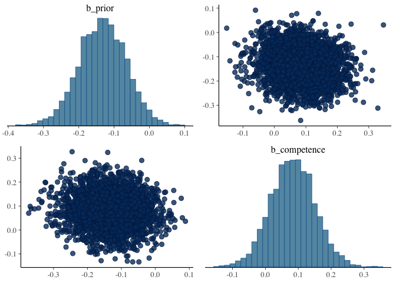<!-- -->

``` r
# xor
model_xor_zScored_pri_rel <- brm(
  target ~ prior*relevance + 
    (1 + prior*relevance || submission_id) +
    (1 | title),
  data = d_critical_zScored_wide %>% filter(main_type == "xor"),
  family = "gaussian",
  cores = 4,
  iter = 3000
)
```

``` r
summary(model_xor_zScored_pri_rel)
```

    ##  Family: gaussian 
    ##   Links: mu = identity; sigma = identity 
    ## Formula: target ~ prior * relevance + (1 + prior * relevance || submission_id) + (1 | title) 
    ##    Data: d_critical_zScored_wide %>% filter(main_type == "x (Number of observations: 396) 
    ## Samples: 4 chains, each with iter = 3000; warmup = 1500; thin = 1;
    ##          total post-warmup samples = 6000
    ## 
    ## Group-Level Effects: 
    ## ~submission_id (Number of levels: 99) 
    ##                     Estimate Est.Error l-95% CI u-95% CI Rhat Bulk_ESS Tail_ESS
    ## sd(Intercept)           0.08      0.06     0.00     0.22 1.00     2492     3174
    ## sd(prior)               0.15      0.09     0.01     0.34 1.00     1357     2329
    ## sd(relevance)           0.14      0.09     0.01     0.32 1.00     1562     2802
    ## sd(prior:relevance)     0.15      0.10     0.01     0.36 1.00     1671     2910
    ## 
    ## ~title (Number of levels: 32) 
    ##               Estimate Est.Error l-95% CI u-95% CI Rhat Bulk_ESS Tail_ESS
    ## sd(Intercept)     0.39      0.08     0.24     0.56 1.00     2591     3583
    ## 
    ## Population-Level Effects: 
    ##                 Estimate Est.Error l-95% CI u-95% CI Rhat Bulk_ESS Tail_ESS
    ## Intercept          -0.20      0.09    -0.37    -0.04 1.00     3999     4278
    ## prior              -0.10      0.07    -0.23     0.03 1.00     6814     5103
    ## relevance           0.00      0.06    -0.13     0.13 1.00     7144     4598
    ## prior:relevance     0.05      0.07    -0.08     0.19 1.00     8749     4975
    ## 
    ## Family Specific Parameters: 
    ##       Estimate Est.Error l-95% CI u-95% CI Rhat Bulk_ESS Tail_ESS
    ## sigma     0.86      0.04     0.79     0.94 1.00     2984     4316
    ## 
    ## Samples were drawn using sampling(NUTS). For each parameter, Bulk_ESS
    ## and Tail_ESS are effective sample size measures, and Rhat is the potential
    ## scale reduction factor on split chains (at convergence, Rhat = 1).

``` r
bayesplot::mcmc_pairs(model_xor_zScored_pri_rel, pars = c("b_prior", "b_relevance"))
```

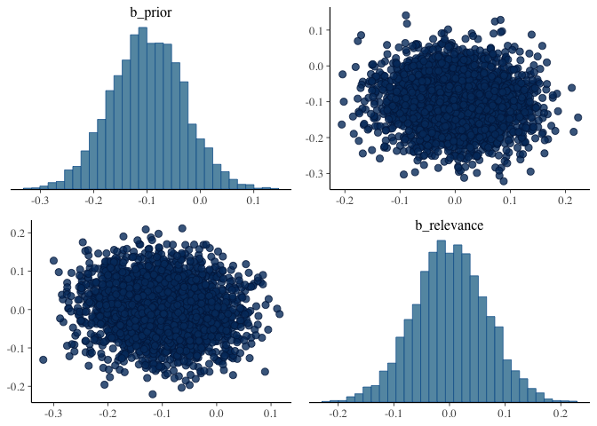<!-- -->

``` r
# xor
model_xor_zScored_rel_comp <- brm(
  target ~ relevance*competence + 
    (1 + relevance*competence || submission_id) +
    (1 | title),
  data = d_critical_zScored_wide %>% filter(main_type == "xor"),
  family = "gaussian",
  cores = 4,
  iter = 3000
)
```

``` r
summary(model_xor_zScored_rel_comp)
```

    ##  Family: gaussian 
    ##   Links: mu = identity; sigma = identity 
    ## Formula: target ~ relevance * competence + (1 + relevance * competence || submission_id) + (1 | title) 
    ##    Data: d_critical_zScored_wide %>% filter(main_type == "x (Number of observations: 396) 
    ## Samples: 4 chains, each with iter = 3000; warmup = 1500; thin = 1;
    ##          total post-warmup samples = 6000
    ## 
    ## Group-Level Effects: 
    ## ~submission_id (Number of levels: 99) 
    ##                          Estimate Est.Error l-95% CI u-95% CI Rhat Bulk_ESS
    ## sd(Intercept)                0.08      0.06     0.00     0.22 1.00     2688
    ## sd(relevance)                0.13      0.08     0.01     0.31 1.00     2005
    ## sd(competence)               0.24      0.11     0.02     0.43 1.00      959
    ## sd(relevance:competence)     0.10      0.07     0.00     0.27 1.00     2274
    ##                          Tail_ESS
    ## sd(Intercept)                3079
    ## sd(relevance)                3420
    ## sd(competence)               1553
    ## sd(relevance:competence)     3208
    ## 
    ## ~title (Number of levels: 32) 
    ##               Estimate Est.Error l-95% CI u-95% CI Rhat Bulk_ESS Tail_ESS
    ## sd(Intercept)     0.40      0.08     0.26     0.57 1.00     2532     4103
    ## 
    ## Population-Level Effects: 
    ##                      Estimate Est.Error l-95% CI u-95% CI Rhat Bulk_ESS
    ## Intercept               -0.23      0.09    -0.41    -0.05 1.00     5103
    ## relevance               -0.00      0.07    -0.13     0.12 1.00     8747
    ## competence               0.06      0.07    -0.07     0.20 1.00     6981
    ## relevance:competence    -0.03      0.06    -0.15     0.09 1.00     7914
    ##                      Tail_ESS
    ## Intercept                4278
    ## relevance                4878
    ## competence               4791
    ## relevance:competence     4488
    ## 
    ## Family Specific Parameters: 
    ##       Estimate Est.Error l-95% CI u-95% CI Rhat Bulk_ESS Tail_ESS
    ## sigma     0.85      0.04     0.78     0.93 1.00     2631     3953
    ## 
    ## Samples were drawn using sampling(NUTS). For each parameter, Bulk_ESS
    ## and Tail_ESS are effective sample size measures, and Rhat is the potential
    ## scale reduction factor on split chains (at convergence, Rhat = 1).

``` r
bayesplot::mcmc_pairs(model_xor_zScored_rel_comp, pars = c("b_relevance", "b_competence"))
```

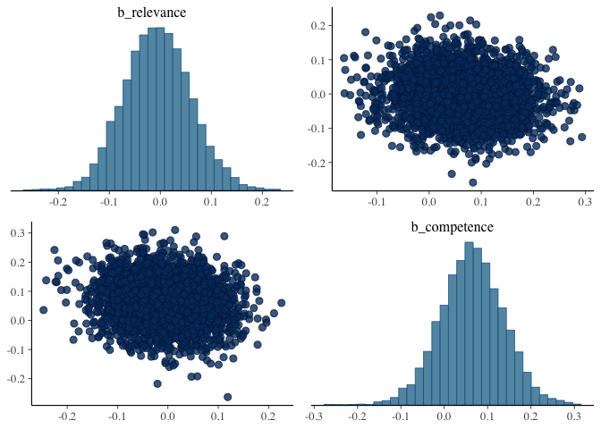<!-- -->

``` r
# some
model_some_zScored_pri_comp <- brm(
  target ~ prior*competence + 
    (1 + prior*competence || submission_id) +
    (1 | title),
  data = d_critical_zScored_wide %>% filter(main_type == "some"),
  family = "gaussian",
  cores = 4,
  iter = 3000
)
```

``` r
summary(model_some_zScored_pri_comp)
```

    ##  Family: gaussian 
    ##   Links: mu = identity; sigma = identity 
    ## Formula: target ~ prior * competence + (1 + prior * competence || submission_id) + (1 | title) 
    ##    Data: d_critical_zScored_wide %>% filter(main_type == "s (Number of observations: 396) 
    ## Samples: 4 chains, each with iter = 3000; warmup = 1500; thin = 1;
    ##          total post-warmup samples = 6000
    ## 
    ## Group-Level Effects: 
    ## ~submission_id (Number of levels: 99) 
    ##                      Estimate Est.Error l-95% CI u-95% CI Rhat Bulk_ESS
    ## sd(Intercept)            0.09      0.07     0.00     0.24 1.00     1547
    ## sd(prior)                0.09      0.06     0.00     0.22 1.00     1401
    ## sd(competence)           0.15      0.08     0.01     0.31 1.00     1082
    ## sd(prior:competence)     0.12      0.07     0.01     0.26 1.00     1139
    ##                      Tail_ESS
    ## sd(Intercept)            2763
    ## sd(prior)                2078
    ## sd(competence)           1848
    ## sd(prior:competence)     2610
    ## 
    ## ~title (Number of levels: 32) 
    ##               Estimate Est.Error l-95% CI u-95% CI Rhat Bulk_ESS Tail_ESS
    ## sd(Intercept)     0.37      0.08     0.23     0.54 1.00     1945     3331
    ## 
    ## Population-Level Effects: 
    ##                  Estimate Est.Error l-95% CI u-95% CI Rhat Bulk_ESS Tail_ESS
    ## Intercept            0.21      0.08     0.04     0.37 1.00     3046     3514
    ## prior               -0.04      0.05    -0.13     0.05 1.00     6644     5219
    ## competence           0.13      0.06     0.01     0.25 1.00     4602     4537
    ## prior:competence    -0.08      0.04    -0.17     0.01 1.00     6407     4800
    ## 
    ## Family Specific Parameters: 
    ##       Estimate Est.Error l-95% CI u-95% CI Rhat Bulk_ESS Tail_ESS
    ## sigma     0.81      0.04     0.74     0.88 1.00     3019     3924
    ## 
    ## Samples were drawn using sampling(NUTS). For each parameter, Bulk_ESS
    ## and Tail_ESS are effective sample size measures, and Rhat is the potential
    ## scale reduction factor on split chains (at convergence, Rhat = 1).

``` r
bayesplot::mcmc_pairs(model_some_zScored_pri_comp, pars = c("b_prior", "b_competence"))
```

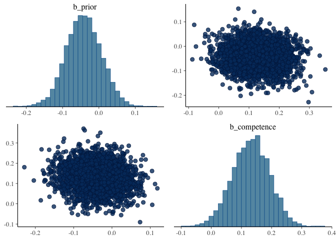<!-- -->

``` r
# some
model_some_zScored_pri_rel <- brm(
  target ~ prior*relevance + 
    (1 + prior*relevance || submission_id) +
    (1 | title),
  data = d_critical_zScored_wide %>% filter(main_type == "some"),
  family = "gaussian",
  cores = 4,
  iter = 3000
)
```

``` r
summary(model_some_zScored_pri_rel)
```

    ##  Family: gaussian 
    ##   Links: mu = identity; sigma = identity 
    ## Formula: target ~ prior * relevance + (1 + prior * relevance || submission_id) + (1 | title) 
    ##    Data: d_critical_zScored_wide %>% filter(main_type == "s (Number of observations: 396) 
    ## Samples: 4 chains, each with iter = 3000; warmup = 1500; thin = 1;
    ##          total post-warmup samples = 6000
    ## 
    ## Group-Level Effects: 
    ## ~submission_id (Number of levels: 99) 
    ##                     Estimate Est.Error l-95% CI u-95% CI Rhat Bulk_ESS Tail_ESS
    ## sd(Intercept)           0.09      0.06     0.00     0.24 1.00     2016     2303
    ## sd(prior)               0.11      0.07     0.01     0.25 1.00     1825     2967
    ## sd(relevance)           0.06      0.05     0.00     0.18 1.00     3470     3488
    ## sd(prior:relevance)     0.09      0.06     0.00     0.22 1.00     1950     3067
    ## 
    ## ~title (Number of levels: 32) 
    ##               Estimate Est.Error l-95% CI u-95% CI Rhat Bulk_ESS Tail_ESS
    ## sd(Intercept)     0.46      0.08     0.33     0.64 1.00     2523     3964
    ## 
    ## Population-Level Effects: 
    ##                 Estimate Est.Error l-95% CI u-95% CI Rhat Bulk_ESS Tail_ESS
    ## Intercept           0.21      0.10     0.02     0.41 1.00     3607     3924
    ## prior              -0.02      0.05    -0.11     0.08 1.00     9672     4764
    ## relevance          -0.04      0.06    -0.16     0.09 1.00     7476     4335
    ## prior:relevance    -0.00      0.05    -0.09     0.08 1.00     8499     5070
    ## 
    ## Family Specific Parameters: 
    ##       Estimate Est.Error l-95% CI u-95% CI Rhat Bulk_ESS Tail_ESS
    ## sigma     0.83      0.03     0.76     0.90 1.00     4741     4654
    ## 
    ## Samples were drawn using sampling(NUTS). For each parameter, Bulk_ESS
    ## and Tail_ESS are effective sample size measures, and Rhat is the potential
    ## scale reduction factor on split chains (at convergence, Rhat = 1).

``` r
bayesplot::mcmc_pairs(model_some_zScored_pri_rel, pars = c("b_prior", "b_relevance"))
```

<!-- -->

``` r
# some
model_some_zScored_rel_comp <- brm(
  target ~ relevance*competence + 
    (1 + relevance*competence || submission_id) +
    (1 | title),
  data = d_critical_zScored_wide %>% filter(main_type == "some"),
  family = "gaussian",
  cores = 4,
  iter = 3000
)
```

``` r
summary(model_some_zScored_rel_comp)
```

    ##  Family: gaussian 
    ##   Links: mu = identity; sigma = identity 
    ## Formula: target ~ relevance * competence + (1 + relevance * competence || submission_id) + (1 | title) 
    ##    Data: d_critical_zScored_wide %>% filter(main_type == "s (Number of observations: 396) 
    ## Samples: 4 chains, each with iter = 3000; warmup = 1500; thin = 1;
    ##          total post-warmup samples = 6000
    ## 
    ## Group-Level Effects: 
    ## ~submission_id (Number of levels: 99) 
    ##                          Estimate Est.Error l-95% CI u-95% CI Rhat Bulk_ESS
    ## sd(Intercept)                0.10      0.07     0.01     0.25 1.00     1947
    ## sd(relevance)                0.07      0.05     0.00     0.18 1.00     2963
    ## sd(competence)               0.16      0.09     0.01     0.32 1.01     1078
    ## sd(relevance:competence)     0.11      0.07     0.00     0.26 1.00     1639
    ##                          Tail_ESS
    ## sd(Intercept)                3151
    ## sd(relevance)                2875
    ## sd(competence)               2096
    ## sd(relevance:competence)     2634
    ## 
    ## ~title (Number of levels: 32) 
    ##               Estimate Est.Error l-95% CI u-95% CI Rhat Bulk_ESS Tail_ESS
    ## sd(Intercept)     0.37      0.08     0.23     0.54 1.00     2267     3969
    ## 
    ## Population-Level Effects: 
    ##                      Estimate Est.Error l-95% CI u-95% CI Rhat Bulk_ESS
    ## Intercept                0.22      0.08     0.05     0.38 1.00     3491
    ## relevance               -0.04      0.06    -0.15     0.07 1.00     7485
    ## competence               0.15      0.06     0.04     0.27 1.00     5636
    ## relevance:competence     0.02      0.05    -0.08     0.12 1.00     7620
    ##                      Tail_ESS
    ## Intercept                3697
    ## relevance                5298
    ## competence               4793
    ## relevance:competence     4708
    ## 
    ## Family Specific Parameters: 
    ##       Estimate Est.Error l-95% CI u-95% CI Rhat Bulk_ESS Tail_ESS
    ## sigma     0.82      0.04     0.75     0.89 1.00     3109     4491
    ## 
    ## Samples were drawn using sampling(NUTS). For each parameter, Bulk_ESS
    ## and Tail_ESS are effective sample size measures, and Rhat is the potential
    ## scale reduction factor on split chains (at convergence, Rhat = 1).

``` r
bayesplot::mcmc_pairs(model_some_zScored_rel_comp, pars = c("b_relevance", "b_competence"))
```

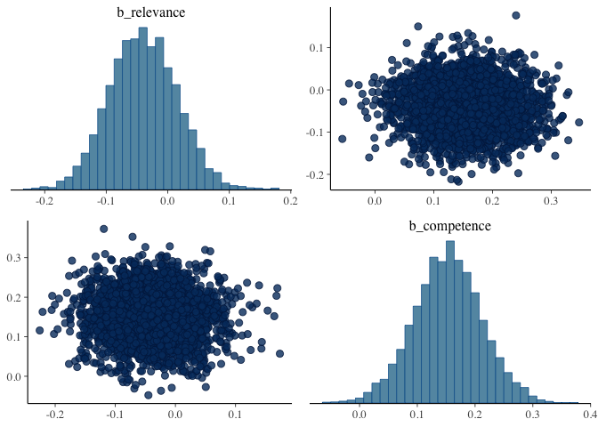<!-- -->

#### Stats with dichotomized predictors

Maximal model on raw inference ratings, using anticipated binary
categorization of items as predictors

``` r
d_critical_long %>% 
  select(submission_id, title, main_type, block_extended, response, prior_class, class_condition) %>% 
  unique() %>% 
  pivot_wider(
    names_from = class_condition, 
    values_from = prior_class
  )  %>%
  mutate(relevance = factor(relevance, levels = c(1, 0)),
         competence = factor(competence, levels = c(1, 0)),
         prior = factor(prior, levels = c(1, 0))) %>% 
  filter(block_extended == "target") -> d_critical_wide_cat
# sum code predictors
# low prior: -1, high prior:: 1 
contrasts(d_critical_wide_cat$prior) <- contr.sum(2)
# low comp : -1, high comp : 1
contrasts(d_critical_wide_cat$competence) <- contr.sum(2)
# low rel: -1, high rel: 1
contrasts(d_critical_wide_cat$relevance) <- contr.sum(2)

# xor, maximal model with interactions and maximal REs
model_xor_cat <- brm(
  response ~ prior*competence*relevance + 
    (1 + prior + competence + relevance || submission_id) +
    (1 | title),
  data = d_critical_wide_cat %>% filter(main_type == "xor"),
  family = "gaussian",
  cores = 4,
  iter = 3000
)
```

``` r
summary(model_xor_cat)
```

    ##  Family: gaussian 
    ##   Links: mu = identity; sigma = identity 
    ## Formula: response ~ prior * competence * relevance + (1 + prior + competence + relevance || submission_id) + (1 | title) 
    ##    Data: d_critical_wide_cat %>% filter(main_type == "xor") (Number of observations: 396) 
    ## Samples: 4 chains, each with iter = 3000; warmup = 1500; thin = 1;
    ##          total post-warmup samples = 6000
    ## 
    ## Group-Level Effects: 
    ## ~submission_id (Number of levels: 99) 
    ##                 Estimate Est.Error l-95% CI u-95% CI Rhat Bulk_ESS Tail_ESS
    ## sd(Intercept)      20.70      2.07    16.79    24.90 1.00     2106     3454
    ## sd(prior1)          5.26      2.65     0.43    10.09 1.00      935     2018
    ## sd(competence1)     7.23      2.76     1.11    12.00 1.00      801      988
    ## sd(relevance1)      2.80      1.92     0.13     7.20 1.00     1510     2732
    ## 
    ## ~title (Number of levels: 32) 
    ##               Estimate Est.Error l-95% CI u-95% CI Rhat Bulk_ESS Tail_ESS
    ## sd(Intercept)     7.95      2.88     2.14    13.73 1.00     1242     1632
    ## 
    ## Population-Level Effects: 
    ##                               Estimate Est.Error l-95% CI u-95% CI Rhat
    ## Intercept                        67.82      2.84    62.30    73.49 1.00
    ## prior1                           -2.07      2.05    -6.19     1.94 1.00
    ## competence1                       3.39      2.13    -0.89     7.45 1.00
    ## relevance1                       -0.30      2.03    -4.26     3.83 1.00
    ## prior1:competence1                0.11      2.02    -4.02     4.17 1.00
    ## prior1:relevance1                 2.91      1.99    -0.98     6.84 1.00
    ## competence1:relevance1            4.08      1.96     0.22     7.97 1.00
    ## prior1:competence1:relevance1    -2.67      2.04    -6.80     1.43 1.00
    ##                               Bulk_ESS Tail_ESS
    ## Intercept                         2806     3826
    ## prior1                            4460     3953
    ## competence1                       4695     4372
    ## relevance1                        4488     3390
    ## prior1:competence1                4350     3623
    ## prior1:relevance1                 4560     4119
    ## competence1:relevance1            4972     3794
    ## prior1:competence1:relevance1     4769     4064
    ## 
    ## Family Specific Parameters: 
    ##       Estimate Est.Error l-95% CI u-95% CI Rhat Bulk_ESS Tail_ESS
    ## sigma    22.78      1.52    19.80    25.75 1.00      948     1490
    ## 
    ## Samples were drawn using sampling(NUTS). For each parameter, Bulk_ESS
    ## and Tail_ESS are effective sample size measures, and Rhat is the potential
    ## scale reduction factor on split chains (at convergence, Rhat = 1).

We test the following hypotheses for the categorical predictors models
(identical for both or and some): H1: For higher prior of the stronger
alternative being true, the inference strength is lower H2: For higher
speaker comptence, the inference strength is higher H3: For higher
listener relevance, the inference strength is higher

``` r
# xor
# test H1
hypothesis(model_xor_cat, "prior1 < 0")
```

    ## Hypothesis Tests for class b:
    ##     Hypothesis Estimate Est.Error CI.Lower CI.Upper Evid.Ratio Post.Prob Star
    ## 1 (prior1) < 0    -2.07      2.05    -5.46     1.24       5.51      0.85     
    ## ---
    ## 'CI': 90%-CI for one-sided and 95%-CI for two-sided hypotheses.
    ## '*': For one-sided hypotheses, the posterior probability exceeds 95%;
    ## for two-sided hypotheses, the value tested against lies outside the 95%-CI.
    ## Posterior probabilities of point hypotheses assume equal prior probabilities.

``` r
# test H2
hypothesis(model_xor_cat, "competence1 > 0")
```

    ## Hypothesis Tests for class b:
    ##          Hypothesis Estimate Est.Error CI.Lower CI.Upper Evid.Ratio Post.Prob
    ## 1 (competence1) > 0     3.39      2.13    -0.13      6.7      16.96      0.94
    ##   Star
    ## 1     
    ## ---
    ## 'CI': 90%-CI for one-sided and 95%-CI for two-sided hypotheses.
    ## '*': For one-sided hypotheses, the posterior probability exceeds 95%;
    ## for two-sided hypotheses, the value tested against lies outside the 95%-CI.
    ## Posterior probabilities of point hypotheses assume equal prior probabilities.

``` r
# test H3
hypothesis(model_xor_cat, "relevance1 > 0")
```

    ## Hypothesis Tests for class b:
    ##         Hypothesis Estimate Est.Error CI.Lower CI.Upper Evid.Ratio Post.Prob
    ## 1 (relevance1) > 0     -0.3      2.03     -3.5     3.08       0.75      0.43
    ##   Star
    ## 1     
    ## ---
    ## 'CI': 90%-CI for one-sided and 95%-CI for two-sided hypotheses.
    ## '*': For one-sided hypotheses, the posterior probability exceeds 95%;
    ## for two-sided hypotheses, the value tested against lies outside the 95%-CI.
    ## Posterior probabilities of point hypotheses assume equal prior probabilities.

``` r
model_some_cat <- brm(
  response ~ prior*competence*relevance + 
    (1 + prior + competence + relevance || submission_id) +
    (1 | title),
  data = d_critical_wide_cat %>% filter(main_type == "some"),
  family = "gaussian",
  cores = 4,
  iter = 3000
)
```

``` r
summary(model_some_cat)
```

    ##  Family: gaussian 
    ##   Links: mu = identity; sigma = identity 
    ## Formula: response ~ prior * competence * relevance + (1 + prior + competence + relevance || submission_id) + (1 | title) 
    ##    Data: d_critical_wide_cat %>% filter(main_type == "some" (Number of observations: 396) 
    ## Samples: 4 chains, each with iter = 3000; warmup = 1500; thin = 1;
    ##          total post-warmup samples = 6000
    ## 
    ## Group-Level Effects: 
    ## ~submission_id (Number of levels: 99) 
    ##                 Estimate Est.Error l-95% CI u-95% CI Rhat Bulk_ESS Tail_ESS
    ## sd(Intercept)      10.91      1.59     7.91    14.17 1.00     1956     3582
    ## sd(prior1)          1.76      1.28     0.08     4.72 1.00     2378     3689
    ## sd(competence1)     6.28      2.11     1.36    10.07 1.00      909      832
    ## sd(relevance1)      3.62      2.00     0.22     7.53 1.00     1089     2447
    ## 
    ## ~title (Number of levels: 32) 
    ##               Estimate Est.Error l-95% CI u-95% CI Rhat Bulk_ESS Tail_ESS
    ## sd(Intercept)     7.55      2.14     3.70    12.13 1.00     1857     2525
    ## 
    ## Population-Level Effects: 
    ##                               Estimate Est.Error l-95% CI u-95% CI Rhat
    ## Intercept                        82.40      1.96    78.51    86.26 1.00
    ## prior1                           -1.99      1.76    -5.40     1.56 1.00
    ## competence1                       7.20      1.83     3.57    10.74 1.00
    ## relevance1                        1.18      1.78    -2.19     4.72 1.00
    ## prior1:competence1                1.73      1.75    -1.72     5.22 1.00
    ## prior1:relevance1                -3.12      1.69    -6.49     0.38 1.00
    ## competence1:relevance1            1.22      1.76    -2.26     4.77 1.00
    ## prior1:competence1:relevance1     1.32      1.76    -2.14     4.80 1.00
    ##                               Bulk_ESS Tail_ESS
    ## Intercept                         4460     3822
    ## prior1                            5217     3700
    ## competence1                       5427     4013
    ## relevance1                        4750     4202
    ## prior1:competence1                5131     4544
    ## prior1:relevance1                 5191     4436
    ## competence1:relevance1            5448     4215
    ## prior1:competence1:relevance1     4406     4418
    ## 
    ## Family Specific Parameters: 
    ##       Estimate Est.Error l-95% CI u-95% CI Rhat Bulk_ESS Tail_ESS
    ## sigma    18.36      1.08    16.25    20.52 1.00     1347     2987
    ## 
    ## Samples were drawn using sampling(NUTS). For each parameter, Bulk_ESS
    ## and Tail_ESS are effective sample size measures, and Rhat is the potential
    ## scale reduction factor on split chains (at convergence, Rhat = 1).

``` r
# some
# test H1
hypothesis(model_some_cat, "prior1 < 0")
```

    ## Hypothesis Tests for class b:
    ##     Hypothesis Estimate Est.Error CI.Lower CI.Upper Evid.Ratio Post.Prob Star
    ## 1 (prior1) < 0    -1.99      1.76    -4.82     0.94       7.06      0.88     
    ## ---
    ## 'CI': 90%-CI for one-sided and 95%-CI for two-sided hypotheses.
    ## '*': For one-sided hypotheses, the posterior probability exceeds 95%;
    ## for two-sided hypotheses, the value tested against lies outside the 95%-CI.
    ## Posterior probabilities of point hypotheses assume equal prior probabilities.

``` r
# test H2
hypothesis(model_some_cat, "competence1 > 0")
```

    ## Hypothesis Tests for class b:
    ##          Hypothesis Estimate Est.Error CI.Lower CI.Upper Evid.Ratio Post.Prob
    ## 1 (competence1) > 0      7.2      1.83     4.22    10.19       2999         1
    ##   Star
    ## 1    *
    ## ---
    ## 'CI': 90%-CI for one-sided and 95%-CI for two-sided hypotheses.
    ## '*': For one-sided hypotheses, the posterior probability exceeds 95%;
    ## for two-sided hypotheses, the value tested against lies outside the 95%-CI.
    ## Posterior probabilities of point hypotheses assume equal prior probabilities.

``` r
# test H3
hypothesis(model_some_cat, "relevance1 > 0")
```

    ## Hypothesis Tests for class b:
    ##         Hypothesis Estimate Est.Error CI.Lower CI.Upper Evid.Ratio Post.Prob
    ## 1 (relevance1) > 0     1.18      1.78    -1.66     4.08       3.01      0.75
    ##   Star
    ## 1     
    ## ---
    ## 'CI': 90%-CI for one-sided and 95%-CI for two-sided hypotheses.
    ## '*': For one-sided hypotheses, the posterior probability exceeds 95%;
    ## for two-sided hypotheses, the value tested against lies outside the 95%-CI.
    ## Posterior probabilities of point hypotheses assume equal prior probabilities.

Maximal model on z-scored inference ratings, using anticipated binary
categorization of items as predictors

``` r
d_critical_zScored %>% 
  select(submission_id, title, main_type, block_extended, response_centered, prior_class, class_condition) %>% 
  unique() %>% 
  pivot_wider(
    names_from = class_condition, 
    values_from = prior_class
  )  %>%
  mutate(relevance = factor(relevance, levels = c(1, 0)),
         competence = factor(competence, levels = c(1, 0)),
         prior = factor(prior, levels = c(1, 0))) %>% 
  filter(block_extended == "target") -> d_critical_wide_cat_zScored
# sum code predictors
# low prior: -1, high prior:: 1 
contrasts(d_critical_wide_cat_zScored$prior) <- contr.sum(2)
# low comp : -1, high comp : 1
contrasts(d_critical_wide_cat_zScored$competence) <- contr.sum(2)
# low rel: -1, high rel: 1
contrasts(d_critical_wide_cat_zScored$relevance) <- contr.sum(2)

# xor, maximal model with interactions and maximal REs
model_xor_cat_zScored <- brm(
  response_centered ~ prior*competence*relevance + 
    (1 + prior + competence + relevance || submission_id) +
    (1 | title),
  data = d_critical_wide_cat_zScored %>% filter(main_type == "xor"),
  family = "gaussian",
  cores = 4,
  iter = 3000
)
```

``` r
summary(model_xor_cat_zScored)
```

    ##  Family: gaussian 
    ##   Links: mu = identity; sigma = identity 
    ## Formula: response_centered ~ prior * competence * relevance + (1 + prior + competence + relevance || submission_id) + (1 | title) 
    ##    Data: d_critical_wide_cat_zScored %>% filter(main_type = (Number of observations: 396) 
    ## Samples: 4 chains, each with iter = 3000; warmup = 1500; thin = 1;
    ##          total post-warmup samples = 6000
    ## 
    ## Group-Level Effects: 
    ## ~submission_id (Number of levels: 99) 
    ##                 Estimate Est.Error l-95% CI u-95% CI Rhat Bulk_ESS Tail_ESS
    ## sd(Intercept)       0.10      0.07     0.00     0.24 1.00     1448     2357
    ## sd(prior1)          0.19      0.09     0.02     0.35 1.01     1093     1800
    ## sd(competence1)     0.23      0.09     0.02     0.40 1.01      966     1239
    ## sd(relevance1)      0.11      0.07     0.01     0.26 1.00     1546     2630
    ## 
    ## ~title (Number of levels: 32) 
    ##               Estimate Est.Error l-95% CI u-95% CI Rhat Bulk_ESS Tail_ESS
    ## sd(Intercept)     0.34      0.09     0.18     0.54 1.00     2061     2948
    ## 
    ## Population-Level Effects: 
    ##                               Estimate Est.Error l-95% CI u-95% CI Rhat
    ## Intercept                        -0.23      0.08    -0.38    -0.08 1.00
    ## prior1                           -0.10      0.08    -0.27     0.05 1.00
    ## competence1                       0.19      0.08     0.02     0.35 1.00
    ## relevance1                        0.04      0.08    -0.11     0.19 1.00
    ## prior1:competence1                0.01      0.08    -0.15     0.16 1.00
    ## prior1:relevance1                 0.10      0.08    -0.05     0.25 1.00
    ## competence1:relevance1            0.15      0.08    -0.01     0.30 1.00
    ## prior1:competence1:relevance1    -0.04      0.08    -0.19     0.11 1.00
    ##                               Bulk_ESS Tail_ESS
    ## Intercept                         4504     4480
    ## prior1                            3734     4119
    ## competence1                       3898     4092
    ## relevance1                        4258     3919
    ## prior1:competence1                4113     4244
    ## prior1:relevance1                 4415     4601
    ## competence1:relevance1            3936     4137
    ## prior1:competence1:relevance1     4590     4255
    ## 
    ## Family Specific Parameters: 
    ##       Estimate Est.Error l-95% CI u-95% CI Rhat Bulk_ESS Tail_ESS
    ## sigma     0.82      0.04     0.74     0.91 1.00     1319     2626
    ## 
    ## Samples were drawn using sampling(NUTS). For each parameter, Bulk_ESS
    ## and Tail_ESS are effective sample size measures, and Rhat is the potential
    ## scale reduction factor on split chains (at convergence, Rhat = 1).

``` r
# xor
# test H1
hypothesis(model_xor_cat_zScored, "prior1 < 0")
```

    ## Hypothesis Tests for class b:
    ##     Hypothesis Estimate Est.Error CI.Lower CI.Upper Evid.Ratio Post.Prob Star
    ## 1 (prior1) < 0     -0.1      0.08    -0.24     0.03       9.26       0.9     
    ## ---
    ## 'CI': 90%-CI for one-sided and 95%-CI for two-sided hypotheses.
    ## '*': For one-sided hypotheses, the posterior probability exceeds 95%;
    ## for two-sided hypotheses, the value tested against lies outside the 95%-CI.
    ## Posterior probabilities of point hypotheses assume equal prior probabilities.

``` r
# test H2
hypothesis(model_xor_cat_zScored, "competence1 > 0")
```

    ## Hypothesis Tests for class b:
    ##          Hypothesis Estimate Est.Error CI.Lower CI.Upper Evid.Ratio Post.Prob
    ## 1 (competence1) > 0     0.19      0.08     0.05     0.32      72.17      0.99
    ##   Star
    ## 1    *
    ## ---
    ## 'CI': 90%-CI for one-sided and 95%-CI for two-sided hypotheses.
    ## '*': For one-sided hypotheses, the posterior probability exceeds 95%;
    ## for two-sided hypotheses, the value tested against lies outside the 95%-CI.
    ## Posterior probabilities of point hypotheses assume equal prior probabilities.

``` r
# test H3
hypothesis(model_xor_cat_zScored, "relevance1 > 0")
```

    ## Hypothesis Tests for class b:
    ##         Hypothesis Estimate Est.Error CI.Lower CI.Upper Evid.Ratio Post.Prob
    ## 1 (relevance1) > 0     0.04      0.08    -0.09     0.17       2.02      0.67
    ##   Star
    ## 1     
    ## ---
    ## 'CI': 90%-CI for one-sided and 95%-CI for two-sided hypotheses.
    ## '*': For one-sided hypotheses, the posterior probability exceeds 95%;
    ## for two-sided hypotheses, the value tested against lies outside the 95%-CI.
    ## Posterior probabilities of point hypotheses assume equal prior probabilities.

``` r
model_some_cat_zScored <- brm(
  response_centered ~ prior*competence*relevance + 
    (1 + prior + competence + relevance || submission_id) +
    (1 | title),
  data = d_critical_wide_cat_zScored %>% filter(main_type == "some"),
  family = "gaussian",
  cores = 4,
  iter = 3000
)
```

``` r
summary(model_some_cat_zScored)
```

    ##  Family: gaussian 
    ##   Links: mu = identity; sigma = identity 
    ## Formula: response_centered ~ prior * competence * relevance + (1 + prior + competence + relevance || submission_id) + (1 | title) 
    ##    Data: d_critical_wide_cat_zScored %>% filter(main_type = (Number of observations: 396) 
    ## Samples: 4 chains, each with iter = 3000; warmup = 1500; thin = 1;
    ##          total post-warmup samples = 6000
    ## 
    ## Group-Level Effects: 
    ## ~submission_id (Number of levels: 99) 
    ##                 Estimate Est.Error l-95% CI u-95% CI Rhat Bulk_ESS Tail_ESS
    ## sd(Intercept)       0.10      0.07     0.00     0.25 1.00     1913     2455
    ## sd(prior1)          0.07      0.05     0.00     0.18 1.00     3385     3486
    ## sd(competence1)     0.16      0.09     0.01     0.32 1.00     1170     2490
    ## sd(relevance1)      0.13      0.08     0.01     0.29 1.00     1580     2468
    ## 
    ## ~title (Number of levels: 32) 
    ##               Estimate Est.Error l-95% CI u-95% CI Rhat Bulk_ESS Tail_ESS
    ## sd(Intercept)     0.28      0.09     0.11     0.46 1.00     1653     2143
    ## 
    ## Population-Level Effects: 
    ##                               Estimate Est.Error l-95% CI u-95% CI Rhat
    ## Intercept                         0.22      0.07     0.09     0.35 1.00
    ## prior1                           -0.09      0.07    -0.22     0.05 1.00
    ## competence1                       0.32      0.07     0.18     0.46 1.00
    ## relevance1                        0.03      0.07    -0.10     0.16 1.00
    ## prior1:competence1                0.05      0.07    -0.08     0.18 1.00
    ## prior1:relevance1                -0.12      0.07    -0.26     0.01 1.00
    ## competence1:relevance1            0.09      0.07    -0.04     0.22 1.00
    ## prior1:competence1:relevance1     0.05      0.07    -0.08     0.19 1.00
    ##                               Bulk_ESS Tail_ESS
    ## Intercept                         6096     4755
    ## prior1                            5690     4443
    ## competence1                       5993     4717
    ## relevance1                        6464     4742
    ## prior1:competence1                6257     4412
    ## prior1:relevance1                 6300     4402
    ## competence1:relevance1            6272     4801
    ## prior1:competence1:relevance1     5704     4609
    ## 
    ## Family Specific Parameters: 
    ##       Estimate Est.Error l-95% CI u-95% CI Rhat Bulk_ESS Tail_ESS
    ## sigma     0.82      0.04     0.74     0.89 1.00     2593     3242
    ## 
    ## Samples were drawn using sampling(NUTS). For each parameter, Bulk_ESS
    ## and Tail_ESS are effective sample size measures, and Rhat is the potential
    ## scale reduction factor on split chains (at convergence, Rhat = 1).

``` r
# some
# test H1
hypothesis(model_some_cat_zScored, "prior1 < 0")
```

    ## Hypothesis Tests for class b:
    ##     Hypothesis Estimate Est.Error CI.Lower CI.Upper Evid.Ratio Post.Prob Star
    ## 1 (prior1) < 0    -0.09      0.07     -0.2     0.03       9.22       0.9     
    ## ---
    ## 'CI': 90%-CI for one-sided and 95%-CI for two-sided hypotheses.
    ## '*': For one-sided hypotheses, the posterior probability exceeds 95%;
    ## for two-sided hypotheses, the value tested against lies outside the 95%-CI.
    ## Posterior probabilities of point hypotheses assume equal prior probabilities.

``` r
# test H2
hypothesis(model_some_cat_zScored, "competence1 > 0")
```

    ## Hypothesis Tests for class b:
    ##          Hypothesis Estimate Est.Error CI.Lower CI.Upper Evid.Ratio Post.Prob
    ## 1 (competence1) > 0     0.32      0.07     0.21     0.44        Inf         1
    ##   Star
    ## 1    *
    ## ---
    ## 'CI': 90%-CI for one-sided and 95%-CI for two-sided hypotheses.
    ## '*': For one-sided hypotheses, the posterior probability exceeds 95%;
    ## for two-sided hypotheses, the value tested against lies outside the 95%-CI.
    ## Posterior probabilities of point hypotheses assume equal prior probabilities.

``` r
# test H3
hypothesis(model_some_cat_zScored, "relevance1 > 0")
```

    ## Hypothesis Tests for class b:
    ##         Hypothesis Estimate Est.Error CI.Lower CI.Upper Evid.Ratio Post.Prob
    ## 1 (relevance1) > 0     0.03      0.07    -0.08     0.14       2.01      0.67
    ##   Star
    ## 1     
    ## ---
    ## 'CI': 90%-CI for one-sided and 95%-CI for two-sided hypotheses.
    ## '*': For one-sided hypotheses, the posterior probability exceeds 95%;
    ## for two-sided hypotheses, the value tested against lies outside the 95%-CI.
    ## Posterior probabilities of point hypotheses assume equal prior probabilities.

#### Single predictor z-scored models with categorical predictors

For xor:

``` r
model_xor_cat_zScored_pri <- brm(
  response_centered ~ prior + 
    (1 + prior | submission_id) +
    (1 | title),
  data = d_critical_wide_cat_zScored %>% filter(main_type == "xor"),
  family = "gaussian",
  cores = 4,
  iter = 3000
)
```

``` r
summary(model_xor_cat_zScored_pri)
```

    ##  Family: gaussian 
    ##   Links: mu = identity; sigma = identity 
    ## Formula: response_centered ~ prior + (1 + prior | submission_id) + (1 | title) 
    ##    Data: d_critical_wide_cat_zScored %>% filter(main_type = (Number of observations: 396) 
    ## Samples: 4 chains, each with iter = 3000; warmup = 1500; thin = 1;
    ##          total post-warmup samples = 6000
    ## 
    ## Group-Level Effects: 
    ## ~submission_id (Number of levels: 99) 
    ##                       Estimate Est.Error l-95% CI u-95% CI Rhat Bulk_ESS
    ## sd(Intercept)             0.08      0.06     0.00     0.22 1.00     1972
    ## sd(prior1)                0.19      0.09     0.02     0.35 1.00      916
    ## cor(Intercept,prior1)     0.12      0.55    -0.91     0.96 1.00     1249
    ##                       Tail_ESS
    ## sd(Intercept)             2601
    ## sd(prior1)                1989
    ## cor(Intercept,prior1)     2282
    ## 
    ## ~title (Number of levels: 32) 
    ##               Estimate Est.Error l-95% CI u-95% CI Rhat Bulk_ESS Tail_ESS
    ## sd(Intercept)     0.41      0.08     0.28     0.58 1.00     2472     4018
    ## 
    ## Population-Level Effects: 
    ##           Estimate Est.Error l-95% CI u-95% CI Rhat Bulk_ESS Tail_ESS
    ## Intercept    -0.22      0.09    -0.39    -0.06 1.00     2572     3182
    ## prior1       -0.10      0.09    -0.28     0.07 1.00     2771     3840
    ## 
    ## Family Specific Parameters: 
    ##       Estimate Est.Error l-95% CI u-95% CI Rhat Bulk_ESS Tail_ESS
    ## sigma     0.87      0.04     0.79     0.94 1.00     3120     3646
    ## 
    ## Samples were drawn using sampling(NUTS). For each parameter, Bulk_ESS
    ## and Tail_ESS are effective sample size measures, and Rhat is the potential
    ## scale reduction factor on split chains (at convergence, Rhat = 1).

``` r
model_xor_cat_zScored_comp <- brm(
  response_centered ~ competence + 
    (1 + competence | submission_id) +
    (1 | title),
  data = d_critical_wide_cat_zScored %>% filter(main_type == "xor"),
  family = "gaussian",
  cores = 4,
  iter = 3000
)
```

``` r
summary(model_xor_cat_zScored_comp)
```

    ##  Family: gaussian 
    ##   Links: mu = identity; sigma = identity 
    ## Formula: response_centered ~ competence + (1 + competence | submission_id) + (1 | title) 
    ##    Data: d_critical_wide_cat_zScored %>% filter(main_type = (Number of observations: 396) 
    ## Samples: 4 chains, each with iter = 3000; warmup = 1500; thin = 1;
    ##          total post-warmup samples = 6000
    ## 
    ## Group-Level Effects: 
    ## ~submission_id (Number of levels: 99) 
    ##                            Estimate Est.Error l-95% CI u-95% CI Rhat Bulk_ESS
    ## sd(Intercept)                  0.08      0.06     0.00     0.22 1.00     1862
    ## sd(competence1)                0.25      0.09     0.03     0.41 1.01     1055
    ## cor(Intercept,competence1)    -0.21      0.55    -0.97     0.92 1.01      676
    ##                            Tail_ESS
    ## sd(Intercept)                  2464
    ## sd(competence1)                 982
    ## cor(Intercept,competence1)     1114
    ## 
    ## ~title (Number of levels: 32) 
    ##               Estimate Est.Error l-95% CI u-95% CI Rhat Bulk_ESS Tail_ESS
    ## sd(Intercept)     0.34      0.08     0.20     0.51 1.00     2112     3117
    ## 
    ## Population-Level Effects: 
    ##             Estimate Est.Error l-95% CI u-95% CI Rhat Bulk_ESS Tail_ESS
    ## Intercept      -0.23      0.08    -0.39    -0.08 1.00     4735     4287
    ## competence1     0.19      0.08     0.03     0.35 1.00     4887     4529
    ## 
    ## Family Specific Parameters: 
    ##       Estimate Est.Error l-95% CI u-95% CI Rhat Bulk_ESS Tail_ESS
    ## sigma     0.86      0.04     0.78     0.93 1.00     3091     3819
    ## 
    ## Samples were drawn using sampling(NUTS). For each parameter, Bulk_ESS
    ## and Tail_ESS are effective sample size measures, and Rhat is the potential
    ## scale reduction factor on split chains (at convergence, Rhat = 1).

``` r
model_xor_cat_zScored_rel <- brm(
  response_centered ~ relevance + 
    (1 + relevance | submission_id) +
    (1 | title),
  data = d_critical_wide_cat_zScored %>% filter(main_type == "xor"),
  family = "gaussian",
  cores = 4,
  iter = 3000
)
```

``` r
summary(model_xor_cat_zScored_rel)
```

    ##  Family: gaussian 
    ##   Links: mu = identity; sigma = identity 
    ## Formula: response_centered ~ relevance + (1 + relevance | submission_id) + (1 | title) 
    ##    Data: d_critical_wide_cat_zScored %>% filter(main_type = (Number of observations: 396) 
    ## Samples: 4 chains, each with iter = 3000; warmup = 1500; thin = 1;
    ##          total post-warmup samples = 6000
    ## 
    ## Group-Level Effects: 
    ## ~submission_id (Number of levels: 99) 
    ##                           Estimate Est.Error l-95% CI u-95% CI Rhat Bulk_ESS
    ## sd(Intercept)                 0.08      0.06     0.00     0.21 1.00     2136
    ## sd(relevance1)                0.11      0.07     0.00     0.27 1.00     1913
    ## cor(Intercept,relevance1)    -0.01      0.57    -0.95     0.95 1.00     2718
    ##                           Tail_ESS
    ## sd(Intercept)                 2252
    ## sd(relevance1)                2474
    ## cor(Intercept,relevance1)     3681
    ## 
    ## ~title (Number of levels: 32) 
    ##               Estimate Est.Error l-95% CI u-95% CI Rhat Bulk_ESS Tail_ESS
    ## sd(Intercept)     0.42      0.08     0.28     0.60 1.00     2158     3115
    ## 
    ## Population-Level Effects: 
    ##            Estimate Est.Error l-95% CI u-95% CI Rhat Bulk_ESS Tail_ESS
    ## Intercept     -0.23      0.09    -0.41    -0.05 1.00     2743     3409
    ## relevance1     0.05      0.09    -0.12     0.23 1.00     3373     3508
    ## 
    ## Family Specific Parameters: 
    ##       Estimate Est.Error l-95% CI u-95% CI Rhat Bulk_ESS Tail_ESS
    ## sigma     0.88      0.03     0.82     0.95 1.00     5128     4388
    ## 
    ## Samples were drawn using sampling(NUTS). For each parameter, Bulk_ESS
    ## and Tail_ESS are effective sample size measures, and Rhat is the potential
    ## scale reduction factor on split chains (at convergence, Rhat = 1).

For some:

``` r
model_some_cat_zScored_pri <- brm(
  response_centered ~ prior + 
    (1 + prior | submission_id) +
    (1 | title),
  data = d_critical_wide_cat_zScored %>% filter(main_type == "some"),
  family = "gaussian",
  cores = 4,
  iter = 3000
)
```

``` r
summary(model_some_cat_zScored_pri)
```

    ##  Family: gaussian 
    ##   Links: mu = identity; sigma = identity 
    ## Formula: response_centered ~ prior + (1 + prior | submission_id) + (1 | title) 
    ##    Data: d_critical_wide_cat_zScored %>% filter(main_type = (Number of observations: 396) 
    ## Samples: 4 chains, each with iter = 3000; warmup = 1500; thin = 1;
    ##          total post-warmup samples = 6000
    ## 
    ## Group-Level Effects: 
    ## ~submission_id (Number of levels: 99) 
    ##                       Estimate Est.Error l-95% CI u-95% CI Rhat Bulk_ESS
    ## sd(Intercept)             0.09      0.07     0.00     0.24 1.00     1437
    ## sd(prior1)                0.07      0.05     0.00     0.18 1.00     2891
    ## cor(Intercept,prior1)     0.09      0.57    -0.93     0.96 1.00     3790
    ##                       Tail_ESS
    ## sd(Intercept)             2655
    ## sd(prior1)                3129
    ## cor(Intercept,prior1)     3573
    ## 
    ## ~title (Number of levels: 32) 
    ##               Estimate Est.Error l-95% CI u-95% CI Rhat Bulk_ESS Tail_ESS
    ## sd(Intercept)     0.46      0.08     0.33     0.64 1.00     1966     3310
    ## 
    ## Population-Level Effects: 
    ##           Estimate Est.Error l-95% CI u-95% CI Rhat Bulk_ESS Tail_ESS
    ## Intercept     0.21      0.09     0.02     0.39 1.00     1723     2608
    ## prior1       -0.08      0.09    -0.27     0.10 1.00     1885     2766
    ## 
    ## Family Specific Parameters: 
    ##       Estimate Est.Error l-95% CI u-95% CI Rhat Bulk_ESS Tail_ESS
    ## sigma     0.84      0.03     0.78     0.91 1.00     5308     4281
    ## 
    ## Samples were drawn using sampling(NUTS). For each parameter, Bulk_ESS
    ## and Tail_ESS are effective sample size measures, and Rhat is the potential
    ## scale reduction factor on split chains (at convergence, Rhat = 1).

``` r
model_some_cat_zScored_comp <- brm(
  response_centered ~ competence + 
    (1 + competence | submission_id) +
    (1 | title),
  data = d_critical_wide_cat_zScored %>% filter(main_type == "some"),
  family = "gaussian",
  cores = 4,
  iter = 3000
)
```

``` r
summary(model_some_cat_zScored_comp)
```

    ##  Family: gaussian 
    ##   Links: mu = identity; sigma = identity 
    ## Formula: response_centered ~ competence + (1 + competence | submission_id) + (1 | title) 
    ##    Data: d_critical_wide_cat_zScored %>% filter(main_type = (Number of observations: 396) 
    ## Samples: 4 chains, each with iter = 3000; warmup = 1500; thin = 1;
    ##          total post-warmup samples = 6000
    ## 
    ## Group-Level Effects: 
    ## ~submission_id (Number of levels: 99) 
    ##                            Estimate Est.Error l-95% CI u-95% CI Rhat Bulk_ESS
    ## sd(Intercept)                  0.17      0.07     0.02     0.30 1.00      989
    ## sd(competence1)                0.22      0.08     0.04     0.36 1.00      827
    ## cor(Intercept,competence1)    -0.72      0.33    -0.99     0.30 1.00      723
    ##                            Tail_ESS
    ## sd(Intercept)                  1215
    ## sd(competence1)                 826
    ## cor(Intercept,competence1)     1029
    ## 
    ## ~title (Number of levels: 32) 
    ##               Estimate Est.Error l-95% CI u-95% CI Rhat Bulk_ESS Tail_ESS
    ## sd(Intercept)     0.30      0.07     0.18     0.46 1.00     2225     3140
    ## 
    ## Population-Level Effects: 
    ##             Estimate Est.Error l-95% CI u-95% CI Rhat Bulk_ESS Tail_ESS
    ## Intercept       0.22      0.07     0.07     0.36 1.00     2881     3576
    ## competence1     0.32      0.07     0.17     0.46 1.00     2756     3062
    ## 
    ## Family Specific Parameters: 
    ##       Estimate Est.Error l-95% CI u-95% CI Rhat Bulk_ESS Tail_ESS
    ## sigma     0.80      0.04     0.73     0.88 1.00     1376     2737
    ## 
    ## Samples were drawn using sampling(NUTS). For each parameter, Bulk_ESS
    ## and Tail_ESS are effective sample size measures, and Rhat is the potential
    ## scale reduction factor on split chains (at convergence, Rhat = 1).

``` r
model_some_cat_zScored_rel <- brm(
  response_centered ~ relevance + 
    (1 + relevance | submission_id) +
    (1 | title),
  data = d_critical_wide_cat_zScored %>% filter(main_type == "some"),
  family = "gaussian",
  cores = 4,
  iter = 3000
)
```

``` r
summary(model_some_cat_zScored_rel)
```

    ##  Family: gaussian 
    ##   Links: mu = identity; sigma = identity 
    ## Formula: response_centered ~ relevance + (1 + relevance | submission_id) + (1 | title) 
    ##    Data: d_critical_wide_cat_zScored %>% filter(main_type = (Number of observations: 396) 
    ## Samples: 4 chains, each with iter = 3000; warmup = 1500; thin = 1;
    ##          total post-warmup samples = 6000
    ## 
    ## Group-Level Effects: 
    ## ~submission_id (Number of levels: 99) 
    ##                           Estimate Est.Error l-95% CI u-95% CI Rhat Bulk_ESS
    ## sd(Intercept)                 0.10      0.07     0.01     0.25 1.00     2002
    ## sd(relevance1)                0.12      0.08     0.01     0.29 1.00     1337
    ## cor(Intercept,relevance1)     0.12      0.55    -0.91     0.96 1.00     2341
    ##                           Tail_ESS
    ## sd(Intercept)                 3280
    ## sd(relevance1)                2898
    ## cor(Intercept,relevance1)     3655
    ## 
    ## ~title (Number of levels: 32) 
    ##               Estimate Est.Error l-95% CI u-95% CI Rhat Bulk_ESS Tail_ESS
    ## sd(Intercept)     0.47      0.08     0.33     0.65 1.00     2102     2746
    ## 
    ## Population-Level Effects: 
    ##            Estimate Est.Error l-95% CI u-95% CI Rhat Bulk_ESS Tail_ESS
    ## Intercept      0.21      0.09     0.02     0.39 1.00     2142     2826
    ## relevance1     0.04      0.10    -0.16     0.24 1.00     2352     2240
    ## 
    ## Family Specific Parameters: 
    ##       Estimate Est.Error l-95% CI u-95% CI Rhat Bulk_ESS Tail_ESS
    ## sigma     0.83      0.03     0.77     0.90 1.00     3714     3340
    ## 
    ## Samples were drawn using sampling(NUTS). For each parameter, Bulk_ESS
    ## and Tail_ESS are effective sample size measures, and Rhat is the potential
    ## scale reduction factor on split chains (at convergence, Rhat = 1).
