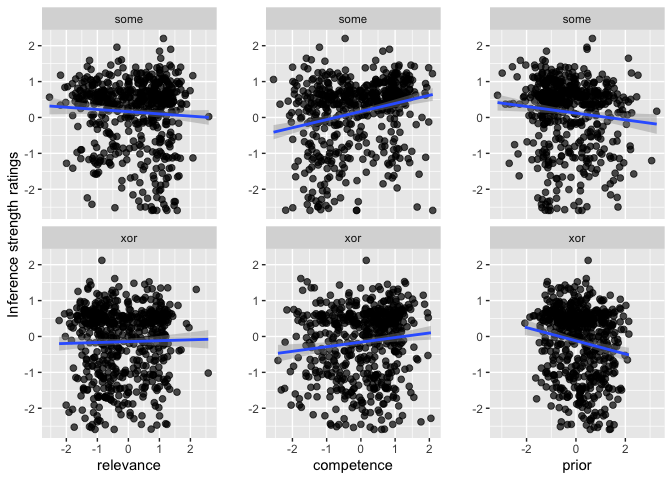

Xor & Some Final analysis
================
Polina Tsvilodub
8/31/2021

## Read Data

First, the preprocessed and tidy wide pilot data is read and combined.
It comprises data from N = 140 subjects after exclusions in total.

    ## Parsed with column specification:
    ## cols(
    ##   submission_id = col_double(),
    ##   title = col_character(),
    ##   main_type = col_character(),
    ##   relevance = col_double(),
    ##   prior = col_double(),
    ##   competence = col_double(),
    ##   target = col_double(),
    ##   competence_wUtt = col_double(),
    ##   relevance_wUtt = col_double()
    ## )

    ## Parsed with column specification:
    ## cols(
    ##   submission_id = col_double(),
    ##   title = col_character(),
    ##   main_type = col_character(),
    ##   prior = col_double(),
    ##   relevance = col_double(),
    ##   competence = col_double(),
    ##   target = col_double()
    ## )

Sanity check the combined data (as can be seen, z-scored data is used):
<!-- -->

## Model

Next, fit the maximal model *across* experiments (i.e., *across SI
trigger types*). For convergence reasons, correlation of random effects
has to be set to 0.

``` r
# Full model 
d_both <- d_both %>% mutate(
  main_type = as.factor(main_type)
)
# some = 0, xor = 1
contrasts(d_both$main_type) 
# try to fit maximal model with brm
model_SI <- brm(target ~ prior*competence*relevance* main_type +
                   (1 + prior + competence + relevance + main_type || submission_id) +
                   (1 | title),
                 data = d_both,
                 control = list(adapt_delta = 0.95),
                 cores = 4,
                 iter = 3000)
```

``` r
summary(model_SI)
```

    ##  Family: gaussian 
    ##   Links: mu = identity; sigma = identity 
    ## Formula: target ~ prior * competence * relevance * main_type + (1 + prior + competence + relevance + main_type || submission_id) + (1 | title) 
    ##    Data: d_both (Number of observations: 1120) 
    ## Samples: 4 chains, each with iter = 3000; warmup = 1500; thin = 1;
    ##          total post-warmup samples = 6000
    ## 
    ## Group-Level Effects: 
    ## ~submission_id (Number of levels: 140) 
    ##                  Estimate Est.Error l-95% CI u-95% CI Rhat Bulk_ESS Tail_ESS
    ## sd(Intercept)        0.02      0.02     0.00     0.06 1.00     4428     2515
    ## sd(prior)            0.09      0.05     0.00     0.20 1.00     1348     2295
    ## sd(competence)       0.27      0.04     0.18     0.35 1.00     1760     2639
    ## sd(relevance)        0.13      0.06     0.01     0.24 1.01     1027     1311
    ## sd(main_typexor)     0.07      0.05     0.00     0.18 1.00     2246     2384
    ## 
    ## ~title (Number of levels: 72) 
    ##               Estimate Est.Error l-95% CI u-95% CI Rhat Bulk_ESS Tail_ESS
    ## sd(Intercept)     0.26      0.04     0.17     0.35 1.00     2184     3358
    ## 
    ## Population-Level Effects: 
    ##                                         Estimate Est.Error l-95% CI u-95% CI
    ## Intercept                                   0.17      0.06     0.06     0.30
    ## prior                                      -0.07      0.04    -0.15     0.00
    ## competence                                  0.14      0.05     0.04     0.24
    ## relevance                                  -0.04      0.05    -0.13     0.06
    ## main_typexor                               -0.32      0.09    -0.49    -0.15
    ## prior:competence                           -0.06      0.04    -0.13     0.01
    ## prior:relevance                             0.05      0.04    -0.02     0.13
    ## competence:relevance                        0.01      0.05    -0.08     0.10
    ## prior:main_typexor                         -0.07      0.07    -0.19     0.06
    ## competence:main_typexor                    -0.05      0.07    -0.19     0.08
    ## relevance:main_typexor                      0.05      0.07    -0.08     0.18
    ## prior:competence:relevance                 -0.01      0.04    -0.08     0.06
    ## prior:competence:main_typexor               0.13      0.07    -0.00     0.27
    ## prior:relevance:main_typexor               -0.04      0.07    -0.17     0.09
    ## competence:relevance:main_typexor          -0.01      0.07    -0.14     0.12
    ## prior:competence:relevance:main_typexor    -0.03      0.06    -0.15     0.10
    ##                                         Rhat Bulk_ESS Tail_ESS
    ## Intercept                               1.00     4066     4261
    ## prior                                   1.00     5473     4585
    ## competence                              1.00     4267     4325
    ## relevance                               1.00     4702     4679
    ## main_typexor                            1.00     3987     4193
    ## prior:competence                        1.00     5107     4547
    ## prior:relevance                         1.00     5484     4865
    ## competence:relevance                    1.00     4887     4724
    ## prior:main_typexor                      1.00     5744     4477
    ## competence:main_typexor                 1.00     5205     4325
    ## relevance:main_typexor                  1.00     4726     4648
    ## prior:competence:relevance              1.00     5000     4177
    ## prior:competence:main_typexor           1.00     6090     4750
    ## prior:relevance:main_typexor            1.00     5449     4709
    ## competence:relevance:main_typexor       1.00     5657     4855
    ## prior:competence:relevance:main_typexor 1.00     5747     4424
    ## 
    ## Family Specific Parameters: 
    ##       Estimate Est.Error l-95% CI u-95% CI Rhat Bulk_ESS Tail_ESS
    ## sigma     0.85      0.02     0.81     0.90 1.00     2987     3660
    ## 
    ## Samples were drawn using sampling(NUTS). For each parameter, Bulk_ESS
    ## and Tail_ESS are effective sample size measures, and Rhat is the potential
    ## scale reduction factor on split chains (at convergence, Rhat = 1).

## Extract conrtrasts of interest

Next, extract posterior contrasts of interest: effects of each predictor
{prior, competence and relevance} for each trigger.

``` r
model_SI %>% spread_draws(b_Intercept, b_prior, b_competence, b_relevance,
                          b_main_typexor, `b_prior:competence`,
                          `b_prior:relevance`, `b_competence:relevance`,
                          `b_prior:main_typexor`, `b_competence:main_typexor`,
                          `b_relevance:main_typexor`, `b_prior:competence:relevance`, 
                          `b_prior:competence:main_typexor`, `b_prior:relevance:main_typexor`,
                          `b_competence:relevance:main_typexor`, 
                          `b_prior:competence:relevance:main_typexor`) %>% 
  mutate(
    prior_xor = b_prior + b_main_typexor + `b_prior:main_typexor`,
    prior_some = b_prior,
    competence_xor = b_competence + b_main_typexor + `b_competence:main_typexor`,
    competence_some = b_competence,
    relevance_xor =  b_relevance + b_main_typexor + `b_relevance:main_typexor`,
    relevance_some = b_relevance,
    prior_some_vs_xor = -b_main_typexor - `b_prior:main_typexor`,
    comp_some_vs_xor =  -b_main_typexor - `b_competence:main_typexor`,
    rel_some_vs_xor =  -b_main_typexor - `b_relevance:main_typexor`
  ) -> model_SI_posteriors

# check P that the effects are positive / negative / no effect present
model_SI_posteriors %>% select(prior_xor, prior_some, 
                               competence_xor, competence_some,
                               relevance_xor, relevance_some) %>%
  gather(key, val) %>%
  group_by(key) %>% mutate(positive = mean(val > 0.05),
                           negative = mean(val < -0.05),
                           no = mean(val %>% between(-0.05, 0.05))) %>%
  summarise(positive_eff = mean(positive),
            negative_eff = mean(negative),
            no_eff = mean(no))
```

    ## `summarise()` ungrouping output (override with `.groups` argument)

    ## # A tibble: 6 x 4
    ##   key             positive_eff negative_eff  no_eff
    ##   <chr>                  <dbl>        <dbl>   <dbl>
    ## 1 competence_some      0.956       0.000167 0.0442 
    ## 2 competence_xor       0.00233     0.974    0.0235 
    ## 3 prior_some           0.002       0.728    0.270  
    ## 4 prior_xor            0           1        0      
    ## 5 relevance_some       0.0477      0.394    0.559  
    ## 6 relevance_xor        0.0005      0.993    0.00667

## Perform BF analysis

Since we want to address a conjunctive hypothesis, we check if all three
contrasts of interest within a trigger are credibly different from 0.
(?)

``` r
# which models are the bayes factors computed on??
```
