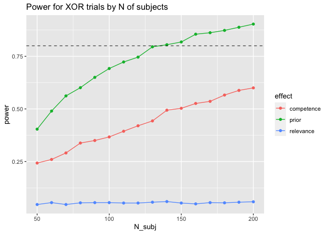
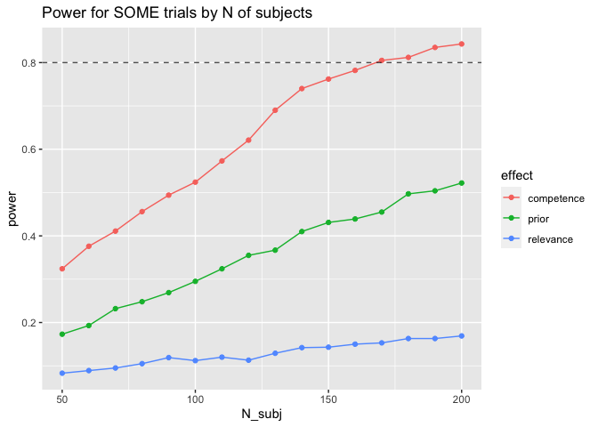

XOR power analysis
================
Polina Tsvilodub
8/17/2021

In this document, I conduct a simulation-based power analysis for the
XOR study, based on
[pilot 2](https://github.com/magpie-ea/magpie-xor-experiment/blob/master/analysis/xor-some-prolific-pilot2.md)
(N=118) and
[pilot 3](https://github.com/magpie-ea/magpie-xor-experiment/blob/master/analysis/xor-some-prolific-pilot3.md)
(N = 50). That is, the desired main analysis is conducted on data
simulated based on a model fit to this combined pilot data, as if the
data came from different numbers of subjects. The significance
statistics of interest are computed for each simulated number of
subjects, by repeatedly simulating the target analysis, yielding the
power analysis.

Due to computational tractability reasons, the power analysis is
conducted using the package `simr` which allows for simulation-based
power analysis of frequentist GLMMs. The main resource for this script
is
[this](https://besjournals.onlinelibrary.wiley.com/doi/full/10.1111/2041-210X.12504)
tutorial.

## Read Data

First, the preprocessed and tidy wide pilot data is read and combined.
It comprises data from N = 140 subjects after exclusions in total.

    ## Parsed with column specification:
    ## cols(
    ##   submission_id = col_double(),
    ##   title = col_character(),
    ##   main_type = col_character(),
    ##   relevance = col_double(),
    ##   prior = col_double(),
    ##   competence = col_double(),
    ##   target = col_double(),
    ##   competence_wUtt = col_double(),
    ##   relevance_wUtt = col_double()
    ## )

    ## Parsed with column specification:
    ## cols(
    ##   submission_id = col_double(),
    ##   title = col_character(),
    ##   main_type = col_character(),
    ##   prior = col_double(),
    ##   relevance = col_double(),
    ##   competence = col_double(),
    ##   target = col_double()
    ## )

Sanity check the combined data (as can be seen, z-scored data is used):

    ## `geom_smooth()` using formula 'y ~ x'
    ## `geom_smooth()` using formula 'y ~ x'
    ## `geom_smooth()` using formula 'y ~ x'

<!-- -->

## Fit sample model

As the first step, the desired model is fit on data from both pilots
(frequentist). Maximal models of interest for xor, then for some, were
attempted, but by-subject random effects result in singular matrix
errors. Furthermore, simulations on different Ns below can only be
conducted if there are by-subject random intercepts only. Essentially,
two separate power analyses are conducted (one for “some”, one for
“or”).

``` r
# fit frequentist model
# remove some random effects due to singular matrix error
model_xor <- lmer(target ~ prior*competence*relevance + 
    (1 | submission_id) +
    (1 | title),
    data = d_both_xor
    )

isSingular(model_xor)
```

    ## [1] TRUE

``` r
summary(model_xor)
```

    ## Linear mixed model fit by REML ['lmerMod']
    ## Formula: target ~ prior * competence * relevance + (1 | submission_id) +  
    ##     (1 | title)
    ##    Data: d_both_xor
    ## 
    ## REML criterion at convergence: 1564.1
    ## 
    ## Scaled residuals: 
    ##     Min      1Q  Median      3Q     Max 
    ## -2.7488 -0.6648  0.2893  0.7076  2.4037 
    ## 
    ## Random effects:
    ##  Groups        Name        Variance Std.Dev.
    ##  submission_id (Intercept) 0.00000  0.0000  
    ##  title         (Intercept) 0.03899  0.1974  
    ##  Residual                  0.88568  0.9411  
    ## Number of obs: 560, groups:  submission_id, 140; title, 36
    ## 
    ## Fixed effects:
    ##                            Estimate Std. Error t value
    ## (Intercept)                -0.14450    0.05492  -2.631
    ## prior                      -0.15198    0.05340  -2.846
    ## competence                  0.09780    0.05166   1.893
    ## relevance                   0.01881    0.04854   0.387
    ## prior:competence            0.06875    0.06012   1.144
    ## prior:relevance             0.01446    0.05475   0.264
    ## competence:relevance        0.02231    0.04767   0.468
    ## prior:competence:relevance -0.04743    0.05612  -0.845
    ## 
    ## Correlation of Fixed Effects:
    ##             (Intr) prior  cmptnc relvnc prr:cm prr:rl cmptn:
    ## prior       -0.119                                          
    ## competence  -0.117 -0.038                                   
    ## relevance    0.181  0.012 -0.142                            
    ## prir:cmptnc -0.014 -0.140 -0.106 -0.029                     
    ## prior:rlvnc  0.037  0.238 -0.020 -0.073 -0.160              
    ## cmptnc:rlvn -0.111 -0.018  0.296 -0.028 -0.043 -0.056       
    ## prr:cmptnc:  0.006 -0.157 -0.043 -0.049  0.388  0.009 -0.041
    ## convergence code: 0
    ## boundary (singular) fit: see ?isSingular

``` r
model_some <- lmer(target ~ prior*competence*relevance + 
    (1 | submission_id) +
    (1 | title),
    data = d_both_some
    )

isSingular(model_some)
```

    ## [1] TRUE

``` r
summary(model_some)
```

    ## Linear mixed model fit by REML ['lmerMod']
    ## Formula: target ~ prior * competence * relevance + (1 | submission_id) +  
    ##     (1 | title)
    ##    Data: d_both_some
    ## 
    ## REML criterion at convergence: 1493.9
    ## 
    ## Scaled residuals: 
    ##     Min      1Q  Median      3Q     Max 
    ## -3.9146 -0.4120  0.2383  0.6324  2.5070 
    ## 
    ## Random effects:
    ##  Groups        Name        Variance Std.Dev.
    ##  submission_id (Intercept) 0.0000   0.0000  
    ##  title         (Intercept) 0.1081   0.3287  
    ##  Residual                  0.7452   0.8633  
    ## Number of obs: 560, groups:  submission_id, 140; title, 36
    ## 
    ## Fixed effects:
    ##                            Estimate Std. Error t value
    ## (Intercept)                 0.17958    0.06869   2.614
    ## prior                      -0.06679    0.03840  -1.739
    ## competence                  0.11263    0.04571   2.464
    ## relevance                  -0.04073    0.04980  -0.818
    ## prior:competence           -0.05371    0.03474  -1.546
    ## prior:relevance             0.05255    0.03559   1.477
    ## competence:relevance       -0.01380    0.04418  -0.312
    ## prior:competence:relevance -0.01951    0.03330  -0.586
    ## 
    ## Correlation of Fixed Effects:
    ##             (Intr) prior  cmptnc relvnc prr:cm prr:rl cmptn:
    ## prior        0.167                                          
    ## competence  -0.004 -0.095                                   
    ## relevance   -0.120 -0.067 -0.005                            
    ## prir:cmptnc -0.032  0.054  0.234  0.061                     
    ## prior:rlvnc  0.000 -0.187  0.078  0.281  0.036              
    ## cmptnc:rlvn  0.041  0.101 -0.180 -0.046 -0.037 -0.081       
    ## prr:cmptnc:  0.073  0.033 -0.045 -0.073 -0.237 -0.047  0.323
    ## convergence code: 0
    ## boundary (singular) fit: see ?isSingular

## Simulate

The `simr` package provides several handy functions for power analysis.

First, there are functions for simulating data extended along different
axes, necessary for simulating different numbers of subjects in order to
determine the minimal N required for a certain power.

Second, there are functions for repeatedly computing the target model
for a given dataset, and extracting significance statistics of interest
from each fit. This is necessary for computing the power (as the
proportion of significant results among the simulations).

However, the significance statistics are only computed for one given
fixed effect estimate, so a wrapper is written to iterate over all
*simple fixed effects* which would be the estimates of interest, if the
SI account was borne out. Intermediate results of the simulations are
written out as csvs for backup.

Below, numbers of subjects ranging between N = 50 and N = 200 are
simulated in steps of 10. There are 4 simulated observations per subject
(because we have 8 vignettes / subject in the experiment, half for some
and half for xor).

``` r
# check power of the pilot source models for a given effect, as an example
p_xor <- powerSim(model_xor, 
                  fixed("prior", "z"), 
                  progress = FALSE)
p_some <- powerSim(model_some, 
                   fixed("prior", "z"), 
                   progress = FALSE)
```

``` r
p_xor
```

    ## Power for predictor 'prior', (95% confidence interval):
    ##       81.60% (79.06, 83.96)
    ## 
    ## Test: z-test
    ##       Effect size for prior is -0.15
    ## 
    ## Based on 1000 simulations, (1 warning, 0 errors)
    ## alpha = 0.05, nrow = 560
    ## 
    ## Time elapsed: 0 h 1 m 6 s
    ## 
    ## nb: result might be an observed power calculation

``` r
p_some
```

    ## Power for predictor 'prior', (95% confidence interval):
    ##       40.80% (37.73, 43.92)
    ## 
    ## Test: z-test
    ##       Effect size for prior is -0.067
    ## 
    ## Based on 1000 simulations, (2 warnings, 0 errors)
    ## alpha = 0.05, nrow = 560
    ## 
    ## Time elapsed: 0 h 1 m 4 s
    ## 
    ## nb: result might be an observed power calculation

``` r
N_subj = c(seq(from = 50, to = 200, by = 10))

# following step necessary for iterating through Ns, n parameter has to be the maximal desired N
# fit extended xor model
model_xor_ext <- extend(model_xor, along="submission_id", n=200)
# fit extended some model
model_some_ext <- extend(model_some, along="submission_id", n=200)

# wrapper for computing power for different effects for a given number of simulated models
effects <- c("prior", "competence", "relevance")
power_4_fe <- function(model, test, effects, nsim, N_subj) {
  N = length(effects)
  # (default alpha = 0.05 for the test)
  powers <- map(effects, ~ powerCurve(model, fixed(.x, test),
                                      nsim = nsim,
                                      progress = FALSE,
                                      along = "submission_id",
                                      breaks = N_subj)['ps']$ps)
  # [[which(effects == .x)]]$pval
  # ugly code above takes apart the powerCurve object
  # selects list of p-values from each simulation for each N 
  
  # put results in a tibble
  power.sim <- tibble(
       N_subj = rep(list(N_subj), times = N),
      effect = effects,
      pvalues = powers 
    ) %>% unnest(col = c(N_subj, pvalues)) %>% 
    rowwise() %>%
    mutate(pvalues = list(pvalues$pval)) %>%
    unnest(col = pvalues)
  
  # compute the power as proportion of significant p-values
  power.sim %>% rowwise() %>%
    mutate(sign_check = ifelse(pvalues < 0.05, 1, 0)) %>%
    group_by(N_subj, effect) %>%
    summarize(power = mean(sign_check)) -> power.sim.summary
  
 return(power.sim.summary) 
}
```

Call the power simulations for xor and some, respectively. For each N,
1000 simulations are performed. The significance test chosen is the
z-test (for no particular reason, for exploration). Alpha is 0.05.

``` r
# call the function
xor_power_sim <- power_4_fe(model_xor_ext, "z", effects, 1000, N_subj)
# write out results
xor_power_sim %>% write_csv("../data/xor_power_sim_N50-200_iter1000.csv")

some_power_sim <- power_4_fe(model_some_ext, "z", effects, 1000, N_subj)
# write out results
some_power_sim %>% write_csv("../data/some_power_sim_N50-200_iter1000.csv")
```

Visualize the results:

``` r
xor_power_sim %>%
  ggplot(., aes(x = N_subj, y = power, color = effect)) +
  geom_line() +
  geom_point() +
  geom_hline(yintercept = 0.8, alpha = 0.7, linetype = 2) +
  ggtitle("Power for XOR trials by N of subjects")
```

<!-- -->

``` r
some_power_sim %>%
  ggplot(., aes(x = N_subj, y = power, color = effect)) +
  geom_line() +
  geom_point() +
  geom_hline(yintercept = 0.8, alpha = 0.7, linetype = 2) +
  ggtitle("Power for SOME trials by N of subjects")
```

<!-- -->
